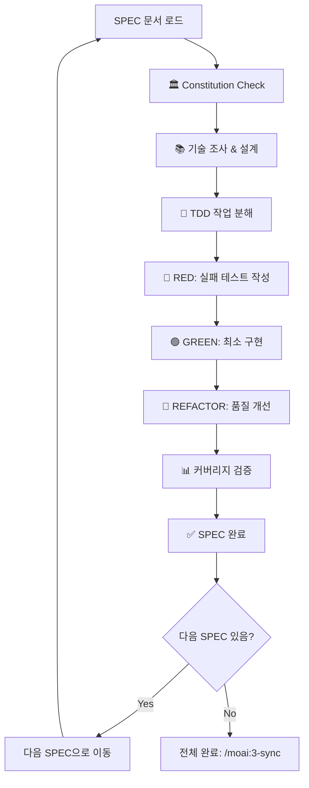

# MoAI-ADK 2단계: TDD 구현 (모드별 Git 통합)

code-builder와 git-manager 에이전트가 협력하여 Constitution Check부터 Red-Green-Refactor까지 체계적으로 지원합니다.

## 📊 현재 모드 확인
- Project mode: !`python3 -c "import json; config=json.load(open('.moai/config.json')); print(config['project']['mode'])" 2>/dev/null || echo "unknown"`
- Auto checkpoint: !`python3 -c "import json; config=json.load(open('.moai/config.json')); print('✅ Enabled' if config.get('git_strategy', {}).get('personal', {}).get('auto_checkpoint') else '❌ Disabled')" 2>/dev/null || echo "unknown"`

## 🔀 모드별 TDD 워크플로우

### 🧪 개인 모드 (Personal Mode) - 자동 체크포인트 기반
```bash
# 1. Constitution 5원칙 검증 + 자동 체크포인트 설정
!`python3 -c "import json; config=json.load(open('.moai/config.json')); print('🔄 Auto-checkpoint:', '✅ Enabled' if config.get('git_strategy', {}).get('personal', {}).get('auto_checkpoint') else '❌ Disabled')"`

# 2. TDD 사이클 - 파일 변경 시 자동 체크포인트 생성
# Git 안전성 확인
!`[ -f .git/index.lock ] && echo "🔒 git index.lock detected - /git:checkpoint --fix" || echo "✅ Git ready"`

# RED 단계: 실패 테스트 작성 (자동 체크포인트)
# 파일 변경 감지 → 자동 체크포인트 → 계속 작업
!`echo "🔴 RED: 실패하는 테스트 작성 중..."`
# 작업 완료 후 수동 체크포인트 (중요 마일스톤)
!`/git:checkpoint "RED 단계 완료: ${SPEC_ID} 테스트 작성"`

# GREEN 단계: 최소 구현 (자동 체크포인트)
!`echo "🟢 GREEN: 최소 구현으로 테스트 통과 중..."`
!`/git:checkpoint "GREEN 단계 완료: ${SPEC_ID} 최소 구현"`

# REFACTOR 단계: 품질 개선 (자동 체크포인트)
!`echo "🔄 REFACTOR: 코드 품질 개선 중..."`
!`/git:checkpoint "REFACTOR 완료: ${SPEC_ID} 품질 개선"`

# 완료 후 최종 정리 커밋
!`/git:commit --spec "${SPEC_ID}" --message "TDD 구현 완료"`
```

### 🏢 팀 모드 (Team Mode) - GitFlow 표준 워크플로우
```bash
# 1. Constitution 5원칙 검증 + 브랜치 상태 확인
!`git status --porcelain | wc -l | xargs -I {} echo "📝 변경사항: {} 개"`
!`git branch --show-current | xargs -I {} echo "🌿 현재 브랜치: {}"`

# 2. 표준 GitFlow TDD 3단계 커밋
# Git index.lock 안전 점검
!`[ -f .git/index.lock ] && echo "🔒 git index.lock detected" || echo "✅ No lock file"`
!`pgrep -fl "git" | grep -E "(commit|rebase|merge)" >/dev/null 2>&1 && echo "❌ Git 작업 진행 중" || echo "✅ Git 안전"`

# RED 단계: 실패하는 테스트 작성
!`git add tests/`
!`git commit -m "🔴 ${SPEC_ID}: 실패하는 테스트 작성 완료 (RED)

- ${TEST_COUNT}개 테스트 케이스 작성
- Given-When-Then 구조 준수
- 의도적 실패 확인 완료"`

# GREEN 단계: 최소 구현으로 테스트 통과
!`git add src/`
!`git commit -m "🟢 ${SPEC_ID}: 최소 구현으로 테스트 통과 (GREEN)

- 모든 테스트 통과 확인
- 최소 요구사항 충족
- 커버리지 ${COVERAGE_PERCENT}% 달성"`

# REFACTOR 단계: 코드 품질 개선
!`git add -A`
!`git commit -m "🔄 ${SPEC_ID}: 코드 품질 개선 및 리팩터링 완료

- Constitution 5원칙 준수
- 코드 중복 제거 및 최적화
- 문서화 및 타입 힌트 추가"`

# 3. GitHub Actions CI/CD 자동 트리거
!`git push origin $(git branch --show-current)`

# 4. PR 상태 업데이트 (구현 진행률)
!`gh pr edit --add-label "implementation-complete" --add-label "ready-for-review-pending"`
```

SPEC을 바탕으로 Constitution Check → 기술 설계 → 작업 분해 → TDD 구현까지 자동화를 지원하는 MoAI-ADK의 핵심 명령어입니다.


## 🚀 빠른 시작

```bash
# 단일 SPEC 완전 구현
/moai:2-build SPEC-001

# 특정 SPEC 구현
/moai:2-build SPEC-001

```

## 🔄 순차 실행 흐름



## 🤖 code-builder 에이전트 지원

**code-builder 에이전트**가 전체 구현 과정을 체계적으로 지원합니다. 환경에 따라 가능한 범위에서 자동화를 시도합니다:

### 1단계: Constitution 검증 (권장)
- **Simplicity**: 프로젝트 복잡도 ≤ 3개 목표
- **Architecture**: 기능 라이브러리화 권장
- **Testing**: TDD 권장 및 커버리지 목표(예: 80~85%)
- **Observability**: 구조화 로깅 권장
- **Versioning**: MAJOR.MINOR.BUILD 체계 권장

### 2단계: 기술 설계
- **기술 스택 조사**: 최신 동향 및 베스트 프랙티스
- **아키텍처 설계**: 필요시 data-model.md, contracts/ 생성
- **의존성 분석**: 외부 라이브러리 및 API 검토

### 3단계: TDD 구현(권장)
- **작업 분해**: 구현 가능한 단위로 태스크 분할
- **Red-Green-Refactor**: 엄격한 TDD 사이클 준수
- **품질 검증**: 린팅, 타입 체킹, 커버리지 확인

## 🏛️ Constitution Check (5원칙 검증 지원)

### 기본 목표 기준(예시)
```markdown
✅ Simplicity: 독립 모듈 ≤ 3개(목표)
✅ Architecture: 라이브러리화 지향
✅ Testing: 커버리지 목표(예: 80~85%) + TDD 권장
✅ Observability: 구조화 로깅 구현 권장
✅ Versioning: 시맨틱 버전 관리 권장
```

### 위반 시 자동 해결
- 복잡도 초과 → 모듈 통합 제안
- 라이브러리화 미흡 → 구조 리팩터링
- 테스트 부족 → 추가 테스트 자동 생성

## 🔴🟢🔄 TDD 사이클 자동화

### RED 단계: 실패하는 테스트 작성
```
언어별 테스트 구조 (자동 감지):
- 테스트 파일명: test_[feature] 또는 [feature]_test
- 테스트 함수/메서드: test_should_[behavior]
- 패턴: Given-When-Then 구조

필수 테스트 케이스:
1. Happy Path: 정상 동작 확인
2. Edge Cases: 경계 조건 처리
3. Error Cases: 예외 상황 처리
```

### GREEN 단계: 최소 구현
```
구현 원칙:
- 테스트 통과를 위한 최소 코드만 작성
- 최적화나 추가 기능 없음
- 크기 제한 준수: 함수 ≤50줄, 매개변수 ≤5개
```

### REFACTOR 단계: 품질 개선
```
개선 체크리스트:
- 코드 중복 제거
- 의도를 드러내는 이름 사용
- 단일 책임 원칙 적용
- 오류 처리 강화
- 성능 최적화
```

## 📊 커버리지 및 품질 검증(지원)

### 자동 검증 항목 (언어별 도구 자동 감지)
- **테스트 커버리지**: 목표 80~85%(프로젝트 설정)
- **타입 커버리지**: 프로젝트 타입 체커 사용
- **린팅 통과**: 프로젝트 린터 규칙 준수
- **보안 검사**: 언어별 보안 도구 실행

### 품질 게이트 실패 시
```bash
🔴 품질 게이트 실패:
- 커버리지 78% < 85% (목표)
- 타입 오류 3건
- 린팅 경고 5건

자동 수정 중...
✅ 추가 테스트 생성
✅ 타입 어노테이션 추가
✅ 코드 스타일 수정
```

## 📁 생성 파일 구조

### 설계 단계 산출물
```
.moai/specs/SPEC-XXX/
├── plan.md              # Constitution Check 결과
├── research.md          # 기술 조사 결과
├── data-model.md        # 데이터 모델 설계
└── contracts/           # API 계약서
    ├── user-auth.yaml
    └── api-responses.yaml
```

### 구현 단계 산출물
```
src/
├── models/              # 데이터 모델
├── services/            # 비즈니스 로직
├── controllers/         # API 엔드포인트
└── utils/              # 유틸리티 함수

tests/
├── unit/               # 단위 테스트
├── integration/        # 통합 테스트
└── fixtures/           # 테스트 데이터
```

## 🔄 완료 후 다음 단계

### 성공적인 구현 완료
```bash
🎉 TDD 구현 완료(예시)!

📊 최종 품질 지표:
- 테스트 커버리지: 87%
- 구현 파일: 12개
- 테스트 파일: 18개
- Constitution: 준수 여부 보고(체크 결과 기준)

📝 생성된 파일:
├── src/ (12개 구현 파일)
├── tests/ (18개 테스트 파일)
└── .moai/specs/SPEC-001/ (설계 문서)

🎯 다음 단계:
> /moai:3-sync  # 문서 동기화 및 TAG 업데이트
> git add . && git commit -m "feat: implement SPEC-001"
```

### 순차 구현 가이드
```bash
📋 SPEC 구현 순서:

1단계: 핵심 기능 (P0)
├── ✅ SPEC-001: 사용자 인증 구현 완료 (87% 커버리지)
├── ⏳ SPEC-002: 게시글 관리 (다음 단계)
└── ⏳ SPEC-003: 댓글 시스템 (대기 중)

2단계: 부가 기능 (P1)
└── ⏳ SPEC-004: 관리자 대시보드 (1단계 완료 후)

📝 권장 순서:
> /moai:2-build SPEC-001  # 첫 번째
> /moai:2-build SPEC-002  # 두 번째
> /moai:2-build SPEC-003  # 세 번째
```

## ⚠️ 에러 처리

### Git index.lock 감지
```bash
fatal: Unable to create '.git/index.lock': File exists.

원인:
- 이전 git 명령 비정상 종료 또는 병렬 실행으로 lock 파일이 남아있음

해결 절차(안전 순서):
1) 활성 Git 작업 확인: pgrep -fl "git (commit|rebase|merge)"
   - 있으면 해당 작업을 종료/완료 후 다시 실행
2) 활성 작업이 없으면 lock 파일 제거: rm -f .git/index.lock
3) 상태 점검: git status
4) 재실행: /moai:2-build
```
### SPEC 문서 누락
```bash
❌ SPEC-001을 찾을 수 없습니다.
먼저: /moai:1-spec "기능 설명" 실행
```

### Constitution 위반
```bash
🔴 Constitution 위반 감지:
- Simplicity: 4개 모듈 (임계값: 3개)

해결 방안:
1. 모듈 통합을 통한 복잡도 감소 [추천]
2. 위반 정당화 문서 작성
3. SPEC 수정 및 재시도
```

### TDD 사이클 실패
```bash
⚠️ 테스트가 통과하지 않습니다.
- test_user_authentication: FAILED

자동 수정 시도 중...
Green 단계 재구현 필요
```

## 🔁 응답 구조

출력은 반드시 3단계 구조를 따릅니다:
1. **Phase 1 Results**: Constitution & 설계 결과
2. **Phase 2 Plan**: TDD 구현 계획
3. **Phase 3 Implementation**: 실제 구현 및 검증
