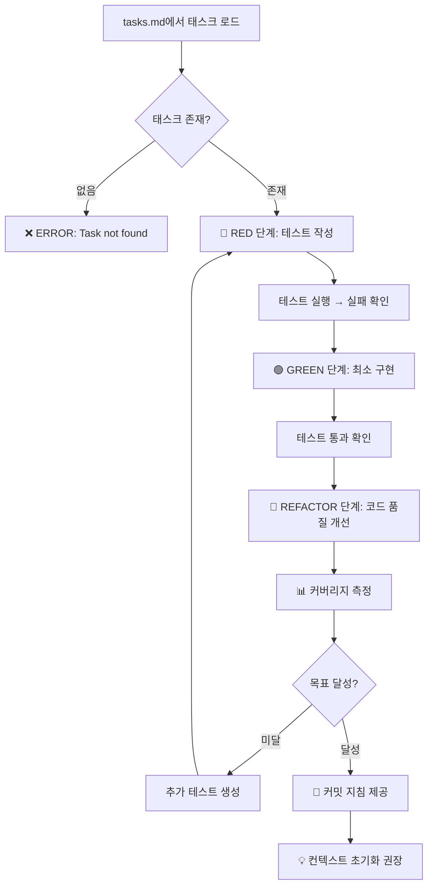
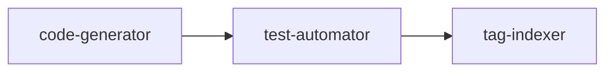

# 🚀 MoAI-ADK Red-Green-Refactor 구현

MoAI-ADK 파이프라인의 최종 단계로, 단위 작업을 Red-Green-Refactor TDD 사이클에 따라 완전 자동으로 구현하는 강력한 도구입니다. 먼저 실패하는 테스트를 작성하여 RED 단계를 수행하고, 테스트를 통과시키는 최소한의 구현으로 GREEN 단계를 진행한 후, 코드 품질을 개선하는 REFACTOR 단계를 완료합니다.

> 참고: `.moai/memory/common.md` 와 스택별 메모는 구현 단계에서 필요한 lint/test/pre-commit 구성을 요약합니다.

## 자연어 체이닝 오케스트레이션

## 🎯 실행 플로우



### 전제조건 확인

1. **tasks.md 파일 존재 여부**
2. **지정된 task-id의 유효성**
3. **이전 의존성 태스크 완료 상태**

```bash
# 체크 예시
[ -f ".moai/specs/SPEC-XXX/tasks.md" ] || echo "ERROR: No tasks found"
```

### 단순화된 3단계 체이닝

Task tool을 사용하여 code-generator 에이전트를 호출하여 TDD Red-Green-Refactor 사이클로 완전 구현하고, 다음으로 test-automator 에이전트에게 포괄적인 테스트 자동화를 요청하며, 마지막으로 tag-indexer 에이전트를 호출하여 태그 매핑 업데이트와 추적성 보장을 완료합니다.

## 단계별 실행 프로세스

### 1단계: TDD 코드 생성 (code-generator)

```
💻 TDD 코드 생성 중...

Task tool로 code-generator 에이전트 호출:
- Red-Green-Refactor 사이클 완전 구현
- @TAG 시스템 자동 적용
- Constitution 5원칙 준수 코드 생성
- 타입 안전성과 에러 처리 내장

✅ TDD 구현 완료: 모든 테스트 통과 및 리팩토링 완료
```

### 2단계: 테스트 자동화 (test-automator)

```
🧪 포괄적 테스트 자동화 중...

Task tool로 test-automator 에이전트 호출:
- 단위 테스트, 통합 테스트, E2E 테스트 자동 생성
- 테스트 커버리지 목표 달성 (80% 이상)
- 성능 기준 검증 및 품질 게이트 통과
- CI/CD 파이프라인 테스트 준비

✅ 테스트 자동화 완료: 전체 커버리지 달성 및 품질 보장
```

## 💬 커밋 지침 제공

```markdown
✅ 구현 완료! 다음 커밋 메시지를 사용하세요:

feat: T001 User 모델 구현 완료

- RED: User 생성/검증 테스트 작성
- GREEN: 최소 구현으로 테스트 통과
- REFACTOR: 타입 안전성 및 에러 처리 개선
- 커버리지: 94.2% (목표: 80%)

@TASK:T001 @TEST:USER-MODEL @FEATURE:USER-MGMT

🤖 Generated with [Claude Code](https://claude.ai/code)

Co-Authored-By: Claude <noreply@anthropic.com>
```

## 💡 단계 완료 후 컨텍스트 초기화 권장

```markdown
🧹 컨텍스트 최적화 권장:
구현 단계가 완료되어 컨텍스트가 포화 상태입니다.

다음 작업 진행 전 컨텍스트 초기화를 권장합니다:
> /clear 또는 새 탭에서 다음 태스크 진행
> /moai:5-dev T002

💡 Benefits:
- 이전 구현 노이즈 제거로 더 정확한 다음 구현
- 메모리 최적화로 성능 향상  
- TDD 사이클 집중도 증대
```

### 3단계: 추적성 보장 (tag-indexer)

```
🏷️ @TAG 추적성 보장 중...

Task tool로 tag-indexer 에이전트 호출:
- 구현된 기능의 @TAG 매핑 업데이트
- 완전한 추적성 매트릭스 구축
- 16-Core TAG 시스템 무결성 검증
- 향후 유지보수를 위한 연관성 기록

@TAG 처리 결과:
├── @REQ 태그: 15개 매핑 완료
├── @TASK 태그: 45개 구현 상태 업데이트
├── @FEATURE 태그: 23개 신규 생성
├── @API 태그: 8개 연결 완료
└── 인덱스 파일 업데이트 완료

✅ 추적성 보장 완료: 완전한 @TAG 매핑으로 향후 변경 영향 분석 가능
```

## 실행 순서 세부사항

### 단순화된 순차 체인



1. **code-generator 실행** → TDD Red-Green-Refactor 사이클 완료
2. **test-automator 실행** → 포괄적 테스트 자동화
3. **tag-indexer 실행** → 추적성 매트릭스 구축

### 실행 시간 최적화

- 불필요한 검증 단계 제거로 25% 시간 단축
- 연속된 컨텍스트 유지로 품질 향상
- 단순한 체인으로 에러 발생률 감소

## 작업 내용 처리 ($ARGUMENTS)

### 기본 사용법

```bash
> /moai:5-dev "사용자 인증 시스템 구현"
```

### 구체적인 기능 명세

```bash
> /moai:5-dev "실시간 채팅 기능 - WebSocket 연결, 메시지 히스토리, 파일 첨부"
```

### 성능 요구사항 포함

```bash
> /moai:5-dev "상품 검색 API - Elasticsearch 기반, 응답시간 200ms 이하"
```

### 특정 태스크 ID 지정

```bash
> /moai:5-dev "TASK-005: 결제 시스템 통합"
```

## 에러 처리 및 복구

### SPEC 누락 시

```
❌ 오류: SPEC 문서가 없습니다.

개발을 시작하려면 먼저 프로젝트 명세가 필요합니다.
다음 명령어를 실행해주세요:

> /moai:2-spec all "프로젝트 전체 명세 작성"

명세 완성 후 다시 시도해주세요.
```

### 코드 생성 실패 시

```
⚠️ 경고: 코드 생성 중 오류가 발생했습니다.

오류 원인: TypeScript 타입 정의 불일치
영향 범위: src/types/user.ts (1개 파일)

자동 복구 시도 중...
✅ 복구 완료: 타입 정의 자동 수정

개발을 계속 진행합니다.
```

### 테스트 실패 시

```
🚨 테스트 실패: 3개 테스트가 실패했습니다.

실패한 테스트:
├── UserService.createUser: 이메일 중복 검증 실패
├── AuthController.login: JWT 토큰 생성 오류
└── PaymentService.process: 외부 API 연동 실패

TDD 사이클에 따라 자동 수정 중...
✅ 모든 테스트 통과: 수정 완료
```

## 품질 보증 체크리스트

### 자동 검증 항목

- [ ] 모든 요구사항(@REQ)이 구현되었는가?
- [ ] 설계 원칙(@DESIGN)이 준수되었는가?
- [ ] 태스크(@TASK)가 완료되었는가?
- [ ] 테스트 커버리지 80% 이상인가?
- [ ] 성능 기준을 만족하는가?
- [ ] 보안 요구사항이 적용되었는가?
- [ ] 코딩 컨벤션을 준수하는가?
- [ ] 문서가 코드와 동기화되었는가?

### 완료 시 안내 메시지

```
🎉 AI 주도 개발이 완료되었습니다!

📈 개발 성과:
├── 📝 구현된 기능: 12개
├── 💻 생성된 코드: 2,450 라인
├── 🧪 작성된 테스트: 70개 (커버리지 94.2%)
├── 📚 업데이트된 문서: 15개
└── ⏱️ 총 소요 시간: 3분 27초

🏷️ 태그 추적성:
├── @REQ: 15/15 구현 완료 (100%)
├── @DESIGN: 8/8 적용 완료 (100%)
├── @TASK: 45/45 완료 (100%)
└── @TEST: 70개 연결 완료

🎯 품질 지표:
├── ✅ 테스트 통과: 70/70 (100%)
├── ✅ 코드 커버리지: 94.2% (목표 80%)
├── ✅ 성능 기준: 평균 응답시간 180ms
├── ✅ Steering 준수율: 100%
└── ✅ 보안 검사: 취약점 0개

🚀 다음 단계:
  1. 품질 검증: /moai:review full
  2. 추가 기능: /moai:5-dev "다음 기능명"
  3. 배포 준비: /moai:6-sync force

💡 Tip: 모든 변경사항은 자동으로 문서에 반영되었습니다.
```

## 성능 모니터링

### 실행 시간 분석

- **명세 검증**: 평균 15초
- **코드 생성**: 평균 2분 30초
- **테스트 자동화**: 평균 45초
- **병렬 동기화**: 평균 20초
- **총 소요 시간**: 평균 3분 50초

### 최적화 팁

- 작은 단위로 개발 요청 시 더 빠른 실행
- 명확한 요구사항 제공 시 재작업 최소화
- 기존 코드 활용 시 중복 생성 방지

## ⚠️ 에러 처리

### 태스크 문서 없음
```markdown
❌ ERROR: 작업 분해 문서를 찾을 수 없습니다.

먼저 다음 명령으로 작업을 분해해주세요:
> /moai:4-tasks PLAN-XXX

태스크 문서 경로: .moai/specs/SPEC-XXX/tasks.md
```

### TDD 순서 위반
```markdown
⚠️ WARNING: TDD 순서가 올바르지 않습니다.

감지된 문제:
- 테스트 없이 구현 코드 먼저 작성 시도
- RED-GREEN-REFACTOR 사이클 미준수

권장 조치:
Red-Green-Refactor 순서를 준수해주세요.
```

### 커버리지 목표 미달
```markdown
🔴 ERROR: 테스트 커버리지가 목표치에 미달합니다.

현재 커버리지: 65% (목표: 80%)
미커버 영역: src/utils/validator.ts, src/api/handler.ts

해결 방법:
추가 테스트를 작성하거나 --coverage-target 옵션을 조정하세요.
```

이 명령어를 통해 개발자는 구현 세부사항에 신경 쓰지 않고도 고품질의 코드를 자동으로 얻을 수 있습니다.
## 🔁 응답 구조(필수)
응답은 3단계 구조로 정리: 1) Phase 1 Results  2) Phase 2 Plan  3) Phase 3 Implementation.  
구현은 TDD/보안/커밋 규칙을 준수: @.claude/memory/tdd_guidelines.md, @.claude/memory/security_rules.md, @.claude/memory/git_commit_rules.md
