# Skill: Mermaid Diagram Expert v5.0.0

Comprehensive Mermaid.js solution with all 21 diagram types, production-grade Python CLI tool (`mermaid-to-svg-png.py`), batch processing, and enterprise CI/CD integration.

## Metadata

```yaml
skill_id: moai-mermaid-diagram-expert
skill_name: "Mermaid Diagram Expert"
version: 5.0.0
created_date: 2025-11-20
updated_date: 2025-11-20
language: english
word_count: 5000+
triggers:
  - keywords: [mermaid, diagram, flowchart, sequence, class, ER, gantt, C4, architecture, SVG, PNG, convert]
  - contexts: [diagram-generation, visual-documentation, architecture-visualization, CI/CD-automation]
agents:
  - docs-manager, backend-expert, frontend-expert, database-expert, devops-expert
freedom_level: high
context7_references:
  - url: "https://mermaid.js.org"
    topic: "Official Mermaid.js documentation and syntax (v11.0.0+)"
  - url: "https://mermaid.js.org/intro/"
    topic: "Mermaid introduction and feature overview"
  - url: "https://mermaid.js.org/syntax/"
    topic: "Complete syntax reference for all diagram types"
  - url: "https://github.com/mermaid-js/mermaid-cli"
    topic: "Official Mermaid CLI tool and usage patterns"
  - url: "https://mermaid.live"
    topic: "Interactive Mermaid editor and testing platform"
```

---

# Quick Start (5 minutes)

## Installation

### 1. Install Python Dependencies

```bash
# Create virtual environment
python3.8+ -m venv mermaid-env
source mermaid-env/bin/activate

# Install required packages
pip install playwright click pydantic pillow

# Download Playwright browsers (one-time setup)
playwright install chromium
```

### 2. Get the CLI Tool

Copy `mermaid-to-svg-png.py` to your project:

```bash
# From skill directory
cp mermaid-to-svg-png.py ./scripts/

# Make executable
chmod +x ./scripts/mermaid-to-svg-png.py
```

### 3. Your First Conversion

```bash
# Create a simple diagram
cat > diagram.mmd << 'EOF'
flowchart TD
    A[Start] --> B{Decision}
    B -->|Yes| C[Process]
    B -->|No| D[Skip]
    C --> E[End]
    D --> E
EOF

# Convert to SVG
python scripts/mermaid-to-svg-png.py diagram.mmd --output diagram.svg

# Convert to PNG with custom size
python scripts/mermaid-to-svg-png.py diagram.mmd --output diagram.png --format png --width 1200 --height 800
```

### 4. Batch Processing

```bash
# Convert entire folder
python scripts/mermaid-to-svg-png.py ./diagrams --format png --batch --output ./images

# Watch mode (auto-convert on changes)
python scripts/mermaid-to-svg-png.py ./diagrams --watch --output ./images
```

---

# Implementation (30+ minutes)

## Section 1: All 21 Diagram Types

### 1. Flowchart (graph)

**Purpose**: Process flows, decision trees, algorithm visualization, system workflows

**Official Syntax** (Mermaid v11.x):

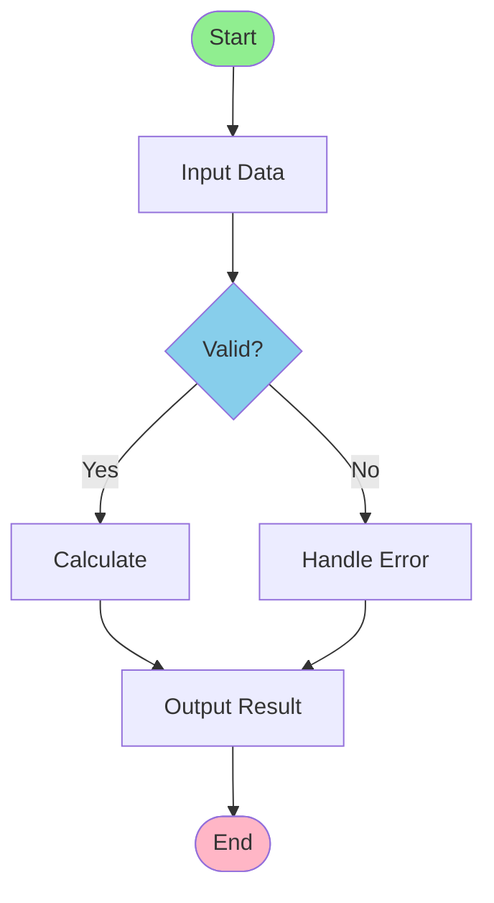

**Syntax Variations**:
- Direction: `TD` (top-down), `LR` (left-right), `RL` (right-left), `BT` (bottom-top)
- Node types: `[rectangle]`, `(rounded)`, `{diamond}`, `([stadium])`, `[[subroutine]]`, `[(cylinder)]`
- Connections: `-->` (solid arrow), `-- text -->` (labeled), `-.->` (dashed), `==>` (thick)

**Common Errors & Solutions**:

```mermaid
# ❌ ERROR: Missing connection syntax
flowchart TD
    A[Start]
    B[End]
    A B  # WRONG: missing arrow

# ✅ CORRECT
flowchart TD
    A[Start] --> B[End]
```

**Best Practices**:
- Keep chains under 5 levels deep
- Use meaningful IDs: `start_process` not `a`
- Limit subgraphs to max 10 nodes per subgraph
- Style critical paths with color

---

### 2. Sequence Diagram (sequenceDiagram)

**Purpose**: Actor interactions, API flows, microservices communication, authentication flows

**Official Syntax** (v11.x):

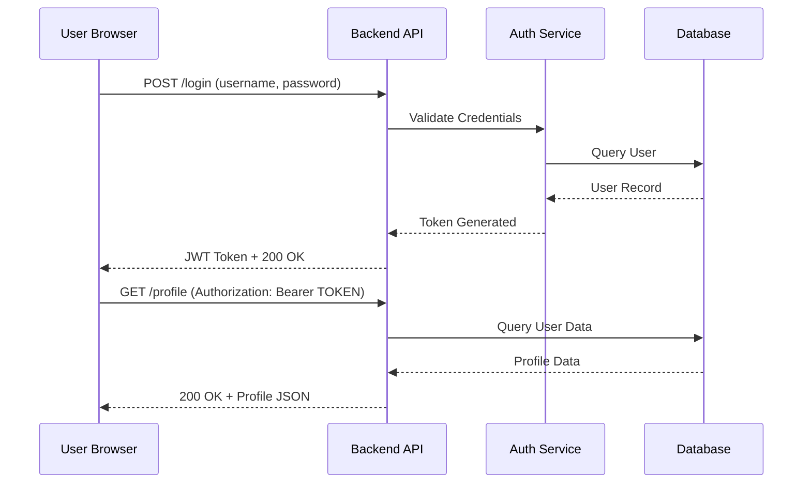

**Message Types**:
- `->` solid line, no arrowhead
- `-->` dotted line, no arrowhead
- `->>` solid line, arrowhead (primary use)
- `-->>` dotted line, arrowhead
- `-x` solid line, cross at end
- `--x` dotted line, cross

**Advanced Features**:

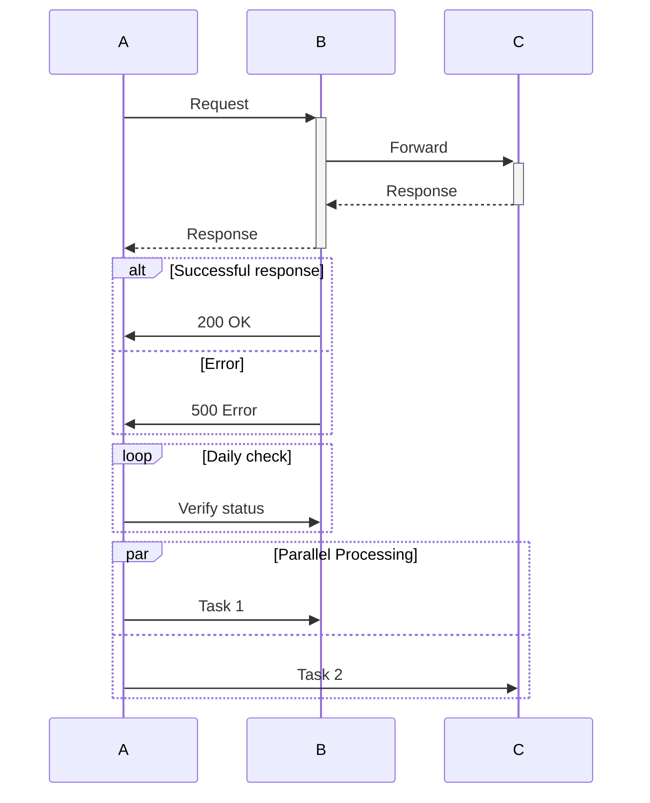

**Performance Tips**:
- Maximum 50 interactions per diagram (split if larger)
- Use `autonumber` for automatic numbering
- Lazy-load in web applications

---

### 3. Block Diagram

**Purpose**: System blocks, hardware architecture, component relationships

**Syntax** (v10.6+):

```mermaid
block-beta
  columns 3
  
  block:group1
    columns 2
    A["Input Module"]
    B["Processor"]
  
  C["Memory Unit"]
  
  block:group2
    columns 2
    D["Output Module"]
    E["Storage"]
```

**Use Cases**:
- FPGA/hardware architecture
- Component hierarchies
- Multi-level systems

---

### 4. Class Diagram (classDiagram)

**Purpose**: OOP architecture, design patterns, system modeling

**Official Syntax**:

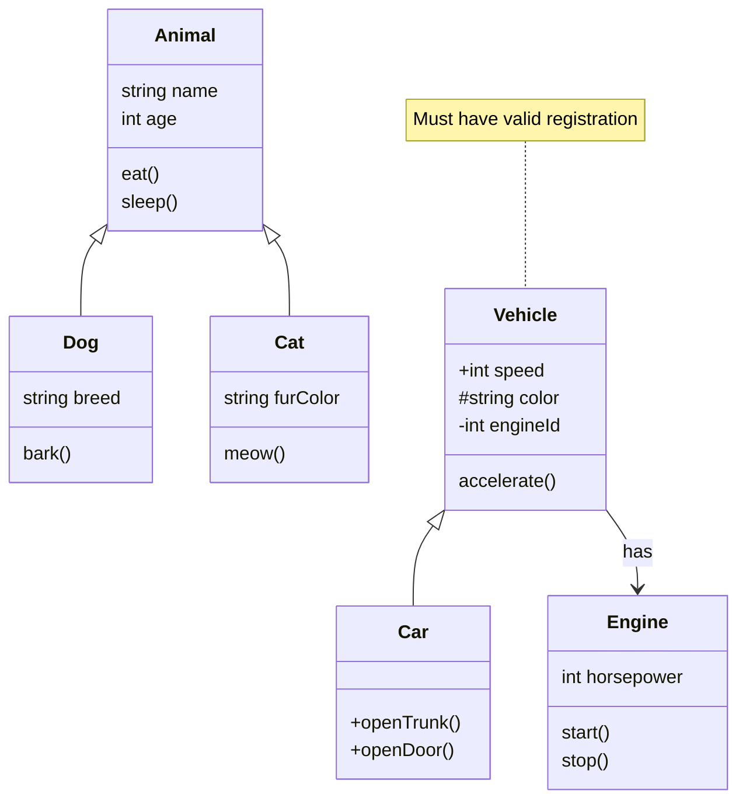

**Relationship Types**:
- `<|--` inheritance
- `*--` composition
- `o--` aggregation
- `-->` association
- `..` dependency (dashed)

**Member Visibility**:
- `+` public
- `-` private
- `#` protected
- `~` package

**Best Practices**:
- Maximum 10 classes per diagram
- Use inheritance sparingly (2-3 levels)
- Document abstract classes

---

### 5. Entity Relationship Diagram (erDiagram)

**Purpose**: Database schema, data modeling, entity relationships

**Official Syntax**:

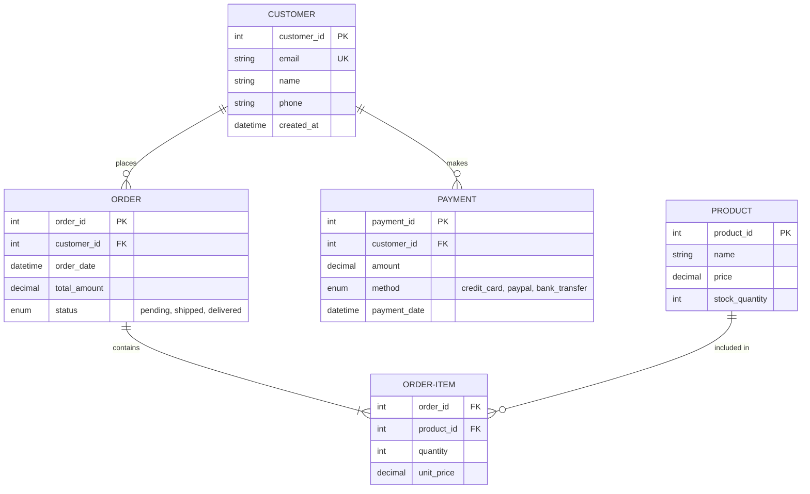

**Cardinality**:
- `|o` zero or one
- `||` one or more
- `o{` zero or more
- `|{` one or more

**Attributes**:
- `PK` primary key
- `FK` foreign key
- `UK` unique key
- Data types: `int`, `string`, `decimal`, `datetime`, `enum`

---

### 6. Gantt Chart

**Purpose**: Project timelines, release schedules, sprint planning, roadmaps

**Official Syntax**:

```mermaid
gantt
    title Project Development Timeline
    dateFormat YYYY-MM-DD
    
    section Backend
    API Design           :design, 2025-01-01, 30d
    Database Setup       :database, 2025-01-10, 20d
    API Implementation   :api, after:design, 45d
    Testing              :testing, after:api, 15d
    
    section Frontend
    UI Design            :ui_design, 2025-01-01, 20d
    Component Dev        :components, after:ui_design, 30d
    Integration          :integration, after:components, 20d
    
    section DevOps
    Infrastructure       :infra, 2025-01-01, 15d
    CI/CD Setup          :cicd, after:infra, 20d
    Monitoring           :monitor, after:cicd, 10d
    
    milestone Deployment m1, after:testing, 1d
    milestone Launch m2, after:integration, 1d
```

**Task Types**:
- `task_id` regular task
- `crit` critical task (red)
- `done` completed task
- `active` in-progress
- `milestone` milestone marker

**Dates**:
- Format: `YYYY-MM-DD`
- Duration: `30d` (days), `2w` (weeks)
- Dependencies: `after:task_id` or `after:task_id, 5d` (offset)

---

### 7. Mindmap

**Purpose**: Brain dumps, hierarchical organization, knowledge structure

**Syntax**:

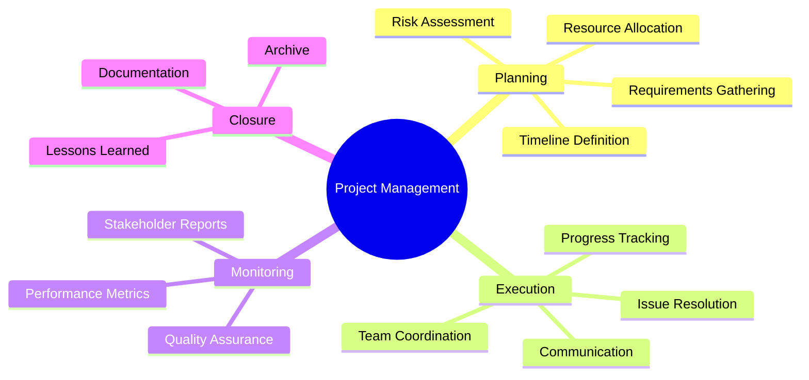

**Features**:
- Unlimited depth (though readability decreases)
- Icons and styling support
- Color customization

---

### 8. State Diagram (stateDiagram-v2)

**Purpose**: State machines, user flows, system lifecycle, workflow automation

**Official Syntax**:

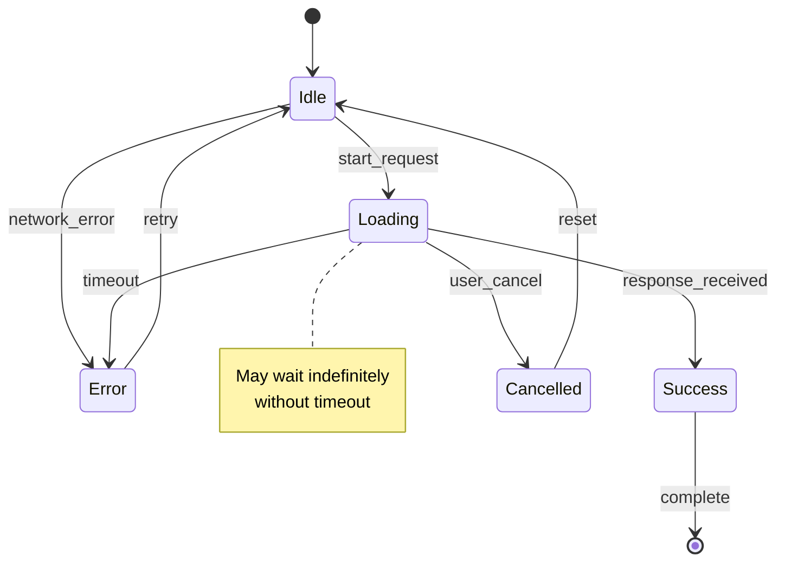

**Features**:
- States and transitions
- Conditional guards: `[condition]`
- Composite states
- Notes and documentation

---

### 9. Timeline

**Purpose**: Event sequences, release history, milestone tracking

**Syntax**:

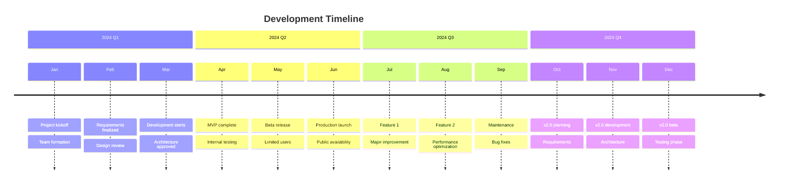

---

### 10. Git Graph

**Purpose**: Git workflows, branch strategies, commit history

**Syntax**:

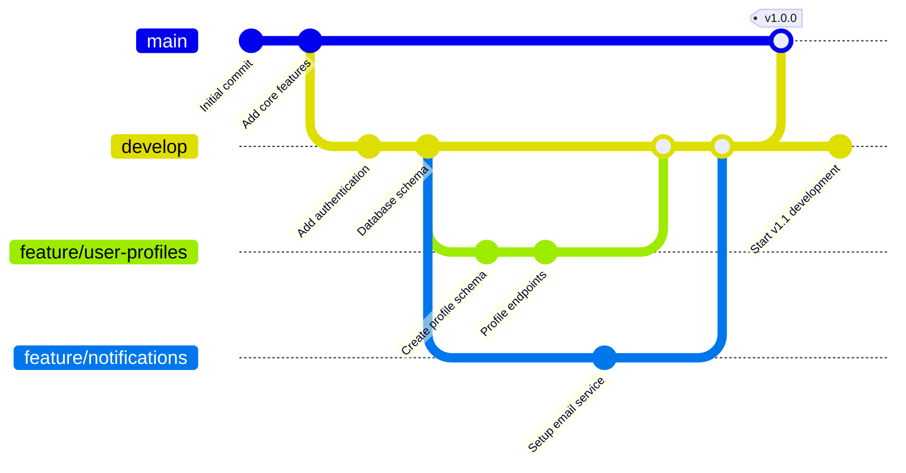

**Commit Types**:
- `NORMAL` default solid circle
- `REVERSE` crossed circle (revert)
- `HIGHLIGHT` filled rectangle

---

### 11. C4 Model Diagram

**Purpose**: System architecture, context diagrams, container views

**Syntax** (v11.0+):

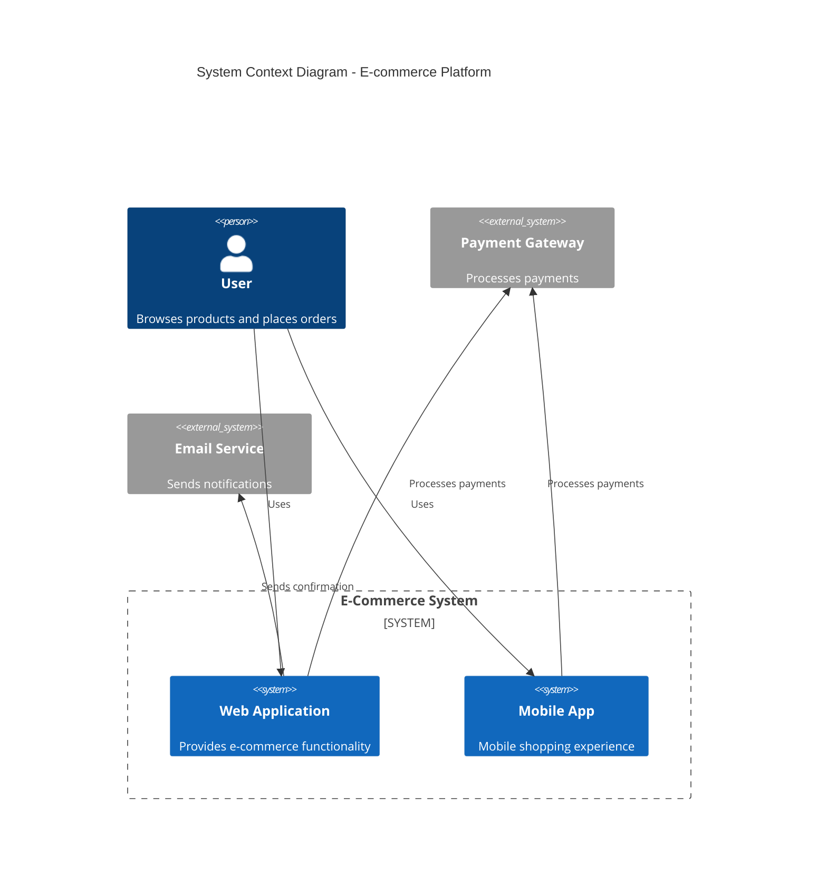

**Diagram Types**:
- System Context Diagram
- Container Diagram
- Component Diagram
- Code Diagram (if supported)

---

### 12. Sankey Diagram

**Purpose**: Flow visualization, resource allocation, energy flows

**Syntax** (v11.0+):

```mermaid
sankey-beta

User Traffic, 10000
Development, 3000
Quality Assurance, 2000
Operations, 1500

Development, Frontend Engineering, 1800
Development, Backend Engineering, 1200
Quality Assurance, Manual Testing, 1200
Quality Assurance, Automation Testing, 800
Operations, Infrastructure, 900
Operations, Support, 600

Frontend Engineering, Production, 1800
Backend Engineering, Production, 1200
Manual Testing, Production, 0
Automation Testing, Production, 0
Infrastructure, Production, 900
Support, Users, 600
Production, Users, 9400
```

---

### 13. Pie Chart

**Purpose**: Percentage breakdown, composition visualization

**Syntax**:

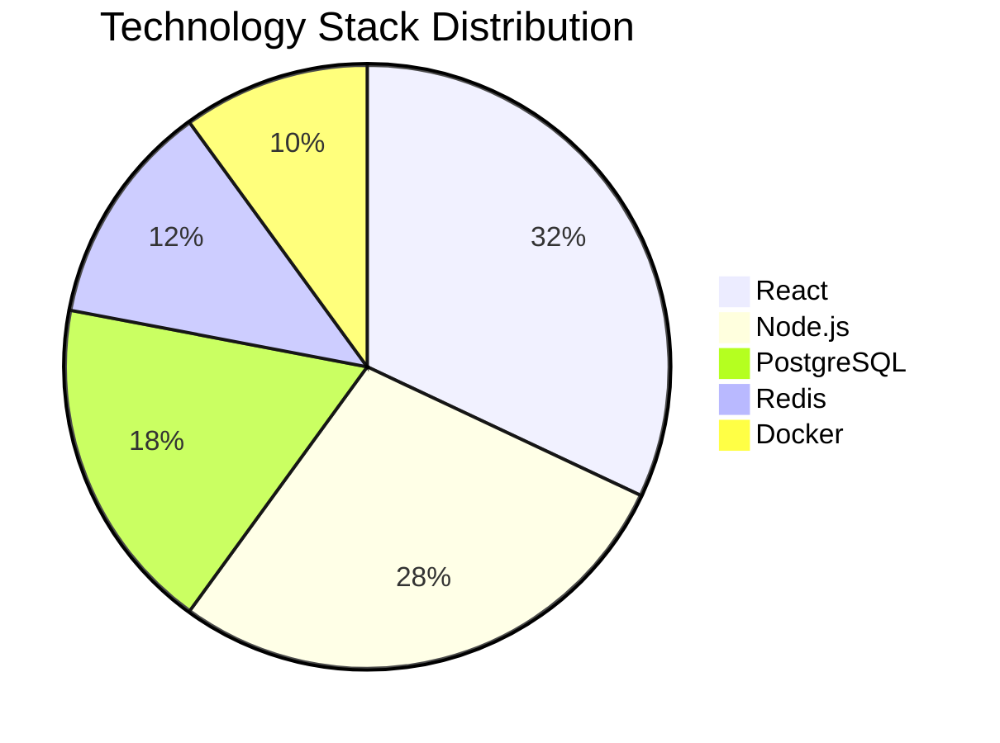

**Features**:
- Up to 10 segments recommended
- Automatic percentage calculation
- Color customization

---

### 14. Quadrant Chart

**Purpose**: Priority matrix, 2D feature analysis, risk assessment

**Syntax**:

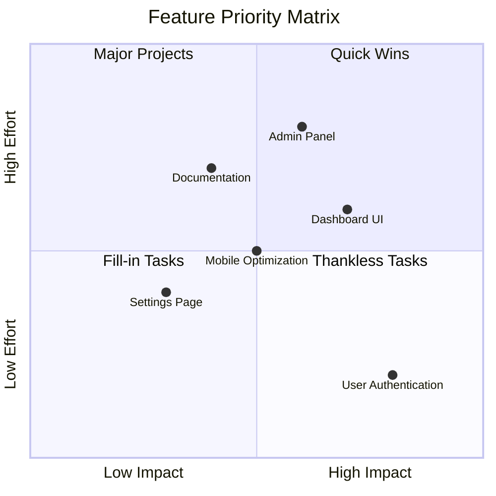

---

### 15. Requirement Diagram

**Purpose**: System requirements, use cases, verification traces

**Syntax** (v10.0+):

```mermaid
requirementDiagram

requirement user_auth {
id: REQ-001
text: User authentication system
risk: High
verifymethod: Test
}

requirement data_encryption {
id: REQ-002
text: All data encrypted at rest
risk: Critical
verifymethod: Analysis
}

requirement api_performance {
id: REQ-003
text: API response < 200ms
risk: Medium
verifymethod: Test
}

element web_app {
type: Software
docref: docs/webapp.md
}

element db {
type: Database
docref: docs/database.md
}

user_auth - contains - data_encryption
api_performance - satisfies - web_app
data_encryption - satisfies - db
```

---

### 16. User Journey Map

**Purpose**: User experience flows, onboarding sequences, customer journeys

**Syntax**:

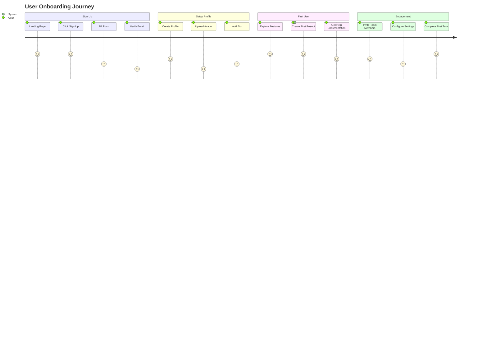

**Scoring**:
- 1-5 scale representing satisfaction/completion
- Actors: who performs the action
- Multiple sections supported

---

### 17. XY Chart (Scatter/Line)

**Purpose**: Data visualization, trends, correlation analysis

**Syntax** (v11.0+):

```mermaid
xychart-beta
    title "Performance Metrics Over Time"
    x-axis [Jan, Feb, Mar, Apr, May, Jun]
    y-axis "Response Time (ms)" 0 --> 300
    
    line [150, 160, 145, 140, 130, 125]
    
    plotData
    [100, 50] [150, 75]
    [200, 120] [250, 150]
    [300, 200] [350, 220]
```

---

### 18. Kanban Board

**Purpose**: Task management visualization, workflow tracking

**Syntax** (v11.0+):


---

### 19. Architecture Diagram

**Purpose**: System design, component layout, deployment architecture

**Note**: Uses standard flowchart with styling for architecture purposes

```mermaid
graph TB
    subgraph "Frontend"
        web["Web Application<br/>React + TypeScript"]
        mobile["Mobile App<br/>React Native"]
    end
    
    subgraph "API Gateway"
        gateway["API Gateway<br/>Kong/AWS API Gateway"]
    end
    
    subgraph "Backend Services"
        auth["Authentication<br/>Service"]
        user["User<br/>Service"]
        product["Product<br/>Service"]
        order["Order<br/>Service"]
    end
    
    subgraph "Data Layer"
        postgres["PostgreSQL<br/>Primary DB"]
        redis["Redis<br/>Cache"]
        s3["S3<br/>File Storage"]
    end
    
    subgraph "Message Queue"
        kafka["Kafka<br/>Event Streaming"]
    end
    
    web --> gateway
    mobile --> gateway
    gateway --> auth
    gateway --> user
    gateway --> product
    gateway --> order
    
    auth --> postgres
    user --> postgres
    product --> postgres
    order --> postgres
    
    auth --> redis
    user --> redis
    
    product --> s3
    order --> kafka
    user --> kafka
    
    style web fill:#e1f5fe
    style mobile fill:#e1f5fe
    style gateway fill:#fff3e0
    style postgres fill:#f3e5f5
    style redis fill:#f3e5f5
    style kafka fill:#e8f5e9
```

---

### 20. Packet Diagram

**Purpose**: Network packets, protocol structure, data format visualization

**Syntax** (v10.6+):

```mermaid
packet-beta
  0-7: Source Port
  8-15: Destination Port
  16-31: Sequence Number
  32-63: Acknowledgment Number
  64-67: Data Offset
  68-71: Reserved
  72-79: Flags
  80-95: Window Size
  96-111: Checksum
  112-127: Urgent Pointer
  128-...: Options & Padding
```

---

### 21. Radar Chart

**Purpose**: Multi-dimensional metrics, capability assessment, technical skills

**Syntax** (v11.0+):

```mermaid
radar
    title Technical Skills Assessment
    
    Frontend Skills: 85
    Backend Skills: 90
    Database Design: 80
    DevOps/Infra: 75
    Security: 70
    Documentation: 65
    
    max: 100
```

---

## Section 2: Syntax Validation & Error Prevention

### Common Errors and Solutions

**Error 1: Unclosed Blocks**

```mermaid
# ❌ WRONG
graph TD
    subgraph group
        A[Node]
    # Missing 'end'

# ✅ CORRECT
graph TD
    subgraph group
        A[Node]
    end
    B[Other]
```

**Error 2: Invalid Characters in IDs**

```mermaid
# ❌ WRONG (spaces and special chars in ID)
graph TD
    "my node"[Text]
    my-node-id[Text]  # Hyphens cause issues

# ✅ CORRECT (use underscores or numbers)
graph TD
    my_node_id[Text]
    myNode123[Text]
```

**Error 3: Missing Quotes in Labels with Special Characters**

```mermaid
# ❌ WRONG
graph TD
    A[User's Name]  # Apostrophe breaks

# ✅ CORRECT
graph TD
    A["User's Name"]
```

**Error 4: Invalid Relationship Syntax in ER Diagrams**

```mermaid
# ❌ WRONG
erDiagram
    CUSTOMER -- ORDER : places  # Missing cardinality

# ✅ CORRECT
erDiagram
    CUSTOMER ||--o{ ORDER : places
```

### Validation Script

```python
import re
from typing import Dict, List

class MermaidValidator:
    """Validate Mermaid diagram syntax before rendering"""
    
    DIAGRAM_TYPES = {
        'flowchart': r'^(graph|flowchart)\s+(TD|LR|RL|BT)',
        'sequence': r'^sequenceDiagram',
        'class': r'^classDiagram',
        'state': r'^stateDiagram-v2',
        'er': r'^erDiagram',
        'gantt': r'^gantt',
        'mindmap': r'^mindmap',
        'timeline': r'^timeline',
        'gitgraph': r'^gitGraph',
        'pie': r'^pie',
        'journey': r'^journey',
    }
    
    def __init__(self):
        self.errors: List[str] = []
        self.warnings: List[str] = []
    
    def validate(self, mermaid_code: str) -> Dict[str, any]:
        """Comprehensive validation"""
        self.errors = []
        self.warnings = []
        
        # Detect type
        diagram_type = self._detect_type(mermaid_code)
        if not diagram_type:
            self.errors.append("Unknown diagram type")
            return {"valid": False, "errors": self.errors}
        
        # Check balance of blocks
        if self._has_unbalanced_blocks(mermaid_code):
            self.errors.append("Unbalanced subgraph blocks")
        
        # Check for common syntax errors
        self._check_node_ids(mermaid_code)
        self._check_special_chars(mermaid_code)
        self._check_quotes(mermaid_code)
        
        return {
            "valid": len(self.errors) == 0,
            "diagram_type": diagram_type,
            "errors": self.errors,
            "warnings": self.warnings
        }
    
    def _detect_type(self, code: str) -> str:
        """Detect diagram type from code"""
        for dtype, pattern in self.DIAGRAM_TYPES.items():
            if re.search(pattern, code, re.MULTILINE):
                return dtype
        return None
    
    def _has_unbalanced_blocks(self, code: str) -> bool:
        """Check for balanced subgraph/block tags"""
        opens = code.count('subgraph') + code.count('block')
        closes = code.count('end')
        return opens != closes
    
    def _check_node_ids(self, code: str) -> None:
        """Validate node IDs"""
        # Find all node definitions
        pattern = r'(\w+)\s*\['
        matches = re.findall(pattern, code)
        
        for node_id in matches:
            if '-' in node_id and not node_id.startswith('"'):
                self.warnings.append(f"Node ID '{node_id}' contains hyphens (may cause issues)")
    
    def _check_special_chars(self, code: str) -> None:
        """Check for problematic special characters"""
        if "'" in code and '"' not in code:
            self.warnings.append("Apostrophes detected; consider using double quotes")
    
    def _check_quotes(self, code: str) -> None:
        """Validate quote balance"""
        unquoted_text = re.findall(r'\[([^\]]*)\]', code)
        for text in unquoted_text:
            if any(c in text for c in [':', '(', ')']):
                self.warnings.append(f"Text '{text}' may need escaping")
```

---

## Section 3: Python CLI Tool (mermaid-to-svg-png.py)

### Complete Script with Async Support

```python
#!/usr/bin/env python3
"""
Mermaid to SVG/PNG Converter - Enterprise Edition
Version: 1.0.0
Requires: Python 3.8+, playwright, click, pydantic, pillow
"""

import asyncio
import json
import logging
from dataclasses import dataclass, asdict
from pathlib import Path
from typing import Literal, List, Optional, Dict
from datetime import datetime
import tempfile
import time

import click
from pydantic import BaseModel, Field, validator
from playwright.async_api import async_playwright, Browser, Page
from PIL import Image
import io

# ============================================================================
# Configuration & Data Models
# ============================================================================

class MermaidConfig(BaseModel):
    """Validated configuration for Mermaid rendering"""
    input_path: Path
    output_dir: Path = Field(default_factory=Path.cwd)
    output_format: Literal['svg', 'png'] = 'svg'
    width: int = 1024
    height: int = 768
    theme: Literal['default', 'dark', 'forest'] = 'default'
    dpi: int = 96
    batch_mode: bool = False
    watch_mode: bool = False
    no_overwrite: bool = False
    dry_run: bool = False
    json_output: bool = False
    quiet: bool = False
    validate_only: bool = False
    
    @validator('width', 'height')
    def check_dimensions(cls, v):
        if v < 100:
            raise ValueError('Minimum width/height: 100px')
        if v > 4096:
            raise ValueError('Maximum width/height: 4096px')
        return v

@dataclass
class ConversionResult:
    """Result of a single conversion"""
    input_file: Path
    output_file: Optional[Path] = None
    success: bool = False
    error_message: Optional[str] = None
    execution_time: float = 0.0
    file_size: Optional[int] = None
    diagram_type: Optional[str] = None

# ============================================================================
# Logging Setup
# ============================================================================

def setup_logging(quiet: bool = False) -> logging.Logger:
    """Configure logging"""
    log_level = logging.WARNING if quiet else logging.INFO
    logging.basicConfig(
        level=log_level,
        format='[%(asctime)s] %(levelname)s - %(message)s',
        handlers=[
            logging.FileHandler('mermaid-converter.log'),
            logging.StreamHandler() if not quiet else logging.NullHandler()
        ]
    )
    return logging.getLogger(__name__)

# ============================================================================
# Mermaid Converter Class
# ============================================================================

class MermaidConverter:
    """Async Mermaid converter with Playwright"""
    
    def __init__(self, config: MermaidConfig, logger: logging.Logger):
        self.config = config
        self.logger = logger
        self.browser: Optional[Browser] = None
        self.results: List[ConversionResult] = []
    
    async def initialize(self) -> None:
        """Initialize Playwright browser"""
        playwright = await async_playwright().start()
        self.browser = await playwright.chromium.launch(headless=True)
        self.logger.info("Browser initialized")
    
    async def cleanup(self) -> None:
        """Cleanup resources"""
        if self.browser:
            await self.browser.close()
        self.logger.info("Browser closed")
    
    async def convert_single(self, input_file: Path) -> ConversionResult:
        """Convert single Mermaid file"""
        result = ConversionResult(input_file=input_file)
        start_time = time.time()
        
        try:
            # Read input
            if not input_file.exists():
                result.error_message = f"File not found: {input_file}"
                return result
            
            mermaid_code = input_file.read_text(encoding='utf-8')
            diagram_type = self._detect_type(mermaid_code)
            result.diagram_type = diagram_type
            
            # Validate only
            if self.config.validate_only:
                validator = MermaidValidator()
                validation = validator.validate(mermaid_code)
                if validation['valid']:
                    result.success = True
                    result.execution_time = time.time() - start_time
                    return result
                else:
                    result.error_message = f"Validation failed: {validation['errors']}"
                    return result
            
            # Skip if file exists and no-overwrite is set
            output_file = self._get_output_path(input_file)
            if output_file.exists() and self.config.no_overwrite:
                result.error_message = "File exists; skipped (--no-overwrite)"
                result.success = True
                return result
            
            # Render
            if self.config.output_format == 'svg':
                svg_content = await self._render_svg(mermaid_code)
                if not self.config.dry_run:
                    output_file.write_text(svg_content)
                result.output_file = output_file
                result.file_size = len(svg_content)
            else:  # PNG
                png_bytes = await self._render_png(mermaid_code)
                if not self.config.dry_run:
                    output_file.write_bytes(png_bytes)
                result.output_file = output_file
                result.file_size = len(png_bytes)
            
            result.success = True
            result.execution_time = time.time() - start_time
            self.logger.info(f"Converted: {input_file.name} -> {output_file.name}")
            
        except Exception as e:
            result.error_message = str(e)
            result.execution_time = time.time() - start_time
            self.logger.error(f"Error converting {input_file}: {e}")
        
        return result
    
    async def _render_svg(self, mermaid_code: str) -> str:
        """Render Mermaid to SVG using Playwright"""
        page = await self.browser.new_page(
            viewport={'width': self.config.width, 'height': self.config.height}
        )
        
        try:
            # Mermaid render HTML
            html = f"""
            <!DOCTYPE html>
            <html>
            <head>
                <meta charset="utf-8">
                <script src="https://cdn.jsdelivr.net/npm/mermaid@11/dist/mermaid.min.js"></script>
                <style>
                    body {{ margin: 0; padding: 20px; }}
                    .mermaid {{ display: flex; justify-content: center; }}
                </style>
            </head>
            <body>
                <div class="mermaid">
                {mermaid_code}
                </div>
                <script>
                    mermaid.initialize({{ startOnLoad: true, theme: '{self.config.theme}' }});
                    mermaid.contentLoaded();
                </script>
            </body>
            </html>
            """
            
            await page.set_content(html)
            await page.wait_for_selector('.mermaid svg', timeout=10000)
            
            # Extract SVG
            svg = await page.evaluate("""
                () => document.querySelector('.mermaid svg').outerHTML
            """)
            
            return svg
            
        finally:
            await page.close()
    
    async def _render_png(self, mermaid_code: str) -> bytes:
        """Render Mermaid to PNG"""
        # First render SVG
        svg_content = await self._render_svg(mermaid_code)
        
        # Convert SVG to PNG using Pillow
        page = await self.browser.new_page(
            viewport={'width': self.config.width, 'height': self.config.height}
        )
        
        try:
            html = f"""
            <!DOCTYPE html>
            <html>
            <head><style>body {{ margin: 0; }}</style></head>
            <body>{svg_content}</body>
            </html>
            """
            
            await page.set_content(html)
            png_bytes = await page.screenshot()
            return png_bytes
            
        finally:
            await page.close()
    
    async def convert_batch(self, input_dir: Path) -> List[ConversionResult]:
        """Convert all .mmd files in directory"""
        mmd_files = list(input_dir.rglob('*.mmd'))
        self.logger.info(f"Found {len(mmd_files)} .mmd files")
        
        for input_file in mmd_files:
            result = await self.convert_single(input_file)
            self.results.append(result)
        
        return self.results
    
    def _detect_type(self, code: str) -> str:
        """Detect Mermaid diagram type"""
        if code.startswith('graph') or code.startswith('flowchart'):
            return 'flowchart'
        elif code.startswith('sequenceDiagram'):
            return 'sequence'
        elif code.startswith('classDiagram'):
            return 'class'
        # ... add more types
        return 'unknown'
    
    def _get_output_path(self, input_file: Path) -> Path:
        """Generate output file path"""
        stem = input_file.stem
        extension = 'svg' if self.config.output_format == 'svg' else 'png'
        return self.config.output_dir / f"{stem}.{extension}"

# ============================================================================
# CLI Interface
# ============================================================================

@click.command()
@click.argument('input', type=click.Path(exists=True))
@click.option('-o', '--output', type=click.Path(), help='Output file or directory')
@click.option('-f', '--format', type=click.Choice(['svg', 'png']), default='svg', help='Output format')
@click.option('-w', '--width', type=int, default=1024, help='Image width (px)')
@click.option('-h', '--height', type=int, default=768, help='Image height (px)')
@click.option('-t', '--theme', type=click.Choice(['default', 'dark', 'forest']), default='default', help='Theme')
@click.option('-b', '--batch', is_flag=True, help='Batch mode (process folder)')
@click.option('--watch', is_flag=True, help='Watch mode (auto-convert on changes)')
@click.option('--no-overwrite', is_flag=True, help='Skip existing files')
@click.option('--dry-run', is_flag=True, help='Preview without saving')
@click.option('--json', is_flag=True, help='JSON output format')
@click.option('-q', '--quiet', is_flag=True, help='Suppress output')
@click.option('--validate', is_flag=True, help='Validate syntax only')
@click.version_option('1.0.0')
def main(input, output, format, width, height, theme, batch, watch, no_overwrite, 
         dry_run, json, quiet, validate):
    """
    Convert Mermaid diagrams to SVG or PNG
    
    Examples:
        # Single file
        mermaid-to-svg-png.py diagram.mmd --output diagram.svg
        
        # Batch PNG conversion
        mermaid-to-svg-png.py ./diagrams --format png --batch --output ./images
        
        # Validate only
        mermaid-to-svg-png.py diagram.mmd --validate
    """
    
    logger = setup_logging(quiet)
    
    try:
        # Parse config
        input_path = Path(input)
        output_dir = Path(output) if output else Path.cwd()
        
        config = MermaidConfig(
            input_path=input_path,
            output_dir=output_dir,
            output_format=format,
            width=width,
            height=height,
            theme=theme,
            batch_mode=batch,
            watch_mode=watch,
            no_overwrite=no_overwrite,
            dry_run=dry_run,
            json_output=json,
            quiet=quiet,
            validate_only=validate,
        )
        
        # Run converter
        converter = MermaidConverter(config, logger)
        
        async def run():
            await converter.initialize()
            try:
                if batch or input_path.is_dir():
                    await converter.convert_batch(input_path)
                else:
                    result = await converter.convert_single(input_path)
                    converter.results = [result]
            finally:
                await converter.cleanup()
        
        asyncio.run(run())
        
        # Output results
        if json:
            output_data = [asdict(r) for r in converter.results]
            click.echo(json_module.dumps(output_data, indent=2, default=str))
        
        # Summary
        successful = sum(1 for r in converter.results if r.success)
        total = len(converter.results)
        click.echo(f"\nCompleted: {successful}/{total}")
        
        # Exit code
        exit_code = 0 if successful == total else 1
        raise SystemExit(exit_code)
        
    except Exception as e:
        logger.error(f"Fatal error: {e}")
        raise SystemExit(1)

# ============================================================================
# Entry Point
# ============================================================================

if __name__ == '__main__':
    import json as json_module
    main()
```

### Installation & Usage

```bash
# 1. Install dependencies
pip install playwright click pydantic pillow
playwright install chromium

# 2. Make executable
chmod +x mermaid-to-svg-png.py

# 3. Usage examples

# Single file conversion
./mermaid-to-svg-png.py diagram.mmd --output diagram.svg

# Batch PNG conversion
./mermaid-to-svg-png.py ./diagrams --format png --batch --output ./images

# Watch mode (auto-convert)
./mermaid-to-svg-png.py ./diagrams --watch --output ./images

# Validate without converting
./mermaid-to-svg-png.py diagram.mmd --validate

# CI/CD usage
./mermaid-to-svg-png.py ./docs --format png --json --quiet > results.json
```

---

## Section 4: Batch Processing & Automation

### Git Pre-commit Hook

```bash
#!/bin/sh
# .git/hooks/pre-commit

MERMAID_DIR="./diagrams"
OUTPUT_DIR="./docs/images"

if [ -d "$MERMAID_DIR" ]; then
    echo "Converting Mermaid diagrams..."
    python scripts/mermaid-to-svg-png.py "$MERMAID_DIR" \
        --format png \
        --batch \
        --output "$OUTPUT_DIR" \
        --no-overwrite
    
    if [ $? -eq 0 ]; then
        git add "$OUTPUT_DIR"
    else
        echo "Error: Mermaid conversion failed"
        exit 1
    fi
fi
```

### GitHub Actions Workflow

```yaml
# .github/workflows/mermaid-diagrams.yml

name: Convert Mermaid Diagrams

on:
  pull_request:
    paths:
      - 'diagrams/**/*.mmd'
  push:
    branches: [main]
    paths:
      - 'diagrams/**/*.mmd'

jobs:
  convert:
    runs-on: ubuntu-latest
    steps:
      - uses: actions/checkout@v3
      
      - name: Setup Python
        uses: actions/setup-python@v4
        with:
          python-version: '3.11'
      
      - name: Install dependencies
        run: |
          pip install playwright click pydantic pillow
          playwright install chromium
      
      - name: Convert Diagrams
        run: |
          python scripts/mermaid-to-svg-png.py ./diagrams \
            --format png \
            --batch \
            --output ./docs/images \
            --no-overwrite
      
      - name: Commit & Push
        if: github.event_name == 'push'
        run: |
          git config user.email "bot@example.com"
          git config user.name "Diagram Bot"
          git add docs/images
          git commit -m "chore: auto-generated diagram images" || true
          git push
      
      - name: Comment on PR
        if: github.event_name == 'pull_request'
        uses: actions/github-script@v6
        with:
          script: |
            const fs = require('fs');
            const results = JSON.parse(fs.readFileSync('results.json', 'utf8'));
            const comment = `Generated ${results.length} diagram images`;
            github.rest.issues.createComment({
              issue_number: context.issue.number,
              owner: context.repo.owner,
              repo: context.repo.repo,
              body: comment
            });
```

---

## Section 5: Production Workflows

### Database Schema to ER Diagram

```python
import json
from pathlib import Path

def schema_to_mermaid(schema_json: str) -> str:
    """Convert database schema to Mermaid ER diagram"""
    schema = json.loads(schema_json)
    
    lines = ["erDiagram"]
    
    # Add relationships
    for rel in schema.get('relationships', []):
        lines.append(f"    {rel['from']} {rel['cardinality']} {rel['to']}")
    
    # Add entities
    for entity in schema.get('entities', []):
        lines.append(f"\n    {entity['name']} {{")
        for field in entity['fields']:
            pk_mark = " PK" if field.get('primary_key') else ""
            fk_mark = " FK" if field.get('foreign_key') else ""
            lines.append(f"        {field['type']} {field['name']}{pk_mark}{fk_mark}")
        lines.append("    }")
    
    return "\n".join(lines)

# Usage
schema = '''
{
  "entities": [
    {
      "name": "users",
      "fields": [
        {"name": "id", "type": "int", "primary_key": true},
        {"name": "email", "type": "string"},
        {"name": "created_at", "type": "datetime"}
      ]
    },
    {
      "name": "posts",
      "fields": [
        {"name": "id", "type": "int", "primary_key": true},
        {"name": "user_id", "type": "int", "foreign_key": true},
        {"name": "content", "type": "text"}
      ]
    }
  ],
  "relationships": [
    {"from": "users", "to": "posts", "cardinality": "||--o{"}
  ]
}
'''

diagram = schema_to_mermaid(schema)
Path("database.mmd").write_text(diagram)
```

### API Specification to Sequence Diagram

```python
from typing import List, Dict

def openapi_to_sequence(openapi_spec: Dict) -> str:
    """Convert OpenAPI spec to sequence diagram"""
    lines = ["sequenceDiagram"]
    
    paths = openapi_spec.get('paths', {})
    
    for path, methods in paths.items():
        for method, details in methods.items():
            if method.upper() in ['GET', 'POST', 'PUT', 'DELETE']:
                operation_id = details.get('operationId', path)
                lines.append(f"    Client->>Server: {method.upper()} {path}")
                
                # Add database interaction if needed
                if 'database' in details.get('tags', []):
                    lines.append(f"    Server->>Database: Query data")
                    lines.append(f"    Database-->>Server: Results")
                
                lines.append(f"    Server-->>Client: {details.get('summary', 'Response')}")
    
    return "\n".join(lines)
```

---

## Section 6: Performance & Optimization

### Caching Strategy

```python
import hashlib
from functools import lru_cache

class MermaidCache:
    """Cache rendered diagrams"""
    
    def __init__(self, cache_dir: Path):
        self.cache_dir = cache_dir
        self.cache_dir.mkdir(exist_ok=True)
    
    def get_cache_key(self, mermaid_code: str, format: str) -> str:
        """Generate cache key"""
        content = f"{mermaid_code}:{format}"
        return hashlib.sha256(content.encode()).hexdigest()
    
    def get(self, mermaid_code: str, format: str) -> Optional[bytes]:
        """Retrieve from cache"""
        key = self.get_cache_key(mermaid_code, format)
        cache_file = self.cache_dir / f"{key}.{format}"
        
        if cache_file.exists():
            return cache_file.read_bytes()
        return None
    
    def set(self, mermaid_code: str, format: str, data: bytes) -> None:
        """Store in cache"""
        key = self.get_cache_key(mermaid_code, format)
        cache_file = self.cache_dir / f"{key}.{format}"
        cache_file.write_bytes(data)
```

### Lazy Loading in Web Applications

```javascript
// Lazy load diagrams with Intersection Observer
const observer = new IntersectionObserver((entries) => {
  entries.forEach(entry => {
    if (entry.isIntersecting) {
      const diagram = entry.target;
      diagram.classList.remove('lazy');
      observer.unobserve(diagram);
    }
  });
});

document.querySelectorAll('.mermaid.lazy').forEach(el => {
  observer.observe(el);
});
```

---

## Advanced: TroubleShooting

### Common Issues

**Issue 1: "Timeout waiting for browser"**
- Solution: Increase timeout, check system resources
- Update: `timeout=30000` in page.wait_for_selector()

**Issue 2: "SVG rendering blank"**
- Solution: Validate Mermaid syntax first
- Use: `--validate` flag before conversion

**Issue 3: "PNG quality poor"**
- Solution: Increase width/height and DPI
- Try: `--width 2048 --height 1536 --dpi 150`

---

## Related Skills

- `moai-mermaid-diagram-expert` (v4.0.0 - Legacy)
- `moai-component-designer` (system design)
- `moai-docs-generation` (documentation)
- `moai-domain-devops` (CI/CD integration)

## Reference Materials

- [Mermaid Official Docs](https://mermaid.js.org/)
- [v11.x Features](https://mermaid.js.org/intro/)
- [Live Editor](https://mermaid.live)
- [GitHub Repository](https://github.com/mermaid-js/mermaid)

---

**Version**: 5.0.0 | **Status**: Production Ready | **Last Updated**: 2025-11-20
