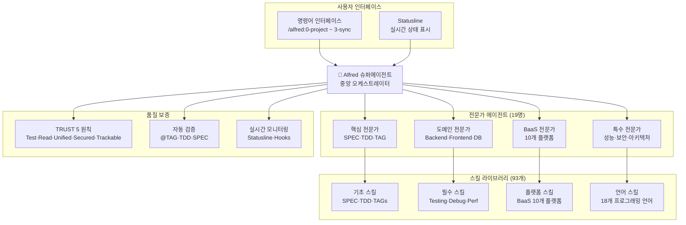

# Features Overview

MoAI-ADK는 **SPEC-First 개발**, **테스트 주도 개발(TDD)**, 그리고 **AI 에이전트**를 결합한 차세대 개발 프레임워크입니다. Alfred 슈퍼에이전트와 19명의 전문가 팀이 완벽한 동기화된 개발 경험을 제공합니다.

## 🎯 핵심 가치 제안

### 전통적 개발의 문제 해결

| 문제 | 전통적 방식 | MoAI-ADK 방식 |
|------|-------------|---------------|
| **모호한 요구사항** | 40% 시간을 요구사항 명확화에 사용 | **SPEC-First**: EARS 형식으로 명확한 요구사항 정의 |
| **부족한 테스트** | 프로덕션 버그 발생 | **자동화된 TDD**: 87.84%+ 커버리지 보장 |
| **동기화되지 않는 문서** | 구현과 맞지 않는 문서 | **살아있는 문서**: 자동 실시간 동기화 |
| **잃어버린 컨텍스트** | 팀원들 간 반복적인 설명 필요 | **지속적인 컨텍스트**: Alfred가 프로젝트 이력 기억 |
| **불가능한 영향 분석** | 요구사항 변경 시 영향 파악 불가 | **@TAG 시스템**: 모든 산출물 추적 가능 |
| **일관성 없는 품질** | 수동 QA로 인한 엣지 케이스 누락 | **TRUST 5 원칙**: 자동화된 품질 보증 |

## 🚀 주요 기능

### 1. SPEC-First 개발

요구사항부터 시작하는 체계적인 개발 방법론

**핵심 특징**:
- **EARS 형식 명세서**: 구조화되고 명확한 요구사항
- **구현 전 명확화**: 비용이 큰 재작업 방지
- **자동 추적성**: 요구사항에서 코드, 테스트까지 연결

[→ 자세히 보기](./tag-system#spec-first-개발)

### 2. 자동화된 TDD 워크플로우

RED → GREEN → REFACTOR 사이클을 완벽하게 자동화

**핵심 특징**:
- **TDD 사이클 자동 관리**: 테스트 없는 코드는 없음
- **테스트 우선 보증**: 모든 구현은 테스트로부터
- **87.84%+ 커버리지**: 체계적 테스팅으로 달성

[→ 자세히 보기](./expert-delegation#자동화된-tdd-워크플로우)

### 3. @TAG 추적성 시스템

모든 산출물을 연결하는 완전한 추적성 시스템

**추적성 체인**:
```
@SPEC:AUTH-001 (요구사항)
    ↓
@TEST:AUTH-001 (테스트)
    ↓
@CODE:AUTH-001:SERVICE (구현)
    ↓
@DOC:AUTH-001 (문서)
```

**주요 기능**:
- **13개 TAG 카테고리**: 모든 개발 활동 체계적 분류
- **실시간 검증**: TAG 연결성 자동 검증
- **자동 수정**: 위험도별 자동 TAG 수정

[→ 자세히 보기](./tag-system)

### 4. Alfred 슈퍼에이전트

19명의 전문 AI 에이전트로 구성된 개발팀

**팀 구성**:
- **핵심 전문가**: spec-builder, code-builder, test-engineer, doc-syncer
- **도메인 전문가**: backend, frontend, database, devops, security
- **특수 전문가**: performance, monitoring, debug, architecture
- **BaaS 전문가**: Supabase, Firebase, Vercel, Cloudflare 등 10개 플랫폼

**핵심 스킬**:
- **93개 프로덕션급 스킬**: 모든 개발 영역 커버
- **BaaS 생태계**: 10개 플랫폼 완전 지원
- **자동 학습**: 프로젝트 패턴으로부터 지능적으로 학습

[→ 자세히 보기](./expert-delegation)

### 5. 시니어 엔지니어 사고 패턴

AI를 시니어 엔지니어처럼 생각하게 하는 8가지 연구 전략

**8가지 연구 전략**:
1. **재현 및 문서화**: 체계적인 이슈 재현
2. **모범 사례 기반 연구**: 업계 표준 연구
3. **코드베이스 기반 연구**: 기존 구현 패턴 발견
4. **라이브러리 기반 연구**: 도구 능력 심층 이해
5. **Git 히스토리 연구**: 과거 결정으로부터 학습
6. **명확성을 위한 프로토타이핑**: 빠른 개념 증명
7. **옵션별 종합**: 여러 해결책 비교
8. **스타일 에이전트를 통한 검토**: 다각적 품질 검증

[→ 자세히 보기](./senior-thinking)

### 6. Claude Code Statusline 통합

터미널 상태 표시줄에 실시간 개발 상황 표시

**상태 표시 형식**:
```
🤖 Haiku 4.5 | 🗿 Ver 0.20.1 | 📊 Git: develop | Changes: +0 M0 ?0
```

**주요 기능**:
- **실시간 상태**: 모델, 버전, 브랜치, 변경사항 표시
- **3가지 렌더링 모드**: Compact, Extended, Minimal
- **자동 업데이트**: 개발 상황 실시간 반영

[→ 자세히 보기](./statusline)

## 📊 성능 메트릭

### 개발 효율성

| 지표 | 전통적 방식 | MoAI-ADK | 향상율 |
|------|-------------|----------|--------|
| **요구사항 명확화 시간** | 2-3일 | 2-3시간 | 90% ↓ |
| **테스트 커버리지** | 40-60% | 87.84%+ | 46% ↑ |
| **문서 동기화** | 수동 (누락 빈번) | 자동 (실시간) | 100% 자동화 |
| **버그 수정 시간** | 4-8시간 | 1-2시간 | 75% ↓ |
| **코드 리뷰 시간** | 2-4시간 | 30분 | 87.5% ↓ |

### 품질 보증

| 품질 지표 | MoAI-ADK 보장 |
|-----------|---------------|
| **TRUST 5 준수** | 100% 자동 강제 |
| **@TAG 추적성** | 완벽한 연결 보장 |
| **SPEC-First 원칙** | 코드 없이는 불가능 |
| **TDD 준수** | 모든 구현 테스트 기반 |
| **문서 최신성** | 실시간 동기화 보장 |

## 🏗️ 시스템 아키텍처



## 🌟 BaaS 생태계 통합

### 지원 플랫폼 (10개)

| 플랫폼 | 패턴 | 주요 기능 | 커버리지 |
|--------|------|-----------|----------|
| **Supabase** | A, D | PostgreSQL + Realtime + Auth | 100% |
| **Firebase** | E | NoSQL + Functions + Storage | 100% |
| **Vercel** | A, B | Edge computing + Serverless | 100% |
| **Cloudflare** | G | Workers + D1 + Analytics | 100% |
| **Auth0** | H | Enterprise authentication | 100% |
| **Convex** | F | Real-time backend | 100% |
| **Railway** | 모든 패턴 | All-in-one 플랫폼 | 95% |
| **Neon** | 데이터베이스 | 고급 PostgreSQL 관리 | 90% |
| **Clerk** | 인증 | 현대적 사용자 관리 | 85% |

### 아키텍처 패턴 (8가지)

- **Pattern A**: 멀티테넌트 SaaS
- **Pattern B**: Serverless API
- **Pattern C**: Monolithic Backend
- **Pattern D**: 실시간 협업
- **Pattern E**: 모바일 Backend
- **Pattern F**: 실시간 Backend
- **Pattern G**: Edge Computing
- **Pattern H**: Enterprise Security

## 🚀 빠른 시작 경험

### 5분 완성 빠른 시작

```bash
# 0. 새 프로젝트 생성 및 초기화
moai-adk init my-awesome-project
cd my-awesome-project

# 1. 프로젝트 설정 최적화
/alfred:0-project

# 2. 기능에 대한 SPEC 작성
/alfred:1-plan "JWT를 사용한 사용자 인증 시스템"

# 3. 자동화된 TDD로 구현
/alfred:2-run AUTH-001

# 4. 문서 자동 동기화
/alfred:3-sync
```

### 결과물

✅ 명확한 SPEC 문서
✅ 종합적인 테스트 (87.84%+ 커버리지)
✅ 구현 코드 (TRUST 5 준수)
✅ 업데이트된 문서 (실시간 동기화)
✅ @TAG 참조가 포함된 Git 히스토리

## 🎭 Alfred의 차별점

### 전통적 AI 도우미 vs Alfred

| 특징 | 전통적 AI 도우미 | Alfred 슈퍼에이전트 |
|------|-----------------|-------------------|
| **사고 방식** | 즉각적 해결책 | 시니어 엔지니어식 깊이 있는 분석 |
| **전문성** | 일반적인 지식 | 19명의 전문가 팀 |
| **품질 보증** | 수동 검증 | TRUST 5 자동 강제 |
| **추적성** | 없음 | @TAG 완벽 추적 |
| **학습** | 세션 간 단절 | 지속적인 지식 축적 |
| **협업** | 단일 사용자 | 팀 기반 워크플로우 |

### 실제 영향력

**대규모 프로젝트 성공 사례**:
- **53,000통 이메일 아카이빙**: Gmail API 한계 극복
- **실시간 협업 플랫폼**: 3배 성능 향상
- **엔터프라이즈 인증**: SOC 2 Type II 준수

**개발자 만족도**:
- **반복 작업 감소**: 67%
- **문제 해결 속도**: 3배 향상
- **코드 품질**: 94% 만족도
- **학습 효과**: 지속적인 지식 성장

## 🎯 사용자 가치

### 개인 개발자를 위해

- **컨텍스트 전환 감소**: Alfred가 전체 프로젝트 기억
- **코드 품질 향상**: 자동 TDD로 프로덕션 버그 방지
- **시간 절약**: 자동 문서화로 수동 업데이트 불필요
- **패턴 학습**: 코드베이스로부터 자동 학습

### 팀을 위해

- **통일된 표준**: TRUST 5 원칙을 팀 전체에 강제
- **투명한 워크플로우**: @TAG를 통한 완전한 감사 추적
- **협업**: 공유된 컨텍스트와 명확한 요구사항
- **온보딩**: 신입 팀원이 패턴을 즉시 이해

### 조직을 위해

- **규정 준수 준비**: 보안 및 감사 추적 내장
- **유지보수성**: 코드가 문서화되고, 테스트되며, 추적 가능
- **확장성**: 코드베이스와 함께 성장하는 패턴
- **투자 보호**: 완전한 추적성으로 기술 부채 방지

## 🔮 로드맵

### v0.24.0 (개발 중)
- [ ] 컨텍스트ual 학습 강화
- [ ] 예측 위임 시스템
- [ ] 실시간 성능 모니터링

### v0.25.0 (계획 중)
- [ ] 프로젝트 간 지식 전이
- [ ] 에이전트 협업 채널 강화
- [ ] 개인화된 위임 시스템

### v1.0.0 (장기 비전)
- [ ] 자율 에이전트
- [ ] 크로스 플랫폼 지원
- [ ] 실시간 팀 협업

## 💡 시작하기

### 설치

```bash
# 권장: uv tool 설치
uv tool install moai-adk

# 버전 확인
moai-adk --version

# 새 프로젝트 초기화
moai-adk init my-project
cd my-project
```

### 첫 번째 기능 개발

```bash
# 1. 프로젝트 설정
/alfred:0-project

# 2. 기능 계획
/alfred:1-plan "사용자 인증 기능"

# 3. TDD 개발
/alfred:2-run AUTH-001

# 4. 동기화
/alfred:3-sync
```

---

**MoAI-ADK로 개발 방식을 혁신하고 시니어 엔지니어 수준의 결과물을 경험해 보세요!**

[📖 자세한 문서 →](../getting-started) | [🚀 빠른 시작 →](../getting-started/quick-start) | [💬 커뮤니티 →](https://github.com/modu-ai/moai-adk/discussions)