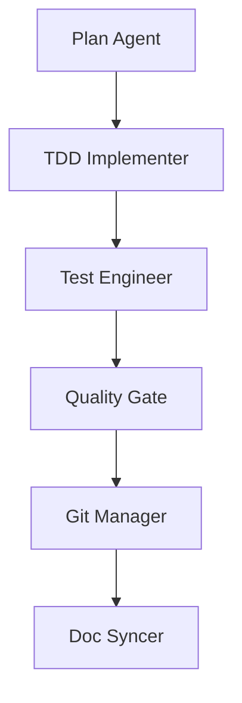
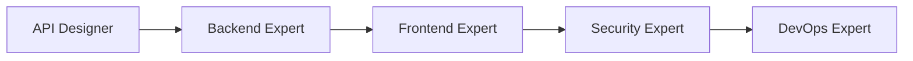

# 에이전트 목록

MoAI-ADK는 29개의 전문 에이전트로 구성된 팀으로, 각 에이전트는 특정 도메인에 대한 전문성을 가지고 협업하여 프로젝트를 완수합니다.

## 에이전트 분류

### 1. 핵심 에이전트 (Core Agents) - 7개
프로젝트의 기본 워크플로우를 담당하는 핵심 에이전트들입니다.

#### Alfred SuperAgent
- **이름**: alfred
- **역할**: 메인 슈퍼에이전트, 전체 워크플로우 오케스트레이션
- **전문 분야**: SPEC-First TDD, 에이전트 조율, 품질 관리
- **주요 작업**: 4단계 워크플로우 실행, 팀 관리, 의사결정

#### Plan Agent
- **이름**: plan-agent
- **역할**: 프로젝트 계획 및 분석 전문가
- **전문 분야**: 요구사항 분석, 작업 분해, 리스크 평가
- **주요 작업**: SPEC 문서 작성, 실행 계획 수립, 의존성 분석

#### TDD Implementer
- **이름**: tdd-implementer
- **역할**: TDD 기반 개발 전문가
- **전문 분야**: 테스트 주도 개발, 코드 구현, 리팩토링
- **주요 작업**: RED-GREEN-REFACTOR 사이클, 최소 구현, 코드 품질

#### Test Engineer
- **이름**: test-engineer
- **역할**: 테스트 전문가
- **전문 분야**: 단위 테스트, 통합 테스트, E2E 테스트
- **주요 작업**: 테스트 케이스 작성, 테스트 자동화, 커버리지 관리

#### Quality Gate
- **이름**: quality-gate
- **역할**: 품질 보증 전문가
- **전문 분야**: TRUST 5 원칙 검증, 코드 품질, 정책 준수
- **주요 작업**: 품질 검증, 보고서 생성, 커밋 승인

#### Git Manager
- **이름**: git-manager
- **역할**: Git 운영 전문가
- **전문 분야**: 버전 관리, 브랜치 전략, 커밋 관리
- **주요 작업**: 커밋 생성, 브랜치 관리, 병합 처리

#### Doc Syncer
- **이름**: doc-syncer
- **역할**: 문서 동기화 전문가
- **전문 분야**: 문서 관리, 동기화, 버전 관리
- **주요 작업**: 문서 업데이트, 정렬, 배포

### 2. 전문 분야 에이전트 (Specialist Agents) - 15개
특정 기술 분야에 대한 깊은 전문성을 가진 에이전트들입니다.

#### 보안 전문가
- **이름**: security-expert
- **전문 분야**: 보안 취약점 분석, 암호화, 인증/인가
- **주요 작업**: 보안 감사, 취약점 점검, 보안 정책 수립

#### API 설계자
- **이름**: api-designer
- **전문 분야**: REST API 설계, GraphQL, API 문서화
- **주요 작업**: API 명세 작성, 엔드포인트 설계, 버전 관리

#### 백엔드 전문가
- **이름**: backend-expert
- **전문 분야**: 서버 아키텍처, 데이터베이스, 마이크로서비스
- **주요 작업**: 백엔드 설계, 데이터 모델링, 성능 최적화

#### 프론트엔드 전문가
- **이름**: frontend-expert
- **전문 분야**: React, Vue, UI/UX, 웹 성능
- **주요 작업**: 컴포넌트 설계, 상태 관리, 사용자 인터페이스

#### DevOps 전문가
- **이름**: devops-expert
- **전문 분야**: CI/CD, 컨테이너, 클라우드 배포
- **주요 작업**: 파이프라인 구축, 배포 자동화, 인프라 관리

#### 데이터베이스 전문가
- **이름**: database-expert
- **전문 분야**: SQL, NoSQL, 데이터 모델링, 최적화
- **주요 작업**: 스키마 설계, 쿼리 최적화, 마이그레이션

#### 모바일 전문가
- **이름**: mobile-expert
- **전문 분야**: iOS, Android, React Native, Flutter
- **주요 작업**: 모바일 앱 개발, 플랫폼 최적화, 앱 스토어 배포

#### 성능 엔지니어
- **이름**: performance-engineer
- **전문 분야**: 성능 최적화, 모니터링, 프로파일링
- **주요 작업**: 병목 지점 분석, 성능 튜닝, 캐싱 전략

#### 모니터링 전문가
- **이름**: monitoring-expert
- **전문 분야**: 로깅, 메트릭, 알림 시스템
- **주요 작업**: 모니터링 구축, 알림 설정, 이상 탐지

#### 마이그레이션 전문가
- **이름**: migration-expert
- **전문 분야**: 데이터 마이그레이션, 시스템 전환
- **주요 작업**: 마이그레이션 계획, 데이터 변환, 롤백 전략

#### TAG 에이전트
- **이름**: tag-agent
- **전문 분야**: @TAG 시스템, 추적성 관리, 체인 검증
- **주요 작업**: TAG 생성, 체인 분석, 추적성 보장

#### 통합 전문가
- **이름**: integration-expert
- **전문 분야**: 시스템 통합, API 연동, 서비스 오케스트레이션
- **주요 작업**: 통합 설계, 연동 테스트, 인터페이스 관리

#### 문서 관리자
- **이름**: docs-manager
- **전문 분야**: 기술 문서, Nextra, Mermaid 다이어그램
- **주요 작업**: 문서 생성, 형식 관리, 발행 자동화

#### Context7 통합 전문가
- **이름**: context7-integrator
- **전문 분야**: Context7 API, 최신 기술 통합, 베스트 프랙티스
- **주요 작업**: 기술 리서치, 통합 구현, 지식 업데이트

#### MCP 플레이라이트 통합 전문가
- **이름**: mcp-playwright-integrator
- **전문 분야**: Playwright, 웹 테스트 자동화, MCP
- **주요 작업**: E2E 테스트, 브라우저 자동화, 테스트 프레임워크

### 3. 지원 에이전트 (Support Agents) - 7개
특정 작업이나 문제 해결을 지원하는 에이전트들입니다.

#### 디버그 헬퍼
- **이름**: debug-helper
- **역할**: 디버깅 및 문제 해결 전문가
- **전문 분야**: 버그 분석, 디버깅, 문제 진단
- **주요 작업**: 오류 분석, 원인 파악, 해결책 제안

#### 리포트 생성기
- **이름**: report-generator
- **역할**: 보고서 생성 전문가
- **전문 분야**: 데이터 분석, 보고서 작성, 시각화
- **주요 작업**: 분석 보고서, 진행 상황, 성과 측정

#### 유지보수 관리자
- **이름**: maintenance-agent
- **역할**: 프로젝트 유지보수 전문가
- **전문 분야**: 정리, 최적화, 정기 점검
- **주요 작업**: 코드 정리, 의존성 관리, 성능 최적화

#### 검증 에이전트
- **이름**: validation-agent
- **역할**: 유효성 검사 전문가
- **전문 분야**: 데이터 검증, 입력 확인, 규칙 검사
- **주요 작업**: 유효성 검사, 규칙 적용, 오류 보고

#### 파일 관리자
- **이름**: file-manager
- **역할**: 파일 시스템 관리 전문가
- **전문 분야**: 파일 조작, 디렉토리 관리, 백업
- **주요 작업**: 파일 생성, 이동, 정리, 백업

#### 질문 에이전트
- **이름**: ask-user-questions
- **역할**: 사용자 인터랙션 전문가
- **전문 분야**: 질문 설계, 사용자 인터페이스, 피드백 수집
- **주요 작업**: 질문 생성, 선택지 제공, 응답 수집

#### 사용자 경험 전문가
- **이름**: ux-expert
- **역할**: 사용자 경험 분석 전문가
- **전문 분야**: UX 분석, 사용성 테스트, 인터페이스 개선
- **주요 작업**: UX 분석, 개선 제안, 사용성 테스트

## 에이전트 협업 패턴

### 1. 기본 워크플로우

### 2. 전문가 협업

### 3. 지원 에이전트 활용
- **Debug Helper**: 모든 에이전트가 문제 발생시 호출
- **Report Generator**: 주기적인 진행 상황 보고
- **Maintenance Agent**: 프로젝트 정리 및 최적화

## 에이전트 선택 가이드

### 1. 작업 유형별 추천 에이전트

| 작업 유형 | 주요 에이전트 | 지원 에이전트 |
|---------|--------------|--------------|
| 프로젝트 계획 | Plan Agent | Report Generator |
| 코드 개발 | TDD Implementer | Debug Helper, Validation Agent |
| 테스트 | Test Engineer | File Manager |
| 품질 검증 | Quality Gate | Maintenance Agent |
| 배포 | Git Manager, DevOps Expert | Monitoring Expert |
| 문서화 | Doc Syncer, Docs Manager | Report Generator |
| 문제 해결 | Debug Helper | 해당 분야 전문가 |

### 2. 기술 스택별 전문가

| 기술 스택 | 추천 전문가 |
|---------|------------|
| 웹 백엔드 | Backend Expert, API Designer |
| 웹 프론트엔드 | Frontend Expert, UX Expert |
| 모바일 | Mobile Expert |
| 데이터베이스 | Database Expert |
| DevOps | DevOps Expert, Monitoring Expert |
| 보안 | Security Expert |
| 통합 | Integration Expert |

## 에이전트 호출 원칙

### 1. 직접 호출 규칙
- **Commands → Agents**: Task() 함수로 에이전트 호출
- **Agents → Skills**: Skill() 함수로 스킬 호출
- **Agents → Agents**: Task() 함수로 다른 에이전트 호출

### 2. 우선순위 규칙
1. **전문 분야**: 해당 분야 전문가 우선 호출
2. **핵심 에이전트**: 기본 워크플로우는 핵심 에이전트 사용
3. **지원 에이전트**: 특정 작업이나 문제 해결 시만 호출

### 3. 협업 규칙
- **명확한 인수**: 에이전트 간 데이터 전달은 명확한 형식으로
- **결과 전달**: 작업 결과는 다음 에이전트에게 명확히 전달
- **예외 처리**: 문제 발생 시 Debug Helper에 위임

## 성공적인 에이전트 활용

### 1. 명확한 역할 정의
- 각 에이전트의 책임과 권한 명확히 정의
- 중복 작업 방지
- 효율적인 분업 체계 구축

### 2. 효과적인 커뮤니케이션
- 표준화된 데이터 형식 사용
- 명확한 작업 지시와 결과 확인
- 정기적인 상태 공유

### 3. 유연한 적응
- 프로젝트 특성에 맞는 에이전트 조합
- 문제 상황에 따른 동적 에이전트 할당
- 지속적인 프로세스 개선

이러한 29개의 에이전트가 유기적으로 협력하여 MoAI-ADK는 SPEC-First TDD 개발 방법론을 성공적으로 구현하고 있습니다.