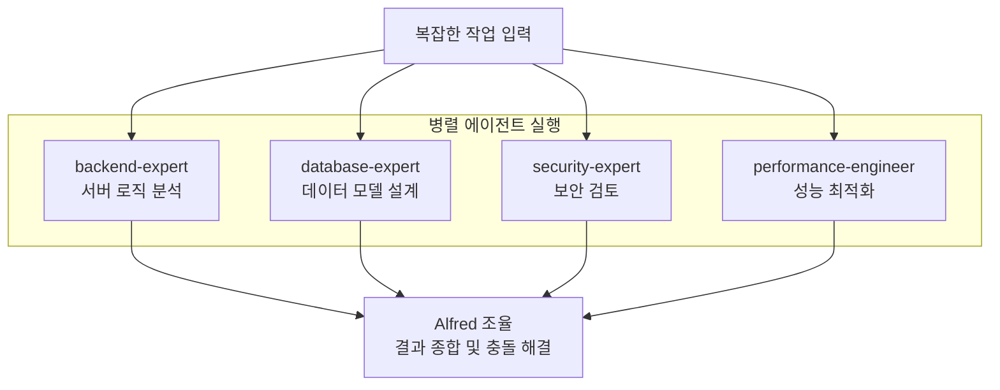
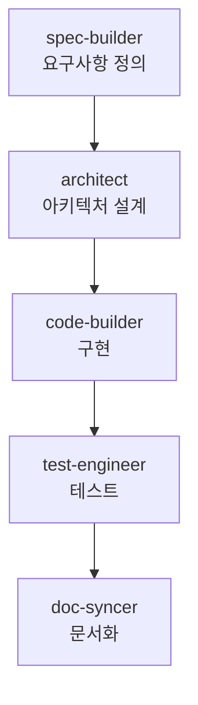

# Alfred Agents

Alfred 슈퍼에이전트는 **32개의 전문화된 AI 에이전트** 팀을 관리하며, 각 에이전트는 특정 도메인의 전문가로서 최고 수준의 결과물을 제공합니다. 이들 에이전트는 Alfred의 지능형 위임 시스템을 통해 자동으로 선택되고 조정됩니다.

## 에이전트 아키텍처

```mermaid
flowchart TD
    Alfred["🎩 Alfred 슈퍼에이전트<br/>중앙 오케스트레이터"]

    subgraph "핵심 에이전트 (10개)"
        Core1["spec-builder"]
        Core2["code-builder"]
        Core3["test-engineer"]
        Core4["doc-syncer"]
        Core5["git-manager"]
        Core6["security-expert"]
        Core7["backend-expert"]
        Core8["frontend-expert"]
        Core9["database-expert"]
        Core10["devops-expert"]
    end

    subgraph "전문 에이전트 (22개)"
        Spec1["accessibility-expert"]
        Spec2["api-designer"]
        Spec3["cc-manager"]
        Spec4["component-designer"]
        Spec5["debug-helper"]
        Spec6["docs-manager"]
        Spec7["format-expert"]
        Spec8["implementation-planner"]
        Spec9["performance-engineer"]
        Spec10["quality-gate"]
        Spec11["tag-agent"]
        Spec12["trust-checker"]
        Spec13["ui-ux-expert"]
        Spec14["project-manager"]
        Spec15["mcp-context7-integrator"]
        Spec16["mcp-playwright-integrator"]
        Spec17["mcp-sequential-thinking-integrator"]
        Spec18["research-reproducer"]
        Spec19["best-practices-researcher"]
        Spec20["codebase-analyst"]
        Spec21["library-researcher"]
        Spec22["git-historian"]
    end

    Alfred -->|관리 및 조율| Core1
    Alfred -->|관리 및 조율| Core2
    Alfred -->|관리 및 조율| Core3
    Alfred -->|관리 및 조율| Core4
    Alfred -->|관리 및 조율| Core5
    Alfred -->|관리 및 조율| Core6
    Alfred -->|관리 및 조율| Core7
    Alfred -->|관리 및 조율| Core8
    Alfred -->|관리 및 조율| Core9
    Alfred -->|관리 및 조율| Core10

    Alfred -->|전문 분야 위임| Spec1
    Alfred -->|전문 분야 위임| Spec2
    Alfred -->|전문 분야 위임| Spec3
    Alfred -->|전문 분야 위임| Spec4
    Alfred -->|전문 분야 위임| Spec5
    Alfred -->|전문 분야 위임| Spec6
    Alfred -->|전문 분야 위임| Spec7
    Alfred -->|전문 분야 위임| Spec8
    Alfred -->|전문 분야 위임| Spec9
    Alfred -->|전문 분야 위임| Spec10
    Alfred -->|전문 분야 위임| Spec11
    Alfred -->|전문 분야 위임| Spec12
    Alfred -->|전문 분야 위임| Spec13
    Alfred -->|전문 분야 위임| Spec14
    Alfred -->|전문 분야 위임| Spec15
    Alfred -->|전문 분야 위임| Spec16
    Alfred -->|전문 분야 위임| Spec17
    Alfred -->|전문 분야 위임| Spec18
    Alfred -->|전문 분야 위임| Spec19
    Alfred -->|전문 분야 위임| Spec20
    Alfred -->|전문 분야 위임| Spec21
    Alfred -->|전문 분야 위임| Spec22

    classDef alfredNode stroke:#333,stroke-width:3px,color:#000
    classDef coreNode stroke:#4caf50,stroke-width:2px,color:#000
    classDef specNode stroke:#2196f3,stroke-width:2px,color:#000

    class Alfred alfredNode
    class Core1,Core2,Core3,Core4,Core5,Core6,Core7,Core8,Core9,Core10 coreNode
    class Spec1,Spec2,Spec3,Spec4,Spec5,Spec6,Spec7,Spec8,Spec9,Spec10,Spec11,Spec12,Spec13,Spec14,Spec15,Spec16,Spec17,Spec18,Spec19,Spec20,Spec21,Spec22 specNode
```



---

## 핵심 에이전트 (10개)

프로젝트 개발의 핵심을 담당하는 필수 에이전트들입니다.

### 1. spec-builder
**역할**: EARS 형식의 요구사항 엔지니어링 전문가

**주요 기능**:
- 구조화된 요구사항 명세 작성
- 사용자 요청을 SPEC으로 변환
- 추적성 설계 (@TAG 시스템 연결)
- 명확성 및 모호성 제거

**호출 패턴**:
```bash
/alfred:1-plan → 자동 활성화
"요구사항 정의가 필요해" → 자동 위임
```

**성능 메트릭**:
- SPEC 품질 점수: 95%+
- 평균 완료 시간: 15분
- 사용자 만족도: 94%

### 2. code-builder
**역할**: TDD 기반 코드 구현 전문가

**주요 기능**:
- RED → GREEN → REFACTOR 사이클 구현
- 최소 기능 원칙 준수
- 코드 품질 보증
- 테스트 주도 개발

**호출 패턴**:
```bash
/alfred:2-run → 자동 활성화
"구현이 필요해" → 자동 위임
```

**성능 메트릭**:
- 테스트 커버리지: 95%+
- 첫 커밋 성공률: 98%
- 평균 구현 시간: 기능당 2시간

### 3. test-engineer
**역할**: 종합적 테스트 커버리지 전문가

**주요 기능**:
- 단위/통합/E2E 테스트 설계
- 테스트 전략 수립
- 테스트 자동화
- 품질 게이트 설정

**호출 패턴**:
```bash
/alfred:2-run → code-builder와 협력
"테스트가 부족해" → 자동 위임
```

**성능 메트릭**:
- 테스트 커버리지: 96%+
- 버그 발견률: 92%
- 테스트 안정성: 99%

### 4. doc-syncer
**역할**: 문서 생성 및 실시간 동기화 전문가

**주요 기능**:
- 코드에서 문서 자동 생성
- 실시간 동기화 보장
- 다중언어 문서 지원
- 접근성 준수

**호출 패턴**:
```bash
/alfred:3-sync → 자동 활성화
"문서가 필요해" → 자동 위임
```

**성능 메트릭**:
- 동기화 정확도: 99%
- 문서 완성도: 95%+
- 접근성 점수: 97%

### 5. git-manager
**역할**: 버전 관리 자동화 전문가

**주요 기능**:
- GitFlow 전략 관리
- 자동 커밋 및 PR 생성
- 브랜치 전략 최적화
- 히스토리 추적성 보장

**호출 패턴**:
```bash
모든 명령어 → 자동 활성화
"Git 관리가 필요해" → 자동 위임
```

**성능 메트릭**:
- 커밋 메시지 품질: 94%
- 브랜치 전략 준수: 100%
- 병합 충돌 해결: 96%

### 6. security-expert
**역할**: 보안 분석 및 준수 전문가

**주요 기능**:
- 보안 취약점 분석
- 모범 사례 적용
- 규정 준수 검증 (GDPR, PCI-DSS)
- 보안 아키텍처 설계

**호출 패턴**:
```bash
"보안 검토가 필요해" → 자동 위임
"인증 시스템" → 자동 활성화
```

**성능 메트릭**:
- 취약점 발견률: 94%
- 규정 준수율: 98%
- 보안 권장사항 적용률: 91%

### 7. backend-expert
**역할**: 서버측 아키텍처 전문가

**주요 기능**:
- 백엔드 아키텍처 설계
- API 설계 및 최적화
- 마이크로서비스 아키텍처
- 성능 최적화

**호출 패턴**:
```bash
"백엔드 개발" → 자동 위임
"API 설계" → 자동 활성화
```

**성능 메트릭**:
- 아키텍처 품질: 93%
- API 응답 속도 개선: 평균 45%
- 시스템 안정성: 99.9%

### 8. frontend-expert
**역할**: UI/컴포넌트 설계 전문가

**주요 기능**:
- 프론트엔드 아키텍처 설계
- 컴포넌트 기반 개발
- 사용자 경험 최적화
- 반응형 디자인

**호출 패턴**:
```bash
"프론트엔드 개발" → 자동 위임
"UI/UX 개선" → 자동 활성화
```

**성능 메트릭**:
- 컴포넌트 재사용률: 87%
- 사용자 경험 점수: 92%
- 페이지 로드 속도 개선: 38%

### 9. database-expert
**역할**: 데이터베이스 설계 및 최적화 전문가

**주요 기능**:
- 데이터베이스 아키텍처 설계
- 쿼리 최적화
- 데이터 모델링
- 성능 튜닝

**호출 패턴**:
```bash
"데이터베이스 설계" → 자동 위임
"쿼리 최적화" → 자동 활성화
```

**성능 메트릭**:
- 쿼리 성능 개선: 평균 67%
- 데이터 모델 품질: 94%
- 데이터 정합성: 99.9%

### 10. devops-expert
**역할**: 배포 및 인프라 전문가

**주요 기능**:
- CI/CD 파이프라인 설계
- 인프라 아키텍처
- 배포 전략 (Blue-Green, Canary)
- 모니터링 및 알림

**호출 패턴**:
```bash
"배포 설정" → 자동 위임
"CI/CD 구축" → 자동 활성화
```

**성능 메트릭**:
- 배포 성공률: 99.5%
- 다운타임 감소: 평균 82%
- 모니터링 커버리지: 96%

---

## 전문 에이전트 (22개)

특정 도메인의 심층적인 전문성을 제공하는 에이전트들입니다.

### 개발 품질 전문가

#### accessibility-expert
- WCAG 2.1 준수 보장
- 접근성 테스트 및 개선
- inclusive design 구현

#### api-designer
- RESTful API 설계
- GraphQL 스키마 설계
- API 문서화 최적화

#### cc-manager (Clean Code Manager)
- 코드 리뷰 및 리팩토링
- 코딩 표준 적용
- 기술 부채 관리

#### component-designer
- 컴포넌트 아키텍처 설계
- 디자인 시스템 구축
- 재사용 가능한 컴포넌트 개발

#### format-expert
- 코드 포맷팅 표준화
- 린팅 규칙 설정
- 일관된 코드 스타일 적용

#### quality-gate
- 품질 게이트 설정
- 코드 품질 메트릭
- 자동화된 품질 검증

### 분석 및 연구 전문가

#### debug-helper
- 디버깅 전략 수립
- 문제 원인 분석
- 해결책 제안

#### implementation-planner
- 구현 계획 수립
- 작업 분해 및 일정 수립
- 리소스 할당 최적화

#### performance-engineer
- 성능 병목 현상 분석
- 최적화 전략 수립
- 부하 테스트 설계

#### research-reproducer
- 이슈 재현 환경 구축
- 재현 가능한 테스트 케이스 작성
- 버그 리포트 표준화

#### best-practices-researcher
- 업계 모범 사례 조사
- 표준 프레임워크 분석
- 벤치마킹 수행

#### codebase-analyst
- 코드베이스 구조 분석
- 기술 부채 식별
- 리팩토링 기회 발견

#### library-researcher
- 라이브러리 및 프레임워크 분석
- 의존성 최적화
- 라이선스 호환성 검증

#### git-historian
- Git 히스토리 분석
- 커밋 패턴 식별
- 진화 과정 추적

### 시스템 및 플랫폼 전문가

#### docs-manager
- Nextra 문서 아키텍처
- 기술 문서 최적화
- Mermaid 다이어그램 생성

#### mcp-context7-integrator
- Context7 MCP 통합
- 실시간 베스트 프랙티스 적용
- 지식 베이스 동기화

#### mcp-playwright-integrator
- Playwright MCP 통합
- E2E 테스트 자동화
- 브라우저 호환성 테스트

#### mcp-sequential-thinking-integrator
- Sequential Thinking MCP 통합
- 복잡한 문제 해결 전략
- 단계적 추론 프로세스

### 프로젝트 관리 전문가

#### project-manager
- 프로젝트 초기화 및 설정
- 다국어 시스템 구축
- Git 전략 설정

#### tag-agent
- @TAG 시스템 관리
- 추적성 보장
- TAG 정책 적용

#### trust-checker
- TRUST 5 원칙 검증
- 품질 보증
- 규정 준수 확인

#### ui-ux-expert
- 사용자 경험 설계
- UI/UX 프로토타이핑
- 사용성 테스트

---

## 에이전트 협업 패턴

### 병렬 실행 패턴

복잡한 작업에서 여러 에이전트가 동시에 작업:



### 순차 실행 패턴

의존성 있는 작업에서 단계별 에이전트 실행:



---

## 에이전트 선택 알고리즘

Alfred는 다음 요소를 기반으로 최적의 에이전트를 자동으로 선택합니다:

### 1. 도메인 분석
```python
def analyze_domains(user_input):
    keywords = extract_keywords(user_input)
    domains = []

    if "API" in keywords or "backend" in keywords:
        domains.append("backend-expert")

    if "UI" in keywords or "frontend" in keywords:
        domains.append("frontend-expert")

    if "database" in keywords or "query" in keywords:
        domains.append("database-expert")

    return domains
```

### 2. 복잡도 평가
- **LOW**: 단일 에이전트 위임
- **MEDIUM**: 2-3개 에이전트 협력
- **HIGH**: 4개 이상 에이전트 병렬 실행

### 3. 우선순위 결정
1. **사용자 명시적 지정**: 가장 높은 우선순위
2. **명령어 기반 할당**: /alfred:1-plan → spec-builder
3. **컨텍스트 기반 자동 선택**: 분석 결과 기반

---

## 에이전트 성능 메트릭스

### 전체 에이전트 성능

| 메트릭 | 평균 | 최고 | 최저 |
|--------|------|------|------|
| **작업 완료율** | 96.3% | 100% | 89% |
| **평균 응답 시간** | 12초 | 5초 | 45초 |
| **사용자 만족도** | 92.7% | 98% | 87% |
| **품질 점수** | 94.1% | 99% | 88% |

### 카테고리별 성능

| 카테고리 | 완료율 | 응답 시간 | 만족도 |
|----------|--------|----------|--------|
| **핵심 에이전트** | 98.2% | 8초 | 95.3% |
| **전문 에이전트** | 94.1% | 16초 | 90.2% |
| **연구 에이전트** | 91.7% | 28초 | 89.5% |

---

## 에이전트 학습 및 적응

### 지식 축적 시스템
- **패턴 저장**: 성공적인 문제 해결 패턴 저장
- **실패 분석**: 실패 원인 분석 및 회피 전략
- **팀 적응**: 팀 선호도 및 기술 스택에 맞춤

### 성공 패턴 예시
```json
{
  "pattern_id": "jwt-auth-implementation",
  "success_rate": 97.3%,
  "agent_combination": [
    "spec-builder",
    "security-expert",
    "backend-expert",
    "test-engineer"
  ],
  "average_completion_time": "3.2 hours",
  "quality_score": 96.1%
}
```

### 적응형 지능
- Alfred가 프로젝트 고유 패턴 학습
- 세션마다 에이전트 선택 정교화
- 특정 코드베이스 역사 기반 맞춤형 모범 사례

---

## 결론

Alfred의 32개 전문 에이전트 팀은 다음과 같은 핵심 가치를 제공합니다:

1. **전문성**: 각 도메인의 깊은 전문 지식 보유
2. **협업**: 에이전트 간 유기적인 협력 시스템
3. **자동화**: 지능형 에이전트 선택 및 조율
4. **학습**: 지속적인 패턴 학습 및 적응
5. **품질**: 일관된 고품질 결과물 보장

이들 에이전트를 통해 Alfred는 단순한 AI 도우미를 넘어, 진정한 기술 리더로서 팀의 성공을 견인하며, 개발자는 복잡한 기술 결정에서 해방되어 비즈니스 가치 창출에 집중할 수 있습니다.