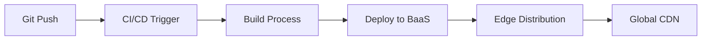
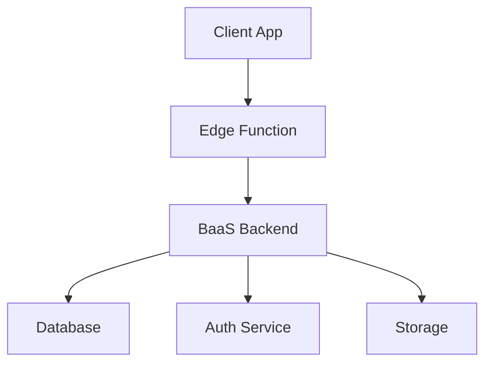
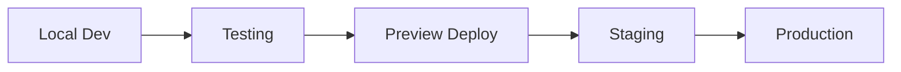

# BaaS 통합

MoAI-ADK는 다양한 Backend as a Service (BaaS) 플랫폼과의 통합을 지원하여 개발자가 서버리스 백엔드를 효율적으로 구축하고 관리할 수 있도록 돕습니다.

## 지원 BaaS 플랫폼

### 1. Vercel
- **특징**: Next.js 전문 호스팅, 자동 배포
- **통합점**: GitHub Actions, 자동 최적화
- **사용 사례**: 정적 사이트, SSR/SSG 애플리케이션

### 2. Netlify
- **특징**: Jamstack 호스팅, Edge Functions
- **통합점**: Forms, Background Functions
- **사용 사례**: 정적 사이트, 서버리스 함수

### 3. Firebase
- **특징**: Google의 BaaS 플랫폼
- **통합점**: Firestore, Authentication, Functions
- **사용 사례**: 실시간 애플리케이션, 모바일 백엔드

### 4. Supabase
- **특징**: 오픈소스 Firebase 대안
- **통합점**: PostgreSQL, Real-time, Auth
- **사용 사례**: 관계형 데이터베이스 기반 애플리케이션

## 통합 아키텍처

### 1. 배포 파이프라인


### 2. 데이터 흐름


### 3. 개발 워크플로우


## 통합 구성 요소

### 1. 환경 설정
- **배포 시크릿**: .vercel/project.json, .netlify/state.json
- **환경 변수**: API 키, 데이터베이스 연결 정보
- **도메인 설정**: 커스텀 도메인 및 SSL 인증서

### 2. CI/CD 통합
- **GitHub Actions**: 자동 테스트 및 배포
- **배포 훅**: 사전/사후 배포 스크립트
- **롤백 메커니즘**: 자동 롤백 및 모니터링

### 3. 모니터링 및 로깅
- **성능 메트릭**: 페이지 로드 시간, API 응답 시간
- **에러 추적**: 실시간 에러 모니터링 및 알림
- **사용자 분석**: 사용자 행동 추적 및 분석

## MoAI-ADK BaaS 기능

### 1. 자동 프로비저닝
```bash
# BaaS 프로젝트 자동 설정
moai-adk init --baas vercel
moai-adk deploy --platform netlify
```

### 2. 환경 관리
- **개발 환경**: 로컬 개발용 설정
- **테스트 환경**: 스테이징 및 프리뷰
- **프로덕션 환경**: 실제 서비스 환경

### 3. 데이터 마이그레이션
- **스키마 관리**: 데이터베이스 스키마 버전 관리
- **데이터 동기화**: 환경 간 데이터 동기화
- **백업 및 복원**: 자동 백업 및 복원 기능

## 보안 고려사항

### 1. 시크릿 관리
- **환경 변수 보호**: 민감한 정보의 안전한 저장
- **액세스 제어**: 역할 기반 액세스 제어 (RBAC)
- **감사 로그**: 모든 액세스 기록 및 모니터링

### 2. 데이터 보호
- **전송 암호화**: HTTPS/TLS를 통한 데이터 전송 보안
- **저장 암호화**: 데이터베이스 및 스토리지 암호화
- **개인정보 보호**: GDPR, CCPA 준수

### 3. 네트워크 보안
- **방화벽 설정**: 불필요한 액세스 차단
- **DDoS 방어**: 분산 서비스 거부 공격 방어
- **CDN 보안**: CDN 레벨의 보안 기능 활용

## 성능 최적화

### 1. Edge Computing
- **글로벌 배포**: 전 세계 엣지 노드에 배포
- **캐싱 전략**: 정적/동적 콘텐츠 캐싱
- **CDN 활용**: 콘텐츠 전송 네트워크 최적화

### 2. 데이터베이스 최적화
- **인덱싱**: 쿼리 성능 향상을 위한 인덱스 설계
- **연결 풀링**: 데이터베이스 연결 관리
- **쿼리 최적화**: 느린 쿼리 식별 및 개선

### 3. 리소스 관리
- **서버리스 스케일링**: 자동 스케일링 및 비용 최적화
- **콜드 스타트 감소**: 함수 웜업 최적화
- **메모리 관리**: 효율적인 메모리 사용 패턴

## 비용 최적화

### 1. 사용량 기반 과금
- **종량제**: 실제 사용량에 따른 비용 청구
- **예산 설정**: 비용 경고 및 제한
- **사용량 분석**: 비용 최적화를 위한 사용량 추이 분석

### 2. 리소스 최적화
- **자동 스케일링**: 필요에 따른 리소스 조정
- **유휴 리소스 제거**: 불필요한 리소스 자동 정리
- **예약 용량**: 예측 가능한 부하를 위한 할인 혜택

## 모범 사례

### 1. 배포 전략
- **블루-그린 배포**: 무중단 배포 전략
- **카나리 릴리스**: 점진적 롤아웃
- **기능 플래그**: 기능 활성화/비활성화 제어

### 2. 모니터링 전략
- **실시간 모니터링**: 시스템 상태 실시간 추적
- **프로파일링**: 성능 병목 지점 식별
- **사용자 피드백**: 사용자 경험 모니터링

### 3. 재해 복구
- **백업 전략**: 정기적인 데이터 백업
- **다중 리전**: 여러 지역에 이중화
- **장애 조치**: 자동 장애 복구 시나리오

## 미래 로드맵

### 1. 추가 BaaS 플랫폼 지원
- **AWS Amplify**: AWS 기반 BaaS 통합
- **Azure Static Web Apps**: Microsoft 플랫폼 지원
- **Cloudflare Pages**: Cloudflare 통합

### 2. 고급 기능
- **멀티 클라우드**: 여러 클라우드 플랫폼 동시 사용
- **하이브리드 배포**: 클라우드와 온프레미스 혼합
- **Edge AI**: 엣지 컴퓨팅 기반 AI 기능