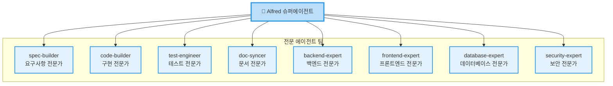
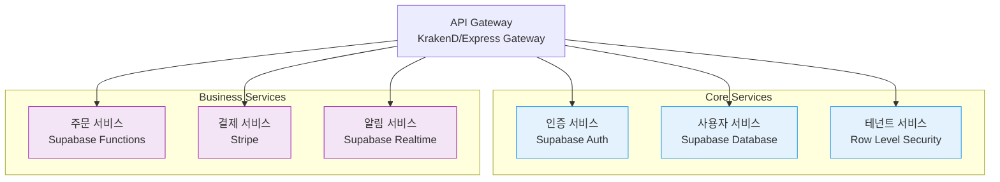
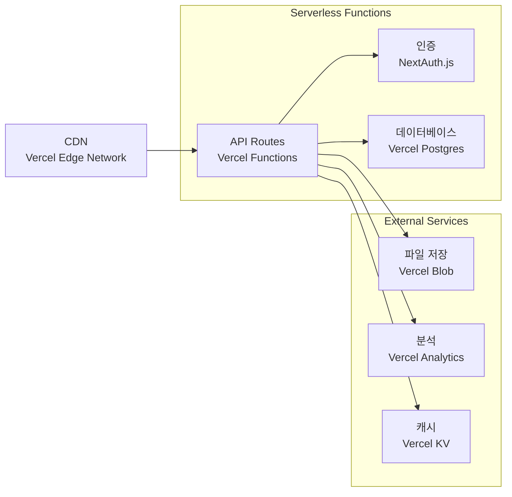
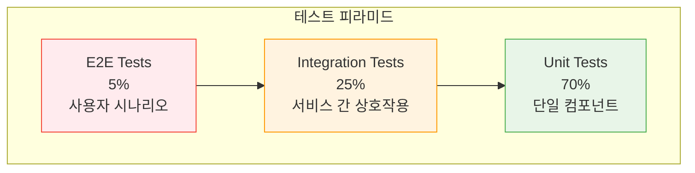
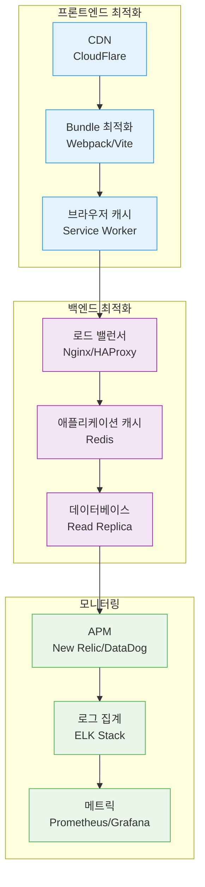

# 중급 가이드

초보자 가이드를 마쳤다면, 이제 MoAI-ADK의 고급 기능과 실전 패턴을 익힐 시간입니다. 이 가이드에서는 복잡한 프로젝트에서 MoAI-ADK를 효과적으로 활용하는 방법을 배웁니다.

## 🎯 학습 목표

이 가이드를 통해 다음을 마스터할 수 있습니다:

- ✅ 복잡한 아키텍처 패턴 구현
- ✅ 32개 에이전트 전문 활용법
- ✅ BaaS 플랫폼 통합
- ✅ 팀 협업 워크플로우
- ✅ 고급 TDD 패턴
- ✅ 성능 최적화 전략

## 🧠 1단계: Alfred 에이전트 심층 활용

### 전문 에이전트의 이해와 활용

Alfred는 19개의 전문 에이전트를 관리하며, 각 에이전트는 특정 도메인에 최적화되어 있습니다.

#### 핵심 전문 에이전트 상세 분석



#### 에이전트별 전문 분야와 활용 팁

<Tabs items={['spec-builder', 'code-builder', 'test-engineer', '도메인 전문가들']}>
  <Tab>
    ### spec-builder (요구사항 전문가)

    **전문 분야**: EARS 형식 요구사명세, 비즈니스 요구사항 분석

    **고급 활용법**:
    ```bash
    # 복잡한 시스템 요구사명세
    /alfred:1-plan "마이크로서비스 아키텍처 기반 전자상거래 플랫폼" \
      --include "성능 요구사항" \
      --include "보안 요구사항" \
      --include "확장성 요구사항"
    ```

    **활용 팁**:
    - 비즈니스 용어를 최대한 명확하게 사용
    - 성능 지표(KPI)를 구체적으로 명시
    - 제약사항(기술적/비즈니스적)을 명확히 정의

    **산출물 예시**:
    ```
    .moai/specs/SPEC-ECOM-001/
    ├── spec.md           # EARS 형식 요구사명세
    ├── plan.md           # 구현 계획
    ├── acceptance.md     # 인수 기준
    └── architecture.md   # 아키텍처 설계
    ```
  </Tab>
  <Tab>
    ### code-builder (구현 전문가)

    **전문 분야**: TDD 기반 코드 생성, 아키텍처 구현, 리팩토링

    **고급 활용법**:
    ```bash
    # 복잡한 비즈니스 로직 구현
    /alfred:2-run ECOM-001 \
      --pattern "domain-driven-design" \
      --architecture "clean-architecture" \
      --testing "integration+unit"
    ```

    **활용 팁**:
    - 아키텍처 패턴을 명시적으로 지정
    - 테스트 수준을 세밀하게 제어
    - 코드 스타일 가이드를 미리 정의

    **고급 기능**:
    - 자동 리팩토링 제안
    - 성능 최적화 코드 생성
    - 보안 코딩 패턴 적용
  </Tab>
  <Tab>
    ### test-engineer (테스트 전문가)

    **전문 분야**: 테스트 전략 수립, 자동화된 테스트 슈트, 품질 보증

    **고급 활용법**:
    ```bash
    # 포괄적인 테스트 전략
    /alfred:2-run ECOM-001 \
      --test-strategy "comprehensive" \
      --coverage "unit:integration:e2e" \
      --performance "load:stress"
    ```

    **테스트 레벨 이해**:
    ```mermaid
    graph TB
        Unit["단위 테스트<br/>단일 함수/클래스"]
        Integration["통합 테스트<br/>컴포넌트 간 상호작용"]
        E2E["E2E 테스트<br/>전체 사용자 시나리오"]
        Performance["성능 테스트<br/>부하 및 스트레스"]

        Unit --> Integration
        Integration --> E2E
        E2E --> Performance

        classDef testNode fill:#e8f5e8,stroke:#4caf50
        class Unit,Integration,E2E,Performance testNode
    ```

    **고급 테스트 패턴**:
    - 테스트 피라미드 구성
    - 테스트 데이터 관리 전략
    - Mock/Stub 적용 범위 결정
    - 테스트 커버리지 최적화
  </Tab>
  <Tab>
    ### 도메인 전문가들

    **backend-expert**: REST API, GraphQL, 마이크로서비스
    **frontend-expert**: React/Vue/Svelte, 컴포넌트 아키텍처
    **database-expert**: 스키마 설계, 쿼리 최적화, 데이터 모델링
    **security-expert**: 인증/인가, 보안 검증, 취약점 분석

    **협업 패턴**:
    ```bash
    # 여러 전문가 협업 요청
    /alfred:2-run ECOM-001 \
      --experts "backend-expert,database-expert,security-expert" \
      --focus "payment-processing" \
      --priority "high"
    ```

    **전문가 선택 기준**:
    - 프로젝트 복잡도
    - 기술 스택 특수성
    - 도메인 지식 요구 수준
    - 성능/보안 중요도
  </Tab>
</Tabs>

## 🏗️ 2단계: 복잡한 프로젝트 아키텍처

### 마이크로서비스 아키텍처 패턴

#### 패턴 A: 멀티테넌트 SaaS (Supabase 기반)



#### 실제 구현 예시

**SPEC 작성**:
```bash
/alfred:1-plan "마이크로서비스 기반 B2B SaaS 플랫폼" \
  --architecture "pattern-a" \
  --platform "supabase" \
  --features "multi-tenant:rbac:realtime:analytics"
```

**서비스별 구현**:
```bash
# 각 서비스 별도 구현
/alfred:2-run SAAS-AUTH    # 인증 서비스
/alfred:2-run SAAS-USER    # 사용자 서비스
/alfred:2-run SAAS-ORDER   # 주문 서비스
/alfred:2-run SAAS-PAYMENT # 결제 서비스
```

### 패턴 B: Serverless API (Vercel 기반)



#### 고급 프로젝트 구조 설정

```bash
# 복잡한 프로젝트 초기화
/alfred:0-project \
  --mode "complex" \
  --architecture "microservices" \
  --platform "supabase" \
  --features "auth:storage:realtime:edge-functions"
```

**생성되는 프로젝트 구조**:
```
complex-project/
├── services/
│   ├── auth-service/
│   ├── user-service/
│   ├── order-service/
│   └── notification-service/
├── shared/
│   ├── common/
│   ├── database/
│   └── infrastructure/
├── docs/
│   ├── api/
│   ├── architecture/
│   └── deployment/
├── tests/
│   ├── unit/
│   ├── integration/
│   └── e2e/
└── infrastructure/
    ├── docker/
    ├── kubernetes/
    └── terraform/
```

## 🧪 3단계: 고급 테스트 전략

### 포괄적인 테스트 피라미드



### 테스트 전략 설정

<Steps>
  <Step>
    <p><strong>1단계: 테스트 전략 정의</strong></p>
    <pre><code class="language-bash"># 포괄적인 테스트 전략으로 구현
/alfred:2-run PROJECT-001 \
  --test-strategy "comprehensive" \
  --coverage-target 90 \
  --test-types "unit:integration:e2e:performance"</code></pre>
  </Step>
  <Step>
    <p><strong>2단계: 테스트 환경 설정</strong></p>
    <pre><code class="language-bash"># 테스트 환경 자동 구성
/alfred:3-sync \
  --include "test-environment" \
  --database "test-docker" \
  --mocking "comprehensive"</code></pre>
  </Step>
  <Step>
    <p><strong>3단계: CI/CD 연동</strong></p>
    <pre><code class="language-bash"># 자동화된 테스트 파이프라인
/alfred:3-sync \
  --ci-cd "github-actions" \
  --testing "automated" \
  --quality-gates "strict"</code></pre>
  </Step>
</Steps>

### 테스트 데이터 관리 전략

<Tabs items={['팩토리 패턴', **Fixture 관리**, **Testcontainers**]}>
  <Tab>
    ### 팩토리 패턴 활용

    Alfred는 자동으로 팩토리 패턴을 생성합니다:

    ```python
    # tests/factories/user_factory.py
    import factory
    from app.models import User

    class UserFactory(factory.Factory):
        class Meta:
            model = User

        id = factory.Sequence(lambda n: n + 1)
        email = factory.Faker('email')
        name = factory.Faker('name')
        is_active = True

    class AdminUserFactory(UserFactory):
        is_admin = True
        permissions = ['read', 'write', 'delete']
    ```

    **활용법**:
    ```bash
    # 팩토리 기반 테스트 자동 생성
    /alfred:2-run USER-SERVICE \
      --test-pattern "factory-based" \
      --fixtures "comprehensive"
    ```
  </Tab>
  <Tab>
    ### Fixture 관리

    **계층적 Fixture 구조**:
    ```
    tests/fixtures/
    ├── users/
    │   ├── basic_user.json
    │   ├── admin_user.json
    │   └── test_users.json
    ├── orders/
    │   ├── single_order.json
    │   ├── bulk_orders.json
    │   └── edge_cases.json
    └── scenarios/
        ├── happy_path.json
        ├── error_cases.json
        └── load_test.json
    ```

    **Fixture 생성 자동화**:
    ```bash
    # 시나리오 기반 fixture 생성
    /alfred:2-run E2E-TESTS \
      --fixtures "scenario-based" \
      --coverage "edge-cases:load-tests"
    ```
  </Tab>
  <Tab>
    ### Testcontainers 활용

    **실제 환경과 유사한 테스트**:
    ```python
    # tests/conftest.py
    import pytest
    from testcontainers.postgres import PostgresContainer

    @pytest.fixture(scope="session")
    def postgres_db():
        with PostgresContainer("postgres:15") as postgres:
            yield postgres

    @pytest.fixture
    def db_session(postgres_db):
        # Alfred가 자동으로 세션 설정 코드 생성
        engine = create_engine(postgres_db.get_connection_url())
        Session = sessionmaker(bind=engine)
        session = Session()
        yield session
        session.close()
    ```

    **환경 설정**:
    ```bash
    # Testcontainers 기반 테스트 환경
    /alfred:2-run INTEGRATION-TESTS \
      --environment "testcontainers" \
      --databases "postgres:redis:elasticsearch" \
      --isolation "full"
    ```
  </Tab>
</Tabs>

## 👥 4단계: 팀 협업 워크플로우

### GitFlow 기반 협업 프로세스


### 팀 설정 및 구성

<Steps>
  <Step>
    <p><strong>1단계: 팀 모드 설정</strong></p>
    <pre><code class="language-bash"># 팀 협업 모드로 프로젝트 설정
/alfred:0-project \
  --mode "team" \
  --git-strategy "gitflow" \
  --review-process "pull-request"</code></pre>

    **자동 구성되는 내용**:
    - GitFlow 브랜치 전략
    - Pull Request 템플릿
    - 코드 리뷰 가이드라인
    - 자동화된 체크포인트
  </Step>
  <Step>
    <p><strong>2단계: 코드 리뷰 프로세스 설정</strong></p>
    <pre><code class="language-bash"># 코드 리뷰 자동화
/alfred:3-sync \
  --review "automated" \
  --checks "quality:security:performance" \
  --approval "2-reviewers-required"</code></pre>

    **적용되는 검증**:
    - TRUST 5 원칙 준수 여부
    - @TAG 체인完整性
    - 테스트 커버리지 (85%+)
    - 보안 취약점 검사
  </Step>
  <Step>
    <p><strong>3단계: 지식 공유 시스템 구축</strong></p>
    <pre><code class="language-bash"># 팀 지식 베이스 자동 생성
/alfred:3-sync \
  --knowledge-base "team" \
  --patterns "extract:share:reuse" \
  --documentation "living-docs"</code></pre>

    **생성되는 지식 자산**:
    - 팀 코딩 표준
    - 아키텍처 결정 기록 (ADR)
    - 재사용 가능한 코드 패턴
    - 문제 해결 Playbook
  </Step>
</Steps>

### 팀별 역할과 책임

<Cards>
  <Card
    title="Tech Lead"
    icon="👨‍💻"
  >
    <p><strong>주요 책임:</strong></p>
    <ul>
      <li>아키텍처 결정</li>
      <li>코드 리뷰 최종 승인</li>
      <li>기술 표준 설정</li>
      <li>멘토링 및 교육</li>
    </ul>
  </Card>
  <Card
    title="Backend Developer"
    icon="⚙️"
  >
    <p><strong>주요 책임:</strong></p>
    <ul>
      <li>API/서비스 개발</li>
      <li>데이터베이스 설계</li>
      <li>성능 최적화</li>
      <li>보안 구현</li>
    </ul>
  </Card>
  <Card
    title="Frontend Developer"
    icon="🎨"
  >
    <p><strong>주요 책임:</strong></p>
    <ul>
      <li>UI/UX 구현</li>
      <li>컴포넌트 설계</li>
      <li>상태 관리</li>
      <li>사용자 경험 최적화</li>
    </ul>
  </Card>
  <Card
    title="DevOps Engineer"
    icon="🚀"
  >
    <p><strong>주요 책임:</strong></p>
    <ul>
      <li>CI/CD 파이프라인</li>
      <li>인프라 관리</li>
      <li>모니터링 설정</li>
      <li>배포 자동화</li>
    </ul>
  </Card>
</Cards>

## ⚡ 5단계: 성능 최적화 및 모니터링

### 성능 최적화 전략

#### 코드 레벨 최적화

```bash
# 성능 최적화 기반 구현
/alfred:2-run PERFORMANCE-OPTIMIZATION \
  --focus "algorithms:database-queries:caching" \
  --metrics "response-time:throughput:memory-usage" \
  --target "p95-response-time < 200ms"
```

**Alfred가 적용하는 최적화 패턴**:

1. **알고리즘 최적화**:
   - Big-O 분석 및 개선
   - 메모리 사용량 최적화
   - 병렬 처리 활용

2. **데이터베이스 최적화**:
   - 쿼리 플랜 분석
   - 인덱스 전략 수립
   - N+1 문제 해결

3. **캐싱 전략**:
   - Redis/Memcached 활용
   - 캐시 무효화 전략
   - CDN 설정

#### 인프라 레벨 최적화



### 모니터링 및 관찰 가능성

#### 모니터링 설정 자동화

```bash
# 포괄적인 모니터링 설정
/alfred:3-sync \
  --monitoring "comprehensive" \
  --metrics "application:infrastructure:business" \
  --alerts "real-time:slack:email"
```

**적용되는 모니터링 구성요소**:

1. **애플리케이션 모니터링**:
   - 응답 시간 및 처리량
   - 에러율 및 예외 추적
   - 사용자 행동 분석

2. **인프라 모니터링**:
   - CPU/메모리/디스크 사용량
   - 네트워크 트래픽
   - 데이터베이스 성능

3. **비즈니스 메트릭**:
   - 사용자 활동
   - 전환율
   - 수익 관련 지표

## 🔧 6단계: 실전 프로젝트 예시

### 프로젝트: 전자상거래 플랫폼

#### 요구사항 정의

```bash
# 복잡한 전자상거래 플랫폼 SPEC
/alfred:1-plan "B2C 전자상거래 플랫폼" \
  --features "user-management:product-catalog:order-processing:payment:integration" \
  --non-functional "performance:security:scalability:availability" \
  --constraints "pci-dss:gdpr:accessibility"
```

#### 아키텍처 구현

<Tabs items={['백엔드', '프론트엔드', '데이터베이스', '배포']}>
  <Tab>
    ### 백엔드 아키텍처

    **마이크로서비스 구성**:
    ```python
    # services/structure.py
    services = {
        'user-service': {
            'responsibility': '사용자 관리, 인증, 권한',
            'database': 'PostgreSQL',
            'cache': 'Redis',
            'monitoring': 'Prometheus'
        },
        'product-service': {
            'responsibility': '상품 관리, 재고, 검색',
            'database': 'PostgreSQL + Elasticsearch',
            'cache': 'Redis',
            'cdn': 'CloudFlare'
        },
        'order-service': {
            'responsibility': '주문 처리, 결제, 배송',
            'database': 'PostgreSQL',
            'queue': 'RabbitMQ',
            'integration': ['Stripe', '택배사 API']
        }
    }
    ```

    **API 게이트웨이 설정**:
    ```yaml
    # infrastructure/api-gateway.yaml
    gateway:
      routes:
        - path: /api/v1/users/*
          service: user-service
          rate_limit: 1000/minute
        - path: /api/v1/products/*
          service: product-service
          cache_ttl: 300
        - path: /api/v1/orders/*
          service: order-service
          auth_required: true
    ```
  </Tab>
  <Tab>
    ### 프론트엔드 아키텍처

    **컴포넌트 구조**:
    ```
    src/
    ├── components/
    │   ├── common/           # 공통 컴포넌트
    │   ├── product/          # 상품 관련
    │   ├── cart/            # 장바구니
    │   ├── checkout/        # 결제
    │   └── user/            # 사용자
    ├── pages/              # 페이지 컴포넌트
    ├── hooks/              # 커스텀 훅
    ├── services/           # API 서비스
    ├── store/              # 상태 관리
    └── utils/              # 유틸리티
    ```

    **상태 관리 전략**:
    ```javascript
    // store/index.js
    import { configureStore } from '@reduxjs/toolkit'

    const store = configureStore({
      reducer: {
        user: userSlice,
        products: productsSlice,
        cart: cartSlice,
        checkout: checkoutSlice,
        orders: ordersSlice
      },
      middleware: (getDefaultMiddleware) =>
        getDefaultMiddleware({
          serializableCheck: {
            ignoredActions: ['persist/PERSIST']
          }
        })
    })
    ```
  </Tab>
  <Tab>
    ### 데이터베이스 설계

    **핵심 테이블 구조**:
    ```sql
    -- 사용자 테이블
    CREATE TABLE users (
        id UUID PRIMARY KEY DEFAULT gen_random_uuid(),
        email VARCHAR(255) UNIQUE NOT NULL,
        password_hash VARCHAR(255) NOT NULL,
        created_at TIMESTAMP DEFAULT CURRENT_TIMESTAMP,
        updated_at TIMESTAMP DEFAULT CURRENT_TIMESTAMP
    );

    -- 상품 테이블
    CREATE TABLE products (
        id UUID PRIMARY KEY DEFAULT gen_random_uuid(),
        name VARCHAR(255) NOT NULL,
        description TEXT,
        price DECIMAL(10,2) NOT NULL,
        inventory_count INTEGER DEFAULT 0,
        created_at TIMESTAMP DEFAULT CURRENT_TIMESTAMP
    );

    -- 주문 테이블
    CREATE TABLE orders (
        id UUID PRIMARY KEY DEFAULT gen_random_uuid(),
        user_id UUID REFERENCES users(id),
        total_amount DECIMAL(10,2) NOT NULL,
        status VARCHAR(50) DEFAULT 'pending',
        created_at TIMESTAMP DEFAULT CURRENT_TIMESTAMP
    );
    ```

    **성능 최적화**:
    ```sql
    -- 인덱스 전략
    CREATE INDEX idx_products_name_search ON products USING gin(to_tsvector('english', name));
    CREATE INDEX idx_orders_user_created ON orders(user_id, created_at DESC);
    CREATE INDEX idx_orders_status ON orders(status) WHERE status IN ('pending', 'processing');
    ```
  </Tab>
  <Tab>
    ### 배포 전략

    **CI/CD 파이프라인**:
    ```yaml
    # .github/workflows/deploy.yml
    name: Deploy to Production

    on:
      push:
        branches: [main]

    jobs:
      test:
        runs-on: ubuntu-latest
        steps:
          - uses: actions/checkout@v4
          - name: Run tests
            run: |
              /alfred:2-run --test-all
              /alfred:3-sync --quality-check

      deploy:
        needs: test
        runs-on: ubuntu-latest
        steps:
          - name: Deploy to staging
            run: |
              docker-compose -f docker-compose.staging.yml up -d
          - name: Run E2E tests
            run: |
              /alfred:2-run --e2e-tests
          - name: Deploy to production
            run: |
              docker-compose -f docker-compose.prod.yml up -d
    ```

    **인프라 설정**:
    ```yaml
    # infrastructure/docker-compose.prod.yml
    version: '3.8'
    services:
      nginx:
        image: nginx:alpine
        ports:
          - "80:80"
          - "443:443"
        volumes:
          - ./nginx.conf:/etc/nginx/nginx.conf

      app:
        image: ecommerce-app:latest
        environment:
          - DATABASE_URL=${DATABASE_URL}
          - REDIS_URL=${REDIS_URL}
        deploy:
          replicas: 3
```

    **모니터링 설정**:
    ```yaml
    # infrastructure/monitoring.yml
    services:
      prometheus:
        image: prom/prometheus
        ports:
          - "9090:9090"

      grafana:
        image: grafana/grafana
        ports:
          - "3001:3000"
        environment:
          - GF_SECURITY_ADMIN_PASSWORD=admin
    ```
  </Tab>
</Tabs>

## 📈 7단계: 다음 학습 단계

### 중급자 가이드 완료 후

<Callout type="success" emoji="🎉">
  <strong>축하합니다! 중급자 가이드를 완료했습니다.</strong><br />
  이제 복잡한 프로젝트를 구축하고 팀을 이끌 수 있는 능력을 갖추었습니다.
</Callout>

#### 추천 학습 경로:

1. **[고급자 가이드](./advanced)**: 커스터마이징 및 기여 방법 배우기
2. **엔터프라이즈 패턴**: 대규모 시스템 설계 및 운영
3. **DevOps 마스터리**: Kubernetes, 서버리스 아키텍처
4. **AI/ML 통합**: 머신러닝 모델 배포 및 운영

#### 실천 프로젝트:

- 🏗️ **대규모 SaaS 플랫폼**: 수만 명 사용자 지원
- 📱 **모바일 앱 백엔드**: React Native/Flutter 연동
- 🤖 **AI 기반 서비스**: 머신러닝 모델 통합
- 🌐 **글로벌 서비스**: 다국어, 다통화 지원

### 팀 리더십 개발

#### 기술 리더로서의 역할

1. **아키텍처 결정**:
   - 기술 스택 선택
   - 시스템 설계 방향 결정
   - 기술 부채 관리

2. **팀 육성**:
   - 코드 리뷰 및 멘토링
   - 기술 교육 및 공유
   - 성장 기회 제공

3. **프로세스 개선**:
   - 개발 프로세스 최적화
   - 효율적인 협업 방법 도입
   - 품질 기준 설정

<Callout type="info" emoji="🚀">
  <strong>계속해서 전문성을 키워나가세요!</strong><br />
  고급자 가이드에서는 커스터마이징, 기여, 커뮤니티 리더십을 배울 수 있습니다.
</Callout>