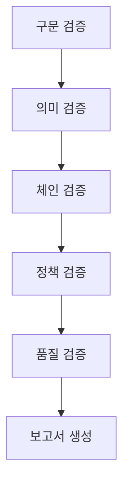
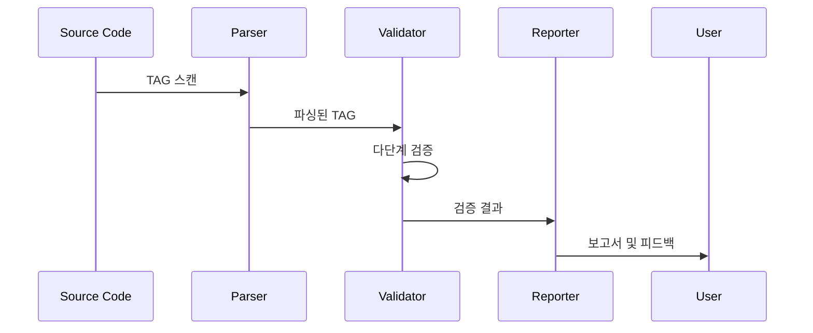

# @TAG 검증

@TAG 검증 시스템은 모든 TAG가 정확한 형식을 따르고, 완전한 체인을 형성하며, 프로젝트 정책을 준수하는지 확인하는 품질 보증 메커니즘입니다.

## 검증 시스템 아키텍처

### 1. 검증 레이어


### 2. 검증 파이프라인


## 구문 검증 (Syntax Validation)

### 1. 기본 형식 검사

#### TAG 패턴 규칙
```python
TAG_PATTERN = r'^@[A-Z]+:[A-Z0-9\-]+$'

class SyntaxValidator:
    def validate_format(self, tag: str) -> ValidationResult:
        """
        기본 TAG 형식 검증:
        1. @로 시작
        2. 대문자 카테고리
        3. 콜론(:) 구분자
        4. 대문자/숫자/하이픈 식별자
        """
        pass
```

#### 허용된 카테고리
```python
VALID_CATEGORIES = {
    'REQ', 'DESIGN', 'TASK', 'TEST', 'FEATURE',
    'API', 'UI', 'DATA', 'RESEARCH', 'ANALYSIS',
    'KNOWLEDGE', 'INSIGHT'
}

def validate_category(self, category: str) -> bool:
    """유효한 카테고리인지 확인"""
    return category in self.VALID_CATEGORIES
```

### 2. 식별자 규칙

#### 길이 제한
```python
def validate_identifier_length(self, identifier: str) -> ValidationResult:
    """
    식별자 길이 제한:
    - 최소 길이: 3자
    - 최대 길이: 50자
    - 권장 길이: 10-20자
    """
    if len(identifier) < 3:
        return ValidationResult(False, "식별자가 너무 짧습니다")
    if len(identifier) > 50:
        return ValidationResult(False, "식별자가 너무 깁니다")
    return ValidationResult(True)
```

#### 문자 규칙
```python
def validate_identifier_chars(self, identifier: str) -> ValidationResult:
    """
    식별자 문자 규칙:
    - 대문자 (A-Z)
    - 숫자 (0-9)
    - 하이픈 (-) 단어 구분
    - 연속 하이픈 금지 (--)

    허용된 예: USER-LOGIN-001, API-V2, MODULE-SUBMODULE
    금지된 예: user_login, USER__LOGIN, user-login-001
    """
    if not re.match(r'^[A-Z0-9]+(-[A-Z0-9]+)*$', identifier):
        return ValidationResult(False, "잘못된 식별자 형식")
    return ValidationResult(True)
```

### 3. 구문 오류 유형

#### 일반적인 형식 오류
```
잘못된 예:
- @user-login-001 (소문자 카테고리)
- @REQ:user_login (소문자 식별자)
- @REQ:USER-LOGIN-001 EXTRA (추가 텍스트)
- @REQ:001 (의미 없는 식별자)

올바른 예:
- @REQ:USER-LOGIN-001
- @API:POST-LOGIN
- @TEST:UNIT-AUTH-001
```

#### 중복 TAG 검출
```python
def detect_duplicates(self, tags: List[TAG]) -> List[DuplicateTAG]:
    """중복된 TAG 검출"""
    tag_counts = {}
    duplicates = []

    for tag in tags:
        key = f"{tag.category}:{tag.identifier}"
        tag_counts[key] = tag_counts.get(key, 0) + 1
        if tag_counts[key] > 1:
            duplicates.append(DuplicateTAG(tag, tag_counts[key]))

    return duplicates
```

## 의미 검증 (Semantic Validation)

### 1. 카테고리 의미 규칙

#### 카테고리별 역할 검증
```python
class SemanticValidator:
    def validate_category_usage(self, tag: TAG, context: str) -> ValidationResult:
        """
        카테고리별 올바른 사용 검증:

        @REQ: 최상위 요구사항만 정의
        @API: 실제 HTTP 엔드포인트에만 사용
        @TEST: 테스트 파일/함수에만 사용
        @UI: UI 컴포넌트에만 사용
        """
        if tag.category == 'API':
            return self.validate_api_usage(tag, context)
        elif tag.category == 'TEST':
            return self.validate_test_usage(tag, context)
        # ... 다른 카테고리 검증
```

#### API TAG 의미 검증
```python
def validate_api_usage(self, tag: TAG, context: str) -> ValidationResult:
    """
    API TAG 의미 검증:
    - HTTP 메소드 포함 (GET, POST, PUT, DELETE)
    - 리소스 경로 명확성
    - RESTful 규약 준수
    """
    if not any(method in tag.identifier for method in ['GET', 'POST', 'PUT', 'DELETE', 'PATCH']):
        return ValidationResult(False, "API TAG는 HTTP 메소드를 포함해야 합니다")

    return ValidationResult(True)
```

### 2. 내용 일관성 검증

#### TAG와 실제 내용 일치
```python
def validate_content_alignment(self, tag: TAG, content: str) -> ValidationResult:
    """
    TAG가 설명하는 실제 내용과 일치하는지 검증:
    - 함수 이름과 API TAG 일치
    - 컴포넌트 이름과 UI TAG 일치
    - 테스트 목적과 TEST TAG 일치
    """
    if tag.category == 'API':
        return self.check_api_name_match(tag, content)
    elif tag.category == 'UI':
        return self.check_ui_component_match(tag, content)

    return ValidationResult(True)
```

## 체인 검증 (Chain Validation)

### 1. 필수 체인 규칙

#### REQ → 구현 → TEST 체인
```python
class ChainValidator:
    def validate_requirement_chain(self, req_tag: TAG, all_tags: List[TAG]) -> ChainValidationResult:
        """
        요구사항 체인 검증:
        1. @REQ는 최소 하나의 구현 TAG 참조
        2. 구현 TAG는 최소 하나의 @TEST 참조
        3. 체인이 완전히 연결되어야 함
        """
        implementation_tags = self.find_implementations(req_tag, all_tags)
        test_tags = self.find_tests(implementation_tags, all_tags)

        if not implementation_tags:
            return ChainValidationResult(
                is_valid=False,
                issue=f"@REQ:{req_tag.identifier}에 구현 TAG가 없음"
            )

        if not test_tags:
            return ChainValidationResult(
                is_valid=False,
                issue="구현 TAG에 대한 테스트가 없음"
            )

        return ChainValidationResult(is_valid=True)
```

#### TEST TAG 참조 검증
```python
def validate_test_references(self, test_tag: TAG, all_tags: List[TAG]) -> ValidationResult:
    """
    테스트 TAG가 실제 구현을 참조하는지 검증:
    - 단위 테스트: 구현 함수/클래스 참조
    - 통합 테스트: API/서비스 참조
    - E2E 테스트: 사용자 시나리오 참조
    """
    referenced_implementations = self.extract_referenced_tags(test_tag.context)

    if not referenced_implementations:
        return ValidationResult(False, "테스트가 구현 TAG를 참조하지 않음")

    for ref in referenced_implementations:
        if not self.find_tag_by_identifier(ref, all_tags):
            return ValidationResult(False, f"참조된 TAG {ref}를 찾을 수 없음")

    return ValidationResult(True)
```

### 2. 체인 완전성 측정

#### 완전성 점수 계산
```python
def calculate_completeness_score(self, tags: List[TAG]) -> CompletenessScore:
    """
    체인 완전성 점수 계산:

    A급 (95-100%): 완벽한 체인
    B급 (85-94%): 약간의 누락
    C급 (70-84%): 다수 누락
    D급 (50-69%): 심각한 누락
    F급 (<50%): 체인 붕괴
    """
    total_requirements = len([t for t in tags if t.category == 'REQ'])
    complete_chains = self.count_complete_chains(tags)

    if total_requirements == 0:
        return CompletenessScore(100, 'A')  # 요구사항 없음은 완벽

    completeness = (complete_chains / total_requirements) * 100

    if completeness >= 95:
        grade = 'A'
    elif completeness >= 85:
        grade = 'B'
    elif completeness >= 70:
        grade = 'C'
    elif completeness >= 50:
        grade = 'D'
    else:
        grade = 'F'

    return CompletenessScore(completeness, grade)
```

## 정책 검증 (Policy Validation)

### 1. 프로젝트 정책 준수

#### 필수 디렉토리 규칙
```python
class PolicyValidator:
    def validate_mandatory_directories(self, tags: List[TAG], project_structure: Dict) -> PolicyResult:
        """
        필수 디렉토리 TAG 요구사항 검증:
        - src/: 최소 1개 구현 TAG
        - tests/: 모든 구현 TAG에 해당 테스트 TAG
        - .moai/specs/: 모든 요구사항 TAG
        """
        violations = []

        if not self.has_tags_in_directory(tags, 'src/'):
            violations.append("src/ 디렉토리에 구현 TAG가 없음")

        if not self.has_tags_in_directory(tags, 'tests/'):
            violations.append("tests/ 디렉토리에 테스트 TAG가 없음")

        return PolicyResult(len(violations) == 0, violations)
```

#### 의무 규칙 검증
```python
def validate_enforcement_rules(self, tags: List[TAG]) -> EnforcementResult:
    """
    강제 규칙 검증:
    - require_spec_before_code: 코드 전에 SPEC 요구
    - require_test_for_code: 모든 코드에 테스트 요구
    - enforce_chains: TAG 체인 강제
    """
    if self.config.get('require_spec_before_code'):
        violations = self.check_spec_before_code(tags)

    if self.config.get('require_test_for_code'):
        violations.extend(self.check_tests_for_code(tags))

    return EnforcementResult(len(violations) == 0, violations)
```

### 2. 품질 기준 검증

#### 테스트 커버리지
```python
def validate_test_coverage(self, tags: List[TAG]) -> CoverageResult:
    """
    테스트 커버리지 검증:
    - 목표 커버리지: 85%
    - 단위 테스트: 모든 구현에 필수
    - 통합 테스트: 주요 기능에 필수
    """
    implementation_count = len([t for t in tags if t.category in ['API', 'UI', 'DATA']])
    test_count = len([t for t in tags if t.category == 'TEST'])

    if implementation_count == 0:
        return CoverageResult(100, True)  # 구현 없음은 100% 커버리지

    coverage = (test_count / implementation_count) * 100
    is_sufficient = coverage >= self.config.get('test_coverage_target', 85)

    return CoverageResult(coverage, is_sufficient)
```

## 품질 검증 (Quality Validation)

### 1. TAG 품질 메트릭

#### 설명 품질
```python
def validate_tag_description(self, tag: TAG) -> QualityScore:
    """
    TAG 설명 품질 평가:
    - 길이: 10-100자 적정
    - 명확성: 구체적인 동사와 명사 사용
    - 일관성: 프로젝트 용어사용 일치
    """
    score = 0

    # 길이 점수 (0-25점)
    if 10 <= len(tag.description) <= 100:
        score += 25
    elif len(tag.description) > 0:
        score += 10

    # 명확성 점수 (0-40점)
    if self.has_clear_verbs(tag.description):
        score += 20
    if self.avoids_ambiguity(tag.description):
        score += 20

    # 일관성 점수 (0-35점)
    if self.uses_project_terminology(tag.description):
        score += 35

    return QualityScore(score)
```

#### TAG 밀도 분석
```python
def analyze_tag_density(self, file_content: str) -> DensityAnalysis:
    """
    파일 내 TAG 밀도 분석:
    - 과도한 TAG: 가독성 저하
    - 부족한 TAG: 추적성 부족
    - 적정 밀도: 1개 TAG당 10-30줄 코드
    """
    lines = file_content.count('\n')
    tag_count = len(self.extract_tags(file_content))

    if lines == 0:
        return DensityAnalysis(0, "empty")

    density = lines / tag_count if tag_count > 0 else float('inf')

    if density < 10:
        status = "over_tagged"
    elif density > 30:
        status = "under_tagged"
    else:
        status = "optimal"

    return DensityAnalysis(density, status)
```

### 2. 일관성 검증

#### 명명 규칙 일관성
```python
def validate_naming_consistency(self, tags: List[TAG]) -> ConsistencyReport:
    """
    명명 규칙 일관성 검증:
    - 동일 모듈 내 식별자 접두사 일치
    - 시퀀스 번호 체계 일관성
    - 약어 사용 통일성
    """
    inconsistencies = []

    # 모듈별 접두사 일관성
    module_prefixes = self.analyze_module_prefixes(tags)
    for module, prefixes in module_prefixes.items():
        if len(prefixes) > 1:
            inconsistencies.append(f"모듈 {module}에서 일치하지 않는 접두사: {prefixes}")

    # 시퀀스 번호 분석
    sequence_issues = self.analyze_sequence_numbers(tags)
    inconsistencies.extend(sequence_issues)

    return ConsistencyReport(len(inconsistencies) == 0, inconsistencies)
```

## 검증 실행 및 보고

### 1. 실시간 검증

#### Pre-commit 훅
```python
def pre_commit_validation(self, changed_files: List[str]) -> ValidationResult:
    """
    Pre-commit TAG 검증:
    - 변경된 파일만 검증 (성능 최적화)
    - 커밋 차단 규칙 적용
    - 빠른 피드백 제공
    """
    all_issues = []

    for file_path in changed_files:
        content = self.read_file(file_path)
        tags = self.extract_tags(content)

        # 구문 검증
        syntax_issues = self.validate_syntax(tags)
        all_issues.extend(syntax_issues)

        # 체인 검증 (빠른 모드)
        chain_issues = self.validate_chains_fast(tags)
        all_issues.extend(chain_issues)

    # 치명적 오류가 있으면 커밋 차단
    critical_issues = [i for i in all_issues if i.severity == 'critical']

    return ValidationResult(
        is_valid=len(critical_issues) == 0,
        issues=all_issues,
        block_commit=len(critical_issues) > 0
    )
```

### 2. 전체 검증

#### 전체 프로젝트 검증
```python
def full_project_validation(self, project_path: str) -> ValidationResult:
    """
    전체 프로젝트 TAG 검증:
    - 모든 파일 분석
    - 전체 체인 검증
    - 품질 메트릭 계산
    - 상세 보고서 생성
    """
    # 모든 TAG 수집
    all_tags = self.scan_all_tags(project_path)

    # 다단계 검증
    syntax_result = self.validate_syntax_all(all_tags)
    semantic_result = self.validate_semantics(all_tags)
    chain_result = self.validate_chains(all_tags)
    policy_result = self.validate_policies(all_tags)
    quality_result = self.validate_quality(all_tags)

    # 종합 보고서
    return ValidationReport(
        syntax=syntax_result,
        semantic=semantic_result,
        chain=chain_result,
        policy=policy_result,
        quality=quality_result,
        overall_score=self.calculate_overall_score([
            syntax_result, semantic_result, chain_result,
            policy_result, quality_result
        ])
    )
```

### 3. 보고서 생성

#### 검증 보고서 형식
```python
def generate_validation_report(self, result: ValidationResult) -> str:
    """
    검증 결과 보고서 생성:
    - 요약 정보 (전체 점수, 문제 개수)
    - 문제 목록 (심각도별 분류)
    - 권장 조치
    - 개선 계획
    """
    report = f"""
# TAG 검증 보고서

## 요약
- 전체 점수: {result.overall_score}/100
- 검증된 TAG: {result.total_tags}개
- 발견된 문제: {len(result.issues)}개
- 심각도 분류: 치명적 {result.critical_count}개, 경고 {result.warning_count}개

## 주요 문제
{self.format_issues(result.issues)}

## 권장 조치
{self.generate_recommendations(result.issues)}

## 개선 계획
{self.create_improvement_plan(result)}
"""
    return report
```

## 자동 수정 기능

### 1. 자동 수정 규칙

#### 형식 오류 자동 수정
```python
def auto_fix_syntax_errors(self, tags: List[TAG]) -> List[Fix]:
    """
    형식 오류 자동 수정:
    - 대문자 변환
    - 하이픈 정규화
    - 공백 제거
    """
    fixes = []

    for tag in tags:
        # 소문자를 대문자로 변환
        if tag.category != tag.category.upper():
            fixes.append(Fix(
                type="category_case",
                original=tag.category,
                corrected=tag.category.upper()
            ))

        # 연속 하이픈 수정
        if '--' in tag.identifier:
            corrected = re.sub('--+', '-', tag.identifier)
            fixes.append(Fix(
                type="identifier_hyphens",
                original=tag.identifier,
                corrected=corrected
            ))

    return fixes
```

### 2. 수정 제안 시스템

#### 누락된 TAG 제안
```python
def suggest_missing_tags(self, chain_analysis: ChainAnalysis) -> List[Suggestion]:
    """
    누락된 TAG 자동 제안:
    - REQ에 대한 구현 TAG 제안
    - 구현에 대한 테스트 TAG 제안
    - 체인 간 연결 TAG 제안
    """
    suggestions = []

    for req_tag in chain_analysis.unimplemented_requirements:
        # API TAG 제안
        api_suggestion = self.suggest_api_tag(req_tag)
        if api_suggestion:
            suggestions.append(api_suggestion)

        # 테스트 TAG 제안
        test_suggestion = self.suggest_test_tag(req_tag)
        if test_suggestion:
            suggestions.append(test_suggestion)

    return suggestions
```

## 설정 및 커스터마이징

### 1. 검증 규칙 설정

#### 프로젝트별 검증 규칙
```json
{
  "validation": {
    "syntax": {
      "strict_mode": true,
      "allow_custom_categories": false,
      "identifier_length": {"min": 3, "max": 50}
    },
    "chain": {
      "require_complete_chains": true,
      "allow_partial_chains": false,
      "minimum_depth": 2
    },
    "policy": {
      "test_coverage_target": 85,
      "require_spec_before_code": true,
      "mandatory_directories": ["src/", "tests/"]
    }
  }
}
```

### 2. 검증 예외 설정

#### 예외 규칙 정의
```json
{
  "validation_exceptions": {
    "excluded_directories": [
      "node_modules/",
      ".git/",
      "docs/"
    ],
    "excluded_patterns": [
      "*.min.js",
      "*.generated.*"
    ],
    "allowed_duplicates": [
      "@COMMON:SECURITY-AUTH-001"
    ]
  }
}
```

## 모범 사례

### 1. 검증 전략

#### 점진적 도입
1. **1단계**: 구문 검증만 활성화
2. **2단계**: 기본 체인 검증 추가
3. **3단계**: 전체 품질 검증 활성화
4. **4단계**: 자동 수정 기능 활용

#### 위험 기반 접근
- 치명적 오류: 즉시 수정 요구
- 경고: 시간제 수정 권고
- 정보: 개선 제안

### 2. 팀 협업

#### 검증 기준 공유
- 명명 규칙 문서화
- 검증 규칙 팀 합의
- 정기적인 검토 회의

#### 교육 및 훈련
- TAG 작성 가이드
- 검증 도구 사용법
- 품질 기준 이해