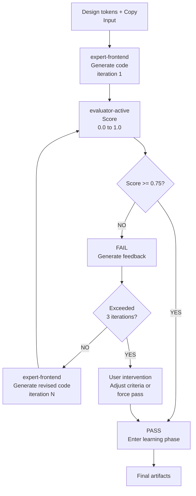

# GAN Loop — Builder-Evaluator Iteration

The GAN Loop is an iterative process where **Builder** (expert-frontend) and **Evaluator** (evaluator-active) collaborate. Design improves → evaluates → improves until quality threshold reached.

## Process Overview



## Iteration Mechanism

### Step 1: Builder Generates Code

**expert-frontend**:
- Loads design tokens JSON
- Loads copy sections
- Writes React/Vue components
- Applies Tailwind/CSS styles

**Output:**
```
src/components/
├── Hero.tsx        (copy + styles)
├── Features.tsx    (feature cards)
├── CTA.tsx         (call-to-action)
└── Footer.tsx
pages/
└── index.tsx       (main layout)
styles/
└── globals.css     (design tokens as CSS vars)
```

### Step 2: Evaluator Scores

**evaluator-active**:
- Loads Sprint Contract (acceptance criteria)
- Analyzes generated code
- Calculates 4-dimensional score (each 0.0 to 1.0)
- Generates feedback

**Score Calculation:**
```
Overall = (
  Design Quality × 0.30 +
  Originality × 0.25 +
  Completeness × 0.25 +
  Functionality × 0.20
)
```

**Pass Threshold:** Score >= 0.75 (all required criteria met)

### Step 3: Pass/Fail Decision

**Pass (Score >= 0.75):**
- ✅ Proceed to next phase
- Start learning phase (record patterns, etc.)

**Fail (Score < 0.75):**
- ❌ Generate feedback
- Suggest improvements to Builder
- Increment iteration counter

### Step 4: Iteration Control

| Condition | Action |
|---|---|
| iteration < 3 | Auto-retry |
| iteration == 3 | Check for improvement (threshold: 0.05) |
| iteration == 4-5 | Final 2 attempts |
| iteration > 5 | User intervention (escalation) |

## Sprint Contract Protocol

Before each iteration, negotiate a **Sprint Contract** specifying **concrete acceptance criteria** for that iteration.

### Contract Elements

1. **Acceptance Checklist** — Specific criteria must-meet this iteration
2. **Priority Dimension** — Which of 4 dimensions to focus on
3. **Test Scenarios** — Playwright E2E tests
4. **Pass Conditions** — Minimum score per dimension

### Contract Example

```yaml
iteration: 1
priority_dimension: "Design Quality"
acceptance_checklist:
  - Hero section applies brand colors
  - CTA button is clickable
  - Mobile responsive (< 768px)
  - WCAG AA color contrast

test_scenarios:
  - "Hero CTA click navigates to form"
  - "Layout reflows below 768px"
  - "Dark mode colors applied"

pass_conditions:
  design_quality: 0.75
  originality: 0.50
  completeness: 0.50
  functionality: 0.60
```

### Contract Negotiation

1. **evaluator-active** proposes Contract
2. **expert-frontend** reviews
   - Feasibility check
   - Can request adjustments
3. **evaluator-active** finalizes
   - Verify BRIEF compliance
   - Validate practicality

## 4-Dimensional Scoring

### Dimension 1: Design Quality (Weight 0.30)

**Evaluation Criteria:**
- Brand color/typography accuracy
- Spacing consistency
- Visual hierarchy clarity
- Responsive design completeness

**Rubric:**
| Score | Criterion |
|---|---|
| 1.0 | All tokens applied accurately, responsive perfect |
| 0.75 | Major tokens applied, responsive works |
| 0.50 | Basic layout only, some omissions |
| 0.25 | Significant deviations, partial functionality |
| 0.0 | Design rules not reflected |

### Dimension 2: Originality (Weight 0.25)

**Evaluation Criteria:**
- Brand voice reflection strength
- Target audience alignment
- Differentiation (vs competitors)

**Rubric:**
| Score | Criterion |
|---|---|
| 1.0 | Brand voice perfectly reflected, unique |
| 0.75 | Voice clearly reflected, audience connected |
| 0.50 | Partial voice reflection, generic feel |
| 0.25 | Weak voice, AI-generated appearance |
| 0.0 | Generic feel, AI-slop evident |

### Dimension 3: Completeness (Weight 0.25)

**Evaluation Criteria:**
- BRIEF requirement coverage
- All sections implemented
- No errors/bugs

**Rubric:**
| Score | Criterion |
|---|---|
| 1.0 | 100% requirements met, 0 bugs |
| 0.75 | 90%+ requirements, minor bugs |
| 0.50 | 70-90% requirements, some gaps |
| 0.25 | 50-70% requirements, major gaps |
| 0.0 | < 50%, unfinished |

### Dimension 4: Functionality (Weight 0.20)

**Evaluation Criteria:**
- Component interactions working
- Form input/validation
- Routing/navigation
- Performance (Lighthouse >= 80)

**Rubric:**
| Score | Criterion |
|---|---|
| 1.0 | All interactions work, performance excellent |
| 0.75 | Major features work, performance good |
| 0.50 | Basic features work, performance average |
| 0.25 | Some feature failures, performance degraded |
| 0.0 | Major features not working |

## Leniency Prevention 5 Mechanisms

Prevent evaluator score inflation.

### Mechanism 1: Rubric Anchoring

All scoring references **concrete rubrics**.
- Scores without rubric citation invalid
- Rubric citation mandatory

### Mechanism 2: Regression Baseline

Track previous project score distribution:
- Current score > baseline + 0.15 → review
- Detect score inflation patterns

### Mechanism 3: Must-Pass Firewall

**Must-pass criteria failure** → project fails, regardless of other scores:
- Functionality 0 → overall max 0.50
- WCAG AA violation → design quality max 0.50

### Mechanism 4: Independent Re-evaluation

Every 5th project:
- Score twice independently
- Deviation > 0.10 → calibration review

### Mechanism 5: Anti-Pattern Blocking

Detected anti-patterns:
- Related dimension score capped at 0.50
- No compensation possible

Examples:
- Color contrast violation → design quality capped
- Repetitive code → completeness capped

## Escalation

When iteration progresses:

| Condition | Action |
|---|---|
| 3 iterations without pass | Trigger escalation |
| Score improvement < 0.05 (2x consecutive) | Stagnation signal, escalate |
| iteration > 5 | Force stop, user intervention |

**User Intervention Options:**
1. Adjust criteria (modify Sprint Contract)
2. Force pass (ignore score)
3. Restart (reset iteration counter)

## Configuration

In `.moai/config/sections/design.yaml`:

```yaml
gan_loop:
  max_iterations: 5
  pass_threshold: 0.75
  escalation_after: 3
  improvement_threshold: 0.05
  strict_mode: false
  
sprint_contract:
  enabled: true
  required_for_harness: "thorough"
  artifact_dir: ".moai/sprints/"
```

- **max_iterations:** Max iteration count
- **pass_threshold:** Min pass score (>= 0.60)
- **escalation_after:** Escalation trigger iteration
- **improvement_threshold:** Min score improvement
- **strict_mode:** If true, validate all must-pass individually

## Next Steps

- [Migration Guide](./migration-guide.md) — Convert existing .agency/ projects
