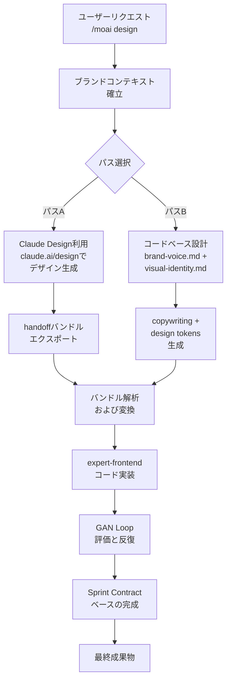

# デザインシステム

MoAI-ADKのデザインシステムは、**ハイブリッドアプローチ**をサポートしています。Claude Designまたはコードベース設計を選択して、ブランドに合わせたウェブ体験を構築できます。

## 2つのパス

## 主な特徴

- **ブランド一貫性** — ブランドコンテキストがすべての段階で適用される
- **Sprint Contractプロトコル** — 各反復周期の明確な受け入れ基準
- **4次元スコアリング** — 設計品質、独創性、完成度、機能性を評価
- **Anti-AI-Slop** — AI生成コンテンツの浅薄さを防ぐルール
- **アクセシビリティ準拠** — WCAG AA標準の自動検証

## 次のステップ

- **[はじめに](./getting-started.md)** — `/moai design`で最初のプロジェクト開始
- **[Claude Designハンドオフ](./claude-design-handoff.md)** — Claude Design機能とバンドルエクスポート
- **[コードベースパス](./code-based-path.md)** — brand-voice.mdを使用した設計
- **[GAN Loop](./gan-loop.md)** — Builder-Evaluator反復プロセス
- **[移行ガイド](./migration-guide.md)** — 既存の.agency/プロジェクト変換

## 要件

- 最新のMoAI-ADKバージョン
- Claude Codeデスクトップクライアント v2.1.50以上
- パスA: Claude.ai Pro以上のサブスクリプション
- パスB: 完成したブランドコンテキストファイル
