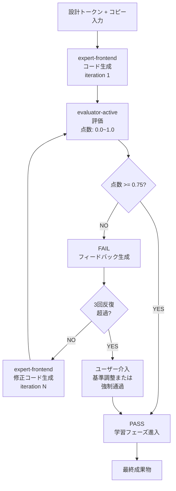

# GAN Loop — Builder-Evaluator反復

GAN Loopは、**Builder**(expert-frontend)と**Evaluator**(evaluator-active)が協力する反復プロセスです。設計が品質基準を満たすまで改善 → 評価 → 改善を繰り返します。

## プロセス概要



## 反復メカニズム

### ステップ1: Builder コード生成

**expert-frontend**:
- 設計トークンJSON読み込み
- カピセクション読み込み
- React/Vueコンポーネント作成
- Tailwind/CSSスタイル適用

### ステップ2: Evaluator 評価

**evaluator-active**:
- Sprint Contract読み込み(受け入れ基準)
- 生成コード分析
- 4次元スコア計算(各0.0~1.0)
- フィードバック生成

**スコア計算:**
```
総合点 = (
  設計品質 × 0.30 +
  独創性 × 0.25 +
  完成度 × 0.25 +
  機能性 × 0.20
)
```

**合格線:** 総合点 >= 0.75(必須条件すべて満たす)

### ステップ3: 合格/不合格判定

**合格(点数 >= 0.75):**
- ✅ 次ステップ進行
- 学習phase開始

**不合格(点数 < 0.75):**
- ❌ フィードバック生成
- Builder に改善方向提示
- iteration カウント増加

### ステップ4: 反復制御

| 条件 | 処置 |
|---|---|
| iteration < 3 | 自動再試行 |
| iteration == 3 | 点数改善確認 |
| iteration == 4-5 | 最後の2回試行 |
| iteration > 5 | ユーザー介入必要 |

## Sprint Contract プロトコル

各反復前に、**Sprint Contract**を締結し、その反復の**具体的な受け入れ基準**を明示します。

### Contract 要素

1. **受け入れチェックリスト** — この反復で満たすべき具体的基準
2. **優先度ディメンション** — 4次元中この反復に集中する領域
3. **テストシナリオ** — Playwright E2Eテスト
4. **通過条件** — ディメンション別最小点数

## 4次元スコアリング

### ディメンション1: 設計品質(重み 0.30)

**評価項目:**
- ブランド色/タイポ精度
- 間隔一貫性
- ビジュアル階層明確性
- レスポンシブ設計完成度

### ディメンション2: 独創性(重み 0.25)

**評価項目:**
- ブランドvoice反映強度
- ターゲット顧客合致度
- 差別性

### ディメンション3: 完成度(重み 0.25)

**評価項目:**
- BRIEF要件カバー率
- 全セクション実装
- エラー/バグ不在

### ディメンション4: 機能性(重み 0.20)

**評価項目:**
- コンポーネント相互作用動作
- フォーム入力/検証
- ナビゲーション
- パフォーマンス(Lighthouse >= 80)

## Leniency防止 5つのメカニズム

評価者の点数水増しを防止します。

1. **ルブリックアンカリング** — 具体的ルブリック参照必須
2. **回帰基準線** — 前プロジェクトスコア分布を基準
3. **必須条件ファイアウォール** — 必須条件不合格 → プロジェクト失敗
4. **独立的再評価** — 5番目プロジェクトごと2回独立評価
5. **Anti-Pattern遮断** — 既知anti-pattern検出時はスコアcap

## Escalation

反復進行時:

| 条件 | 処置 |
|---|---|
| 3回反復後も不合格 | escalation トリガー |
| 点数改善 < 0.05(2回連続) | 停滞信号、escalate |
| iteration > 5 | 強制終了、ユーザー介入 |

**ユーザー介入オプション:**
1. 基準調整(Sprint Contract修正)
2. 強制通過(点数無視)
3. 再開始(iteration初期化)

## 設定

`.moai/config/sections/design.yaml`:

```yaml
gan_loop:
  max_iterations: 5
  pass_threshold: 0.75
  escalation_after: 3
  improvement_threshold: 0.05
  strict_mode: false
```

## 次のステップ

- [移行ガイド](./migration-guide.md) — 既存.agency/プロジェクト変換
