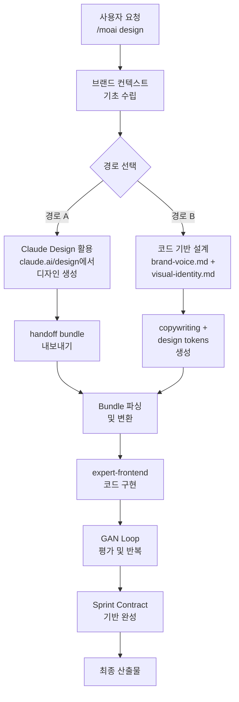

# 디자인 시스템

MoAI-ADK의 디자인 시스템은 **하이브리드 접근 방식**을 지원합니다. Claude Design 또는 코드 기반 디자인을 선택하여 브랜드에 맞는 웹 경험을 구축할 수 있습니다.

## 두 가지 경로

## 주요 특징

- **브랜드 일관성** — 브랜드 컨텍스트가 모든 단계에 적용됨
- **Sprint Contract 프로토콜** — 각 반복 주기의 명확한 수용 기준
- **4차원 스코어링** — 설계 품질, 독창성, 완성도, 기능성 평가
- **Anti-AI-Slop** — 인공지능 생성 콘텐츠의 부실함을 방지하는 규칙
- **접근성 준수** — WCAG AA 표준 자동 검증

## 다음 단계

- **[시작하기](./getting-started.md)** — `/moai design` 명령어로 첫 프로젝트 시작
- **[Claude Design 핸드오프](./claude-design-handoff.md)** — Claude Design 기능 소개 및 bundle 내보내기
- **[코드 기반 경로](./code-based-path.md)** — brand-voice.md를 활용한 설계
- **[GAN Loop](./gan-loop.md)** — Builder-Evaluator 반복 프로세스
- **[마이그레이션 가이드](./migration-guide.md)** — 기존 .agency/ 프로젝트 전환

## 요구 사항

- MoAI-ADK 최신 버전
- Claude Code 데스크톱 클라이언트 v2.1.50 이상
- 경로 A: Claude.ai Pro 또는 상위 구독
- 경로 B: 완료된 브랜드 컨텍스트 파일
