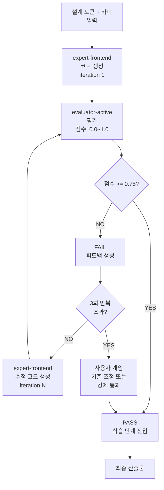

# GAN Loop — Builder-Evaluator 반복

GAN Loop는 **Builder** (expert-frontend) 와 **Evaluator** (evaluator-active) 가 협력하는 반복 프로세스입니다. 설계가 품질 기준을 만족할 때까지 개선 → 평가 → 개선을 반복합니다.

## 프로세스 개요



## 반복 메커니즘

### 1단계: Builder 코드 생성

**expert-frontend** 가:
- 설계 토큰 JSON 로드
- 카피 섹션 로드
- React/Vue 컴포넌트 작성
- Tailwind/CSS 모듈 스타일 적용

**출력:**
```
src/components/
├── Hero.tsx        (카피 + 스타일)
├── Features.tsx    (기능 카드)
├── CTA.tsx         (클릭 유도)
└── Footer.tsx
pages/
└── index.tsx       (메인 레이아웃)
styles/
└── globals.css     (설계 토큰 CSS 변수)
```

### 2단계: Evaluator 평가

**evaluator-active** 가:
- Sprint Contract 로드 (현재 반복의 수용 기준)
- 생성된 코드 분석
- 4차원 점수 계산 (각 0.0~1.0)
- 피드백 생성

**점수 계산:**
```
종합점수 = (
  설계 품질 × 0.30 +
  독창성 × 0.25 +
  완성도 × 0.25 +
  기능성 × 0.20
)
```

**합격선:** 종합점수 >= 0.75 (필수 조건 모두 충족)

### 3단계: 합격/불합격 판정

**합격 (점수 >= 0.75):**
- ✅ 다음 단계 진행
- 학습 phase 시작 (anti-pattern 기록 등)

**불합격 (점수 < 0.75):**
- ❌ 피드백 생성
- Builder에게 개선 방향 제시
- iteration 카운트 증가

### 4단계: 반복 제어

| 상황 | 조치 |
|---|---|
| iteration < 3 | 자동 재시도 |
| iteration == 3 | 점수 개선 여부 확인 (threshold: 0.05) |
| iteration == 4-5 | 마지막 2회 시도 |
| iteration > 5 | 사용자 개입 필요 (escalation) |

## Sprint Contract 프로토콜

각 반복 전에 **Sprint Contract** 를 체결합니다. 이는 해당 반복의 **구체적인 수용 기준**을 명시합니다.

### Contract 요소

1. **수용 체크리스트** — 이번 반복에서 충족해야 할 구체적 기준
2. **우선순위 차원** — 4차원 중 이번 반복에 집중할 영역
3. **테스트 시나리오** — Playwright E2E 테스트
4. **통과 조건** — 각 차원별 최소 점수

### Contract 예시

```yaml
iteration: 1
priority_dimension: "Design Quality"
acceptance_checklist:
  - Hero 섹션이 브랜드 색상 적용됨
  - CTA 버튼이 클릭 가능함
  - 모바일 반응형 (< 768px)
  - WCAG AA 색상 대비

test_scenarios:
  - "Hero CTA 클릭 시 form으로 이동"
  - "768px 이하에서 레이아웃 재배열"
  - "다크 모드 색상 반영"

pass_conditions:
  design_quality: 0.75
  originality: 0.50
  completeness: 0.50
  functionality: 0.60
```

### Contract 협상

1. **evaluator-active** 가 Contract 제안
2. **expert-frontend** 가 검토
   - 실현 가능한지 확인
   - 조정 요청 가능
3. **evaluator-active** 가 최종 확정
   - BRIEF 요구사항 준수 확인
   - 현실성 검증

## 4차원 스코어링

### 차원 1: 설계 품질 (가중치 0.30)

**평가 항목:**
- 브랜드 색상/타이포 정확성
- 스페이싱 일관성
- 시각 계층 명확성
- 반응형 설계 완성도

**루브릭:**
| 점수 | 기준 |
|---|---|
| 1.0 | 모든 토큰 정확히 적용, 반응형 완벽 |
| 0.75 | 주요 토큰 적용, 반응형 동작 |
| 0.50 | 기본 레이아웃만 적용, 일부 누락 |
| 0.25 | 심각한 편차, 부분 기능 |
| 0.0 | 설계 규칙 미반영 |

### 차원 2: 독창성 (가중치 0.25)

**평가 항목:**
- 브랜드 voice 반영 강도
- 타겟 고객 맞춤성
- 차별성 (경쟁사 대비)

**루브릭:**
| 점수 | 기준 |
|---|---|
| 1.0 | 브랜드 voice 완벽히 반영, 독특함 |
| 0.75 | voice 명확히 반영, 타겟 연결 |
| 0.50 | voice 부분 반영, 일반적 |
| 0.25 | voice 약함, 제네릭 느낌 |
| 0.0 | AI 생성 느낌, 부실함 |

### 차원 3: 완성도 (가중치 0.25)

**평가 항목:**
- BRIEF 요구사항 커버율
- 모든 섹션 구현
- 에러/버그 부재

**루브릭:**
| 점수 | 기준 |
|---|---|
| 1.0 | 100% 요구사항 충족, 0 버그 |
| 0.75 | 90%+ 요구사항, 사소한 버그 |
| 0.50 | 70~90% 요구사항, 몇 가지 누락 |
| 0.25 | 50~70% 요구사항, 주요 누락 |
| 0.0 | 50% 미만, 미완성 |

### 차원 4: 기능성 (가중치 0.20)

**평가 항목:**
- 컴포넌트 상호작용 동작
- 폼 입력/검증
- 라우팅/네비게이션
- 성능 (Lighthouse >= 80)

**루브릭:**
| 점수 | 기준 |
|---|---|
| 1.0 | 모든 상호작용 동작, 성능 우수 |
| 0.75 | 주요 기능 동작, 성능 양호 |
| 0.50 | 기본 기능만 동작, 성능 보통 |
| 0.25 | 일부 기능 장애, 성능 저하 |
| 0.0 | 주요 기능 미동작 |

## Leniency 방지 5가지 메커니즘

평가자가 점수를 부풀리는 것을 방지합니다.

### 메커니즘 1: 루브릭 앵커링

모든 평가는 **구체적인 루브릭**을 참조합니다.
- 루브릭 없는 점수는 무효
- 점수 배정 시 루브릭 인용 필수

### 메커니즘 2: 회귀선 기준

이전 프로젝트의 점수 분포를 기준으로:
- 현재 점수가 기준선보다 0.15 이상 높으면 재검토
- 점수 부풀림 패턴 감지

### 메커니즘 3: 필수 조건 방화벽

다른 차원이 높아도 **필수 조건 불합격** 시 프로젝트 실패:
- 기능성이 0 → 종합 점수 0.5 이상 불가
- WCAG AA 위반 → 설계 품질 0.5 이상 불가

### 메커니즘 4: 독립적 재평가

5번째 프로젝트마다:
- 같은 코드를 2번 독립적으로 평가
- 점수 차이 > 0.10 시 보정

### 메커니즘 5: Anti-Pattern 차단

알려진 안티패턴 감지 시:
- 해당 차원 점수 최대 0.50
- 점수 보상 불가

예시:
- 색상 대비율 위반 → 설계 품질 cap
- 반복 코드 → 완성도 cap

## Escalation

반복이 진행 중일 때:

| 상황 | 조치 |
|---|---|
| 3회 반복 후에도 불합격 | escalation 트리거 |
| 점수 개선 < 0.05 (2회 연속) | 정체 신호, escalation |
| iteration > 5 | 강제 종료, 사용자 개입 |

**사용자 개입 옵션:**
1. 기준 조정 (Sprint Contract 수정)
2. 강제 통과 (점수 무시)
3. 재시작 (iteration 초기화)

## 설정

`.moai/config/sections/design.yaml` 에서:

```yaml
gan_loop:
  max_iterations: 5
  pass_threshold: 0.75
  escalation_after: 3
  improvement_threshold: 0.05
  strict_mode: false
  
sprint_contract:
  enabled: true
  required_for_harness: "thorough"
  artifact_dir: ".moai/sprints/"
```

- **max_iterations:** 최대 반복 회수
- **pass_threshold:** 합격 최소 점수 (0.60 이상)
- **escalation_after:** escalation 트리거 반복 회차
- **improvement_threshold:** 점수 개선 최소값
- **strict_mode:** true 시 모든 필수 조건 개별 통과 검증

## 다음 단계

- [마이그레이션 가이드](./migration-guide.md) — 기존 .agency/ 프로젝트 전환
