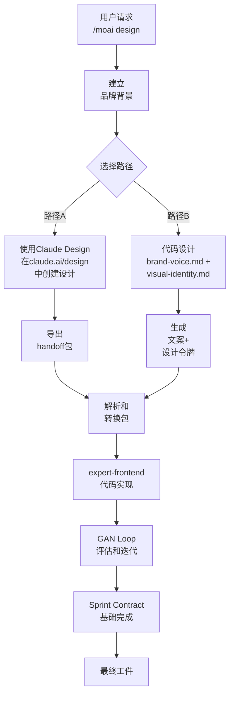

# 设计系统

MoAI-ADK的设计系统支持**混合方法**。选择Claude Design或代码设计来构建品牌一致的网络体验。

## 两条路径

## 主要特点

- **品牌一致性** — 品牌背景在每个阶段应用
- **Sprint Contract协议** — 每次迭代的明确接受标准
- **4维评分** — 设计质量、独创性、完整性、功能性
- **反AI-Slop规则** — 防止肤浅AI生成内容
- **无障碍合规** — WCAG AA标准自动验证

## 后续步骤

- **[入门指南](./getting-started.md)** — 使用/moai design启动第一个项目
- **[Claude Design交接](./claude-design-handoff.md)** — 了解Claude Design功能和包导出
- **[代码路径](./code-based-path.md)** — 使用brand-voice.md进行设计
- **[GAN Loop](./gan-loop.md)** — Builder-Evaluator迭代过程
- **[迁移指南](./migration-guide.md)** — 转换现有.agency/项目

## 要求

- 最新MoAI-ADK版本
- Claude Code桌面客户端v2.1.50或更高版本
- 路径A: Claude.ai Pro或更高订阅
- 路径B: 完整的品牌背景文件
