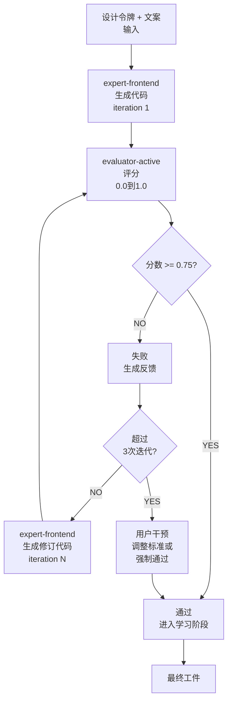

# GAN Loop — Builder-Evaluator迭代

GAN Loop是**Builder**(expert-frontend)和**Evaluator**(evaluator-active)协作的迭代过程。设计改进 → 评估 → 改进,直到达到质量阈值。

## 流程概览



## 迭代机制

### 步骤1: Builder生成代码

**expert-frontend**:
- 加载设计令牌JSON
- 加载文案部分
- 编写React/Vue组件
- 应用Tailwind/CSS样式

### 步骤2: Evaluator评分

**evaluator-active**:
- 加载Sprint Contract(接受标准)
- 分析生成的代码
- 计算4维分数(各0.0到1.0)
- 生成反馈

**分数计算:**
```
总体 = (
  设计质量 × 0.30 +
  独创性 × 0.25 +
  完整性 × 0.25 +
  功能性 × 0.20
)
```

**通过阈值:** 分数 >= 0.75(所有必需条件满足)

### 步骤3: 通过/失败判定

**通过(分数 >= 0.75):**
- ✅ 进行下一阶段
- 启动学习阶段

**失败(分数 < 0.75):**
- ❌ 生成反馈
- 建议Builder改进
- 增加迭代计数器

### 步骤4: 迭代控制

| 条件 | 操作 |
|---|---|
| iteration < 3 | 自动重试 |
| iteration == 3 | 检查改进 |
| iteration == 4-5 | 最后2次尝试 |
| iteration > 5 | 用户干预 |

## Sprint Contract协议

在每次迭代前,协商**Sprint Contract**以明确该迭代的**具体接受标准**。

### Contract要素

1. **接受检查清单** — 该迭代必须满足的具体标准
2. **优先级维度** — 4维中关注的领域
3. **测试场景** — Playwright E2E测试
4. **通过条件** — 每维最小分数

## 4维评分

### 维度1: 设计质量(权重0.30)

**评估项目:**
- 品牌颜色/排版精度
- 间距一致性
- 视觉层次清晰性
- 响应设计完整性

### 维度2: 独创性(权重0.25)

**评估项目:**
- 品牌voice反映强度
- 目标受众对齐度
- 差异性

### 维度3: 完整性(权重0.25)

**评估项目:**
- BRIEF要求覆盖率
- 所有部分已实现
- 无错误/bug

### 维度4: 功能性(权重0.20)

**评估项目:**
- 组件交互工作
- 表单输入/验证
- 导航
- 性能(Lighthouse >= 80)

## Leniency防止5个机制

1. **规则固定** — 具体规则参考必须
2. **回归基准** — 前项目分数分布作为基准
3. **必需条件防火墙** — 必需条件失败 → 项目失败
4. **独立重新评估** — 每5个项目2次独立评估
5. **Anti-Pattern阻止** — 已知anti-pattern检测时分数上限

## Escalation

迭代进行中:

| 条件 | 操作 |
|---|---|
| 3次迭代后仍未通过 | 触发escalation |
| 分数改进 < 0.05(连续2次) | 停滞信号,escalate |
| iteration > 5 | 强制停止,用户干预 |

**用户干预选项:**
1. 调整标准(修改Sprint Contract)
2. 强制通过(忽略分数)
3. 重新启动(重置迭代计数器)

## 配置

在`.moai/config/sections/design.yaml`:

```yaml
gan_loop:
  max_iterations: 5
  pass_threshold: 0.75
  escalation_after: 3
  improvement_threshold: 0.05
  strict_mode: false
```

## 后续步骤

- [迁移指南](./migration-guide.md) — 转换现有.agency/项目
