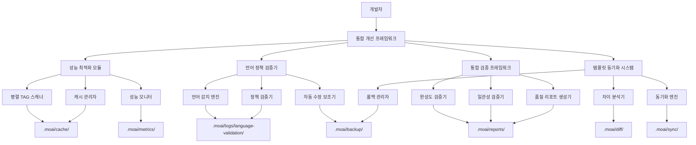

# 개선 가이드: 통합 개선 프레임워크

**작성 일시**: 2025-11-10
**상태**: 최초 작성
**대상**: 개발자, 기술 리더

---

## 개요

본 문서는 MoAI-ADK 프로젝트의 통합 개선 프레임워크 사용법을 상세히 설명합니다. SPEC-IMPROVEMENT-001에서 정의된 성능 최적화, 언어 정책 검증, 통합 검증 프레임워크, 템플릿 동기화 자동화를 체계적으로 적용하는 방법을 안내합니다.

---

## 1. 통합 개선 프레임워크 개요

### 1.1 핵심 기능

|------|------|------|

### 1.2 시스템 아키텍처



---


### 2.1 주요 기능

#### 2.1.1 병렬 TAG 스캐닝

**사용 방법**:
```bash
# 기본 병렬 스캔 실행
python -m moai_adk.cli scan --parallel --all

# 특정 디렉토리 대상 스캔
python -m moai_adk.cli scan --parallel --path src/

# 캐시 활성화 스캔
python -m moai_adk.cli scan --parallel --cache --all
```

**성능 개선 효과**:
- **초기 스캔**: 30% 이상 속도 개선
- **반복 스캔**: 80% 이상 속도 개선 (캐시 적용)
- **메모리 사용량**: 20% 이내 증가

#### 2.1.2 캐시 관리

**캐시 위치**: `.moai/cache/tags/`

**캐시 정책**:
- **만료 시간**: 24시간 또는 파일 변경 시
- **용량 관리**: LRU (Least Recently Used) 정책
- **무효화**: 파일 변경 시 자동 무효화

**캐시 관리 명령**:
```bash
# 캐시 조회
python -m moai_adk.cli cache --list

# 캐시 정리
python -m moai_adk.cli cache --clean

# 캐시 강제 무효화
python -m moai_adk.cli cache --invalidate --path src/
```

#### 2.1.3 성능 모니터링

**모니터링 위치**: `.moai/metrics/`

**실시간 지표**:
- 스캔 시간 (초)
- 메모리 사용량 (MB)
- 캐시 히트율 (%)
- 병렬 처리 효율성

```bash
# 성능 모니터링 시작
python -m moai_adk.cli monitor --start

# 성능 리포트 생성
python -m moai_adk.cli monitor --report --output performance-report.md
```

### 2.2 구성 파일

**성능 설정 위치**: `.moai/config.json` → `performance`

```json
{
  "performance": {
    "parallel_workers": 4,
    "cache_enabled": true,
    "cache_ttl_hours": 24,
    "cache_max_size_mb": 500,
    "batch_size": 100,
    "memory_limit_mb": 1024
  }
}
```

---


### 3.1 주요 기능

#### 3.1.1 언어 정책 위반 탐지

**스캔 대상**:
- `.claude/` 디렉토리 내 모든 파일
- 패키지 템플릿 파일
- 커밋 전 검증

**실행 방법**:
```bash
# 전체 언어 정책 검증
python -m moai_adk.cli validate --language --all

# 특정 디렉토리 검증
python -m moai_adk.cli validate --language --path .claude/

# 커밋 전 검증 (Git Hook)
python -m moai_adk.cli validate --language --git-hook
```

#### 3.1.2 자동 수정 보조

**수정 유형**:
- **자동 수정**: 단순 패턴의 경우 자동 수정
- **수정 제안**: 복잡한 경우 수정 옵션 제공
- **수동 검토**: 사용자 확인 필요

```bash
# 자동 수정 실행
python -m moai_adk.cli fix --language --auto

# 수정 제안 보기
python -m moai_adk.cli fix --language --suggest

# 대화형 수정
python -m moai_adk.cli fix --language --interactive
```

#### 3.1.3 검증 결과 리포트

**리포트 위치**: `.moai/logs/language-validation/`

**리포트 형식**:
```markdown
# 언어 정책 검증 리포트

## 위반 항목 요약
- 총 파일 수: 15
- 위반 파일 수: 3
- 자동 수정 가능: 2
- 수동 검토 필요: 1

## 상세 위반 내용
### .claude/agents/doc-syncer.md (라인 23)
**문제**: 한국어 주석 포함
**내용**: "이 문서는 동기화 작업을 설명합니다"
**수정 권장**: "This document describes the synchronization process"
**자동 수정**: 가능

### .claude/skills/SKILL.md (라인 45)
**문제**: 한국어 혼재
**내용**: "이 skill은 문서 검증을 수행합니다"
**수정 권장**: Multiple options provided
**자동 수정**: 불가능
```

### 3.2 구성 파일

**언어 정책 설정 위치**: `.moai/config.json` → `language_policy`

```json
{
  "language_policy": {
    "enabled": true,
    "target_directories": [".claude/"],
    "auto_fix_patterns": {
      "korean_comments": {
        "pattern": "//\\s*[가-힣]+",
        "replacement": "// TODO: Translate to English"
      },
      "korean_strings": {
        "pattern": "\"[가-힣]+\"",
        "replacement": "\"TODO: Translate to English\""
      }
    },
    "excluded_patterns": [
      "node_modules/",
      "dist/",
      "build/"
    ]
  }
}
```

---


### 4.1 주요 기능

#### 4.1.1 완성도 검증

**검증 대상**:
- TODO/FIXME 마커
- 미완성 구현
- 문서 누락

```bash
# 완성도 검증 실행
python -m moai_adk.cli validate --completeness --all

# 결과 분석
python -m moai_adk.cli validate --completeness --analyze --output completeness-report.md
```

**완성도 점수 계산**:
```
완성도 점수 = (1 - (미완성 항목 수 / 총 항목 수)) * 100

카테고리별 점수:
- 코드 완성도: 85점
- 문서 완성도: 92점
- 테스트 완성도: 78점
```

#### 4.1.2 일관성 검증

**검증 내용**:
- SPEC-코드-테스트 추적성 검사
- TAG 체인 무결성 검증
- 의존성 관계 검증

```bash
# 일관성 검증 실행
python -m moai_adk.cli validate --consistency --all

# TAG 체인 분석
python -m moai_adk.cli validate --consistency --tag-chain
```

#### 4.1.3 품질 리포트 생성

**리포트 위치**: `.moai/reports/`

**리포트 형식**:
```markdown
# 품질 검증 종합 리포트

## 개요
검증 일시: 2025-11-10 15:00:00
검증 범위: 전체 프로젝트
총 점수: 87점

## 상세 점수
- 완성도: 85점
- 일관성: 92점
- 성능: 88점
- 보안: 90점

## 개선 필요 항목
### 우선순위 높음
1. [SPEC-IMPROVEMENT-001] 구현 완료 (3/8 구현 중)
2. [TODO] 테스트 커버리지 개선 필요

### 우선순위 보통
1. [FIXME] 문서 업데이트 필요
2. [PERF] 성능 최적화 대상 코드 식별

## 추천 액션
1. SPEC-IMPROVEMENT-001 구현 완료
2. 테스트 커버리지 목표 85% 달성
3. 주요 성능 병목 해결
```

### 4.2 구성 파일

**검증 설정 위치**: `.moai/config.json` → `validation`

```json
{
  "validation": {
    "completeness": {
      "enabled": true,
      "scan_patterns": ["TODO", "FIXME", "XXX", "HACK"],
      "exclude_patterns": ["node_modules/", "dist/", "test-files/"]
    },
    "consistency": {
      "enabled": true,
      "check_tag_chains": true,
      "check_dependencies": true,
      "check_spec_implementation": true
    },
    "quality_gates": {
      "minimum_score": 80,
      "critical_issues_threshold": 5,
      "auto_fail_on_critical": true
    }
  }
}
```

---


### 5.1 주요 기능

#### 5.1.1 차이 분석

**분석 대상**:
- 패키지 템플릿 vs 로컬 프로젝트
- 파일 내용 차이
- 디렉토리 구조 차이

```bash
# 차이 분석 실행
python -m moai_adk.cli sync --diff --all

# 결과 보기
python -m moai_adk.cli sync --diff --output diff-report.md
```

**차이 유형**:
- **추가 (Added)**: 로컬에만 존재하는 파일
- **삭제 (Removed)**: 템플릿에만 존재하는 파일
- **수정 (Modified)**: 내용이 다른 파일
- **이동 (Moved)**: 위치가 변경된 파일

#### 5.1.2 자동 동기화

**동기화 전략**:
- **3-way 병합**: 패키지 템플릿, 로컬 수정, 공통 조상
- **자동 백업**: 동기화 전 자동 백업 생성
- **롤백**: 실패 시 즉시 롤백

```bash
# 안전한 동기화 (백업 포함)
python -m moai_adk.cli sync --safe --all

# 강제 동기화 (백업 없음)
python -m moai_adk.cli sync --force --all

# 선택적 동기화
python -m moai_adk.cli sync --selective --file .claude/agents/doc-syncer.md
```

#### 5.1.3 충돌 해결

**충돌 유형**:
- **내용 충돌**: 동일 파일 다른 내용
- **구조 충돌**: 디렉토리 구조 불일치
- **의존성 충돌**: 파일 간 의존성 문제

```bash
# 충돌 해결 모드
python -m moai_adk.cli sync --resolve --conflicts

# 자동 해결 시도
python -m moai_adk.cli sync --resolve --auto

# 대화형 해결
python -m moai_adk.cli sync --resolve --interactive
```

### 5.2 구성 파일

**동기화 설정 위치**: `.moai/config.json` → `sync`

```json
{
  "sync": {
    "enabled": true,
    "template_path": "src/moai_adk/templates/",
    "auto_backup": true,
    "backup_location": ".moai/backup/",
    "sync_strategy": "safe",
    "conflict_resolution": "interactive",
    "exclude_patterns": [
      "node_modules/",
      "dist/",
      ".git/",
      "temp/"
    ]
  }
}
```

---

## 6. 통합 실행 가이드

### 6.1 전체 개선 워크플로우

```bash
# 1. 성능 현황 진단
python -m moai_adk.cli scan --baseline --all

# 2. 언어 정책 검증
python -m moai_adk.cli validate --language --auto-fix

# 3. 완성도 검증
python -m moai_adk.cli validate --completeness --analyze

# 4. 일관성 검증
python -m moai_adk.cli validate --consistency --tag-chain

# 5. 템플릿 동기화
python -m moai_adk.cli sync --safe --all

# 6. 종합 리포트 생성
python -m moai_adk.cli report --all --output comprehensive-report.md
```

### 6.2 주기적 자동화

#### 6.2.1 Git Hook 설정

```bash
# pre-commit hook 설치
python -m moai_adk.hooks install --pre-commit

# pre-push hook 설치
python -m moai_adk.hooks install --pre-push

# 모든 hook 설치
python -m moai_adk.hooks install --all
```

#### 6.2.2 주기적 실행 (Cron)

```bash
# 매일 자정 자동 실행
0 0 * * * cd /path/to/project && python -m moai_adk.cli improve --all

# 매주 일요일 자동 실행
0 0 * * 0 cd /path/to/project && python -m moai_adk.cli improve --all
```

### 6.3 CI/CD 통합

#### 6.3.1 GitHub Actions 예시

```yaml
name: MoAI-ADK Quality Gate
on: [push, pull_request]

jobs:
  quality-check:
    runs-on: ubuntu-latest
    steps:
      - uses: actions/checkout@v4
      - uses: oven-sh/setup-bun@v1
      - run: bun install

      - name: Language Policy Check
        run: bun run moai-adk validate --language --all

      - name: Completeness Check
        run: bun run moai-adk validate --completeness --all

      - name: Consistency Check
        run: bun run moai-adk validate --consistency --all

      - name: Performance Scan
        run: bun run moai-adk scan --parallel --baseline

      - name: Generate Report
        run: bun run moai-adk report --all --output quality-report.md

      - name: Upload Report
        uses: actions/upload-artifact@v3
        with:
          name: quality-report
          path: quality-report.md
```

---

## 7. 문제 해결 (Troubleshooting)

### 7.1 성능 문제

**문제**: 스캔 속도가 개선되지 않음
```bash
# 디버그 정보 확인
python -m moai_adk.cli scan --parallel --debug --all

# 캐시 상태 확인
python -m moai_adk.cli cache --list --verbose

# 캐시 정리 후 재시도
python -m moai_adk.cli cache --clean
python -m moai_adk.cli scan --parallel --all
```

**해결책**:
- 캐시 삭제 후 재시도
- 병렬 worker 수 조정
- 배치 크기 최적화

### 7.2 언어 정책 문제

**문제**: 과도한 언어 정책 위반 탐지
```bash
# 정책 설정 확인
python -m moai_adk.cli config --show language_policy

# 제외 패턴 확인 및 수정
python -m moai_adk.cli config --edit language_policy
```

**해결책**:
- `excluded_patterns` 설정 확인
- `auto_fix_patterns` 조정
- 검증 대상 디렉토리 범위 축소

### 7.3 동기화 문제

**문제**: 동기화 충돌 발생
```bash
# 충돌 상태 확인
python -m moai_adk.cli sync --status

# 충돌 해결
python -m moai_adk.cli sync --resolve --interactive

# 롤백 실행
python -m moai_adk.cli sync --rollback --to last-success
```

**해결책**:
- 충돌 파일 수동 해결
- 백업에서 복원
- 동기화 설정 재검토

### 7.4 일반적인 문제

**문제**: "Permission denied" 오류
```bash
# 권한 확인
ls -la .moai/

# 권한 수정
chmod -R 755 .moai/

# 소유자 변경 (필요 시)
sudo chown -R $USER:$USER .moai/
```

---

## 8. 모니터링 및 유지보수

### 8.1 정기 모니터링 항목

| 항목 | 빈도 | 위치 | 도구 |
|------|------|------|------|
| **성능 지표** | 매일 | `.moai/metrics/` | 성능 모니터 |
| **언어 정책 준수율** | 매주 | `.moai/logs/language-validation/` | 검증 리포트 |
| **완성도 점수** | 매주 | `.moai/reports/` | 품질 리포트 |
| **동기화 상태** | 매일 | `.moai/sync/` | 동기화 로그 |

### 8.2 업데이트 및 유지보수

```bash
# 시스템 상태 확인
python -m moai_adk.cli status --all

# 설정 업데이트
python -m moai_adk.cli config --update

# 로그 정리
python -m moai_adk.cli logs --clean --older-than 30d

# 백업 생성
python -m moai_adk.cli backup --all
```

---

## 9. 모범 사례

### 9.1 성능 최적화

1. **캐시 활용**: 반복 스캔 시 캐시 항상 활성화
2. **적절한 병렬 처리**: 코어 수에 맞는 worker 설정
3. **리소스 관리**: 메모리 사용량 주기적 모니터링
4. **성능 벤치마크**: 정기적인 성능 측정 비교

### 9.2 언어 정책 관리

1. **점진적 적용**: 기존 프로젝트 단계적 정립
2. **자동화 활용**: 가능한 경우 자동 수정 적용
3. **예외 관리**: 불가피한 경우 예외 규칙 등록
4. **팀 교육**: 언어 정책 중요성 공유

### 9.3 검증 프레임워크 활용

1. **정기 검증**: 커밋 전 자동 검증 실행
2. **품질 게이트**: CI/CD 통합 품질 관리
3. **개선 추적**: 시간에 따른 품질 변화 추이 분석
4. **우선순위 관리**: 위험도에 따른 개선 순위 설정

### 9.4 동기화 관리

1. **주기적 동기화**: 템플릿 업데이트 시 즉시 동기화
2. **백업 정책**: 항상 백업 후 동기화
3. **충돌 예방**: 사전 차이 분석 실행
4. **롤백 계획**: 실패 시 즉시 복구 가능한 상태 유지

---

## 10. FAQ

### Q1: 어느 기능을 먼저 적용해야 하나요?

**A**: 다음 순서를 권장합니다:
1. **성능 최적화** (즉시적인 개선 효과)
2. **언어 정책 검증** (기본 품질 확보)
3. **일관성 검증** (시스템 안정성)
4. **템플릿 동기화** (장기적인 유지보수)

### Q2: 어떻게 팀원들에게 교육하나요?

**A**:
1. **개발 워크숍**: 실제 프로젝트에서 적용하는 방법 시연
2. **문서 공유**: 본 가이드와 추가 자료 제공
3. **실습 환경**: 샘플 프로젝트로 실습 기회 제공
4. **지원 채널**: 문의 및 피드백 채널 운영

### Q3: 프로젝트 규모가 큰 경우 어떻게 적용하나요?

**A**:
1. **단계적 적용**: 모듈별로 나누어 점진적으로 적용
2. **자동화**: Git Hook과 CI/CD 활용
3. **모니터링**: 성능과 품질 지표 주기적 확인
4. **규모 조정**: 프로젝트 크기에 맞는 설정 조정

### Q4: 성능 저하가 발생하면 어떻게 하나요?

**A**:
1. **디버그 모드**: 상세한 디버그 정보 확인
2. **성능 분석**: 병목 지점 식별
3. **설정 조정**: 자원 할당량 및 캐시 설정 재검토
4. **롤백**: 필요시 시스템 이전 버전으로 복원

---

## 11. 관련 문서

### 내부 문서
- [SPEC-IMPROVEMENT-001](../../specs/SPEC-IMPROVEMENT-001/spec.md) - 통합 개선 프레임워크 SPEC
- [ACCEPTANCE-IMPROVEMENT-001](../../specs/SPEC-IMPROVEMENT-001/acceptance.md) - 인수 기준
- [PLAN-IMPROVEMENT-001](../../specs/SPEC-IMPROVEMENT-001/plan.md) - 구현 계획
- [개발 가이드](../development-guide.md) - 일반 개발 가이드

### 외부 자료
- [MoAI-ADK 공식 문서](https://mo-ai.kr)
- [성능 최적화 기법](https://example.com/performance-guide)
- [언어 정책 관리](https://example.com/language-policy-guide)

---

## 12. 연락처 및 지원

### 기술 지원
- **이슈 보고**: GitHub Issues
- **기술 블로그**: [MoAI Tech Blog](https://blog.mo-ai.kr)
- **커뮤니티**: [MoAI Discord](https://discord.gg/moai)

### 담당자 정보
- **기술 리더**: (이름)
- **개발팀**: (이름)
- **QA 담당**: (이름)

---

**최종 업데이트**: 2025-11-10
**다음 업데이트**: 기능 개선 시점
**버전**: 1.0.0

