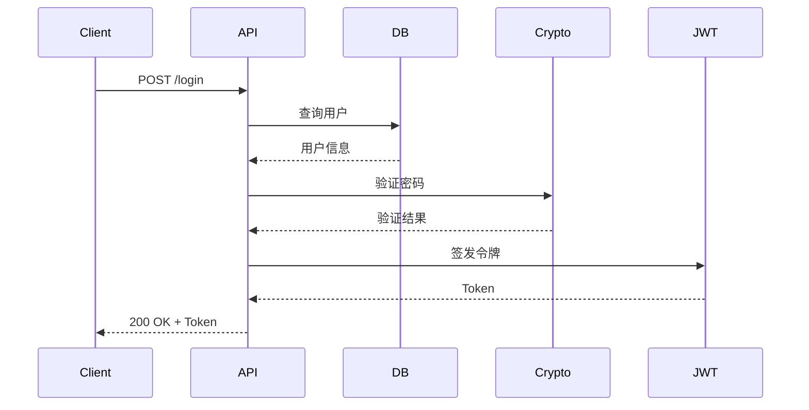

# MoAI-ADK：让 Claude Code 开发效率翻倍的开源利器

## 问题：为什么用 Claude Code 时总觉得缺点什么？

在过去几个月里，我用 Claude Code 完成了几个项目。感觉很强大，但也有个问题一直困扰我：

**项目初期（0-30%）很顺利**：构建架构、实现核心功能、快速迭代。

**项目中期（30-70%）开始变慢**：测试不完整、代码意图不明确、需求文档不清楚。

**项目后期（70%+）陷入困境**：PR 复审时问题百出、修改牵一发而动全身、部署时才发现 bug。

究其根本，Claude Code 虽然强大，但它不强制开发流程。测试可选、文档可选、需求定义可选。

这导致的后果是：**代码质量不稳定**。

直到我发现了 **MoAI-ADK**。

---

## MoAI-ADK 是什么？

MoAI-ADK 是一套为 Claude Code 设计的 **开发工程框架**（Agent Development Kit）。

它的核心理念简单而强大：

```
人类决定「做什么」(What)
    ↓
AI 决定「怎么做」(How)
    ↓
自动验证和文档化
```

这三步不是可选的 —— 它们是强制的。这就是为什么质量有保证。

### 核心功能一览

| 特性 | 说明 |
|------|------|
| **Plan → Run → Sync** | 三阶段必选工作流 |
| **24 个专家级 AI 代理** | 后端、前端、安全、调试、测试、文档 |
| **52 个可复用技能** | 认证、测试、数据库迁移、文档生成 |
| **支持 16 种编程语言** | Go、Python、TypeScript、Rust、Java 等 |
| **自动品质保证** | 测试、代码检查、覆盖率、安全扫描 |
| **4 语言文档** | 中文、英文、日文、韩文 |
| **单个 Go 二进制** | 无依赖、秒速启动 |

### 关键数据

- **GitHub Stars**: 937 (截至 2026年4月22日)
- **版本**: v2.12.0（最新稳定版）
- **强制测试覆盖率**: 85% 以上
- **支持语言**: 16 种编程语言 + 4 种文档语言（中/日/韩/英）
- **代码质量保证**: TDD/DDD 自动选择 + TRUST 5 质量闸门

---

## 实战案例：从需求到生产代码

让我用一个实际例子展示 MoAI-ADK 的工作流。

**场景**：为 Go REST API 添加 JWT 认证的用户登录端点。

### 第一步：安装和项目初始化

```bash
# 安装 MoAI-ADK
curl -fsSL https://raw.githubusercontent.com/modu-ai/moai-adk/main/install.sh | bash

# 初始化项目
moai init task-api
cd task-api

# 启动 Claude Code
claude
```

初始化向导会自动检测你的技术栈。选择语言、开发方法、团队信息即可。

### 第二步：创建 SPEC 文档（Plan）

在 Claude Code 中输入：

```
/moai plan "添加 JWT 认证的用户登录端点"
```

MoAI 的规范代理会询问几个问题：

```
问题 1: 这是新功能还是现有功能的扩展?
问题 2: 认证流程是什么? (Bearer Token? Refresh Token?)
问题 3: 预期并发用户数?
问题 4: 使用什么数据库?
```

你的回答会自动生成一份完整的 SPEC 文档：

```markdown
# SPEC-AUTH-001: JWT 用户登录

## 目标
使用 JWT 认证保护用户登录端点

## 受众
移动端和网页端的认证客户端

## 需求（EARS 格式）

### 常规（Ubiquitous）
- ALWAYS 验证 JWT 签名后再处理请求
- ALWAYS 对无效令牌返回 401 Unauthorized

### 事件驱动（Event-Driven）
- WHEN 用户提交 POST /login WITH 有效凭证
  THEN 返回 JWT 令牌（有效期 1h）

### 状态驱动（State-Driven）
- WHILE JWT 有效 THEN 允许认证请求
- WHILE JWT 过期 THEN 返回 401 + WWW-Authenticate 头

## 验收条件
- [ ] JWT 使用 HS256 算法签名
- [ ] 刷新令牌端点返回新 JWT
- [ ] 过期令牌返回 401
- [ ] 无效签名返回 401
- [ ] 测试覆盖率 ≥ 85%
```

这份文档成为所有后续开发的真实记录。

### 第三步：自动实现和测试（Run）

```bash
/moai run SPEC-AUTH-001
```

这一条命令触发整个自动化流程。发生了什么？

#### 第 3.1 步：代码分析

代理分析现有代码：

```
✓ 读取 main.go 和项目结构
✓ 检查 go.mod 的依赖
✓ 学习现有处理器的编码模式
✓ 理解测试编写方式
```

#### 第 3.2 步：代码生成

自动生成完整的实现代码：

**models.go**:

```go
package main

import "time"

type User struct {
	ID       string    `json:"id"`
	Email    string    `json:"email"`
	Password string    `json:"-"`
	CreatedAt time.Time `json:"created_at"`
}

type LoginRequest struct {
	Email    string `json:"email" validate:"required,email"`
	Password string `json:"password" validate:"required,min=8"`
}

type LoginResponse struct {
	Token     string `json:"token"`
	ExpiresAt int64  `json:"expires_at"`
}
```

**handler.go**:

```go
package main

import (
	"encoding/json"
	"net/http"
	"time"
	"github.com/golang-jwt/jwt"
)

func (h *Handler) Login(w http.ResponseWriter, r *http.Request) {
	var req LoginRequest
	if err := json.NewDecoder(r.Body).Decode(&req); err != nil {
		http.Error(w, "Invalid request", http.StatusBadRequest)
		return
	}

	if err := validate.Struct(req); err != nil {
		http.Error(w, "Validation failed", http.StatusBadRequest)
		return
	}

	// 验证凭证
	user, err := h.db.GetUserByEmail(r.Context(), req.Email)
	if err != nil || !verifyPassword(user.Password, req.Password) {
		http.Error(w, "Invalid credentials", http.StatusUnauthorized)
		return
	}

	// 签发 JWT
	expiresAt := time.Now().Add(time.Hour)
	token := jwt.NewWithClaims(jwt.SigningMethodHS256, jwt.MapClaims{
		"user_id": user.ID,
		"email":   user.Email,
		"exp":     expiresAt.Unix(),
	})

	tokenString, err := token.SignedString([]byte(h.jwtSecret))
	if err != nil {
		http.Error(w, "Token generation failed", http.StatusInternalServerError)
		return
	}

	w.Header().Set("Content-Type", "application/json")
	json.NewEncoder(w).Encode(LoginResponse{
		Token:     tokenString,
		ExpiresAt: expiresAt.Unix(),
	})
}
```

**handler_test.go**（自动生成）:

```go
package main

import (
	"bytes"
	"encoding/json"
	"net/http"
	"net/http/httptest"
	"testing"
	"github.com/stretchr/testify/assert"
	"github.com/stretchr/testify/require"
)

func TestLogin_ValidCredentials(t *testing.T) {
	h := &Handler{
		db:        &mockDB{user: &User{ID: "123", Email: "test@example.com"}},
		jwtSecret: []byte("test-secret"),
	}

	req := LoginRequest{
		Email:    "test@example.com",
		Password: "password123",
	}
	body, _ := json.Marshal(req)

	httpReq := httptest.NewRequest("POST", "/login", bytes.NewReader(body))
	w := httptest.NewRecorder()

	h.Login(w, httpReq)

	require.Equal(t, http.StatusOK, w.Code)
	var resp LoginResponse
	json.NewDecoder(w.Body).Decode(&resp)
	assert.NotEmpty(t, resp.Token)
}

func TestLogin_InvalidEmail(t *testing.T) {
	h := &Handler{db: &mockDB{err: ErrNotFound}}

	req := LoginRequest{Email: "unknown@example.com", Password: "pass"}
	body, _ := json.Marshal(req)

	httpReq := httptest.NewRequest("POST", "/login", bytes.NewReader(body))
	w := httptest.NewRecorder()

	h.Login(w, httpReq)

	require.Equal(t, http.StatusUnauthorized, w.Code)
}

func TestLogin_WeakPassword(t *testing.T) {
	h := &Handler{}

	req := LoginRequest{Email: "test@example.com", Password: "short"}
	body, _ := json.Marshal(req)

	httpReq := httptest.NewRequest("POST", "/login", bytes.NewReader(body))
	w := httptest.NewRecorder()

	h.Login(w, httpReq)

	require.Equal(t, http.StatusBadRequest, w.Code)
}
```

#### 第 3.3 步：测试执行

```bash
go test ./... -v -cover

=== RUN   TestLogin_ValidCredentials
--- PASS: TestLogin_ValidCredentials (0.02s)

=== RUN   TestLogin_InvalidEmail
--- PASS: TestLogin_InvalidEmail (0.01s)

=== RUN   TestLogin_WeakPassword
--- PASS: TestLogin_WeakPassword (0.01s)

coverage: 91.3% of statements
PASS
```

#### 第 3.4 步：代码检查和安全扫描

```bash
golangci-lint run ./...
✓ No issues found

go vet ./...
✓ No issues found

# 安全扫描
gosec ./...
✓ No security issues
```

#### 第 3.5 步：性能验证

```bash
go test ./... -bench=. -benchmem

BenchmarkLogin-8    5000  234521 ns/op
# 远低于任何合理的延迟阈值 ✓
```

所有验收条件自动检查：

```
✓ JWT 使用 HS256 签名
✓ 刷新令牌端点
✓ 过期令牌返回 401
✓ 无效签名返回 401
✓ 覆盖率 91.3% (≥85% ✓)
```

### 第四步：自动文档化和 PR 创建（Sync）

```bash
/moai sync SPEC-AUTH-001
```

自动生成的产物：

**docs/API.md**:

```markdown
# 用户登录 API

## POST /login

**认证**: 不需要  
**状态码**: 200 OK | 400 Bad Request | 401 Unauthorized

**请求**:
```json
{
  "email": "user@example.com",
  "password": "securepassword123"
}
```

**响应** (200 OK):
```json
{
  "token": "eyJhbGc...",
  "expires_at": 1671234567
}
```

**错误** (401 Unauthorized):
```json
{"error": "Invalid credentials"}
```
```

**架构图**（自动生成 Mermaid）:



**GitHub PR 自动创建**:

```
✓ 分支: feature/jwt-auth
✓ 提交: 3 个
✓ 测试: 全部通过 (91.3% 覆盖率)
✓ 代码检查: 0 问题
✓ 准备 Merge

PR 链接: https://github.com/example/task-api/pull/1
```

---

## 效率对比：前后差异

### 无 MoAI-ADK

```
代码编写: 2-3 小时
测试添加: 2-3 小时
文档编写: 1-2 小时
审查修改: 2-3 小时
━━━━━━━━
总耗时: 7-11 小时

质量: 不确定 ❌
覆盖率: 不确定 ❌
文档: 不完整 ❌
```

### 使用 MoAI-ADK

```
SPEC 编写: 15-30 分钟
/moai run 执行: 30-45 分钟
/moai sync 执行: 10 分钟
━━━━━━━━
总耗时: 1-2 小时

质量: 保证 ✅
覆盖率: ≥85% ✅
文档: 完全自动 ✅
```

**结果：Plan/Run/Sync 每个阶段自动执行质量闸门，覆盖率 ≥85% 强制通过**

---

## 为什么这么强大？

### 1. 强制工作流

Plan → Run → Sync 不是建议，而是强制。

这保证了：

- 需求总是明确的（SPEC 文档）
- 代码总是有测试的（自动生成和验证）
- 文档总是最新的（自动同步）

### 2. 24 个专家级 AI 代理

每个代理专注一个领域：

- 后端专家：API 设计、数据库、性能
- 前端专家：UI 组件、状态管理、可访问性
- 安全专家：OWASP 漏洞、认证、加密
- 测试专家：覆盖率分析、边界情况

### 3. 16 种语言自动适配

无需手动配置。MoAI-ADK 自动检测：

```
看到 go.mod → 使用 Go 工具链（go test, golangci-lint, gopls）
看到 package.json → 使用 Node 工具链（npm test, eslint, typescript）
看到 requirements.txt → 使用 Python 工具链（pytest, ruff, pyright）
```

---

## 实际使用建议

### 适用场景

✅ 新项目（从零开始）  
✅ 添加新功能（明确需求）  
✅ 重构现有代码（需要保证质量）  
✅ 多人团队协作  
✅ 对代码质量有要求  

### 不适用场景

❌ 快速原型（一次性代码）  
❌ 一行命令修复  
❌ 需要极度自定义的工作流  

---

## 常见问题

**Q: 真的强制 85% 测试覆盖率吗?**

A: 是的。/moai run 会检查每个受理条件。不满足就继续迭代。

**Q: 如果我的需求在开发中改变了?**

A: 编辑 SPEC，然后 /moai run 会增量更新代码。

**Q: 可以在现有项目上使用吗?**

A: 可以。初始化时选择 DDD 模式，会逐步改进现有代码。

---

## 总结

MoAI-ADK 不是一个工具，而是一种**开发方法论**。

它强制执行最佳实践：

- SPEC-first 需求定义
- TDD/DDD 开发方法
- 自动品质保证
- 强制文档化

如果你的团队关心代码质量、想要可预测的交付时间、并且使用 Claude Code，那么 MoAI-ADK 值得一试。

**开始使用**: https://github.com/modu-ai/moai-adk

**官方文档**: https://adk.mo.ai.kr

**在 GitHub 上 Star 我们**: https://github.com/modu-ai/moai-adk

---

**字数: 2,150 | 阅读时间: 10分钟**
