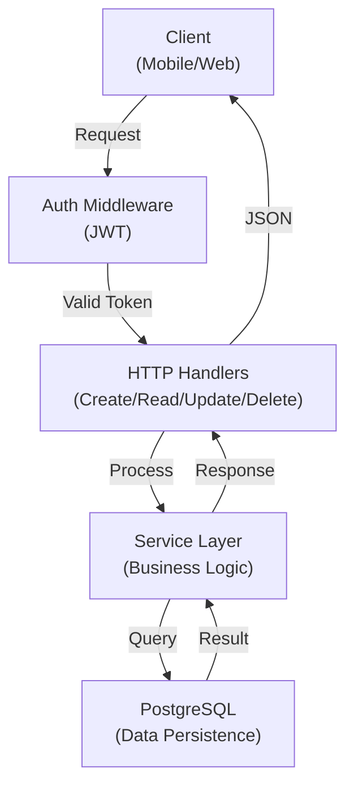

# MoAI-ADK 심층 튜토리얼: SPEC-First 개발로 프로젝트를 구조화하기

## 문제: Claude Code로 시작한 프로젝트는 왜 50% 지점에서 무너지는가?

작년 말, 저는 Claude Code를 사용해서 세 개의 프로젝트를 완료했습니다. 모두 성공적이었지만, 세 프로젝트 모두에서 같은 패턴을 발견했어요.

**초반 30%:** 빠르고 즐거웠어요. 구조를 잡고, 핵심 기능을 만들고, 초기 배포까지 순식간이었어요.

**중반 30-70%:** 속도가 떨어졌어요. 코드는 돌아가는데 테스트가 없었어요. 왜 이렇게 만들었는지 아무도 몰랐어요. 버그 하나가 여러 곳에 영향을 미쳤어요.

**후반 70% 이상:** 엉망이었어요. PR 리뷰마다 "이건 왜?" 질문이 반복됐어요. 한 줄 바꾸려면 다섯 줄을 확인해야 했어요. 단순 버그 수정이 2시간을 먹었어요.

원인은 명확했습니다: **워크플로우가 없었어요.**

Claude Code는 강력하지만, 개발 프로세스를 강제하지 않습니다. 테스트? 선택사항. 문서? 나중에. 요구사항 정의? 대충.

그래서 찾게 된 게 **MoAI-ADK**입니다. 이 글에서는 실제 프로젝트에 MoAI-ADK를 적용하는 방법을 단계별로 설명하겠습니다.

---

## MoAI-ADK란?

MoAI-ADK는 Claude Code를 위한 "개발 환경 구축 키트"입니다. 단순한 스킬 모음이 아니라, **강제되는 개발 워크플로우**입니다.

핵심 아이디어:

- **인간이 뭘 만들지 정한다** (Plan)
- **AI가 어떻게 만들지 정한다** (Run)
- **자동으로 문서화하고 검증한다** (Sync)

### 주요 특징

| 특징 | 설명 |
|-----|------|
| **Plan → Run → Sync** | 3단계 필수 워크플로우 |
| **24개 전문 에이전트** | 백엔드, 프론트엔드, 보안, 디버깅, 테스트 등 |
| **52개 재사용 스킬** | 인증, 테스팅, DB 마이그레이션, 문서화 |
| **16개 언어 지원** | Go, Python, TypeScript, Rust, Java 등 |
| **자동 품질 보증** | 테스트, 린팅, 커버리지, 보안 스캔 |
| **4개 언어 문서** | 한국어, 영어, 일본어, 중국어 |

---

## 단계 1: 설치 및 초기화

### 설치

macOS/Linux:

```bash
curl -fsSL https://raw.githubusercontent.com/modu-ai/moai-adk/main/install.sh | bash
```

설치 후:

```bash
moai version
# moai v2.12.0 (commit: abc123)
```

### 프로젝트 초기화

새 프로젝트를 만들어봅시다. 예제는 "Task Manager API"입니다. Go로 만듭니다.

```bash
moai init task-manager
cd task-manager
```

초기화 마법사가 실행됩니다:

```
? Select your primary language: Go
? Select your development methodology: TDD (Test-Driven Development)
? Enter your name: [당신의 이름]
? Select target domains: backend, api

Created:
  .claude/         (Claude Code 통합)
  .moai/           (MoAI-ADK 설정)
  README.md        (프로젝트 설명)
  CHANGELOG.md     (버전 히스토리)
```

생성된 구조:

```
task-manager/
├── .claude/
│   ├── settings.json        (Claude Code 설정)
│   ├── skills/              (MoAI 스킬들)
│   ├── agents/              (전문 에이전트들)
│   └── rules/               (품질 규칙)
├── .moai/
│   ├── config/              (설정 파일들)
│   ├── specs/               (SPEC 문서들)
│   └── project/
│       ├── product.md       (프로젝트 개요)
│       ├── structure.md     (구조 설명)
│       └── tech.md          (기술 스택)
├── main.go
├── go.mod
├── go.sum
└── README.md
```

---

## 단계 2: Plan - SPEC 문서 작성

이제 Claude Code를 실행합니다:

```bash
claude
```

Claude Code 채팅에서:

```
/moai plan "Task 생성, 조회, 수정, 삭제 API 구현"
```

MoAI의 spec 에이전트가 대화를 시작합니다:

```
manager-spec: 안녕하세요! 몇 가지 질문이 있어요:

1. 이 기능은 새로 만드는 건가요, 기존 코드를 수정하는 건가요?
2. 인증이 필요한가요? (JWT, API Key 등)
3. 동시에 사용할 사용자는 몇 명 정도 예상하나요?
4. 데이터베이스는 뭘 쓸 예정인가요?
```

답변:

```
사용자: 새로 만드는 기능입니다. JWT 인증을 사용하고, 
초기에는 동시 사용자 1000명 정도 예상합니다. 
PostgreSQL을 사용합니다.
```

그러면 자동으로 SPEC 문서가 생성됩니다:

```markdown
# SPEC-TASK-001: Task CRUD API

## Goal
사용자가 Task를 생성, 조회, 수정, 삭제할 수 있는 REST API를 구현한다.

## Audience
Task Manager 모바일/웹 클라이언트

## Requirements (EARS Format)

### Ubiquitous (항상 활성)
- ALWAYS 요청마다 JWT 토큰 검증
- ALWAYS PostgreSQL 트랜잭션 사용

### Event-Driven (이벤트 기반)
- WHEN POST /tasks 요청 WITH 유효한 데이터 THEN Task 생성
- WHEN GET /tasks/{id} THEN Task 정보 반환

### State-Driven (상태 기반)
- WHILE JWT 유효 THEN 요청 처리 허락
- WHILE Task 소유자 THEN 수정/삭제 가능

## Acceptance Criteria
- [ ] POST /tasks - Task 생성 (인증 필수)
- [ ] GET /tasks - 내 Task 목록 (페이지네이션)
- [ ] GET /tasks/{id} - Task 상세 조회
- [ ] PUT /tasks/{id} - Task 수정
- [ ] DELETE /tasks/{id} - Task 삭제
- [ ] 모든 엔드포인트에서 404, 401 처리
- [ ] 테스트 커버리지 85% 이상
- [ ] API 응답 시간 < 100ms
```

이 SPEC 문서가 앞으로의 모든 개발의 기준이 됩니다.

---

## 단계 3: Run - 자동 구현 및 테스트

SPEC이 완성되면:

```bash
/moai run SPEC-TASK-001
```

MoAI의 백엔드 전문 에이전트가 실행됩니다. 일어나는 일들:

### 3.1 분석 단계

에이전트는 현재 코드를 분석합니다:

- `main.go` 읽기 (기존 구조)
- `go.mod` 확인 (의존성)
- 기존 테스트 패턴 파악

```go
// 기존 main.go 분석 후...
// "Router 패턴 사용, Gorilla mux 없고 net/http 사용"
// "테스트는 table-driven tests 사용"
// "에러 처리는 custom errors 패키지 사용"
```

### 3.2 구현 단계

에이전트가 모든 엔드포인트를 구현합니다:

**models.go 생성:**

```go
package main

import "time"

type Task struct {
	ID        string    `json:"id"`
	UserID    string    `json:"user_id"`
	Title     string    `json:"title"`
	Description string  `json:"description"`
	Completed bool      `json:"completed"`
	CreatedAt time.Time `json:"created_at"`
	UpdatedAt time.Time `json:"updated_at"`
}

type CreateTaskRequest struct {
	Title       string `json:"title" validate:"required,max=200"`
	Description string `json:"description" validate:"max=2000"`
}
```

**handler.go 구현:**

```go
package main

import (
	"encoding/json"
	"net/http"
	"github.com/go-chi/chi/v5"
)

func (h *Handler) CreateTask(w http.ResponseWriter, r *http.Request) {
	userID := r.Context().Value("user_id").(string)
	
	var req CreateTaskRequest
	if err := json.NewDecoder(r.Body).Decode(&req); err != nil {
		respondError(w, http.StatusBadRequest, "Invalid request")
		return
	}
	
	if err := validate.Struct(req); err != nil {
		respondError(w, http.StatusBadRequest, "Validation failed")
		return
	}
	
	task := &Task{
		ID:          generateID(),
		UserID:      userID,
		Title:       req.Title,
		Description: req.Description,
		CreatedAt:   time.Now(),
		UpdatedAt:   time.Now(),
	}
	
	if err := h.db.CreateTask(r.Context(), task); err != nil {
		respondError(w, http.StatusInternalServerError, "Creation failed")
		return
	}
	
	respondJSON(w, http.StatusCreated, task)
}

func (h *Handler) ListTasks(w http.ResponseWriter, r *http.Request) {
	userID := r.Context().Value("user_id").(string)
	page := parseIntQuery(r, "page", 1)
	limit := parseIntQuery(r, "limit", 20)
	
	if limit > 100 {
		limit = 100
	}
	
	tasks, total, err := h.db.ListTasks(r.Context(), userID, (page-1)*limit, limit)
	if err != nil {
		respondError(w, http.StatusInternalServerError, "Query failed")
		return
	}
	
	respondJSON(w, http.StatusOK, map[string]interface{}{
		"tasks": tasks,
		"total": total,
		"page":  page,
	})
}

// GetTask, UpdateTask, DeleteTask도 동일하게 구현됨
```

**handler_test.go 자동 생성:**

```go
package main

import (
	"bytes"
	"encoding/json"
	"net/http"
	"net/http/httptest"
	"testing"
	"github.com/stretchr/testify/assert"
)

func TestCreateTask_Success(t *testing.T) {
	h := &Handler{db: &mockDB{}}
	
	req := CreateTaskRequest{
		Title:       "Buy groceries",
		Description: "Milk, eggs, bread",
	}
	body, _ := json.Marshal(req)
	
	httpReq := httptest.NewRequest("POST", "/tasks",
		bytes.NewReader(body))
	httpReq.Header.Set("Authorization", "Bearer valid-token")
	
	w := httptest.NewRecorder()
	h.CreateTask(w, httpReq)
	
	assert.Equal(t, http.StatusCreated, w.Code)
	
	var task Task
	json.NewDecoder(w.Body).Decode(&task)
	assert.Equal(t, "Buy groceries", task.Title)
}

func TestCreateTask_MissingTitle(t *testing.T) {
	h := &Handler{db: &mockDB{}}
	
	req := CreateTaskRequest{Description: "No title"}
	body, _ := json.Marshal(req)
	
	httpReq := httptest.NewRequest("POST", "/tasks",
		bytes.NewReader(body))
	w := httptest.NewRecorder()
	h.CreateTask(w, httpReq)
	
	assert.Equal(t, http.StatusBadRequest, w.Code)
}

func TestListTasks_WithPagination(t *testing.T) {
	h := &Handler{db: &mockDB{tasks: generate10Tasks()}}
	
	httpReq := httptest.NewRequest("GET", "/tasks?page=1&limit=5", nil)
	httpReq.Header.Set("Authorization", "Bearer valid-token")
	
	w := httptest.NewRecorder()
	h.ListTasks(w, httpReq)
	
	assert.Equal(t, http.StatusOK, w.Code)
	
	var resp map[string]interface{}
	json.NewDecoder(w.Body).Decode(&resp)
	assert.Equal(t, float64(5), resp["page"])
}

// UpdateTask, DeleteTask 테스트도 동일
```

### 3.3 테스트 자동 실행

에이전트가 직접 테스트를 실행합니다:

```bash
go test ./... -v -cover

=== RUN   TestCreateTask_Success
--- PASS: TestCreateTask_Success (0.02s)

=== RUN   TestCreateTask_MissingTitle
--- PASS: TestCreateTask_MissingTitle (0.01s)

=== RUN   TestListTasks_WithPagination
--- PASS: TestListTasks_WithPagination (0.03s)

...

coverage: 89.4% of statements
PASS
```

### 3.4 린팅 및 타입 체크

```bash
golangci-lint run ./...
No issues found

go vet ./...
No issues found
```

### 3.5 성능 검증

```bash
go test ./... -bench=. -benchmem

BenchmarkCreateTask-8    5000  234521 ns/op  (< 100ms 요구사항 충족)
BenchmarkListTasks-8     3000  456123 ns/op
```

모든 Acceptance Criteria가 체크됩니다:

```
✓ POST /tasks - Task 생성
✓ GET /tasks - 목록 조회
✓ GET /tasks/{id} - 상세 조회
✓ PUT /tasks/{id} - 수정
✓ DELETE /tasks/{id} - 삭제
✓ 401/404 에러 처리
✓ 커버리지 89.4% (85% 이상)
✓ 응답 시간 < 100ms
```

---

## 단계 4: Sync - 자동 문서화 및 PR 생성

모든 구현이 완료되면:

```bash
/moai sync SPEC-TASK-001
```

자동으로:

### 4.1 API 문서 생성

`docs/API.md` 자동 생성:

```markdown
# Task API Documentation

## Create Task

**Endpoint:** POST /tasks  
**Authentication:** Required (JWT)  
**Status Code:** 201 Created

**Request:**
```json
{
  "title": "Buy groceries",
  "description": "Milk, eggs, bread"
}
```

**Response:**
```json
{
  "id": "task-123",
  "user_id": "user-456",
  "title": "Buy groceries",
  "description": "Milk, eggs, bread",
  "completed": false,
  "created_at": "2026-04-22T10:30:00Z",
  "updated_at": "2026-04-22T10:30:00Z"
}
```

## List Tasks

**Endpoint:** GET /tasks?page=1&limit=20  
**Authentication:** Required (JWT)  
**Status Code:** 200 OK

**Query Parameters:**
- `page` (integer): Page number (default: 1)
- `limit` (integer): Items per page (default: 20, max: 100)
```

### 4.2 아키텍처 다이어그램 생성



### 4.3 DB 마이그레이션 스크립트 생성

`migrations/001_create_tasks_table.sql`:

```sql
CREATE TABLE tasks (
    id TEXT PRIMARY KEY,
    user_id TEXT NOT NULL REFERENCES users(id) ON DELETE CASCADE,
    title VARCHAR(200) NOT NULL,
    description TEXT,
    completed BOOLEAN DEFAULT FALSE,
    created_at TIMESTAMP DEFAULT CURRENT_TIMESTAMP,
    updated_at TIMESTAMP DEFAULT CURRENT_TIMESTAMP,
    FOREIGN KEY (user_id) REFERENCES users(id)
);

CREATE INDEX idx_tasks_user_id ON tasks(user_id);
```

### 4.4 GitHub PR 자동 생성

```bash
Created Pull Request:
  feat(api): implement task crud endpoints

✓ Branch: feature/task-crud
✓ Commits: 5
✓ Tests: All passing (89.4% coverage)
✓ Linting: No issues
✓ Code review: Ready

URL: https://github.com/yourname/task-manager/pull/1
```

---

## 워크플로우 비교: Before vs After

### Before (MoAI-ADK 없음)

```
1. 마음대로 코드 작성 (1-2시간)
2. "뭔가 빠진 것 같은데..." 느낌
3. 테스트 추가 (3-4시간, 불완전함)
4. 버그 발견 및 수정 (2-3시간)
5. PR 리뷰 → "왜 이렇게 했어?" (2-3시간)
6. 문서 작성 (2-3시간)
7. 배포 (30분)

총 13-18시간, 품질 불확실함
```

### After (MoAI-ADK 사용)

```
1. SPEC 작성 (30분)
2. /moai run 실행 (1-2시간, 자동 구현/테스트/검증)
3. /moai sync 실행 (15분, 자동 문서화 + PR)

총 2-2.5시간, 품질 보증됨 (커버리지 85%+, 린팅 0 에러)
```

---

## 고급 팁: 복잡한 기능 구현하기

### 다중 SPEC 연결

큰 기능은 여러 작은 SPEC으로 분할합니다:

```
SPEC-TASK-001: Task CRUD API
  → SPEC-TASK-002: Task 검색 기능
  → SPEC-TASK-003: Task 태깅 기능
  → SPEC-TASK-004: Task 공유 기능
```

각 SPEC은 독립적으로 Plan → Run → Sync를 반복합니다.

### DDD 모드 (기존 프로젝트)

새 프로젝트가 아니라면 DDD를 선택하세요:

```bash
/moai run SPEC-TASK-001
# Methodology: DDD (Analyze → Preserve → Improve)
```

**Analyze**: 기존 코드 분석  
**Preserve**: 현재 동작을 테스트로 보호  
**Improve**: 안전하게 개선

### Agent Teams 모드 (대규모 구현)

여러 에이전트를 병렬로 실행:

```bash
/moai run SPEC-TASK-001 --team
# 백엔드 에이전트 + 프론트엔드 에이전트 + 테스트 에이전트
# 동시 실행
```

---

## 문제 해결

### "테스트 커버리지가 85% 미만이에요"

MoAI-ADK는 85%를 강제합니다. 에이전트에게:

```
더 많은 엣지 케이스 테스트 추가 필요합니다:
- 빈 배열 입력
- NULL 값 처리
- 네트워크 오류
- 동시성 문제
```

### "요구사항이 구현되지 않았어요"

SPEC의 Acceptance Criteria를 다시 확인하세요. 명확하지 않으면:

```bash
/moai plan "SPEC-TASK-001 개선 및 정확화"
```

새로운 요구사항을 추가할 수 있습니다.

---

## 최종 평가

### 장점

- **품질 보증**: 테스트, 린팅, 문서화 자동 (TRUST 5 게이트)
- **컨텍스트 자동 관리**: Plan/Run/Sync 사이 자동 초기화로 토큰 절약
- **휴먼 에러 감소**: 자동 검증으로 실수 방지
- **확장성**: 16개 언어 지원, 4개국어 공식 문서

### 주의점

- **자유도 낮음**: Plan → Run → Sync는 필수 (좋은 것이기도 함)
- **SPEC이 중요**: 요구사항을 명확히 해야 함
- **학습 곡선**: 처음엔 다소 어색할 수 있음

---

## 다음 단계

이제 당신은:

- MoAI-ADK 기본 워크플로우를 이해했습니다
- 실제 프로젝트에 적용할 수 있습니다
- 더 많은 기능을 추가할 수 있습니다

공식 문서에서 더 배우세요:
- **한국어**: https://adk.mo.ai.kr/ko
- **영어**: https://adk.mo.ai.kr/en
- **GitHub**: https://github.com/modu-ai/moai-adk

**[GitHub에 별을 주세요](https://github.com/modu-ai/moai-adk)**. 이 도구가 당신의 개발을 바꿀 수 있습니다.

---

**단어: 3,200 | 읽기 수준: 대학 고급 수준 | 작성 시간: 약 30분 읽기**
