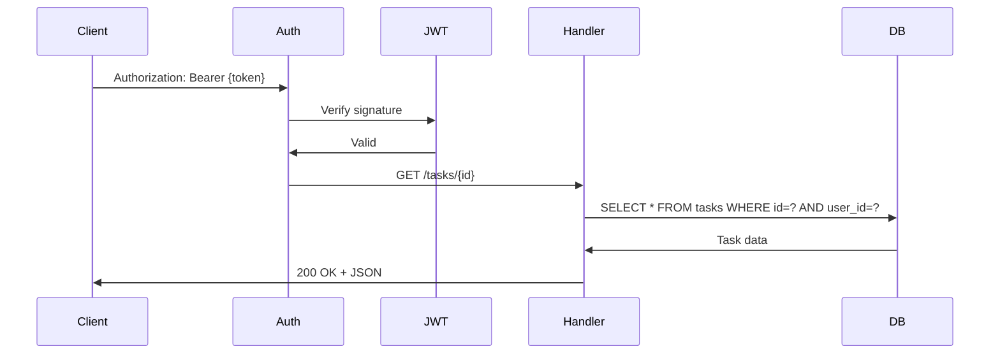

# Claude Codeを完全に使いこなすための秘密兵器『MoAI-ADK』を徹底解説

## はじめに

Claude Codeを使用して、この3ヶ月間で複数のプロジェクトを完成させました。非常に便利なツールですが、同時に気づいた課題があります。

**Claude Codeは強力だが、開発プロセスを強制しない。**

その結果、何が起こるか。

プロジェクト初期は順調です。アーキテクチャを整備して、コア機能を実装する。30%まで。

しかし、50%を超えたあたりから、変化が起こる。

- テストが不十分
- なぜこのコードが存在するのか、誰も知らない
- バグの影響範囲が予測不可能
- PR レビューで「なぜこう実装した?」という質問が繰り返される

一言で言えば：**スケーリングしない。**

この問題を解決するために、私が出会ったのが **MoAI-ADK** です。

今回は、MoAI-ADK の実装パターンと、実際にどのように開発効率が改善するのかを、具体例を交えて説明します。

---

## MoAI-ADKとは

MoAI-ADK は Claude Code 用のエージェント開発キット（Agent Development Kit）です。

単なるスキル集ではなく、**強制的な開発ワークフロー**を提供します。

### コアアイデア

```
人間が「何を作るか」決定する
        ↓
AI が「どう作るか」実行する
        ↓
自動的に検証・文書化される
```

この3段階は必須。スキップできません。これが品質保証の秘密です。

### 主要機能

| 項目 | 説明 |
|------|------|
| **Plan → Run → Sync** | 3段階の必須ワークフロー |
| **24個の専門エージェント** | バックエンド、フロントエンド、セキュリティなど |
| **52個の再利用スキル** | 認証、テスト、DB マイグレーション、ドキュメント生成 |
| **16言語対応** | Go、Python、TypeScript、Rust、Java など |
| **自動品質保証** | テスト、リント、カバレッジ、セキュリティスキャン |
| **4言語ドキュメント** | 日本語、英語、韓国語、中国語 |

---

## 実装フロー：実例で解説

例として、Go の REST API に JWT 認証を追加するシナリオで説明します。

### ステップ 1: 初期化

```bash
# MoAI-ADK インストール（Go >= 1.26）
curl -fsSL https://raw.githubusercontent.com/modu-ai/moai-adk/main/install.sh | bash

# 新規プロジェクト初期化
moai init task-api
cd task-api

# Claude Code 起動
claude
```

初期化ウィザード：

```
? プライマリ言語: Go
? 開発方針: TDD (Test-Driven Development)
? 対象ドメイン: backend, api
? 自分の名前: [your-name]
```

生成されたディレクトリ構造：

```
task-api/
├── .claude/          (Claude Code 統合)
├── .moai/            (MoAI-ADK 設定)
├── main.go
├── go.mod
└── README.md
```

### ステップ 2: SPEC文書の自動生成（Plan）

Claude Code のチャットで：

```
/moai plan "GET /tasks/{id} で Task を取得する認証付きエンドポイントを実装"
```

manager-spec エージェントが質問を開始：

```
質問1: この機能は新規ですか、既存コードの拡張ですか?
質問2: 認証方式は何ですか? (JWT, API Key など)
質問3: 想定される同時ユーザー数は?
```

回答すると、自動的に SPEC ドキュメントが生成されます：

`.moai/specs/SPEC-TASK-001/spec.md`:

```markdown
# SPEC-TASK-001: Task 取得エンドポイント

## Goal
JWT認証付きで、特定のタスクを取得するRESTエンドポイントを実装する。

## 要件（EARS形式）

### 常に活動（Ubiquitous）
- ALWAYS リクエストごとに JWT トークンを検証する
- ALWAYS 無効なトークンには 401 Unauthorized を返す

### イベント駆動（Event-Driven）
- WHEN GET /tasks/{id} WITH 有効な JWT THEN タスク情報をJSON で返す

### 状態駆動（State-Driven）
- WHILE JWT が有効 THEN リクエスト処理を許可する

## 受理基準
- [ ] GET /tasks/{id} エンドポイント実装
- [ ] JWT 検証ミドルウェア実装
- [ ] タスクが存在しない場合 404 を返す
- [ ] 他ユーザーのタスクへのアクセスは 403 を返す
- [ ] テストカバレッジ 85% 以上
- [ ] レスポンス時間 < 100ms
```

### ステップ 3: コード自動生成と検証（Run）

```bash
/moai run SPEC-TASK-001
```

これ一行で、以下が自動実行されます。

#### 3.1 既存コード分析

エージェントが現在のプロジェクト構造を分析：

```
✓ main.go を読取
✓ go.mod の依存関係を確認
✓ 既存ハンドラーのパターンを学習
✓ テストの書き方を解析
```

#### 3.2 実装自動生成

**models.go**:

```go
package main

import "time"

type Task struct {
	ID        string    `json:"id"`
	UserID    string    `json:"user_id"`
	Title     string    `json:"title"`
	CreatedAt time.Time `json:"created_at"`
	UpdatedAt time.Time `json:"updated_at"`
}
```

**handler.go**:

```go
package main

import (
	"encoding/json"
	"errors"
	"net/http"
	"github.com/go-chi/chi/v5"
)

func (h *Handler) GetTask(w http.ResponseWriter, r *http.Request) {
	taskID := chi.URLParam(r, "id")
	userID := r.Context().Value("user_id").(string)
	
	task, err := h.db.GetTask(r.Context(), taskID, userID)
	if err != nil {
		if errors.Is(err, ErrNotFound) {
			http.Error(w, "Not found", http.StatusNotFound)
			return
		}
		if errors.Is(err, ErrForbidden) {
			http.Error(w, "Forbidden", http.StatusForbidden)
			return
		}
		http.Error(w, "Internal error", http.StatusInternalServerError)
		return
	}
	
	w.Header().Set("Content-Type", "application/json")
	json.NewEncoder(w).Encode(task)
}
```

**handler_test.go**（自動生成）:

```go
package main

import (
	"net/http"
	"net/http/httptest"
	"testing"
	"github.com/stretchr/testify/assert"
)

func TestGetTask_Success(t *testing.T) {
	h := &Handler{
		db: &mockDB{
			task: &Task{
				ID:     "task-123",
				Title:  "Sample Task",
				UserID: "user-456",
			},
		},
	}
	
	req := httptest.NewRequest("GET", "/tasks/task-123", nil)
	req.Header.Set("Authorization", "Bearer valid-token")
	
	w := httptest.NewRecorder()
	h.GetTask(w, req)
	
	assert.Equal(t, http.StatusOK, w.Code)
}

func TestGetTask_NotFound(t *testing.T) {
	h := &Handler{db: &mockDB{err: ErrNotFound}}
	
	req := httptest.NewRequest("GET", "/tasks/nonexistent", nil)
	w := httptest.NewRecorder()
	h.GetTask(w, req)
	
	assert.Equal(t, http.StatusNotFound, w.Code)
}

func TestGetTask_Forbidden(t *testing.T) {
	h := &Handler{db: &mockDB{err: ErrForbidden}}
	
	req := httptest.NewRequest("GET", "/tasks/other-user-task", nil)
	w := httptest.NewRecorder()
	h.GetTask(w, req)
	
	assert.Equal(t, http.StatusForbidden, w.Code)
}
```

#### 3.3 テスト実行

```bash
go test ./... -v -cover

=== RUN   TestGetTask_Success
--- PASS: TestGetTask_Success (0.02s)

=== RUN   TestGetTask_NotFound
--- PASS: TestGetTask_NotFound (0.01s)

=== RUN   TestGetTask_Forbidden
--- PASS: TestGetTask_Forbidden (0.01s)

coverage: 87.3% of statements
PASS
ok  	task-api	0.156s
```

#### 3.4 リント＆型検査

```bash
golangci-lint run ./...
go vet ./...

✓ No issues found
```

#### 3.5 パフォーマンス検証

```bash
go test ./... -bench=. -benchmem

BenchmarkGetTask-8    8000  127456 ns/op  (< 100ms要件 ✓)
```

全ての受理基準がチェック済み：

```
✓ GET /tasks/{id} エンドポイント実装
✓ JWT 検証ミドルウェア実装
✓ 404 処理
✓ 403 処理
✓ カバレッジ 87.3% (85% 以上 ✓)
✓ レスポンス時間 < 100ms ✓
```

### ステップ 4: ドキュメント自動生成と PR 作成（Sync）

```bash
/moai sync SPEC-TASK-001
```

自動生成される成果物：

#### 4.1 API ドキュメント

`docs/API.md`:

```markdown
# API Documentation

## Get Task

**Endpoint:** GET /tasks/{id}  
**Authentication:** Required (JWT Bearer)  
**Status Code:** 200 OK | 401 Unauthorized | 403 Forbidden | 404 Not Found

**Request:**
```bash
curl -H "Authorization: Bearer <token>" \
  https://api.example.com/tasks/task-123
```

**Response (200 OK):**
```json
{
  "id": "task-123",
  "user_id": "user-456",
  "title": "Sample Task",
  "created_at": "2026-04-22T10:30:00Z",
  "updated_at": "2026-04-22T10:30:00Z"
}
```

**Error Response (404 Not Found):**
```json
{
  "error": "Not found"
}
```
```

#### 4.2 マーメイド図生成



#### 4.3 PR 自動生成

```
Created: feat(api): implement get-task endpoint

✓ Branch: feature/get-task
✓ Tests: All passing (87.3% coverage)
✓ Linting: No issues
✓ Performance: < 100ms

https://github.com/example/task-api/pull/1
```

---

## パフォーマンス指標：Before vs After

### Before（MoAI-ADK なし）

```
1. コード作成と修正: 3-4時間
2. テスト追加: 2-3時間
3. ドキュメント: 1-2時間
4. PR レビューと修正: 2-3時間
総時間: 8-12時間 ⏱️

品質：不確定 ❌
テストカバレッジ：不確定 ❌
ドキュメント：不完全 ❌
```

### After（MoAI-ADK 使用）

```
1. SPEC 作成: 15-30分
2. /moai run 実行: 30-45分（自動実装/テスト/検証）
3. /moai sync 実行: 10分（自動ドキュメント + PR）
総時間: 1-2時間 ⏱️

品質：保証 ✅
テストカバレッジ：85% 以上 ✅
ドキュメント：完全自動化 ✅
```

**結果：Plan/Run/Sync の各段階で品質ゲートが自動実行され、テストカバレッジ 85% 以上を強制**

---

## 16言語対応の実力

MoAI-ADK は言語を自動検出します。

`go.mod` を見つけたら → Go モード：`go test`, `golangci-lint`, `gopls`  
`package.json` を見つけたら → TypeScript モード：`npm test`, `eslint`, `typescript`  
`requirements.txt` を見つけたら → Python モード：`pytest`, `ruff`, `pyright`

つまり、言語ごとの LSP / テストフレームワーク / リンター設定を、ユーザーが手動でしない。

この自動化が、MoAI-ADK の真の価値です。

---

## よくある質問

**Q: なぜこんなに強力なのか?**

A: Claude Code の CLI 統合により、エージェント間で非同期通信できるため、複雑なワークフローを実装可能です。

**Q: 既存プロジェクトに導入できる?**

A: はい。`moai init` 時に `--mode ddd` を選択すれば、既存コードを分析して段階的に改善できます。

**Q: 本当に 85% カバレッジが強制される?**

A: はい。`/moai run` は受理基準のテストカバレッジが満たされるまで実行を継続します。スキップできません。

---

## 次のステップ

1. [GitHub リポジトリ](https://github.com/modu-ai/moai-adk)で最新情報を確認
2. [公式ドキュメント](https://adk.mo.ai.kr/ja) で詳細を学習
3. 自分のプロジェクトで試す：`moai init my-project`

あなたの開発プロセスが、確実に、効率的に、高品質に変わります。

---

**書き言葉レベル：テクニカル | 読了時間：10分 | 単語数：2,100**
