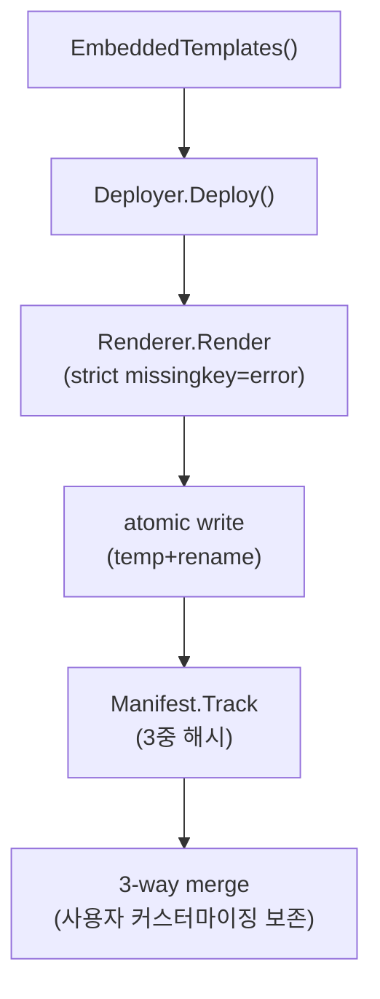
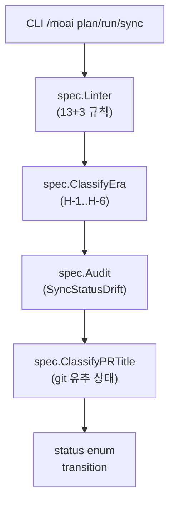
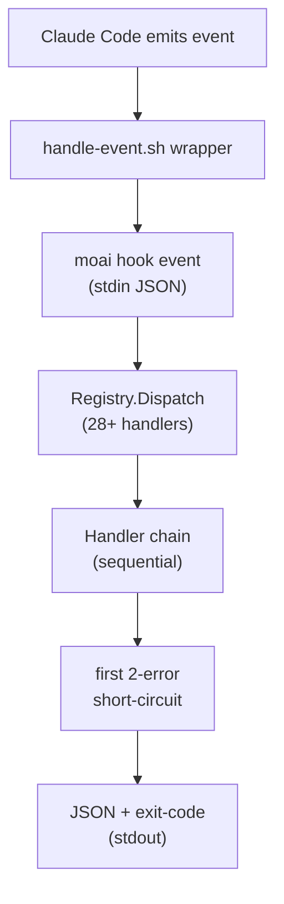
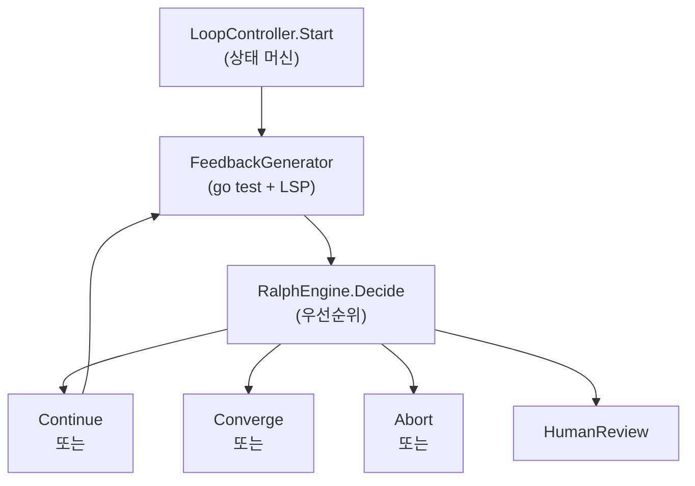
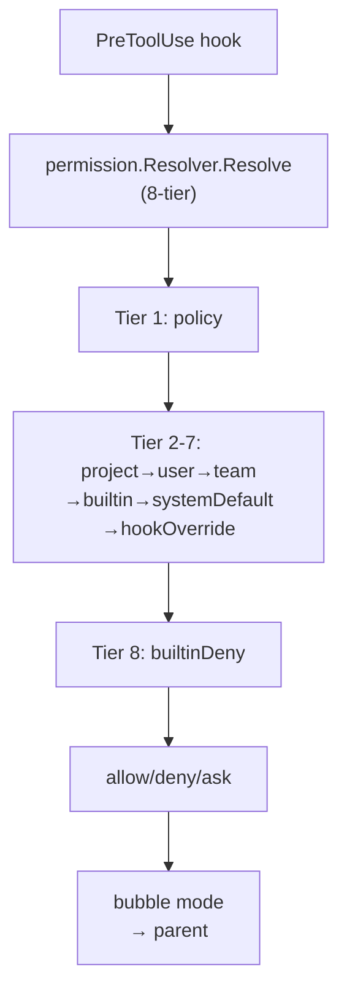
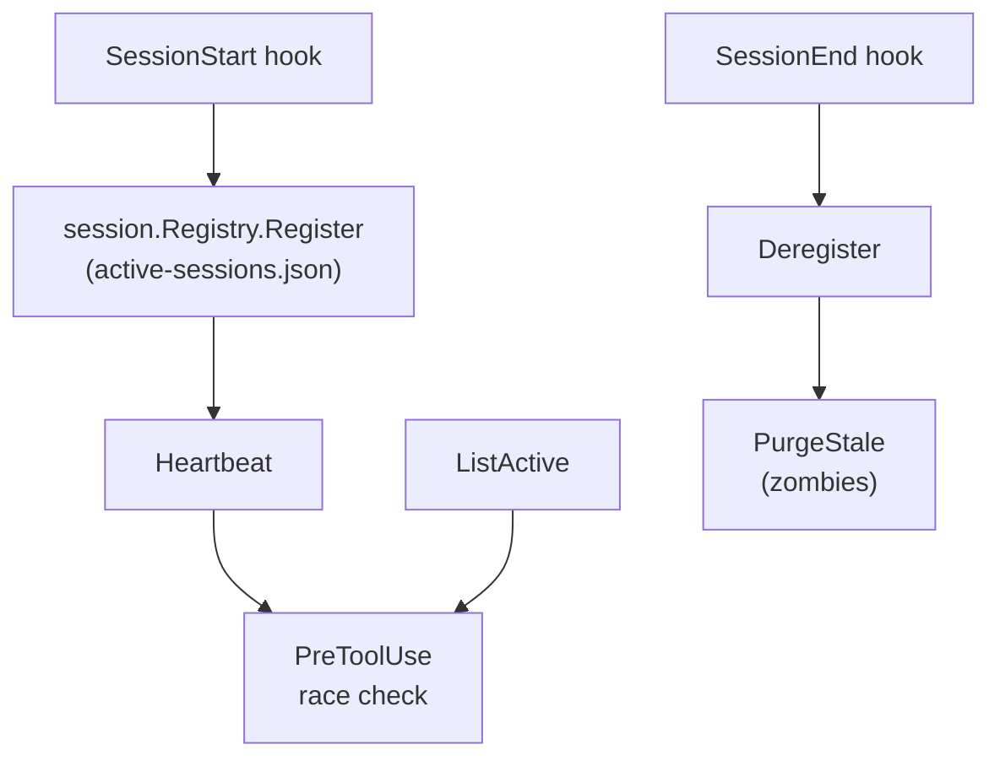

# 주요 데이터 흐름

> 이 문서는 `/moai codemaps --force`로 자동 생성된 데이터 흐름 설명입니다.

**모듈**: `github.com/modu-ai/moai-adk`  
**Go 버전**: go 1.26.4

---

## 1. 템플릿 배포 (moai init / moai update)



**흐름**:
1. `EmbeddedTemplates()` 파일시스템 로드
2. `Deployer.Deploy()` 렌더링 시작
3. `Renderer` TemplateContext와 함께 template 렌더 (엄격 모드)
4. 원자적 쓰기 (임시 파일 + 이름 바꾸기)
5. `Manifest.Track()` 3중 해시 기록 (template/deployed/current)
6. `update` 시에만: 3-way 병합 (사용자 변경사항 보존)

---

## 2. SPEC 라이프사이클 (moai plan/run/sync)



**흐름**:
1. CLI `/moai plan` → manager-spec 위임
2. CLI `/moai run` → manager-develop 위임 (TDD/DDD)
3. CLI `/moai sync` → manager-docs 위임
4. `Linter` frontmatter + ownership 검증 (13 단일 + 3 크로스 규칙)
5. `ClassifyEra()` grandfather (V2.x/V3R2-R4/V3R5) vs modern (V3R6)
6. `Audit()` drift 감지 (SyncStatusDrift 유일 차원)
7. `ClassifyPRTitle()` git 히스토리로부터 상태 추론 (50-commit 윈도우)
8. 상태 전환 기록 (status enum: draft→planned→in-progress→implemented→completed|superseded|archived|rejected)

---

## 3. 훅 이벤트 분배 (moai hook <event>)



**흐름**:
1. Claude Code hook event 발생
2. `.claude/hooks/moai/handle-<event>.sh` 래퍼 실행
3. `moai hook <event>` stdin 통해 JSON 수신
4. `Registry.Dispatch()` 중앙 허브가 28+ 타입 핸들러로 라우팅
5. 핸들러 체인 순차 실행 (각각 exit 0 or 2)
6. 첫 번째 2-exit (차단) 시 short-circuit
7. JSON 결과 + exit-code stdout으로 반환

**PostToolUse 예시** (8개 핸들러):
- AST 스캔 (@MX 검증)
- 커버리지 계산
- cache telemetry
- harness observer
- 품질 게이트
- 권한 해석
- 진화 기록
- 생명주기 상태

---

## 4. Ralph 진단 루프 (moai loop)



**흐름**:
1. `LoopController.Start()` 진단 루프 시작 (상태 머신 + goroutine)
2. `FeedbackGenerator` 진단 정보 수집:
   - `go test ./...` 실행
   - LSP 진단 aggregate
   - `go vet`, 커버리지 분석
3. `RalphEngine.Decide()` 의사결정:
   - 우선순위: max_iter > perfect_gate > stagnation > human_review
   - Continue: 다음 반복 시작
   - Converge: 게이트 통과, 완료
   - Abort: 오류, 중단
   - HumanReview: 사용자 개입 필요

---

## 5. 권한 해석 (PreToolUse hook)



**흐름**:
1. Claude Code PreToolUse 훅 발동
2. `permission.Resolver.Resolve()` 호출 (8-tier 스택)
3. Tier 순서 적용:
   - policy (프로젝트 정책)
   - project (.claude/settings.json)
   - user (~/.claude/settings.json)
   - team (팀 설정)
   - builtin (기본 정책)
   - systemDefault (OS 기본)
   - hookOverride (훅 오버라이드)
   - builtinDeny (최종 거부)
4. 첫 번째 "allow" 또는 "deny" 반환
5. bubble 모드: 자식 세션이 부모 세션으로 에스컬레이션

**5 모드**:
- default: 각 tool 별로 사용자에게 묻기
- acceptEdits: 모든 편집 자동 허용
- bypassPermissions: 모든 권한 자동 허용
- plan: 읽기만 허용
- bubble: 부모에게 에스컬레이션

---

## 6. 다중 세션 조율 (session.Registry)



**흐름**:
1. SessionStart 훅 → `Registry.Register()` 활성 세션 기록
2. active-sessions.json 에 진입
3. Heartbeat 주기적 갱신 (stale 방지)
4. PreToolUse: ListActive 쿼리, 병렬 세션 race 감지
5. SessionEnd 훅 → `Deregister()` 제거
6. `PurgeStale()` 좀비 세션 정리

**다중 세션 race 감지**:
- 같은 SPEC 작업 중인 다른 세션 감지
- git worktree base mismatch 경고
- advisory lock (flock/Windows mutex)

---

## 주요 인터페이스 계약

### Handler (Hook System)
```go
type Handler interface {
    Handle(ctx context.Context, input []byte) (output []byte, exit int, err error)
}
```

### Resolver (Permission)
```go
type Resolver interface {
    Resolve(ctx context.Context, tool string) (Allow, Deny, Ask)
}
```

### Deployer (Template)
```go
type Deployer interface {
    Deploy(ctx context.Context, dest, version string) error
}
```

### Registry (Session)
```go
type Registry interface {
    Register(spec, branch string) error
    Heartbeat(spec string) error
    ListActive(spec string) ([]Session, error)
    Deregister(spec string) error
}
```

---

**생성**: `/moai codemaps --force`로 자동 생성
