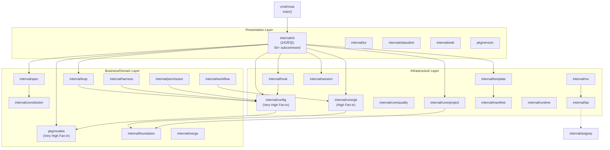

# 패키지 의존도 분석

> 이 문서는 `/moai codemaps --force`로 자동 생성된 의존도 그래프입니다.

**모듈**: `github.com/modu-ai/moai-adk`  
**Go 버전**: go 1.26.4

---

## 의존도 그래프 (Mermaid)

---

## 팬-인 분석 (Very High)

| 패키지 | 팬-인 수준 | 이유 |
|--------|----------|------|
| `pkg/models` | 45+ | Config 타입 중심 |
| `internal/config` | 48+ | CLI composition에서 모든 패키지에 주입 |
| `internal/cli` | (50+ import) | Composition root |
| `internal/core/git` | 35+ | workflow/spec/session 필수 |
| `pkg/version` | 30+ | 버전 출력 (CLI/help) |
| `internal/foundation` | 32+ | 언어 registry (모든 도메인) |

---

## 계층 간 의존도

**Presentation → Business → Infrastructure**

- `cli` → 모든 business 계층 + infrastructure
- `config` → models, defs (핵심 주입)
- `hook` → config, lsp, session, mx
- `coreGit` → foundation

---

## 순환 의존성 검증

**결과**: 0개 순환 의존성 (검증됨)

---

**생성**: `/moai codemaps --force`로 자동 생성
