# moai-adk-go: Architecture Overview

> Refreshed for v3.0.0-rc2 by SPEC-V3R6-DOCS-CODEMAPS-V3-001 M1.

## Project Identity

| Attribute | Value |
|-----------|-------|
| Module | `github.com/modu-ai/moai-adk` |
| Language | Go 1.26.4 |
| Binary | `moai` |
| Entry Point | `cmd/moai/main.go` |
| Internal Packages | 48 |
| Agent Catalog | 8 retained (7 MoAI-custom + 1 Anthropic built-in `Explore`) |

**Purpose**: moai-adk-go is the Strategic Orchestrator for Claude Code. It provides a single Go binary (`moai`) plus an embedded template filesystem of Claude Code assets (agents, skills, commands, rules, hooks) that together drive agentic development workflows: project initialization, template deployment, Claude Code hook event handling, LSP quality gates, Git operations, multi-LLM execution modes (Claude-only, GLM-only, Claude+GLM hybrid), a browser-based settings console, and SPEC-based development lifecycle management.

## Technology Stack

| Layer | Technology |
|-------|-----------|
| CLI Framework | cobra v1.10.2 |
| TUI Framework | bubbletea v1.3.10 |
| TUI Components | bubbles v1.0.0 |
| Interactive Prompts | huh v1.0.0 |
| Markdown Rendering | glamour v0.10.0 |
| Terminal Styling | lipgloss v1.1.0 |
| HTML Templating (Web Console) | a-h/templ v0.3.1020 |
| TTY Detection | go-isatty v0.0.22 |
| YAML Parsing | yaml.v3 |
| Validation | go-playground/validator v10 |
| Build System | Makefile + go generate |

## Architecture Pattern

moai-adk-go follows **Hexagonal (Ports and Adapters) Architecture** combined with **Clean Architecture** layering and a **Composition Root** dependency injection pattern.

Key design decisions:

- **Composition Root in `internal/cli/deps.go`**: All concrete types are instantiated in one place (`InitDependencies()`). CLI commands access services only via interfaces, never concrete types.
- **Interface-first domain contracts**: Every domain module exposes Go interfaces (`Repository`, `Registry`, `Deployer`, etc.). Concrete implementations are hidden inside packages.
- **No circular imports**: Dependency flow is strictly one-directional from presentation to infrastructure.
- **Hook-driven extensibility**: Claude Code integration is achieved through an event handler registry pattern covering 27 Claude Code hook event types.
- **Embedded template filesystem**: All project templates (`.claude/`, `.moai/`) are compiled into the binary using Go's `go:embed` directive (`internal/template/embed.go`), enabling zero-dependency project initialization.
- **Tier-based PR routing**: the Git strategy (Hybrid Trunk 1-person OSS) routes Tier S/M work directly to `main` and reserves PRs for Tier L or explicit `--pr`.

## Capability Layers (v3.0)

The codebase is organized around 10 capability layers. Each layer is covered in detail in `modules.md`; this overview names them collectively.

| # | Capability Layer | Primary Packages | Representative CLI Surface |
|---|------------------|------------------|----------------------------|
| 1 | **CLI surface** | `internal/cli/` (40 files, 119 `AddCommand` calls), `internal/tui/` | `moai init`, `moai doctor`, `moai update`, `moai version` |
| 2 | **Lifecycle** | `internal/spec/`, `internal/state/`, `internal/workflow/` | `moai spec audit`, `moai spec close`, `moai spec lint` |
| 3 | **Harness** | `internal/harness/`, `internal/evaluator/`, `internal/evolution/`, `internal/measure/` | `moai harness` router (status/apply/rollback/disable) |
| 4 | **Hooks** | `internal/hook/` (27 Claude Code event handlers) | `moai hook <event>`, `moai doctor hook` |
| 5 | **Templates** | `internal/template/`, `internal/manifest/`, `internal/migrate/`, `internal/migration/` | `moai init`, `moai update` (3-way merge via `internal/merge`) |
| 6 | **Quality** | `internal/lsp/`, `internal/loop/`, `internal/resilience/`, `internal/ralph/` | `moai loop`, LSP quality gates |
| 7 | **Multi-LLM** | `internal/config/` (GLM tier-models table), `internal/cli/cc.go`/`glm.go`/`cg.go` | `moai cc`, `moai glm`, `moai cg` |
| 8 | **Web** | `internal/web/` (loopback HTTP console, templ + HTMX) | `moai web` |
| 9 | **Governance** | `internal/constitution/`, `internal/mx/`, `internal/telemetry/`, `internal/permission/` | `moai constitution`, `moai mx`, `moai telemetry` |
| 10 | **Foundation** | `internal/foundation/`, `internal/defs/`, `internal/i18n/`, `internal/shell/`, `pkg/` | cross-cutting utilities |

### Architectural Insight: v3.0 growth vs pre-v3

The internal package count grew from ~24 (pre-v3) to 48 (v3.0.0-rc2). The growth is concentrated in the Lifecycle (`spec`, `state`), Harness (`evaluator`, `evolution`, `measure`), Governance (`constitution`, `mx`, `permission`), and Web (`web`) layers. This is architectural judgment, not a `go list -deps -json` fact — the deterministic package count (48) is fact, the "concentrated in" attribution is insight.

## Architecture Layer Diagram

```mermaid
graph TB
    subgraph Presentation["Presentation Layer"]
        CLI["internal/cli<br/>Cobra command tree<br/>40 files, 119 AddCommand calls"]
        TUI["internal/tui<br/>Bubbletea TUI components"]
    end

    subgraph Interface["Interface / Protocol Layer"]
        HOOK["internal/hook<br/>27 Claude Code<br/>event handlers"]
        CONFIG["internal/config<br/>YAML config +<br/>GLM tier-models"]
        TMUX["internal/tmux<br/>Split-pane integration"]
        WEB["internal/web<br/>Loopback HTTP console<br/>(templ + HTMX)"]
    end

    subgraph Lifecycle["Lifecycle Layer"]
        SPEC["internal/spec<br/>audit + era + close"]
        STATE["internal/state<br/>session checkpoints"]
        WF["internal/workflow<br/>phase state"]
    end

    subgraph Harness["Harness Layer"]
        HARN["internal/harness<br/>GAN-loop applier"]
        EVAL["internal/evaluator<br/>+ evolution + measure"]
    end

    subgraph Governance["Governance Layer"]
        CONST["internal/constitution<br/>CONST-* registry"]
        MX["internal/mx<br/>@MX annotation engine"]
        PERM["internal/permission<br/>+ telemetry"]
    end

    subgraph Domain["Domain Layer"]
        CORE["internal/core/<br/>project, git, quality"]
        TMPL["internal/template<br/>deploy + embed + manifest"]
        LOOP["internal/loop<br/>iterative fix loop"]
        MERGE["internal/merge<br/>3-way file merge"]
    end

    subgraph Infrastructure["Infrastructure Layer"]
        LSP["internal/lsp<br/>LSP diagnostics"]
        GH["internal/github<br/>GitHub API"]
        STATUS["internal/statusline<br/>zsh/bash status line"]
        SESS["internal/session<br/>multi-session registry"]
    end

    subgraph Support["Cross-cutting Support"]
        FOUND["internal/foundation<br/>+ defs + i18n + shell"]
        PKG["pkg/models<br/>pkg/version"]
    end

    CLI --> HOOK
    CLI --> CONFIG
    CLI --> TMUX
    CLI --> WEB
    CLI --> SPEC
    CLI --> STATE
    CLI --> HARN
    CLI --> CONST
    CLI --> CORE
    CLI --> TMPL
    CLI --> STATUS
    CLI --> SESS

    HOOK --> LSP
    HOOK --> CONFIG
    TMPL --> PKG
    CONFIG --> PKG
```

## Named Capability-Anchor Packages

The 9 packages whose public surfaces are cited as ground-truth by `docs-truth.md` (the docs cohort's canonical facts checklist):

| Package | Role |
|---------|------|
| `internal/spec/` | SPEC lifecycle (status enum, frontmatter schema, era, audit, close) |
| `internal/cli/` | Cobra command tree (human-facing `moai` verbs) |
| `internal/config/` | GLM→Claude tier-models table |
| `internal/statusline/` | Status-line rendering for tmux/vim |
| `internal/hook/` | 27 Claude Code event handlers |
| `internal/template/` | Embedded template filesystem + manifest |
| `internal/harness/` | GAN-loop frontmatter applier + evaluator |
| `internal/session/` | Multi-session coordination registry |
| `internal/web/` | Loopback HTTP settings console |

## Module Statistics

| Category | Representative Packages |
|----------|-------------------------|
| Presentation | `cli`, `tui` |
| Interface / Protocol | `hook`, `config`, `tmux`, `web` |
| Lifecycle | `spec`, `state`, `workflow` |
| Harness | `harness`, `evaluator`, `evolution`, `measure` |
| Governance | `constitution`, `mx`, `telemetry`, `permission` |
| Domain | `core/project`, `core/git`, `core/quality`, `template`, `loop`, `merge`, `manifest` |
| Infrastructure | `lsp`, `github`, `statusline`, `session`, `resilience`, `update`, `shell` |
| Cross-cutting Support | `foundation`, `defs`, `i18n`, `astgrep`, `ralph`, `sandbox`, `runtime`, `bodp`, `ciwatch` |
| Public API | `pkg/models`, `pkg/version` |
| **Total internal packages** | **48** |

## Key Design Decisions

1. **Single binary distribution**: All templates, rules, skills, and agent definitions are embedded in the Go binary. Users get everything with one `go install` command.

2. **Interface segregation for Git**: Git operations are split across interfaces (`Repository`, `BranchManager`, `WorktreeManager`) to support precise dependency injection and testability.

3. **Hook registry pattern**: Claude Code sends JSON events to stdin; the registry dispatches to typed handlers. Each handler is registered once in `deps.go` and follows the `Handler` interface contract.

4. **Multi-LLM execution modes**: The `cc`, `glm`, and `cg` commands manipulate `~/.claude/settings.json` environment variables to switch between Claude-only, GLM-only, and Claude+GLM hybrid execution. The GLM tier-models table in `internal/config/defaults.go` maps Claude tiers (High/Medium/Low/Sonnet/Haiku/Opus) to GLM models.

5. **Template manifest tracking**: The `internal/manifest` package tracks which template files were deployed and at which version, enabling safe `moai update` operations that apply 3-way merges via `internal/merge`.

6. **LSP quality gates**: The `internal/lsp` package integrates with language server diagnostics (with CLI fallbacks) to enforce zero-error quality gates between workflow phases.

7. **SPEC-based development lifecycle**: `internal/spec` implements the 8-value status enum (`draft`/`planned`/`in-progress`/`implemented`/`completed`/`superseded`/`archived`/`rejected`), the 12-field frontmatter schema, era classification (V2.x / V3R2-R4 / V3R5 / V3R6), and the atomic `moai spec close` transaction.

8. **Web console parity**: `internal/web` ships a loopback-only HTTP server (templ + HTMX) that mirrors the terminal profile wizard, enabling browser-based editing of the named MoAI settings.
