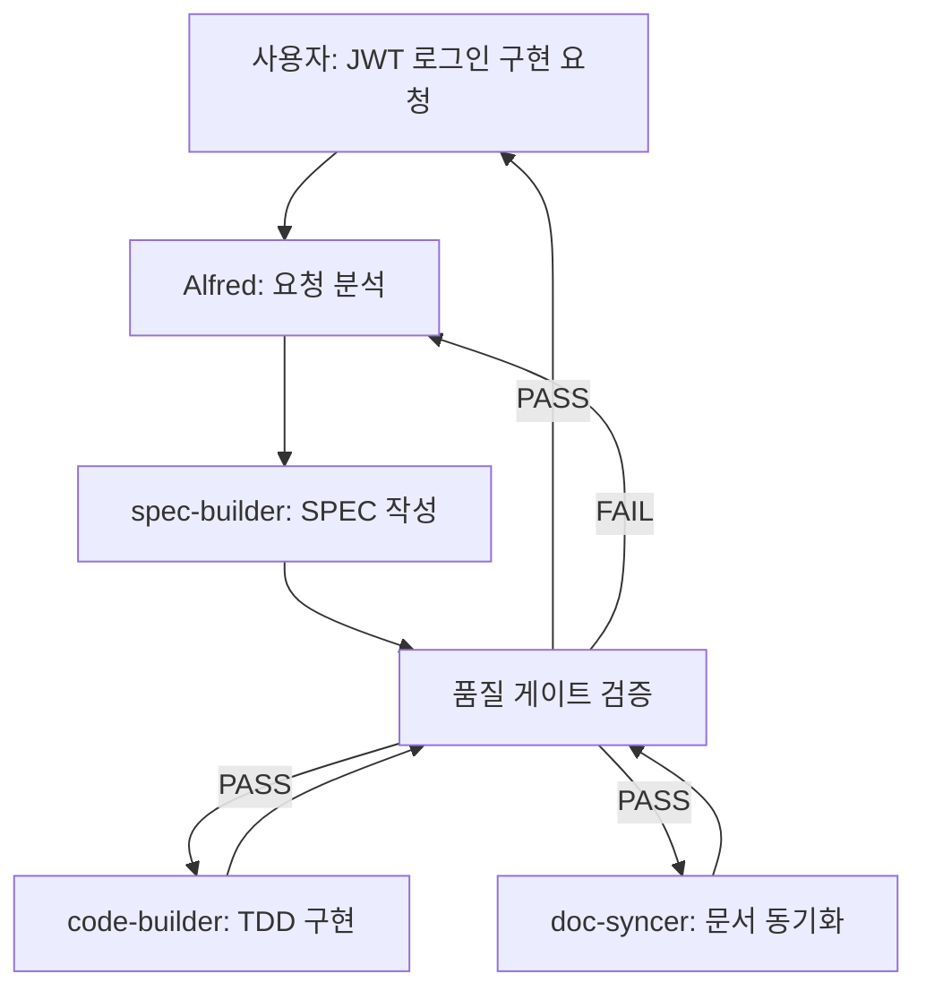

# MoAI-ADK Structure Design

## HISTORY

### v2.0.0 (2025-10-06)
- **UPDATED**: Alfred + 9개 에이전트 아키텍처 상세 기술
- **CHANGED**: 템플릿 내용을 실제 MoAI-ADK 구조로 전면 교체
- **ADDED**: 에이전트 협업 프로토콜 및 품질 게이트 명시
- **PRESERVED**: Legacy Context에 기존 템플릿 보존
- **AUTHOR**: @AI-Alfred
- **REVIEW**: project-manager

### v1.0.0 (2025-10-01)
- **INITIAL**: 프로젝트 구조 설계 문서 작성
- **AUTHOR**: @architect
- **SECTIONS**: Architecture, Modules, Integration, Traceability

---

## @DOC:ARCHITECTURE-001 시스템 아키텍처

### 아키텍처 전략

**MoAI-ADK는 SuperAgent 중심의 계층형 에이전트 아키텍처를 채택합니다.**

```
MoAI-ADK Architecture
├── Alfred (SuperAgent)           # 중앙 오케스트레이터
│   ├── 요청 분석 및 작업 분해
│   ├── 에이전트 선택 및 조율
│   └── 품질 게이트 검증
│
├── Core Workflow Agents (3단계)
│   ├── spec-builder              # 1️⃣ SPEC 작성 (EARS)
│   ├── code-builder              # 2️⃣ TDD 구현 (RED-GREEN-REFACTOR)
│   └── doc-syncer                # 3️⃣ 문서 동기화 (Living Doc)
│
├── Quality Assurance Agents (온디맨드)
│   ├── tag-agent                 # TAG 체인 검증
│   ├── debug-helper              # 오류 진단 및 해결
│   ├── trust-checker             # TRUST 5원칙 검증
│   └── git-manager               # Git 워크플로우
│
└── System Management Agents
    ├── cc-manager                # Claude Code 설정
    └── project-manager           # 프로젝트 초기화
```

**선택 이유**:
- **단일 진입점(Alfred)**: 복잡도 관리, 일관된 사용자 경험
- **전문화된 에이전트**: 단일 책임 원칙, 높은 품질 보장
- **계층적 조율**: 에이전트 간 직접 호출 금지, Alfred만 조율 권한
- **확장성**: 새로운 에이전트 추가 시 Alfred 로직만 수정

**트레이드오프**:
- ✅ 장점: 명확한 책임 분리, 테스트 용이성, 유지보수성
- ⚠️ 단점: 단일 장애점(Alfred), 에이전트 간 통신 오버헤드

## @DOC:MODULES-001 모듈별 책임 구분

### 1. Alfred (SuperAgent 모듈)

- **책임**: 중앙 오케스트레이터, 전체 워크플로우 조율
- **입력**: 사용자 요청 (명령어, 자연어)
- **처리**:
  1. 요청 의도 분석 (SPEC 작성? TDD 구현? 디버깅?)
  2. 작업 복잡도 평가 (직접 처리 vs 에이전트 위임)
  3. 적절한 에이전트 선택 및 호출
  4. 품질 게이트 검증 (TRUST, TAG 무결성)
  5. 결과 통합 및 사용자 보고
- **출력**: 최종 결과물, 품질 검증 리포트

| 컴포넌트 | 역할 | 주요 기능 |
|----------|------|-----------|
| Request Analyzer | 요청 분석 | 의도 파악, 작업 분해 |
| Agent Router | 에이전트 라우팅 | 최적 에이전트 선택, 순차/병렬 조율 |
| Quality Gate | 품질 검증 | TRUST 원칙, TAG 무결성 자동 검증 |
| Result Aggregator | 결과 통합 | 에이전트 출력 병합, 리포트 생성 |

### 2. Core Workflow Agents (핵심 3단계)

#### 2.1 spec-builder (명세 작성자)

- **책임**: EARS 형식 SPEC 문서 생성, Git 브랜치 관리
- **입력**: 사용자 요청 ("JWT 로그인 API")
- **처리**:
  1. EARS 구문 변환 (Ubiquitous, Event-driven, Constraints 등)
  2. `@SPEC:ID` TAG 생성 (중복 검증 포함)
  3. YAML Front Matter 추가 (id, version, status)
  4. HISTORY 섹션 초기화
  5. Git 브랜치 생성 (`feature/SPEC-XXX-YYY`)
- **출력**: `.moai/specs/SPEC-XXX.md`, Git 브랜치

#### 2.2 code-builder (TDD 구현자)

- **책임**: TDD 사이클(RED-GREEN-REFACTOR) 실행
- **입력**: SPEC ID (AUTH-001)
- **처리**:
  1. **RED**: SPEC 기반 테스트 작성, 실패 확인
  2. **GREEN**: 최소 구현으로 테스트 통과
  3. **REFACTOR**: TRUST 5원칙 적용, 코드 품질 개선
  4. `@TEST:ID`, `@CODE:ID` TAG 부여
- **출력**: `tests/**/*.test.{ts,py,go}`, `src/**/*.{ts,py,go}`

#### 2.3 doc-syncer (문서 동기화자)

- **책임**: TAG 체인 검증, Living Document 생성
- **입력**: 전체 코드베이스
- **처리**:
  1. 코드 전체 스캔 (`rg '@(SPEC|TEST|CODE|DOC):' -n`)
  2. TAG 체인 무결성 검증 (고아 TAG 탐지)
  3. 코드 기반 최신 문서 자동 생성
  4. PR 상태 전환 (Draft → Ready)
- **출력**: `docs/**/*.md`, TAG 검증 리포트, PR 업데이트

### 3. Quality Assurance Agents (품질 보증)

| 에이전트 | 책임 | 호출 시점 | 출력 |
|----------|------|-----------|------|
| **tag-agent** | TAG 체계 관리 | TAG 조회/검증 요청 시 | TAG 목록, 체인 검증 결과 |
| **debug-helper** | 오류 진단 | 에러 발생 시 | 원인 분석, 해결 방안 |
| **trust-checker** | TRUST 검증 | 품질 검증 요청 시 | 커버리지, 복잡도, 보안 리포트 |
| **git-manager** | Git 워크플로우 | 체크포인트, 롤백 요청 시 | Git 작업 결과 |

### 4. System Management Agents (시스템 관리)

| 에이전트 | 책임 | 호출 시점 | 출력 |
|----------|------|-----------|------|
| **cc-manager** | Claude Code 설정 | 설정 변경 요청 시 | 설정 파일 업데이트 결과 |
| **project-manager** | 프로젝트 초기화 | `/alfred:8-project` | product/structure/tech.md |

## @DOC:INTEGRATION-001 외부 시스템 통합

### Claude Code 연동

- **인증 방식**: Claude API Key (환경 변수)
- **데이터 교환**:
  - 입력: CLAUDE.md 컨텍스트, 사용자 명령어
  - 출력: 에이전트 응답, 생성된 파일
- **장애 시 대체**: 로컬 백업 모드, 수동 명령어 실행
- **위험도**: 중간 (API 장애 시 일시적 작업 중단)

### GitHub API 연동 (Team 모드 전용)

- **용도**: PR 자동 생성, 상태 전환, 리뷰어 할당
- **의존성 수준**: 선택적 (Personal 모드는 미사용)
- **성능 요구사항**:
  - PR 생성: < 3초
  - 브랜치 생성: < 1초
  - 리뷰어 할당: < 2초

### 언어별 도구 체인 연동

- **TypeScript**: Vitest, Biome, tsc
- **Python**: pytest, ruff, mypy
- **Go**: go test, golint
- **Rust**: cargo test, clippy

**통합 전략**: 프로젝트 메타파일 자동 감지 → 최적 도구 선택

## @DOC:TRACEABILITY-001 추적성 전략

### TAG 체계 적용

**TDD 완벽 정렬**: SPEC → 테스트 → 구현 → 문서
- `@SPEC:ID` (.moai/specs/) → `@TEST:ID` (tests/) → `@CODE:ID` (src/) → `@DOC:ID` (docs/)

**구현 세부사항**: @CODE:ID 내부 주석 레벨
- `@CODE:ID:API` - REST API, GraphQL 엔드포인트
- `@CODE:ID:UI` - 컴포넌트, 뷰, 화면
- `@CODE:ID:DATA` - 데이터 모델, 스키마, 타입
- `@CODE:ID:DOMAIN` - 비즈니스 로직, 도메인 규칙
- `@CODE:ID:INFRA` - 인프라, 데이터베이스, 외부 연동

### TAG 추적성 관리 (코드 스캔 방식)

- **검증 방법**: `/alfred:3-sync` 실행 시 `rg '@(SPEC|TEST|CODE|DOC):' -n`으로 코드 전체 스캔
- **추적 범위**: 프로젝트 전체 소스코드 (.moai/specs/, tests/, src/, docs/)
- **유지 주기**: 코드 변경 시점마다 실시간 검증
- **CODE-FIRST 원칙**: TAG의 진실은 코드 자체에만 존재

### 에이전트 협업 프로토콜

**단일 책임 원칙**:
- 각 에이전트는 자신의 전문 영역만 담당
- 다른 에이전트 영역 침범 금지

**중앙 조율 원칙**:
- Alfred만이 에이전트 간 작업 조율 권한 보유
- 에이전트끼리 직접 호출 절대 금지

**품질 게이트 원칙**:
- 각 단계 완료 시 TRUST 원칙 자동 검증
- TAG 무결성 자동 확인
- 실패 시 다음 단계 진행 차단

### 협업 플로우 예시



## Legacy Context

### 기존 템플릿 보존 (v1.0.0)

다음은 v1.0.0의 템플릿 내용입니다. 향후 다른 프로젝트 초기화 시 참조용으로 보존합니다.

<details>
<summary>v1.0.0 템플릿 내용</summary>

```markdown
## @DOC:ARCHITECTURE-001 시스템 아키텍처

### 아키텍처 전략

**[프로젝트의 전체 아키텍처 접근법을 설명하세요]**

```
Project Architecture
├── [Layer 1]          # [역할 설명]
├── [Layer 2]          # [역할 설명]
├── [Layer 3]          # [역할 설명]
└── [Layer 4]          # [역할 설명]
```

**선택 이유**: [아키텍처 선택의 근거와 트레이드오프]

## @DOC:MODULES-001 모듈별 책임 구분

### 1. [주요 모듈 1]

- **책임**: [모듈의 주요 책임]
- **입력**: [처리하는 입력 데이터]
- **처리**: [수행하는 주요 처리 과정]
- **출력**: [생성하는 결과물]

| 컴포넌트 | 역할 | 주요 기능 |
|----------|------|-----------|
| [컴포넌트1] | [역할] | [기능 목록] |
| [컴포넌트2] | [역할] | [기능 목록] |

### 2. [주요 모듈 2]

- **책임**: [모듈의 주요 책임]
- **입력**: [처리하는 입력 데이터]
- **처리**: [수행하는 주요 처리 과정]
- **출력**: [생성하는 결과물]

## @DOC:INTEGRATION-001 외부 시스템 통합

### [외부 시스템 1] 연동

- **인증 방식**: [인증 방법]
- **데이터 교환**: [데이터 형식과 프로토콜]
- **장애 시 대체**: [fallback 전략]
- **위험도**: [리스크 수준과 완화 방안]

### [외부 시스템 2] 연동

- **용도**: [사용 목적]
- **의존성 수준**: [의존도와 대안]
- **성능 요구사항**: [응답 시간, 처리량 등]
```

</details>

## TODO:STRUCTURE-001 구조 개선 계획

1. **에이전트 간 통신 프로토콜 표준화** - 메시지 형식, 에러 처리 규약 정의
2. **Alfred 장애 복구 메커니즘** - Fallback 에이전트, 수동 모드 전환
3. **에이전트 성능 모니터링** - 응답 시간, 성공률 추적 대시보드
4. **새로운 에이전트 추가 가이드** - 플러그인 아키텍처 도입
5. **분산 에이전트 실행** - 병렬 처리 최적화, 큐잉 시스템

## EARS 아키텍처 요구사항 작성법

### 구조 설계에서의 EARS 활용

아키텍처와 모듈 설계 시 EARS 구문을 활용하여 명확한 요구사항을 정의하세요:

#### 시스템 아키텍처 EARS 예시
```markdown
### Ubiquitous Requirements (아키텍처 기본 요구사항)
- 시스템은 SuperAgent 중심 계층형 아키텍처를 채택해야 한다
- 시스템은 에이전트 간 느슨한 결합을 유지해야 한다

### Event-driven Requirements (이벤트 기반 구조)
- WHEN 에이전트 실행이 실패하면, 시스템은 Alfred에게 에러를 보고해야 한다
- WHEN 품질 게이트가 실패하면, 시스템은 다음 단계 진행을 차단해야 한다

### State-driven Requirements (상태 기반 구조)
- WHILE Alfred가 에이전트를 조율하는 동안, 다른 요청은 큐에 대기해야 한다
- WHILE 개발 모드일 때, 시스템은 에이전트 실행 로그를 상세히 출력해야 한다

### Optional Features (선택적 구조)
- WHERE Team 모드이면, 시스템은 GitHub API 통합을 활성화할 수 있다
- WHERE 성능 모드이면, 시스템은 병렬 에이전트 실행을 지원할 수 있다

### Constraints (구조적 제약사항)
- IF Alfred가 장애 시, 시스템은 수동 모드로 전환해야 한다
- 각 에이전트의 응답 시간은 10초를 초과하지 않아야 한다
- 에이전트 간 직접 호출은 절대 금지해야 한다
```

---

_이 구조는 `/alfred:2-build` 실행 시 TDD 구현의 가이드라인이 됩니다._
