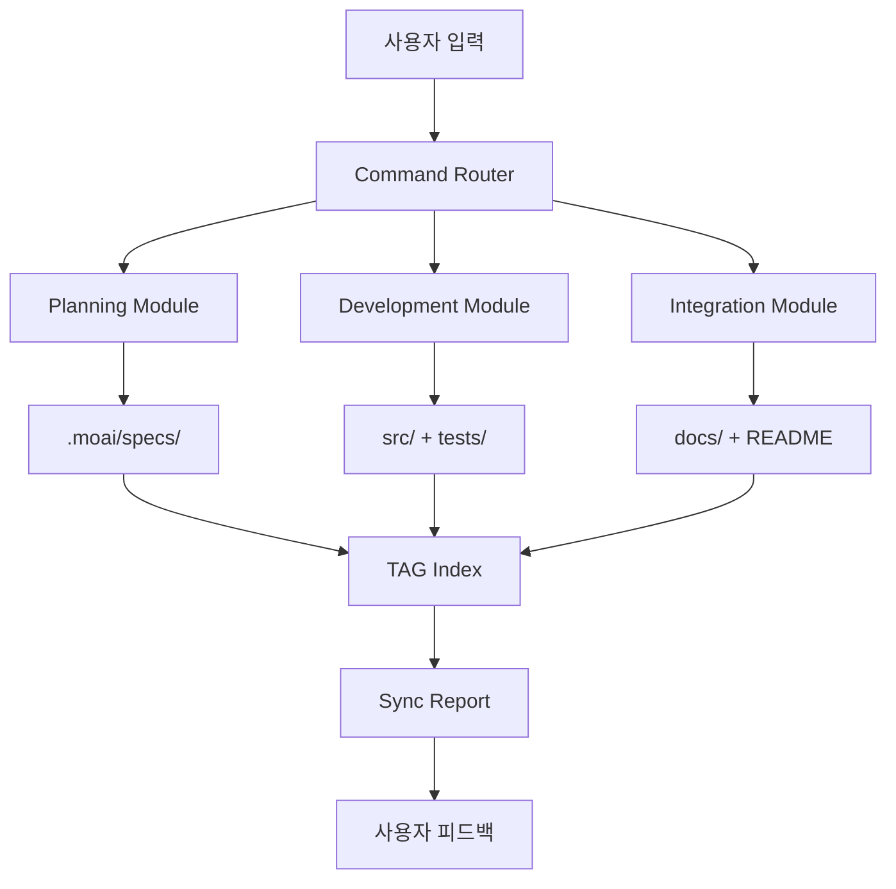

# MoAI-ADK Structure Document

## 시스템 아키텍처 개요

**MoAI-ADK**는 Claude Code 패키지 에코시스템에 통합되는 **모듈러 아키텍처**를 채택하여, @src/ 패키지 코드와 로컬 설정 파일(.claude/.moai/CLAUDE.md) 간의 완전한 동기화를 제공합니다.

## 아키텍처 설계 원칙

### 🎯 핵심 설계 철학 @STRUCT:PHILOSOPHY-001

- **패키지 중심**: Claude Code 패키지로 설치/관리되는 독립적 모듈
- **동기화 우선**: @src/ ↔ 로컬 설정 간 실시간 동기화
- **에이전트 분산**: 역할별 전문 에이전트를 통한 작업 분산
- **워크플로우 자동화**: 4단계 개발 프로세스 완전 자동화

### 🏗️ 아키텍처 패턴 @DESIGN:PATTERN-001

- **Hexagonal Architecture @DESIGN:PATTERN-HEXAGONAL-001**: 외부 의존성 격리
- **CQRS @DESIGN:PATTERN-CQRS-001**: Command와 Query 책임 분리
- **Event Sourcing @DESIGN:PATTERN-EVENT-001**: @TAG 시스템을 통한 이벤트 추적
- **Microkernel @DESIGN:PATTERN-PLUGIN-001**: 플러그인 가능한 에이전트 시스템

## 모듈 구조 및 책임

### 1️⃣ 핵심 3모듈 (Core Modules) @STRUCT:MODULES-001

#### **A. Planning Module @STRUCT:MODULE-PLANNING-001**

> 명세 및 요구사항 관리

```
📋 책임 영역
├── SPEC 문서 생성 및 관리
├── 16-Core @TAG 시스템 운영
├── 요구사항 → 설계 → 태스크 연결
└── GitFlow 브랜치/PR 생성 지원

🔄 입력 → 처리 → 출력
입력: 사용자 요구사항, 프로젝트 문서
처리: EARS 패턴 명세 생성, TAG 연결 관계 구성
출력: .moai/specs/*.md, 브랜치/PR 생성
```

**주요 컴포넌트**:

- `spec-builder` 에이전트: EARS 명세 작성
- `@TAG Indexer`: 태그 관계 추적 및 검증
- `Project Context Manager`: product/structure/tech 문서 연동

#### **B. Development Module**

> TDD 구현 및 품질 관리

```
⚙️ 책임 영역
├── Red-Green-Refactor 사이클 자동화
├── TRUST 5원칙 기반 품질 게이트
├── 테스트 커버리지 및 정적 분석
└── 코드 리뷰 자동화 지원

🔄 입력 → 처리 → 출력
입력: SPEC 명세, 기존 코드베이스
처리: TDD 사이클 실행, 품질 검증, 커밋 생성
출력: 구현 코드, 테스트, 품질 리포트
```

**주요 컴포넌트**:

- `code-builder` 에이전트: TDD 구현 전담
- `Quality Gate`: TRUST 5원칙 자동 검증
- `Test Runner`: 언어별 테스트 프레임워크 통합

#### **C. Integration Module**

> 문서 동기화 및 배포 관리

```
🔗 책임 영역
├── Living Document 동기화
├── PR 상태 관리 및 라벨링
├── CI/CD 파이프라인 연동
└── 배포 후 문서 업데이트

🔄 입력 → 처리 → 출력
입력: 코드 변경, 테스트 결과, PR 상태
처리: 문서 업데이트, 태그 동기화, 배포 트리거
출력: 동기화된 문서, PR 상태 전환, 배포 로그
```

**주요 컴포넌트**:

- `doc-syncer` 에이전트: 문서 동기화 전담
- `Git Integration`: GitHub/GitLab API 연동
- `CI/CD Bridge`: 외부 파이프라인 연결

### 2️⃣ 지원 모듈 (Support Modules)

#### **D. Management Module**

> Claude Code 환경 및 시스템 관리

```
🛠️ 책임 영역
├── Claude Code 설정 최적화
├── 권한 및 보안 정책 관리
├── 에이전트 상태 모니터링
└── 오류 진단 및 복구

🔄 입력 → 처리 → 출력
입력: 시스템 상태, 에러 로그, 설정 변경 요청
처리: 진단 분석, 설정 최적화, 권한 조정
출력: 최적화된 설정, 진단 리포트, 복구 스크립트
```

**주요 컴포넌트**:

- `cc-manager` 에이전트: Claude Code 전용 관리
- `debug-helper` 에이전트: 문제 진단 및 해결
- `Constitution Checker`: 개발 가이드 준수 검증

#### **E. Analytics Module**

> 브레인스토밍 및 고급 분석

```
🧠 책임 영역
├── 외부 AI CLI 도구 연동 (선택적)
├── 코드 품질 및 성능 분석
├── 개발 패턴 학습 및 제안
└── 팀 생산성 지표 수집

🔄 입력 → 처리 → 출력
입력: 코드베이스, 개발 이력, 분석 요청
처리: 멀티 AI 모델 분석, 패턴 인식, 인사이트 생성
출력: 분석 리포트, 개선 제안, 성능 지표
```

**주요 컴포넌트**:

- `codex-bridge` 에이전트: Codex CLI 연동
- `gemini-bridge` 에이전트: Gemini CLI 연동
- `Metrics Collector`: 개발 지표 수집 및 분석

## 외부 시스템 연동

### 🔌 Primary Integrations

#### **Claude Code Ecosystem**

```
연동 방식: 네이티브 패키지 통합
인증: Claude Code 내장 인증 시스템
API: Claude Code Extension API
장애 대응: 로컬 캐시 + Graceful Degradation
```

#### **Git 저장소 (GitHub/GitLab)**

```
연동 방식: Git CLI + REST API
인증: Personal Access Token (PAT)
API: GitHub API v4 (GraphQL), GitLab API v4
장애 대응: 로컬 Git → 원격 동기화 지연 처리
```

#### **CI/CD 시스템**

```
연동 방식: Webhook + Status API
인증: CI/CD 플랫폼별 토큰
API: GitHub Actions, GitLab CI, Jenkins API
장애 대응: Manual Trigger + Status Polling
```

### 🔗 Secondary Integrations (선택적)

#### **외부 AI CLI 도구**

```
Codex CLI:
- 연동 조건: brainstorming.enabled = true + 사용자 동의
- 설치 확인: which codex && codex --version
- 사용 시나리오: 브레인스토밍, 디버깅 아이디어 수집

Gemini CLI:
- 연동 조건: brainstorming.enabled = true + 사용자 동의
- 설치 확인: which gemini && gemini --version
- 사용 시나리오: 구조화된 분석, 코드 리뷰 자동화
```

#### **패키지 레지스트리**

```
PyPI (Python): pip install moai-adk
NPM (Node.js): npm install @moai/adk
기타: 언어별 패키지 매니저 지원 (향후 확장)
```

## 데이터 흐름 및 상태 관리

### 📊 데이터 계층 구조



### 💾 상태 저장소

#### **Local State (.moai/)**

```
.moai/
├── project/           # 프로젝트 기본 문서
│   ├── product.md
│   ├── structure.md
│   └── tech.md
├── specs/             # SPEC 문서들
│   ├── SPEC-001.md
│   └── ...
├── indexes/           # 추적성 인덱스
│   ├── tags.json      # @TAG 관계 매핑
│   └── dependencies.json
├── reports/           # 동기화 리포트
│   └── sync-report.md
├── memory/            # 에이전트 메모리
│   └── development-guide.md
└── config.json        # 프로젝트 설정
```

#### **Claude Code State (.claude/)**

```
.claude/
├── commands/moai/     # 커스텀 명령어
├── agents/moai/       # 에이전트 정의
├── hooks/moai/        # 자동화 훅
├── memory/            # 공유 메모리
└── settings.json      # 권한 설정
```

### 🔄 동기화 전략

#### **@src/ ↔ 로컬 동기화**

```python
# 동기화 주기
- 실시간: 파일 변경 감지 (Watcher)
- 배치: 커밋/푸시 시점
- 수동: /moai:3-sync 명령어

# 충돌 해결
1. @src/ 우선 (패키지 코드가 소스 오브 트루스)
2. 로컬 변경 → @TODO 태그로 표시
3. 수동 머지 필요 시 알림
```

#### **TAG 체인 무결성**

```python
# 검증 규칙
- @REQ → @DESIGN → @TASK → @TEST 연결 완성도
- 순환 참조 방지
- 고아 태그 자동 감지

# 자동 복구
- 누락된 링크 제안
- 불일치 태그 정리
- 중복 태그 통합
```

## 확장성 및 진화 전략

### 🚀 확장 가능한 영역

#### **에이전트 플러그인 시스템**

```
표준 인터페이스:
- IAgent: 기본 에이전트 계약
- IWorkflowStep: 워크플로우 단계 확장
- IQualityGate: 품질 게이트 커스터마이징
- IIntegration: 외부 시스템 연동

커스텀 에이전트 개발:
- 팀별 특화 에이전트 (예: security-scanner)
- 도메인별 전문 에이전트 (예: api-designer)
- 언어별 최적화 에이전트 (예: python-optimizer)
```

#### **워크플로우 커스터마이징**

```
기본 4단계: 0-project → 1-spec → 2-build → 3-sync
확장 가능한 단계:
- 0.5-analysis: 레거시 코드 분석
- 1.5-review: 명세 리뷰 및 승인
- 2.5-security: 보안 스캔 및 검증
- 3.5-deploy: 배포 및 모니터링
```

### 📈 성능 최적화 전략

#### **병렬 처리**

```
에이전트 병렬 실행:
- 독립적 작업: 동시 실행
- 의존성 작업: 순차 실행 + 파이프라인
- 리소스 제한: 동시 실행 에이전트 수 제한

캐싱 전략:
- SPEC 파싱 결과 캐시
- @TAG 인덱스 증분 업데이트
- 외부 API 응답 캐시 (TTL 적용)
```

#### **메모리 관리**

```
에이전트 메모리:
- 세션별 컨텍스트 분리
- 장기 메모리 압축 및 아카이브
- 불필요한 히스토리 정리

파일 처리:
- 대용량 파일 스트리밍 처리
- 증분 파싱 및 업데이트
- 임시 파일 자동 정리
```

## 배포 및 운영

### 📦 배포 전략

#### **패키지 배포**

```bash
# 개발 환경 설치
pip install moai-adk[dev]
moai init project-name

# 프로덕션 환경 설치
pip install moai-adk
moai init . --mode production
```

#### **버전 관리**

```
Semantic Versioning (MAJOR.MINOR.PATCH):
- MAJOR: 호환성 파괴 변경
- MINOR: 새 기능 추가 (하위 호환)
- PATCH: 버그 수정

Release Channels:
- stable: 안정 버전 (권장)
- beta: 베타 테스트 버전
- alpha: 개발 중 버전 (위험)
```

### 🔍 모니터링 및 관찰성

#### **메트릭 수집**

```python
# 개발 생산성 지표
- 명령어 실행 횟수 및 성공률
- 에이전트별 실행 시간 및 리소스 사용량
- 오류 발생 패턴 및 복구 시간

# 품질 지표
- TRUST 5원칙 준수율
- 테스트 커버리지 변화 추이
- 기술 부채 누적 및 해결 현황

# 사용자 만족도
- 명령어 완료율
- 에러 재시도 횟수
- 사용자 피드백 점수
```

#### **로깅 전략**

```json
{
  "timestamp": "2024-09-24T10:00:00Z",
  "level": "INFO",
  "agent": "code-builder",
  "command": "/moai:2-build",
  "spec_id": "SPEC-001",
  "tags": ["@TASK:API-001", "@TEST:UNIT-001"],
  "duration_ms": 1500,
  "success": true,
  "metrics": {
    "lines_changed": 150,
    "tests_added": 5,
    "coverage_delta": "+3%"
  }
}
```

## Legacy Context @DEBT:STRUCTURE-ANALYSIS-001

### 현재 아키텍처 상태 분석

**기존 구조 현황**:

- 모듈 구조: .claude/agents/, .claude/commands/, .moai/scripts/ 기반
- 에이전트 분산: 5개 핵심 + 2개 전문 에이전트 구성
- 설정 관리: settings.json, config.json 이원화
- 데이터 흐름: TAG 인덱스, sync report 기반

### 구조적 개선 필요 영역

**식별된 구조적 부채**:

- @DEBT:ARCHITECTURE-001: 모듈 간 의존성 순환 참조 가능성
- @DEBT:INTEGRATION-001: 외부 시스템 연동 추상화 부족
- @DEBT:SCALABILITY-001: 대규모 프로젝트 확장성 제한
- @DEBT:MONITORING-001: 실시간 모니터링 인프라 부재

**우선순위 리팩터링 계획**:

- @TODO:HEXAGONAL-001: Hexagonal Architecture 완전 적용
- @TODO:CQRS-001: Command/Query 책임 분리 강화
- @TODO:PLUGIN-001: 플러그인 시스템 표준화
- @TODO:MONITORING-001: 관찰성 인프라 구축

---

## Next Steps

이 structure.md 문서는 `product.md`와 `tech.md` 문서와 함께 MoAI-ADK의 전체 설계를 완성합니다.

**다음 단계**: `tech.md` 작성 후 `/moai:1-spec` 실행

---

_@TAG: @STRUCT:MOAI-ADK-001 @DESIGN:ARCHITECTURE-001 @DEBT:STRUCTURE-ANALYSIS-001_
_문서 생성일: 2024-09-24_
_최종 수정: 브레인스토밍 통합 및 레거시 구조 분석 추가_
