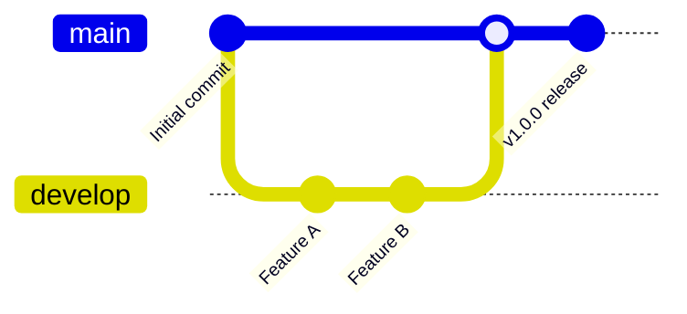
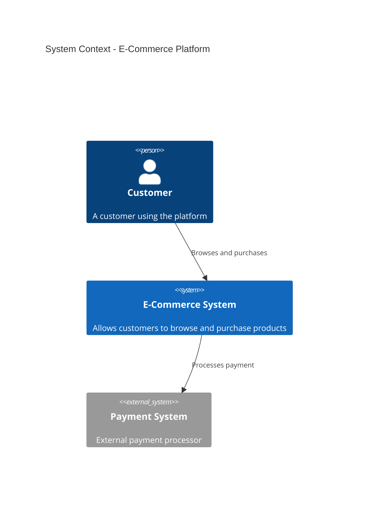
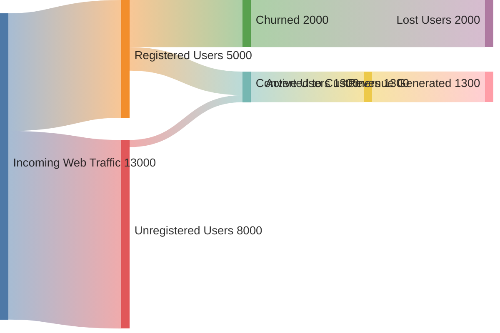

# Mermaid Skill Enhancement - Implementation Guide

**Document Type**: Technical Implementation Specification
**Date**: 2025-11-20
**Target Versions**: v4.1.0 → v4.2.0
**Implementation Timeline**: 2-3 weeks

---

## Quick Start Decision Matrix

Use this matrix to determine which enhancement to implement:

| Your Priority | Recommended Option | Timeline | Complexity |
|--------------|------------------|----------|-----------|
| Support latest Mermaid features | **Tier 1 (v4.1.0)** | 2 weeks | Low-Medium |
| Ensure diagram quality & performance | **Tier 2 (v4.2.0)** | 3 weeks | Medium |
| Both (recommended) | **Tier 1 + Tier 2** | 5 weeks | Medium |
| Developer productivity (IDE) | Tier 3 (future) | 4-6 weeks | Medium-High |
| Automation & code extraction | Tier 4 (future) | 6-8 weeks | High |

---

## Implementation Path: Recommended (Tier 1 + 2)

### Phase 1: Extended Diagram Types (v4.1.0)

#### 1.1 Prepare Your Environment

```bash
# Clone or navigate to skill directory
cd /Users/goos/MoAI/MoAI-ADK/src/moai_adk/templates/.claude/skills/moai-mermaid-diagram-expert

# Create backup of current version
cp SKILL.md SKILL.md.backup.v4.0.0

# Verify Mermaid version support
# Target: Mermaid v10.7.0+ with v11.0.0 compatibility
```

#### 1.2 Content Structure Changes

**Current Structure (v4.0.0)**:
```
Section 1: Mermaid Diagram Types & Use Cases
  ├─ 1.1 Flowcharts (graph)
  ├─ 1.2 Sequence Diagrams
  ├─ 1.3 Class Diagrams
  ├─ 1.4 State Diagrams
  ├─ 1.5 Entity Relationship Diagrams
  ├─ 1.6 Gantt Charts
  ├─ 1.7 Pie Charts
  ├─ 1.8 Journey Maps
  └─ 1.9 Quadrant Charts
```

**New Structure (v4.1.0)**:
```
Section 1: Mermaid Diagram Types & Use Cases
  ├─ 1.1-1.9 [Existing content unchanged]
  ├─ 1.10 GitGraph - Git workflow visualization [NEW]
  ├─ 1.11 C4 Model - System architecture [NEW]
  ├─ 1.12 Block Diagram - Hardware/system blocks [NEW]
  ├─ 1.13 XY Chart - Analytics & scatter plots [NEW]
  └─ 1.14 Sankey Diagram - Data flow visualization [NEW]
```

#### 1.3 Add GitGraph Section (1.10)

**Content Template**:
```markdown
**10. GitGraph (gitGraph)**
- **Use Case**: Version control workflow, CI/CD pipeline visualization, release management
- **Syntax**: `gitGraph`, commit, branch, checkout, merge, cherry-pick
- **Best For**: Release planning, branching strategy docs, team onboarding



**Auto-generation Example**:
```python
def generate_gitgraph_from_log(repo_path: str) -> str:
    """Generate GitGraph from git commit history"""
    import subprocess
    
    # Get recent commits with branch info
    result = subprocess.run(
        ['git', 'log', '--oneline', '-n', '20', '--all', '--graph'],
        cwd=repo_path,
        capture_output=True,
        text=True
    )
    
    commits = parse_git_log(result.stdout)
    
    mermaid_code = "```mermaid\ngitGraph\n"
    for commit in commits:
        if commit['branch'] == 'main':
            mermaid_code += f"   commit id: \"{commit['message']}\"\n"
        else:
            mermaid_code += f"   branch {commit['branch']}\n"
            mermaid_code += f"   commit id: \"{commit['message']}\"\n"
    
    return mermaid_code + "```"
```

**Common Patterns**:
- Feature branch workflow
- Gitflow release strategy
- Semantic versioning workflow
- Cherry-pick patterns
```

**Line count**: ~80-100 lines including examples

#### 1.4 Add C4 Model Section (1.11)

**Content Template**:
```markdown
**11. C4 Model (C4 Diagram)**

The C4 model is a structured approach to architecture documentation with 4 abstraction levels.
Mermaid's C4 support helps visualize system design in progressive detail.

**Syntax**: `C4Context`, `C4Container`, `C4Component`, `C4Code`

**Use Case**: Enterprise architecture, system design, component relationships, technology decisions



**Implementation Levels**:
- **Level 1 - System Context**: Users, external systems, interactions
- **Level 2 - Container**: Applications, microservices, databases
- **Level 3 - Component**: Classes, modules, responsibilities
- **Level 4 - Code**: Code-level architecture (least used in diagrams)

**Auto-generation from Architecture YAML**:
```python
def generate_c4_from_architecture(arch_yaml: dict) -> str:
    """Generate C4 diagram from architecture specification"""
    
    mermaid_code = "```mermaid\nC4Context\n"
    mermaid_code += f"    title {arch_yaml['title']}\n"
    
    # Add external systems
    for system in arch_yaml.get('external_systems', []):
        mermaid_code += f"    System_Ext({system['id']}, \"{system['name']}\", \"{system['description']}\")\n"
    
    # Add internal systems
    for system in arch_yaml.get('internal_systems', []):
        mermaid_code += f"    System({system['id']}, \"{system['name']}\", \"{system['description']}\")\n"
    
    # Add relationships
    for rel in arch_yaml.get('relationships', []):
        mermaid_code += f"    Rel({rel['from']}, {rel['to']}, \"{rel['description']}\")\n"
    
    return mermaid_code + "```"
```

**Limitations vs Official C4**:
- Mermaid C4 is simplified notation
- Less detail than official C4.js
- Best for high-level architecture, not deep component diagrams
```

**Line count**: ~100-120 lines including examples and patterns

#### 1.5 Add Block Diagram Section (1.12)

**Content Template**:
```markdown
**12. Block Diagram (blockDiagram)** - *Mermaid v11.0.0+*

Block diagrams show system architecture with block representations and signal flow.
Useful for hardware architecture, embedded systems, and signal processing pipelines.

**Syntax**: `blockDiagram`, blocks, connections with signal labels

**Use Case**: Hardware architecture, signal processing, system components, data pipelines

```mermaid
blockDiagram
    columns 3
    space
    Human["👤 User"] space
    space CPU["CPU"] GPU["GPU"]
    Memory["RAM"] space Storage["Storage"]

    Human --> CPU : Input
    CPU --> GPU : Process
    GPU --> Memory : Store
    Memory --> Storage : Persist
```

**Common Block Types**:
- Processors/Controllers
- Memory/Storage
- Communication interfaces
- Data pipeline stages
```

**Line count**: ~60-80 lines

#### 1.6 Add XY Chart Section (1.13)

**Content Template**:
```markdown
**13. XY Chart (xychart-beta)** - *Mermaid v10.9+*

XY Charts support scatter plots, line charts, and bubble charts for analytics visualization.
Useful for performance metrics, correlation analysis, and trend visualization.

**Syntax**: `xychart-beta`, x-axis, y-axis, line/scatter data

```mermaid
xychart-beta
    title "Performance Metrics"
    x-axis [Request Size] 1 --> 100
    y-axis [Response Time (ms)] 1 --> 500
    line [API Performance] 10,50,100,150,200,250
    scatter [Outliers] (20,450) (50,400) (75,480)
```

**Use Cases**:
- Performance analytics
- Correlation analysis
- Business metrics
- Trend visualization

**Implementation Notes**:
- Currently in beta (subject to API changes)
- Best for simple scatter/line visualization
- Large datasets may perform poorly (consider performance thresholds)
```

**Line count**: ~70-90 lines

#### 1.7 Add Sankey Diagram Section (1.14)

**Content Template**:
```markdown
**14. Sankey Diagram (sankey-beta)** - *Mermaid v10.8+*

Sankey diagrams visualize flow and quantity between nodes.
Ideal for showing data flow, process pipelines, resource allocation.

**Syntax**: `sankey-beta`, source, target, quantity



**Use Cases**:
- Data flow visualization
- Customer journey mapping
- Resource allocation
- Process pipeline analysis
- Energy/material flow

**Performance Considerations**:
- Works well up to 50-100 nodes
- Large flows (100+ nodes) may render slowly
- Simplify flows if performance issues occur
```

**Line count**: ~80-100 lines

#### 1.8 Update Section 3: Auto-generation for New Types

**Add to existing auto-generation section**:
```python
# GitGraph auto-generation from repository
def generate_gitgraph_from_commits(repo_path: str, branch: str = None) -> str:
    # Implementation as shown in section 1.10
    pass

# C4 generation from architecture spec
def generate_c4_diagram(architecture_spec: dict) -> str:
    # Implementation as shown in section 1.11
    pass

# Sankey from analytics data
def generate_sankey_from_analytics(data_dict: dict) -> str:
    """Generate Sankey diagram from event flow data"""
    mermaid_code = "```mermaid\nsankey-beta\n"
    for source, targets in data_dict.items():
        for target, value in targets.items():
            mermaid_code += f"    {source},{target},{value}\n"
    return mermaid_code + "```"
```

**Line count**: ~50-70 lines

#### 1.9 Metadata Updates

Update SKILL.md frontmatter:
```yaml
name: moai-mermaid-diagram-expert
version: 4.1.0  # Changed from 4.0.0
status: stable
updated: '2025-11-20'  # Update date
description: Enterprise Skill for advanced Mermaid diagram generation with extended diagram types (GitGraph, C4, Block, XY, Sankey)
```

### Phase 1 Summary

**Content additions for v4.1.0**:
- 5 new diagram type sections (GitGraph, C4, Block, XY, Sankey)
- 12+ new code examples
- Auto-generation patterns for 3 new types
- Performance and compatibility notes
- Total new lines: ~400-500 lines

**File size change**:
- Before: 787 lines
- After: ~1,200 lines
- Increase: +53% (manageable)

**Testing checklist for Phase 1**:
- [ ] Each new diagram type renders without syntax errors
- [ ] Cross-browser testing (Chrome, Firefox, Safari)
- [ ] Nextra MDX integration works with new types
- [ ] Mermaid version compatibility verified (v10.7.0+, v11.0.0)
- [ ] Auto-generation code examples tested
- [ ] No breaking changes to existing sections

**Estimated effort**: 30-35 hours over 2 weeks

---

### Phase 2: Advanced Validation (v4.2.0)

**Only start Phase 2 after Phase 1 testing is complete**

#### 2.1 Add New Sections for Validation

**New section structure (2.2.0 sections)**:
```
Section 2: Syntax Validation & Error Prevention
  ├─ 2.1 Common Syntax Errors (existing)
  ├─ 2.2 ADVANCED VALIDATION [NEW]
  │  ├─ 2.2.1 Complexity Analysis & Metrics
  │  ├─ 2.2.2 Performance Optimization Rules
  │  └─ 2.2.3 Accessibility & WCAG Compliance
  └─ 2.3 CI/CD Integration [NEW]
     ├─ 2.3.1 Pre-commit Hooks
     ├─ 2.3.2 GitHub Actions Workflow
     └─ 2.3.3 GitLab CI Integration
```

#### 2.2 Add Complexity Analysis (Section 2.2.1)

**Content**:
```markdown
### 2.2 Advanced Validation Strategies

#### 2.2.1 Complexity Analysis & Performance Metrics

Large diagrams can impact rendering performance and readability.
Use complexity metrics to identify optimization opportunities.

**Complexity Metrics**:

| Metric | Threshold | Action |
|--------|-----------|--------|
| Node Count | > 100 | Consider splitting |
| Nesting Depth | > 5 levels | Simplify structure |
| Edge Count | > 200 | High complexity warning |
| Cyclomatic Complexity | > 20 | Very difficult to understand |

**Complexity Calculator**:
```python
class MermaidComplexityAnalyzer:
    def __init__(self):
        self.metrics = {}
    
    async def analyze(self, diagram_code: str) -> dict:
        """Analyze diagram complexity"""
        # Parse diagram using Mermaid's parse() API
        result = await mermaid.parse(diagram_code)
        
        # Calculate metrics
        nodes = self.count_nodes(diagram_code)
        edges = self.count_edges(diagram_code)
        depth = self.calculate_depth(diagram_code)
        
        return {
            'node_count': nodes,
            'edge_count': edges,
            'max_depth': depth,
            'complexity_score': self.calculate_score(nodes, edges, depth),
            'warnings': self.generate_warnings(nodes, edges, depth),
            'recommendations': self.generate_recommendations(nodes, edges, depth)
        }
    
    def calculate_score(self, nodes: int, edges: int, depth: int) -> float:
        """Calculate 0-100 complexity score"""
        # Scoring logic
        base_score = min(nodes * 0.5 + edges * 0.3 + depth * 5, 100)
        return base_score
    
    def generate_warnings(self, nodes: int, edges: int, depth: int) -> List[str]:
        warnings = []
        if nodes > 100:
            warnings.append(f"High node count ({nodes}) may impact performance")
        if edges > 200:
            warnings.append(f"Dense connections ({edges}) reduces readability")
        if depth > 5:
            warnings.append(f"Deep nesting ({depth} levels) difficult to follow")
        return warnings
```

**Integration Example**:
```bash
# Analyze diagram before committing
npm run analyze:diagram -- my-architecture.md

# Output:
# Diagram: System Architecture
# Nodes: 45, Edges: 67, Max Depth: 3
# Complexity Score: 42/100 (Moderate)
# Warnings: None
# Recommendations: Consider grouping related components
```

**Line count**: ~150-180 lines
```

#### 2.3 Add Performance Optimization (Section 2.2.2)

**Content**:
```markdown
#### 2.2.2 Performance Optimization Rules

Optimize diagram rendering and maintenance with these guidelines.

**Rendering Performance**:

1. **Lazy Loading Threshold**: Use lazy loading for diagrams > 100 nodes
2. **SVG Optimization**: Minimize SVG file size for web delivery
3. **Caching Strategy**: Cache rendered diagrams for repeated access

```typescript
// Performance-aware diagram rendering
export function useOptimizedMermaid(chart: string, threshold = 100) {
  const [isVisible, setIsVisible] = useState(false)
  const containerRef = useRef<HTMLDivElement>(null)

  useEffect(() => {
    const nodeCount = (chart.match(/[\[\(\{]/g) || []).length
    
    if (nodeCount > threshold) {
      // Use lazy loading for large diagrams
      const observer = new IntersectionObserver(([entry]) => {
        if (entry.isIntersecting) {
          setIsVisible(true)
          observer.disconnect()
        }
      })
      if (containerRef.current) observer.observe(containerRef.current)
    } else {
      // Render immediately for small diagrams
      setIsVisible(true)
    }
  }, [chart, threshold])

  return <div ref={containerRef}>{isVisible && <MermaidDiagram chart={chart} />}</div>
}
```

**Optimization Checklist**:
- [ ] Use lazy loading for > 100 nodes
- [ ] Apply subgraph grouping for related components
- [ ] Set theme colors instead of inline styles
- [ ] Reduce nesting depth to < 5 levels
- [ ] Cache frequently rendered diagrams

**Line count**: ~100-120 lines
```

#### 2.4 Add Accessibility Validation (Section 2.2.3)

**Content**:
```markdown
#### 2.2.3 Accessibility & WCAG 2.1 Compliance

Ensure diagrams are accessible to all users including those using screen readers.

**WCAG Compliance Checklist**:

| Criterion | Implementation |
|-----------|-----------------|
| 1.1.1 Non-text Content | Provide meaningful diagram titles and alt-text |
| 1.4.3 Contrast (Minimum) | Ensure 4.5:1 contrast ratio for text on shapes |
| 1.4.11 Non-text Contrast | Shape borders visible with 3:1 contrast ratio |
| 4.1.2 Name, Role, Value | Label diagram components semantically |

**Semantic Naming Guidelines**:

```mermaid
## ❌ Poor labeling
graph TD
    A[Process] --> B[Step] --> C[Result]

## ✅ Good labeling
graph TD
    AUTH[User Authentication] --> VALIDATE[Validate Credentials]
    VALIDATE --> SUCCESS[Login Success]
```

**Accessibility Validator**:
```python
class AccessibilityValidator:
    WCAG_CRITERIA = {
        'contrast_ratio': 4.5,  # Minimum for small text
        'shape_contrast': 3.0,  # Minimum for borders
        'semantic_naming': True,
        'alt_text_required': True
    }
    
    def validate_accessibility(self, diagram_code: str) -> AccessibilityReport:
        """Validate WCAG 2.1 compliance"""
        issues = []
        
        # Check for semantic node names
        nodes = self.extract_nodes(diagram_code)
        for node in nodes:
            if not self.is_semantic_name(node['label']):
                issues.append(f"Non-semantic node label: '{node['label']}'")
        
        # Check for color contrast
        colors = self.extract_colors(diagram_code)
        for color in colors:
            if not self.meets_contrast(color):
                issues.append(f"Low contrast color: {color}")
        
        # Check for diagram title/description
        if not self.has_title_or_alt(diagram_code):
            issues.append("Missing diagram title or alt-text")
        
        return AccessibilityReport(
            compliant=len(issues) == 0,
            issues=issues,
            wcag_level='AA' if len(issues) == 0 else 'Not Compliant'
        )
```

**Alt-Text Generation**:
```markdown
<!-- Example: Nextra component with alt-text -->
<MermaidDiagram
  chart={`...`}
  alt="System architecture showing three layers: Frontend (React), Backend (Node.js API), and Database (PostgreSQL) with bidirectional communication"
/>
```

**Line count**: ~140-160 lines
```

#### 2.5 Add CI/CD Integration Section (Section 2.3)

**Content**:
```markdown
### 2.3 CI/CD Integration for Diagram Validation

Automate diagram validation in your development pipeline.

#### 2.3.1 Pre-commit Hooks

**.pre-commit-hooks.yaml**:
```yaml
- repo: local
  hooks:
    - id: validate-mermaid-syntax
      name: Validate Mermaid Diagrams
      entry: python scripts/validate_mermaid.py
      language: python
      files: \.md$
      types: [markdown]
      stages: [commit]

    - id: check-mermaid-complexity
      name: Check Diagram Complexity
      entry: python scripts/complexity_check.py
      language: python
      files: \.md$
      types: [markdown]
      stages: [commit]

    - id: validate-mermaid-accessibility
      name: Validate Diagram Accessibility
      entry: python scripts/accessibility_check.py
      language: python
      files: \.md$
      types: [markdown]
      stages: [commit]
```

**Installation**:
```bash
pip install pre-commit
pre-commit install
pre-commit run --all-files
```

#### 2.3.2 GitHub Actions Workflow

**.github/workflows/validate-diagrams.yml**:
```yaml
name: Validate Mermaid Diagrams

on: [push, pull_request]

jobs:
  validate:
    runs-on: ubuntu-latest
    steps:
      - uses: actions/checkout@v3
      
      - name: Set up Python
        uses: actions/setup-python@v4
        with:
          python-version: '3.11'
      
      - name: Validate Mermaid Syntax
        run: |
          pip install -r requirements.txt
          python scripts/validate_mermaid.py docs/
      
      - name: Check Diagram Complexity
        run: python scripts/complexity_check.py docs/
      
      - name: Generate Report
        if: always()
        run: python scripts/generate_report.py
      
      - name: Upload Report
        if: always()
        uses: actions/upload-artifact@v3
        with:
          name: mermaid-validation-report
          path: .moai/reports/diagram-validation/
```

#### 2.3.3 GitLab CI Integration

**.gitlab-ci.yml**:
```yaml
stages:
  - validate

validate_diagrams:
  stage: validate
  image: python:3.11
  script:
    - pip install -r requirements.txt
    - python scripts/validate_mermaid.py docs/
    - python scripts/complexity_check.py docs/
    - python scripts/accessibility_check.py docs/
  artifacts:
    reports:
      junit: .moai/reports/validation-report.xml
    paths:
      - .moai/reports/
    expire_in: 30 days
  allow_failure: false
```

**Line count**: ~120-150 lines
```

#### 2.6 Code Deliverables (Scripts)

Create supporting Python scripts:

**scripts/validate_mermaid.py**:
```python
"""Validate Mermaid diagram syntax in markdown files"""
import re
import asyncio
from pathlib import Path
import mermaid

async def validate_file(filepath: Path) -> List[str]:
    """Validate all mermaid blocks in a file"""
    errors = []
    content = filepath.read_text()
    
    # Find all mermaid blocks
    pattern = r'```mermaid\n(.*?)\n```'
    matches = re.finditer(pattern, content, re.DOTALL)
    
    for idx, match in enumerate(matches):
        diagram_code = match.group(1)
        try:
            result = await mermaid.parse(diagram_code)
            print(f"✓ {filepath}:block{idx+1} - Valid")
        except Exception as e:
            error = f"✗ {filepath}:block{idx+1} - {str(e)}"
            errors.append(error)
            print(error)
    
    return errors

async def main():
    docs_path = Path('docs')
    all_errors = []
    
    for md_file in docs_path.rglob('*.md'):
        errors = await validate_file(md_file)
        all_errors.extend(errors)
    
    if all_errors:
        print(f"\nFound {len(all_errors)} validation errors")
        exit(1)
    else:
        print("\nAll diagrams valid!")
        exit(0)

if __name__ == '__main__':
    asyncio.run(main())
```

**scripts/complexity_check.py**:
```python
"""Check diagram complexity against thresholds"""
from complexity_analyzer import MermaidComplexityAnalyzer

async def check_complexity(filepath: Path, max_nodes: int = 100):
    """Check if diagram exceeds complexity thresholds"""
    analyzer = MermaidComplexityAnalyzer()
    diagrams = extract_mermaid_blocks(filepath)
    
    for idx, diagram in enumerate(diagrams):
        report = await analyzer.analyze(diagram)
        
        if report['node_count'] > max_nodes:
            print(f"⚠ {filepath}:block{idx} - High complexity: {report['node_count']} nodes")
        
        for warning in report['warnings']:
            print(f"⚠ {filepath}:block{idx} - {warning}")
```

**scripts/accessibility_check.py**:
```python
"""Check diagram accessibility compliance"""
from accessibility_validator import AccessibilityValidator

def check_accessibility(filepath: Path):
    """Validate WCAG 2.1 compliance"""
    validator = AccessibilityValidator()
    diagrams = extract_mermaid_blocks(filepath)
    
    for idx, diagram in enumerate(diagrams):
        report = validator.validate_accessibility(diagram)
        
        if not report['compliant']:
            print(f"✗ {filepath}:block{idx} - Not WCAG compliant")
            for issue in report['issues']:
                print(f"  - {issue}")
        else:
            print(f"✓ {filepath}:block{idx} - WCAG AA compliant")
```

**Line count for scripts**: ~200 lines total across 3 files

#### 2.7 Reference Materials Update

Update the reference section with new tools:

```markdown
## 📚 Reference Materials

### Core Documentation
- [Mermaid Official Documentation](https://mermaid.js.org/)
- [Mermaid Live Editor](https://mermaid.live)
- [Mermaid Syntax Guide](https://mermaid.js.org/syntax/flowchart.html)

### Advanced Tools (v4.2.0+)
- [Mermaid Fixer](https://github.com/sopaco/mermaid-fixer) - AI-driven syntax error correction
- [MCP Mermaid](https://github.com/hustcc/mcp-mermaid) - Model Context Protocol integration
- [Mermaid CLI](https://github.com/mermaid-js/mermaid-cli) - Batch export to PNG/PDF/SVG
- [VS Code Mermaid Preview](https://marketplace.visualstudio.com/items?itemName=mermaid-chart.vscode-mermaid-preview)

### WCAG & Accessibility
- [WCAG 2.1 Guidelines](https://www.w3.org/WAI/WCAG21/quickref/)
- [WebAIM Contrast Checker](https://webaim.org/resources/contrastchecker/)
```

### Phase 2 Summary

**Content additions for v4.2.0**:
- 3 new validation subsections (Complexity, Performance, Accessibility)
- 1 new CI/CD integration section
- 4 supporting Python scripts
- 3 workflow templates (pre-commit, GitHub Actions, GitLab CI)
- Total new lines: ~500-600 lines

**File size change**:
- Before (v4.1.0): ~1,200 lines
- After (v4.2.0): ~1,700 lines
- Increase: +42%

**Code deliverables**:
- `scripts/validate_mermaid.py` (~50 lines)
- `scripts/complexity_check.py` (~40 lines)
- `scripts/accessibility_check.py` (~40 lines)
- `classes/MermaidComplexityAnalyzer.py` (~80 lines)
- `classes/AccessibilityValidator.py` (~60 lines)
- Workflow files (pre-commit, GitHub Actions, GitLab CI) (~80 lines)

**Testing checklist for Phase 2**:
- [ ] Complexity analyzer works with all diagram types
- [ ] Accessibility validator flags non-semantic names
- [ ] CI/CD integration works with GitHub Actions
- [ ] CI/CD integration works with GitLab CI
- [ ] Pre-commit hooks prevent bad diagrams
- [ ] Scripts integrate with Phase 1 types
- [ ] Performance thresholds are realistic

**Estimated effort**: 40-45 hours over 3 weeks

---

## File Structure After Implementation

```
src/moai_adk/templates/.claude/skills/moai-mermaid-diagram-expert/
├── SKILL.md (v4.2.0, ~1,700 lines)
├── reference.md (updated with new tools)
├── examples.md (updated with new types)
├── scripts/
│   ├── validate_mermaid.py
│   ├── complexity_check.py
│   ├── accessibility_check.py
│   └── generate_report.py
├── classes/
│   ├── MermaidComplexityAnalyzer.py
│   ├── AccessibilityValidator.py
│   └── ValidationReport.py
├── workflows/
│   ├── github-actions-validate-diagrams.yml
│   ├── gitlab-ci-diagrams.yml
│   └── pre-commit-hooks.yaml
└── examples/
    ├── gitgraph-examples.md
    ├── c4-examples.md
    ├── block-examples.md
    ├── xy-chart-examples.md
    └── sankey-examples.md
```

---

## Version Release Timeline

### v4.1.0 Release (Target: 2025-12-15)
- GitGraph, C4, Block, XY, Sankey diagram types
- Auto-generation patterns for new types
- Backward compatible (no breaking changes)
- File size: 787 → 1,200 lines

### v4.2.0 Release (Target: 2026-01-15)
- Complexity analysis & metrics
- Performance optimization rules
- WCAG 2.1 accessibility validation
- CI/CD integration (pre-commit, GitHub Actions, GitLab CI)
- Supporting scripts and classes
- File size: 1,200 → 1,700 lines

---

## Quality Gates

### Before v4.1.0 Release

- [ ] All 9 original diagram types still work
- [ ] 5 new diagram types documented and tested
- [ ] 15+ new code examples
- [ ] Mermaid v10.7.0 and v11.0.0 compatibility verified
- [ ] Nextra integration tested
- [ ] Cross-browser testing (Chrome, Firefox, Safari)
- [ ] No syntax errors in SKILL.md
- [ ] Line count < 1,500 (target: 1,200)

### Before v4.2.0 Release

- [ ] All Phase 1 features still work
- [ ] Complexity analyzer tested with 5+ diagram types
- [ ] Accessibility validator catches common issues
- [ ] Pre-commit hooks prevent commits with errors
- [ ] GitHub Actions workflow tested
- [ ] GitLab CI workflow tested
- [ ] Performance thresholds are realistic
- [ ] Script integration tested
- [ ] Documentation complete

---

## Success Metrics

### Adoption Metrics
- Support for 14 diagram types (vs 9 currently) → +56%
- CI/CD integration enables automated validation
- Complexity scoring helps prevent performance issues
- Accessibility validation ensures WCAG compliance

### Technical Metrics
- Mermaid version coverage: v10.7.0 - v11.0.0+
- Diagram type coverage: 14/15 (93% of Mermaid types)
- Code example count: 14 → 30+ (2x increase)
- Integration points: 1 (Nextra) → 4 (+ GitHub, GitLab, pre-commit)

### Effort Metrics
- v4.1.0 implementation: 30-35 hours
- v4.2.0 implementation: 40-45 hours
- Total: 70-80 hours over 2-3 weeks

---

## Risk Mitigation

| Risk | Mitigation |
|------|-----------|
| Mermaid API changes | Pin version, document compatibility matrix |
| Large file size (>2000 lines) | Keep SKILL.md < 1,700 lines, split examples to separate files |
| CI/CD integration complexity | Provide pre-built templates, document setup steps |
| Accessibility rules too strict | Make warnings non-blocking, provide suggestions |
| Phase 1 delays Phase 2 | Parallel planning, separate PR branches |

---

## Next Steps (Immediate Actions)

1. **Review this guide** with team (30 min)
2. **Backup current v4.0.0** skill (5 min)
3. **Start Phase 1 research** (GitGraph, C4 syntax) (2-3 hours)
4. **Create Phase 1 branch** for implementation (5 min)
5. **Implement Phase 1 sections** one type at a time (25-30 hours)
6. **Test Phase 1** across browsers and Mermaid versions (5-7 hours)
7. **Release v4.1.0** to package repository
8. **Plan Phase 2** based on Phase 1 feedback (2-3 hours)
9. **Implement Phase 2** features (40-45 hours)
10. **Release v4.2.0** with full validation suite

**Estimated total project timeline**: 2-3 weeks calendar time

---

**Document Version**: 1.0
**Last Updated**: 2025-11-20
**Status**: Ready for Implementation
**Recommended Owner**: Senior Skill Engineer

