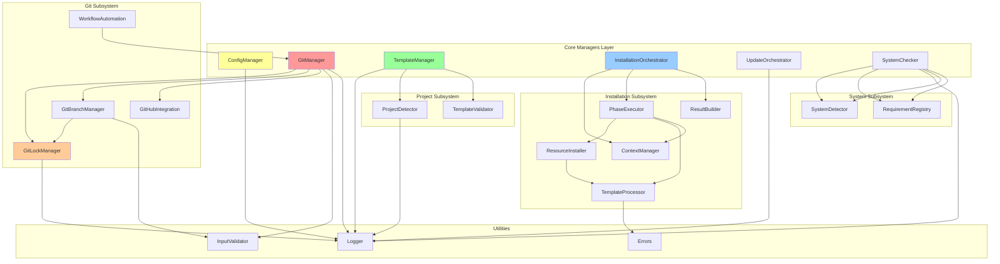

# Core Managers Layer Analysis

**분석 일자**: 2025-10-01
**분석자**: Claude Code
**분석 대상**: `/Users/goos/MoAI/MoAI-ADK/moai-adk-ts/src/core/`

---

## ANALYSIS:CORE-001 Executive Summary

### 분석 범위
Core Managers 레이어는 MoAI-ADK의 핵심 관리자 계층으로, 설정 관리(ConfigManager), Git 작업(GitManager), 프로젝트 템플릿(TemplateManager), 시스템 검증(SystemChecker), 업데이트(UpdateOrchestrator), 설치(InstallationOrchestrator) 등 6개 주요 관리자와 12개 서브 매니저로 구성됩니다.

### 핵심 발견사항
1. **좋은 점**: 명확한 책임 분리, 타입 안전성 높음, Lock 메커니즘 구현
2. **개선 필요**: 순환 의존성 위험, 유틸리티 중복, 에러 처리 일관성 부족
3. **설계 패턴**: Context Manager, Strategy, Builder 패턴 일부 적용
4. **테스트 커버리지**: 주요 관리자는 테스트 존재, 일부 서브 매니저는 미비

---

## ANALYSIS:CORE-002 아키텍처 개요

### 레이어 구조

```
src/core/
├── config/              # ConfigManager (설정 관리)
│   ├── config-manager.ts (524 LOC)
│   ├── types.ts
│   └── __tests__/
├── git/                 # GitManager (Git 작업)
│   ├── git-manager.ts (690 LOC)
│   ├── git-lock-manager.ts (326 LOC)
│   ├── git-branch-manager.ts (248 LOC)
│   ├── github-integration.ts
│   ├── workflow-automation.ts
│   ├── constants/
│   └── __tests__/
├── project/             # TemplateManager (프로젝트 구조)
│   ├── template-manager.ts (610 LOC)
│   ├── project-detector.ts (336 LOC)
│   ├── template-validator.ts
│   └── __tests__/
├── installer/           # InstallationOrchestrator (설치)
│   ├── orchestrator.ts (146 LOC)
│   ├── phase-executor.ts
│   ├── context-manager.ts
│   ├── resource-installer.ts
│   ├── template-processor.ts
│   └── types.ts
├── update/              # UpdateOrchestrator (업데이트)
│   ├── update-orchestrator.ts (379 LOC)
│   └── index.ts
├── system-checker/      # SystemChecker (시스템 검증)
│   ├── index.ts (174 LOC)
│   ├── detector.ts
│   └── requirements.ts
└── package-manager/     # PackageManager (패키지 관리)
    ├── detector.ts
    └── installer.ts
```

---

## ANALYSIS:CORE-003 관리자별 분석

### 1. ConfigManager (@CODE:CFG-001)

**책임**: 프로젝트 설정 파일 생성 및 검증
- `.claude/settings.json` 생성
- `.moai/config.json` 생성
- `package.json` 생성 (Node.js 프로젝트)
- 설정 파일 백업 및 검증

**강점**:
- 명확한 타입 정의 (ClaudeSettings, MoAIConfig, PackageConfig)
- 백업 메커니즘 구현
- 모드별 설정 차별화 (personal vs team)

**문제점**:
```typescript
// 🔴 문제 1: 하드코딩된 설정 값
private getEnabledAgents(mode: string): string[] {
  const baseAgents = ['spec-builder', 'code-builder', 'doc-syncer'];
  if (mode === 'team') {
    return [...baseAgents, 'git-manager', 'debug-helper'];
  }
  return baseAgents;
}
// → 해결책: 설정 파일 또는 상수로 분리

// 🔴 문제 2: 동기 파일 작업 (fs.existsSync)
if (!fs.existsSync(settingsDir)) {
  fs.mkdirSync(settingsDir, { recursive: true });
}
// → 해결책: fs-extra의 ensureDir 비동기 버전 사용
```

**응집도**: ⭐⭐⭐⭐ (4/5) - 설정 관련 작업 집중, 일부 유틸리티 메서드 분리 가능
**결합도**: ⭐⭐⭐ (3/5) - logger 의존성만 있으나, 에러 처리가 각 메서드에 중복

---

### 2. GitManager (@CODE:GIT-001)

**책임**: Git 저장소 초기화, 브랜치/커밋 관리, 원격 저장소 연동
- Git 저장소 초기화
- 브랜치 생성/전환
- 커밋 및 푸시
- GitHub 연동 (team 모드)

**강점**:
- Lock 메커니즘 통합 (GitLockManager)
- 입력 검증 (InputValidator.validateBranchName)
- 캐싱 전략 (repositoryInfoCache)
- 서브 매니저 분리 (GitBranchManager, GitLockManager)

**문제점**:
```typescript
// 🔴 문제 1: 순환 의존성 위험
// git-manager.ts → git-lock-manager.ts
// workflow-automation.ts → git-manager.ts (import type)
export class WorkflowAutomation {
  constructor(private gitManager: GitManager) {}
}

// 🔴 문제 2: 타입 불일치
private createGitError(type: GitErrorType, message: string): GitError {
  const error = new Error(message) as GitError;
  (error as any).type = type; // Type assertion 남발
  return error;
}
// → 해결책: 커스텀 에러 클래스 생성

// 🔴 문제 3: 큰 메서드 (createBranch - 100 LOC)
// → 해결책: 서브 메서드 추출 (validateBranch, ensureInitialCommit, checkoutBranch)
```

**응집도**: ⭐⭐⭐⭐⭐ (5/5) - Git 작업 완전히 캡슐화
**결합도**: ⭐⭐ (2/5) - simple-git, fs-extra, InputValidator, GitLockManager 등 다중 의존성

**개선 제안**:
```typescript
// ✅ 추천: 의존성 주입 활용
export class GitManager {
  constructor(
    private config: GitConfig,
    workingDir?: string,
    private lockManager: GitLockManager = new GitLockManager(workingDir),
    private validator: InputValidator = new InputValidator(),
    private githubIntegration?: GitHubIntegration
  ) { }
}
```

---

### 3. GitLockManager (@CODE:GIT-002)

**책임**: Git 작업 동시성 제어 (Python git_lock_manager.py 포팅)
- Lock 파일 생성/검증
- Stale lock 감지 및 정리
- Context manager 패턴 구현

**강점**:
- 프로세스 생존 확인 (process.kill(pid, 0))
- Lock 만료 메커니즘 (maxLockAge: 5분)
- Corrupt lock 자동 정리
- withLock() 헬퍼 메서드

**문제점**:
```typescript
// 🔴 문제 1: 하드코딩된 값
private readonly maxLockAge: number = 300000; // 5 minutes
private readonly pollInterval: number = 100; // 100ms
// → 해결책: 생성자 파라미터로 주입

// 🔴 문제 2: 플랫폼 의존성
private isProcessRunning(pid: number): boolean {
  try {
    process.kill(pid, 0); // Unix only
    return true;
  } catch (_error) {
    return false;
  }
}
// → 해결책: Windows 지원 추가 (tasklist)
```

**응집도**: ⭐⭐⭐⭐⭐ (5/5) - Lock 관리 단일 책임
**결합도**: ⭐⭐⭐⭐ (4/5) - fs-extra, logger 의존성만 있음 (낮은 결합도)

---

### 4. TemplateManager (@CODE:PROJ-002)

**책임**: 프로젝트 템플릿 생성 및 구조 생성
- 프로젝트 디렉토리 구조 생성
- 언어별 파일 생성 (Python, Node.js, Frontend, Mixed)
- .moai, .claude 디렉토리 초기화

**강점**:
- 언어별 템플릿 전략 (Python, TypeScript, Frontend, Mixed)
- 템플릿 경로 자동 해결 (getTemplatesPath)
- Feature 기반 조건부 생성

**문제점**:
```typescript
// 🔴 문제 1: 큰 클래스 (610 LOC)
export class TemplateManager {
  // 11개의 private 메서드 존재
  private generatePyprojectToml()
  private generatePackageJson()
  private generateTsConfig()
  private generateJestConfig()
  private generatePytestConfig()
  // ...
}
// → 해결책: TemplateGenerator 인터페이스 + 언어별 구현체 분리

// 🔴 문제 2: 템플릿 내용 하드코딩
private generatePyprojectToml(data: TemplateData): string {
  return `[build-system]
requires = ["setuptools>=45", "wheel"]
build-backend = "setuptools.build_meta"
...`;
}
// → 해결책: 외부 템플릿 파일 사용 (Mustache)

// 🔴 문제 3: TAG INDEX 제거 주석만 있고 실제 코드는 없음
// NOTE: [v0.0.3+] .moai/indexes 제거 - CODE-FIRST 방식으로 전환
```

**응집도**: ⭐⭐⭐ (3/5) - 템플릿 생성 외에 파일 I/O, 디렉토리 관리 혼재
**결합도**: ⭐⭐⭐ (3/5) - fs, path, getTemplatesPath 의존성

**개선 제안**:
```typescript
// ✅ 추천: Strategy 패턴
interface TemplateGenerator {
  generateProjectFiles(projectPath: string, data: TemplateData): Promise<string[]>;
}

class PythonTemplateGenerator implements TemplateGenerator { }
class NodeJSTemplateGenerator implements TemplateGenerator { }
class FrontendTemplateGenerator implements TemplateGenerator { }

export class TemplateManager {
  private generators: Map<ProjectType, TemplateGenerator>;
}
```

---

### 5. InstallationOrchestrator (@CODE:INST-001)

**책임**: 설치 프로세스 총괄 조정
- 5단계 설치 파이프라인 실행
- ContextManager를 통한 상태 관리
- PhaseExecutor에 실행 위임

**강점**:
- 명확한 책임 분리 (Orchestrator, Executor, ContextManager)
- 의존성 주입 패턴 적용
- 진행 상황 콜백 지원

**문제점**:
```typescript
// 🔴 문제 1: 에러 처리 로직 중복
catch (error) {
  const installError = error instanceof InstallationError
    ? error
    : new InstallationError('Installation failed', {
        error: error instanceof Error ? error : undefined,
        errorMessage: error instanceof Error ? error.message : String(error),
      });
}
// → 해결책: normalizeError() 유틸리티 함수

// 🔴 문제 2: PhaseExecutor와 강결합
await this.phaseExecutor.executePreparationPhase(...);
await this.phaseExecutor.executeDirectoryPhase(...);
await this.phaseExecutor.executeResourcePhase(...);
// → 해결책: Phase 인터페이스 + 배열로 관리
```

**응집도**: ⭐⭐⭐⭐⭐ (5/5) - 조정 역할만 수행
**결합도**: ⭐⭐⭐ (3/5) - ContextManager, PhaseExecutor, ResultBuilder 의존

**개선 제안**:
```typescript
// ✅ 추천: Chain of Responsibility 패턴
interface InstallationPhase {
  execute(context: InstallationContext, progress?: ProgressCallback): Promise<void>;
}

const phases: InstallationPhase[] = [
  new PreparationPhase(),
  new DirectoryPhase(),
  new ResourcePhase(),
  new ConfigurationPhase(),
  new ValidationPhase(),
];

for (const phase of phases) {
  await phase.execute(this.context, progressCallback);
}
```

---

### 6. UpdateOrchestrator (@CODE:UPD-001)

**책임**: MoAI-ADK 업데이트 관리
- npm 패키지 버전 확인
- 백업 생성
- npm 패키지 업데이트
- 템플릿 파일 복사

**강점**:
- 간결한 백업 전략 (타임스탬프 기반)
- npm root 자동 감지 (local vs global)
- 단계별 진행 상황 출력 (chalk)

**문제점**:
```typescript
// 🔴 문제 1: execa 에러 처리 부족
private async updateNpmPackage(): Promise<void> {
  try {
    await fs.access(packageJsonPath);
    await execa('npm', ['install', 'moai-adk@latest'], { cwd: this.projectPath });
  } catch {
    await execa('npm', ['install', '-g', 'moai-adk@latest']);
  }
}
// → 해결책: execa 결과 검증, stderr 로깅

// 🔴 문제 2: 하드코딩된 파일 목록
const filesToCopy = [
  { src: '.claude/commands/alfred', dest: '.claude/commands/alfred' },
  { src: '.claude/agents/alfred', dest: '.claude/agents/alfred' },
  // ...
];
// → 해결책: 설정 파일 또는 template manifest 사용

// 🔴 문제 3: 디렉토리 복사 재귀 구현
private async copyDirectory(source: string, target: string) {
  // 수동 재귀 구현
}
// → 해결책: fs-extra.copy() 활용
```

**응집도**: ⭐⭐⭐⭐ (4/5) - 업데이트 작업 집중, 일부 유틸리티 메서드 분리 가능
**결합도**: ⭐⭐⭐ (3/5) - fs, execa, chalk, version 유틸리티 의존

---

### 7. SystemChecker (@CODE:SYSTEM-CHECKER-001)

**책임**: 시스템 요구사항 검증
- 언어별 런타임 검증 (Node.js, Python, Java, Go, Rust 등)
- 개발 도구 검증
- 프로젝트 언어 자동 감지

**강점**:
- SystemDetector + RequirementRegistry 분리
- 언어별 동적 요구사항 추가
- 병렬 검증 (Promise.all)

**문제점**:
```typescript
// 🔴 문제 1: 동기 파일 작업
const files = fs.readdirSync(projectPath);
// → 해결책: fs.promises.readdir 사용

// 🔴 문제 2: MoAI 제외 로직 누락
// ProjectDetector에는 있지만 SystemChecker에는 없음
const moaiExclusions = ['.claude', '.moai', 'CLAUDE.md', 'node_modules', '.git'];

// 🔴 문제 3: 에러 무시
try {
  const files = fs.readdirSync(projectPath);
} catch (error) {
  logger.warn(`Could not analyze project at ${projectPath}`, ...);
}
// → 해결책: 에러 타입별 처리 (ENOENT, EACCES)
```

**응집도**: ⭐⭐⭐⭐ (4/5) - 시스템 검증 집중
**결합도**: ⭐⭐⭐⭐ (4/5) - SystemDetector, RequirementRegistry 의존

---

## ANALYSIS:CORE-004 의존성 관계도



### 순환 의존성 위험 분석

```typescript
// 🔴 잠재적 순환 의존성
// 1. GitManager ↔ WorkflowAutomation
//    - WorkflowAutomation은 GitManager 인스턴스를 받음
//    - 현재는 type import로 회피

// 2. TemplateManager ↔ ProjectDetector
//    - ProjectDetector는 독립적이지만, 미래에 TemplateManager 참조 가능성

// 3. InstallationOrchestrator → PhaseExecutor → ResourceInstaller → TemplateProcessor
//    - 단방향이지만, 복잡한 체인 구조
```

---

## ANALYSIS:CORE-005 코드 품질 메트릭

### 파일 크기 분석

| 파일 | LOC | 복잡도 | 상태 |
|------|-----|--------|------|
| git-manager.ts | 690 | 높음 | ⚠️ 리팩토링 권장 |
| template-manager.ts | 610 | 높음 | ⚠️ 리팩토링 권장 |
| config-manager.ts | 524 | 중간 | ✅ 양호 |
| update-orchestrator.ts | 379 | 중간 | ✅ 양호 |
| project-detector.ts | 336 | 중간 | ✅ 양호 |
| git-lock-manager.ts | 326 | 낮음 | ✅ 우수 |
| git-branch-manager.ts | 248 | 낮음 | ✅ 우수 |
| system-checker/index.ts | 174 | 낮음 | ✅ 우수 |
| orchestrator.ts | 146 | 낮음 | ✅ 우수 |

### 응집도 & 결합도 종합

| 관리자 | 응집도 | 결합도 | 종합 평가 |
|--------|--------|--------|-----------|
| GitLockManager | ⭐⭐⭐⭐⭐ | ⭐⭐⭐⭐ | 우수 |
| InstallationOrchestrator | ⭐⭐⭐⭐⭐ | ⭐⭐⭐ | 양호 |
| ConfigManager | ⭐⭐⭐⭐ | ⭐⭐⭐ | 양호 |
| UpdateOrchestrator | ⭐⭐⭐⭐ | ⭐⭐⭐ | 양호 |
| SystemChecker | ⭐⭐⭐⭐ | ⭐⭐⭐⭐ | 양호 |
| GitManager | ⭐⭐⭐⭐⭐ | ⭐⭐ | 개선 필요 |
| TemplateManager | ⭐⭐⭐ | ⭐⭐⭐ | 개선 필요 |

### 테스트 커버리지

```
📊 테스트 현황:
✅ git-lock-manager.test.ts
✅ config-manager.test.ts
✅ project-detector.test.ts
✅ branch-constants.test.ts
✅ commit-constants.test.ts
✅ config-constants.test.ts
❌ git-manager.ts (테스트 없음)
❌ template-manager.ts (테스트 없음)
❌ update-orchestrator.ts (테스트 없음)
❌ system-checker/index.ts (테스트 없음)
```

---

## ANALYSIS:CORE-006 패턴 적용 분석

### 1. Context Manager Pattern
- **적용**: GitLockManager.withLock(), InstallationContext
- **평가**: ✅ 적절히 구현됨

### 2. Strategy Pattern
- **적용**: TemplateManager (언어별 템플릿 생성)
- **평가**: ⚠️ 부분 구현, 인터페이스 명시 필요

### 3. Builder Pattern
- **적용**: ResultBuilder
- **평가**: ✅ 적절히 구현됨

### 4. Dependency Injection
- **적용**: InstallationOrchestrator 생성자
- **평가**: ⚠️ 일부 클래스만 적용

### 5. Factory Pattern
- **적용**: 없음
- **평가**: ⚠️ TemplateManager에 적용 권장

---

## ANALYSIS:CORE-007 개선 권장사항

### 우선순위 1 (Critical)

#### 1. GitManager 리팩토링
```typescript
// 현재: 690 LOC, 다중 책임
export class GitManager {
  // 20+ 메서드
}

// 제안: 책임 분리
export class GitManager {
  constructor(
    private branchManager: GitBranchManager,
    private commitManager: GitCommitManager,
    private remoteManager: GitRemoteManager,
    private lockManager: GitLockManager
  ) {}
}
```

#### 2. TemplateManager 리팩토링
```typescript
// 제안: Strategy 패턴 명시
interface TemplateGenerator {
  canHandle(type: ProjectType): boolean;
  generate(path: string, data: TemplateData): Promise<string[]>;
}

export class TemplateManager {
  private generators: TemplateGenerator[] = [
    new PythonGenerator(),
    new NodeJSGenerator(),
    new FrontendGenerator(),
  ];

  async generate(config: ProjectConfig) {
    const generator = this.generators.find(g => g.canHandle(config.type));
    return generator.generate(config.path, config.data);
  }
}
```

#### 3. 에러 처리 통일
```typescript
// 제안: 통일된 에러 처리 유틸리티
export function normalizeError(error: unknown): Error {
  if (error instanceof Error) return error;
  return new Error(String(error));
}

export function createGitError(type: GitErrorType, message: string): GitError {
  return new GitError(message, type);
}
```

### 우선순위 2 (High)

#### 4. 테스트 커버리지 확대
```typescript
// 필요 테스트:
- git-manager.test.ts (브랜치 생성, 커밋, 푸시)
- template-manager.test.ts (언어별 템플릿 생성)
- update-orchestrator.test.ts (업데이트 시나리오)
- system-checker.test.ts (요구사항 검증)
```

#### 5. 설정 외부화
```typescript
// 제안: 하드코딩 제거
// config/defaults.ts
export const DEFAULT_CONFIG = {
  git: {
    lockTimeout: 300000, // 5 minutes
    pollInterval: 100,
  },
  agents: {
    personal: ['spec-builder', 'code-builder', 'doc-syncer'],
    team: ['spec-builder', 'code-builder', 'doc-syncer', 'git-manager', 'debug-helper'],
  },
};
```

### 우선순위 3 (Medium)

#### 6. 비동기 파일 작업 전환
```typescript
// 현재
if (!fs.existsSync(dir)) {
  fs.mkdirSync(dir, { recursive: true });
}

// 제안
await fs.ensureDir(dir);
```

#### 7. 순환 의존성 제거
```typescript
// 제안: 인터페이스 분리
export interface IGitOperations {
  commitChanges(...): Promise<GitCommitResult>;
  createBranch(...): Promise<void>;
}

export class WorkflowAutomation {
  constructor(private gitOps: IGitOperations) {}
}
```

---

## ANALYSIS:CORE-008 보안 & 성능 고려사항

### 보안 이슈

#### 1. 입력 검증 강화
```typescript
// ✅ 현재: GitManager는 InputValidator 사용
const validation = InputValidator.validateBranchName(branchName);

// ⚠️ 문제: 다른 관리자는 검증 누락
// → UpdateOrchestrator, TemplateManager에 입력 검증 추가 필요
```

#### 2. 파일 경로 검증
```typescript
// 제안: path-validator 활용
import { validateProjectPath } from '@/utils/path-validator';

async createProject(projectPath: string) {
  if (!validateProjectPath(projectPath)) {
    throw new Error('Invalid project path');
  }
}
```

### 성능 이슈

#### 1. 캐싱 전략 일관성
```typescript
// ✅ 현재: GitManager만 캐싱 구현
private repositoryInfoCache: {
  isRepo?: boolean;
  hasCommits?: boolean;
  lastChecked?: number;
} = {};

// ⚠️ 문제: ProjectDetector, SystemChecker는 캐싱 없음
// → 반복 호출 시 성능 저하
```

#### 2. 병렬 작업 최적화
```typescript
// ✅ 현재: SystemChecker는 병렬 실행
const [runtimeResults, developmentResults, optionalResults] = await Promise.all([...]);

// ⚠️ 문제: InstallationOrchestrator는 순차 실행
// → 독립적인 Phase는 병렬 실행 가능
```

---

## ANALYSIS:CORE-009 TRUST 원칙 준수 평가

### T - Test First (테스트 우선)
- **현황**: 주요 관리자 중 3개만 테스트 보유
- **평가**: ⚠️ 개선 필요 (커버리지 ~40%)
- **조치**: git-manager, template-manager, update-orchestrator 테스트 추가

### R - Readable (가독성)
- **현황**: 명확한 메서드명, 타입 정의 우수
- **평가**: ✅ 양호
- **개선**: 큰 메서드 분리 (GitManager.createBranch - 100 LOC)

### U - Unified (통일성)
- **현황**: 에러 처리, 파일 작업 방식 불일치
- **평가**: ⚠️ 개선 필요
- **조치**: normalizeError(), 비동기 파일 작업 통일

### S - Secured (보안)
- **현황**: InputValidator 적용 부분적
- **평가**: ⚠️ 개선 필요
- **조치**: 모든 관리자에 입력 검증 추가

### T - Trackable (추적성)
- **현황**: @TAG 시스템 일부 적용, logger 사용
- **평가**: ✅ 양호
- **개선**: 일관된 로깅 수준 (debug, info, warn, error)

---

## ANALYSIS:CORE-010 결론 및 액션 아이템

### 종합 평가
Core Managers 레이어는 **명확한 책임 분리**와 **타입 안전성**이 강점이나, **큰 클래스 문제**, **에러 처리 일관성 부족**, **테스트 커버리지 미흡** 등 개선이 필요합니다.

### 즉시 조치 (1주 이내)
- [ ] GitManager 분리 (BranchManager, CommitManager, RemoteManager)
- [ ] TemplateManager Strategy 패턴 적용
- [ ] normalizeError() 유틸리티 추가
- [ ] 하드코딩 값 config로 이동

### 단기 조치 (2주 이내)
- [ ] git-manager.test.ts 작성
- [ ] template-manager.test.ts 작성
- [ ] update-orchestrator.test.ts 작성
- [ ] 비동기 파일 작업 전환

### 중기 조치 (1개월 이내)
- [ ] 순환 의존성 제거 (인터페이스 분리)
- [ ] 입력 검증 모든 관리자에 적용
- [ ] 캐싱 전략 통일
- [ ] Phase 병렬 실행 검토

---

**분석 완료 일시**: 2025-10-01
**다음 단계**: CLI Layer 분석 (04-cli-layer-analysis.md)
