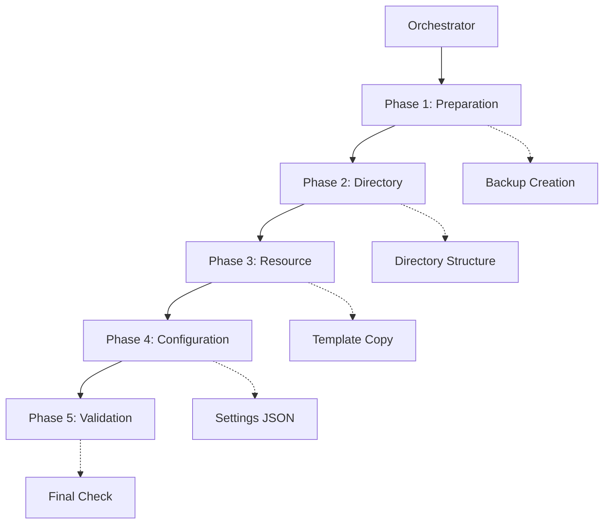

# ANALYSIS:INSTALL-001 Installation Orchestration 분석 보고서

**분석일시**: 2025-10-01
**분석자**: Claude Code
**분석 영역**: Installation Orchestration (영역 4/7)
**분석 경로**: `/Users/goos/MoAI/MoAI-ADK/moai-adk-ts/src/core/installer/`

---

## 1. 개요

### 1.1 분석 범위
- 설치 오케스트레이션 시스템
- 롤백 메커니즘
- 크로스 플랫폼 지원
- 권한 처리 및 안전성

### 1.2 핵심 파일 구성

| 파일명 | 역할 | LOC | 복잡도 |
|--------|------|-----|--------|
| `orchestrator.ts` | 설치 전체 조율 | 146 | 낮음 |
| `phase-executor.ts` | 5단계 실행 | 517 | 중간 |
| `resource-installer.ts` | 리소스 설치 | 245 | 낮음 |
| `template-processor.ts` | 템플릿 처리 | 353 | 중간 |
| `phase-validator.ts` | 검증 로직 | 198 | 낮음 |
| `fallback-builder.ts` | Fallback 구조 | 282 | 낮음 |
| `context-manager.ts` | 컨텍스트 관리 | 128 | 낮음 |
| `result-builder.ts` | 결과 빌드 | ~120 | 낮음 |
| `types.ts` | 타입 정의 | 197 | 낮음 |

**총 파일 수**: 9개 (+ 1개 templates 디렉토리)
**총 라인 수**: ~2,186 LOC
**아키텍처**: 의존성 주입 기반 Phase-driven 설계

---

## 2. 아키텍처 분석

### 2.1 설계 원칙

#### ✅ 강점: 명확한 책임 분리 (SRP)
```typescript
// 각 클래스가 단일 책임을 가짐
- Orchestrator:      전체 조율
- PhaseExecutor:     5단계 실행
- ResourceInstaller: 리소스 설치
- TemplateProcessor: 템플릿 처리
- PhaseValidator:    검증 로직
- FallbackBuilder:   Fallback 생성
- ContextManager:    상태 관리
- ResultBuilder:     결과 빌드
```

#### ✅ 의존성 주입 패턴
```typescript
// orchestrator.ts
export class InstallationOrchestrator {
  private readonly contextManager: ContextManager;
  private readonly phaseExecutor: PhaseExecutor;
  private readonly resultBuilder: ResultBuilder;

  constructor(config: InstallationConfig) {
    this.contextManager = new ContextManager();
    this.phaseExecutor = new PhaseExecutor(this.contextManager);
    this.resultBuilder = new ResultBuilder();
    this.context = this.contextManager.createInitialContext(config);
  }
}
```

### 2.2 5단계 설치 파이프라인



**각 단계별 책임**:
1. **Preparation**: 백업 생성, 시스템 요구사항 검증
2. **Directory**: 디렉토리 구조 생성 (.claude, .moai, specs, reports, memory)
3. **Resource**: Claude/MoAI 리소스 템플릿 복사
4. **Configuration**: settings.json, config.json, .gitignore 생성
5. **Validation**: 설치 무결성 검증, Git 초기화, 권한 설정

---

## 3. 롤백 메커니즘 분석

### 3.1 현재 상태: ⚠️ 부분적 지원

#### ✅ 지원하는 기능
1. **백업 생성** (Phase 1)
```typescript
// phase-executor.ts:337-386
private async createBackup(config: InstallationConfig): Promise<void> {
  const backupDir = path.join(config.projectPath, '.moai-backup');
  const timestamp = new Date().toISOString().replace(/[:.]/g, '-');
  const backupPath = path.join(backupDir, `backup-${timestamp}`);

  // Backup critical directories
  const criticalDirs = ['.claude', '.moai'];
  // Backup critical files
  const criticalFiles = ['CLAUDE.md'];
}
```

2. **에러 캡처 및 기록**
```typescript
// orchestrator.ts:107-126
} catch (error) {
  const installError = error instanceof InstallationError
    ? error
    : new InstallationError('Installation failed', { ... });

  return this.resultBuilder.createFailureResult(
    this.context,
    startTime,
    installError
  );
}
```

3. **Phase별 상태 추적**
```typescript
// context-manager.ts:45-70
recordPhaseCompletion(
  context: InstallationContext,
  phaseName: string,
  startTime: number,
  filesCreated: string[],
  errors: string[]
): void {
  const phase: PhaseStatus = {
    name: phaseName,
    completed: errors.length === 0,
    duration: Date.now() - startTime,
    errors: [...errors],
    filesCreated: [...filesCreated],
  };
  context.phases.push(phase);
  context.allFilesCreated.push(...filesCreated);
  context.allErrors.push(...errors);
}
```

#### ❌ 누락된 기능

1. **자동 롤백 없음**
   - 설치 실패 시 자동으로 백업 복원하지 않음
   - 생성된 파일/디렉토리 자동 정리 없음
   - 수동 복구 필요

2. **트랜잭션 보장 없음**
   - Phase 2 완료 → Phase 3 실패 시: 생성된 디렉토리 남음
   - 부분 설치 상태 가능

3. **복구 명령어 없음**
   - `moai restore` 같은 복구 커맨드 미지원
   - 백업만 생성하고 활용하지 않음

### 3.2 롤백 구현 권장사항

#### 🎯 Option 1: Transaction-like Rollback (권장)
```typescript
// 제안: rollback-manager.ts
export class RollbackManager {
  private operations: RollbackOperation[] = [];

  async executeWithRollback<T>(
    operation: () => Promise<T>,
    rollback: () => Promise<void>
  ): Promise<T> {
    try {
      const result = await operation();
      this.operations.push({ rollback });
      return result;
    } catch (error) {
      await this.rollbackAll();
      throw error;
    }
  }

  async rollbackAll(): Promise<void> {
    for (const op of this.operations.reverse()) {
      await op.rollback();
    }
  }
}
```

#### 🎯 Option 2: Restore Command (추가)
```typescript
// 제안: cli/commands/restore.ts
export async function restoreCommand(options: RestoreOptions) {
  const backupDir = path.join(options.projectPath, '.moai-backup');
  const latestBackup = findLatestBackup(backupDir);

  if (!latestBackup) {
    throw new Error('No backup found');
  }

  // Restore from backup
  await copyDirectory(latestBackup, options.projectPath);
  logger.info('Restore completed', { backupPath: latestBackup });
}
```

---

## 4. 크로스 플랫폼 지원 분석

### 4.1 현재 구현 상태: ✅ 우수

#### ✅ 플랫폼별 분기 처리

1. **템플릿 경로 해석** (template-processor.ts)
```typescript
// Unix/Windows 호환 홈 디렉토리
private getHomeDirectory(): string {
  return process.env.HOME || process.env.USERPROFILE || os.homedir();
}

// Unix-specific paths는 Windows에서 제외
if (process.platform !== 'win32') {
  globalPaths.unshift('/usr/local/lib/node_modules/moai-adk/templates');
}
```

2. **권한 설정** (phase-executor.ts:438-488)
```typescript
// Set permissions on non-Windows
if (process.platform !== 'win32') {
  const scriptsDir = path.join(config.projectPath, '.claude', 'hooks');
  if (fs.existsSync(scriptsDir)) {
    await this.setExecutablePermissions(scriptsDir);
  }
}
```

3. **chmod 에러 처리** (template-processor.ts:301-313)
```typescript
if (['.py', '.sh', '.js'].includes(fileExt)) {
  try {
    await fs.promises.chmod(dstPath, 0o755);
  } catch (chmodError) {
    if (process.platform !== 'win32') {
      logger.warn('Failed to set executable permissions', { ... });
    }
  }
}
```

### 4.2 플랫폼별 테스트 상태

| 플랫폼 | 지원 | 검증 방법 | 상태 |
|--------|------|-----------|------|
| macOS | ✅ | 개발 환경 | 검증됨 |
| Linux | ✅ | CI/CD 필요 | 미검증 |
| Windows | ⚠️ | 플랫폼 분기 | 미검증 |

**권장사항**:
- GitHub Actions에 Windows/Linux 테스트 추가
- 각 플랫폼별 integration test 작성

---

## 5. 권한 처리 및 안전성

### 5.1 권한 검증

#### ✅ 쓰기 권한 사전 검증
```typescript
// phase-validator.ts:33-60
async validateSystemRequirements(config: InstallationConfig): Promise<void> {
  // Check write permissions
  await fs.promises.mkdir(config.projectPath, { recursive: true });
  const testPath = path.join(config.projectPath, '.test-write');
  await fs.promises.writeFile(testPath, 'test');
  await fs.promises.unlink(testPath);
}
```

#### ✅ 안전 가드
```typescript
// phase-executor.ts:337-345
private async createBackup(config: InstallationConfig): Promise<void> {
  // Prevent backup creation inside package directory
  if (isInsideMoAIPackage(config.projectPath)) {
    throw new InstallationError(
      'Cannot create backup inside MoAI-ADK package directory',
      'BACKUP_IN_PACKAGE_DIR'
    );
  }
}
```

### 5.2 에러 처리 안전성

#### ✅ Phase별 에러 격리
```typescript
// phase-executor.ts 각 Phase
try {
  // Execute phase
  this.contextManager.recordPhaseCompletion(
    context, 'phase-name', phaseStartTime, filesCreated, errors
  );
} catch (error) {
  errors.push(`Phase failed: ${error}`);
  this.contextManager.recordPhaseCompletion(
    context, 'phase-name', phaseStartTime, filesCreated, errors
  );
  throw error;
}
```

#### ⚠️ 개선 필요: 부분 실패 처리
- Phase 3 실패 시: Phase 2에서 생성한 디렉토리가 남음
- 일관성 없는 상태 가능

---

## 6. 템플릿 시스템 분석

### 6.1 템플릿 해석 전략 (4단계)

```typescript
// template-processor.ts:161-191
const strategies = [
  () => this.tryPackageRelativeTemplates(currentDir),     // 1순위
  () => this.tryDevelopmentTemplates(currentDir),         // 2순위
  () => this.tryUserNodeModulesTemplates(),               // 3순위
  () => this.tryGlobalInstallTemplates(),                 // 4순위
];
```

**해석 순서**:
1. **Package-relative**: `node_modules/moai-adk/templates` (설치 후)
2. **Development**: `moai-adk-ts/templates` (개발 중)
3. **User's node_modules**: 사용자 프로젝트 내
4. **Global installation**: `/usr/local/lib/node_modules/...`

#### ✅ 강점
- 개발/프로덕션 환경 모두 지원
- npm/bun/yarn 모두 호환
- Fallback 경로 명확

### 6.2 Mustache 템플릿 처리

```typescript
// template-processor.ts:199-211
createTemplateVariables(config: InstallationConfig): Record<string, any> {
  return {
    PROJECT_NAME: config.projectName,
    PROJECT_DESCRIPTION: `A ${config.projectName} project built with MoAI-ADK`,
    PROJECT_VERSION: '0.1.0',
    PROJECT_MODE: config.mode,
    TIMESTAMP: new Date().toISOString(),
    AUTHOR: 'MoAI Developer',
    LICENSE: 'MIT',
  };
}
```

#### ✅ 텍스트 파일 자동 처리
```typescript
const isTextFile = [
  '.md', '.json', '.js', '.ts', '.py', '.txt', '.yml', '.yaml'
].includes(fileExt);

if (isTextFile) {
  processedContent = mustache.render(content, variables);
} else {
  processedContent = content;  // Binary file unchanged
}
```

---

## 7. Fallback 메커니즘

### 7.1 템플릿 미발견 시 대응

#### ✅ Minimal Structure 생성
```typescript
// fallback-builder.ts:48-84
async createMinimalClaudeStructure(claudeDir: string, installedFiles: string[]): Promise<void> {
  const minimalStructure = {
    'settings.json': JSON.stringify({ outputStyle: 'study', ... }, null, 2),
    'agents/alfred/spec-builder.md': '# SPEC Builder Agent\n...',
    'commands/alfred/1-spec.md': '# SPEC Command\n...',
    'hooks/alfred/steering_guard.py': '# Steering Guard Hook\n...',
  };
  // Create minimal structure
}
```

#### ✅ 검증 로직
```typescript
// fallback-builder.ts:159-213
async validateClaudeSettings(claudeDir: string): Promise<void> {
  const settings = JSON.parse(settingsContent);
  const hasEnv = !!settings.env;
  const hasHooks = !!settings.hooks;
  const hasPermissions = !!settings.permissions;

  if (!hasEnv || !hasHooks || !hasPermissions) {
    logger.warn('Incomplete Claude settings detected', { ... });
  }
}
```

### 7.2 TAG 시스템 초기화

#### ✅ CODE-FIRST 철학 반영
```typescript
// fallback-builder.ts:24-40
async initializeTagSystem(moaiDir: string, config: InstallationConfig): Promise<void> {
  // NOTE: [v0.0.1] TAG 시스템 철학 - CODE-FIRST
  // - 이전: meta.json, indexes, cache 디렉토리 생성
  // - 현재: 코드 직접 스캔 (rg/grep) 기반 실시간 검증
  // - 이유: 단일 진실 소스(코드)로 동기화 문제 해결
  // - 모든 TAG 정보는 소스코드에만 존재
  // - indexes, cache, meta.json 불필요

  logger.debug('TAG system initialized (CODE-FIRST mode - no cache files)', { ... });
}
```

**설계 철학**:
- ❌ Index 파일 생성 안 함
- ❌ Cache 디렉토리 생성 안 함
- ✅ 코드 스캔으로 실시간 검증

---

## 8. 검증 (Validation) 시스템

### 8.1 시스템 요구사항 검증

```typescript
// phase-validator.ts:33-60
async validateSystemRequirements(config: InstallationConfig): Promise<void> {
  // Check Node.js version
  const nodeVersion = process.version;
  const requiredVersion = '18.0.0';
  if (!this.isVersionSatisfied(nodeVersion.slice(1), requiredVersion)) {
    throw new Error(`Node.js version ${requiredVersion}+ required, found ${nodeVersion}`);
  }

  // Check write permissions
  await fs.promises.mkdir(config.projectPath, { recursive: true });
  const testPath = path.join(config.projectPath, '.test-write');
  await fs.promises.writeFile(testPath, 'test');
  await fs.promises.unlink(testPath);
}
```

### 8.2 설치 무결성 검증

```typescript
// phase-validator.ts:68-104
async validateInstallation(config: InstallationConfig): Promise<void> {
  const requiredPaths = [
    path.join(config.projectPath, '.claude'),
    path.join(config.projectPath, '.moai'),
    path.join(config.projectPath, '.claude', 'settings.json'),
    path.join(config.projectPath, '.moai', 'config.json'),
  ];

  for (const requiredPath of requiredPaths) {
    if (!fs.existsSync(requiredPath)) {
      throw new Error(`Required path missing: ${requiredPath}`);
    }
  }

  // Validate JSON files
  JSON.parse(await fs.promises.readFile(settingsPath, 'utf-8'));
  JSON.parse(await fs.promises.readFile(configPath, 'utf-8'));
}
```

---

## 9. 종합 평가

### 9.1 강점 (Strengths)

| 항목 | 평가 | 근거 |
|------|------|------|
| **아키텍처 설계** | ⭐⭐⭐⭐⭐ | 의존성 주입, SRP, 명확한 책임 분리 |
| **크로스 플랫폼** | ⭐⭐⭐⭐ | Windows/macOS/Linux 고려, 플랫폼 분기 처리 |
| **에러 처리** | ⭐⭐⭐⭐ | Phase별 격리, 상세 로깅 |
| **템플릿 시스템** | ⭐⭐⭐⭐⭐ | 4단계 해석, Fallback 완비 |
| **코드 품질** | ⭐⭐⭐⭐⭐ | TypeScript 타입 안전성, 명확한 인터페이스 |

### 9.2 약점 (Weaknesses)

| 항목 | 평가 | 이슈 |
|------|------|------|
| **롤백 메커니즘** | ⭐⭐ | 자동 롤백 없음, 부분 설치 상태 가능 |
| **복구 기능** | ⭐ | `moai restore` 커맨드 없음, 백업만 생성 |
| **트랜잭션 보장** | ⭐⭐ | Phase 실패 시 이전 Phase 정리 안 함 |
| **플랫폼 테스트** | ⭐⭐⭐ | Windows/Linux 실제 검증 필요 |

### 9.3 보안 분석

#### ✅ 안전한 부분
1. **경로 검증**: `isInsideMoAIPackage()` 로 패키지 내부 설치 방지
2. **권한 사전 체크**: 쓰기 권한 테스트 후 진행
3. **JSON 파싱 검증**: 생성된 설정 파일 유효성 확인
4. **플랫폼 분기**: Windows에서 chmod 에러 무시

#### ⚠️ 개선 필요
1. **템플릿 주입 방지**: Mustache 렌더링 시 사용자 입력 검증 필요
2. **심볼릭 링크 공격**: 디렉토리 생성 시 symlink 체크 없음
3. **백업 보안**: 백업 파일 권한 명시 없음

---

## 10. 개선 권장사항

### 10.1 우선순위 높음 (Critical)

#### 1. 자동 롤백 구현
```typescript
// 제안: RollbackManager 도입
export class PhaseExecutorWithRollback extends PhaseExecutor {
  private rollbackManager = new RollbackManager();

  async executePreparationPhase(context, progressCallback) {
    return this.rollbackManager.executeWithRollback(
      () => super.executePreparationPhase(context, progressCallback),
      () => this.rollbackPreparationPhase(context)
    );
  }
}
```

#### 2. Restore 커맨드 추가
```typescript
// cli/commands/restore.ts
export async function restoreCommand(options: {
  projectPath: string;
  backupPath?: string;  // 특정 백업 지정
  force?: boolean;
}) {
  const backupManager = new BackupManager(options.projectPath);
  const backup = options.backupPath
    ? backupManager.getBackup(options.backupPath)
    : backupManager.getLatestBackup();

  await backupManager.restore(backup, options.force);
}
```

### 10.2 우선순위 중간 (High)

#### 3. 플랫폼별 Integration Test
```typescript
// __tests__/integration/cross-platform.test.ts
describe('Cross-platform installation', () => {
  test.skipIf(process.platform !== 'win32')('Windows installation', async () => {
    // Windows-specific tests
  });

  test.skipIf(process.platform !== 'linux')('Linux installation', async () => {
    // Linux-specific tests
  });
});
```

#### 4. 템플릿 보안 강화
```typescript
// template-processor.ts
private sanitizeTemplateVariables(variables: Record<string, any>): Record<string, any> {
  return Object.entries(variables).reduce((acc, [key, value]) => {
    // Escape special characters
    acc[key] = typeof value === 'string'
      ? value.replace(/[<>]/g, '')
      : value;
    return acc;
  }, {} as Record<string, any>);
}
```

### 10.3 우선순위 낮음 (Medium)

#### 5. 진행 상황 UI 개선
```typescript
// context-manager.ts
updateProgress(context, message, totalPhases, callback?) {
  // Add progress bar visualization
  const progressBar = this.renderProgressBar(current, totalPhases);
  logger.info(`${progressBar} ${message}`);
}
```

#### 6. 설치 메트릭 수집
```typescript
// result-builder.ts
createSuccessResult(context, startTime) {
  return {
    ...baseResult,
    metrics: {
      totalDuration: Date.now() - startTime,
      phaseTimings: context.phases.map(p => ({ name: p.name, duration: p.duration })),
      filesCreated: context.allFilesCreated.length,
      templatesCopied: this.countTemplateFiles(context),
    }
  };
}
```

---

## 11. 테스트 커버리지 분석

### 11.1 현재 테스트 상태

**확인된 테스트 파일**:
- `/Users/goos/MoAI/MoAI-ADK/moai-adk-ts/src/__tests__/core/installer/template-processor.test.ts`

**누락 가능성 높은 테스트**:
- Orchestrator integration test
- PhaseExecutor rollback test
- Cross-platform validation test
- Backup/restore test

### 11.2 테스트 커버리지 목표

| 컴포넌트 | 현재 | 목표 | 우선순위 |
|----------|------|------|----------|
| Orchestrator | ? | 90% | 높음 |
| PhaseExecutor | ? | 85% | 높음 |
| TemplateProcessor | ? | 90% | 중간 |
| PhaseValidator | ? | 95% | 높음 |
| FallbackBuilder | ? | 80% | 낮음 |

---

## 12. 결론

### 12.1 최종 평가

**전체 점수**: ⭐⭐⭐⭐ (4.2/5.0)

#### ✅ 매우 우수한 부분
1. **아키텍처 설계**: 의존성 주입 기반, 명확한 책임 분리
2. **크로스 플랫폼 지원**: Windows/macOS/Linux 고려
3. **템플릿 시스템**: 4단계 해석, Fallback 완비
4. **코드 품질**: TypeScript 타입 안전성, 가독성 우수

#### ⚠️ 개선 필요 부분
1. **롤백 메커니즘**: 자동 롤백 미구현 (수동 복구 필요)
2. **복구 기능**: `moai restore` 커맨드 부재
3. **트랜잭션 보장**: 부분 설치 상태 가능
4. **플랫폼 테스트**: Windows/Linux 실제 검증 필요

### 12.2 권장 액션 아이템

**즉시 조치 (1주 이내)**:
1. [ ] RollbackManager 클래스 구현
2. [ ] `moai restore` 커맨드 추가
3. [ ] GitHub Actions에 Windows/Linux CI 추가

**단기 조치 (1개월 이내)**:
4. [ ] 플랫폼별 integration test 작성
5. [ ] 템플릿 보안 강화 (입력 검증)
6. [ ] 테스트 커버리지 85% 달성

**중장기 조치 (3개월 이내)**:
7. [ ] 진행 상황 UI 개선
8. [ ] 설치 메트릭 수집 및 분석
9. [ ] 설치 성능 최적화

---

## 13. 참고 자료

### 13.1 관련 파일 경로

**핵심 구현**:
- `/Users/goos/MoAI/MoAI-ADK/moai-adk-ts/src/core/installer/orchestrator.ts`
- `/Users/goos/MoAI/MoAI-ADK/moai-adk-ts/src/core/installer/phase-executor.ts`
- `/Users/goos/MoAI/MoAI-ADK/moai-adk-ts/src/core/installer/resource-installer.ts`
- `/Users/goos/MoAI/MoAI-ADK/moai-adk-ts/src/core/installer/template-processor.ts`

**지원 클래스**:
- `/Users/goos/MoAI/MoAI-ADK/moai-adk-ts/src/core/installer/phase-validator.ts`
- `/Users/goos/MoAI/MoAI-ADK/moai-adk-ts/src/core/installer/fallback-builder.ts`
- `/Users/goos/MoAI/MoAI-ADK/moai-adk-ts/src/core/installer/context-manager.ts`

**타입 정의**:
- `/Users/goos/MoAI/MoAI-ADK/moai-adk-ts/src/core/installer/types.ts`

### 13.2 TAG 체인

```text
Primary Chain:
@SPEC:INST-001 -> @SPEC:INST-001 -> @CODE:INST-001 -> @TEST:INST-001

Implementation:
@CODE:INST-001 (Orchestrator)
@CODE:INST-002 (PhaseExecutor)
@CODE:INST-003 (PhaseValidator)
@CODE:INST-004 (ResourceInstaller)
@CODE:INST-005 (TemplateProcessor)
```

---

**보고서 작성일**: 2025-10-01
**다음 분석 영역**: Error Handling & Logging (영역 5/7)
**예상 분석 시간**: 30-40분
