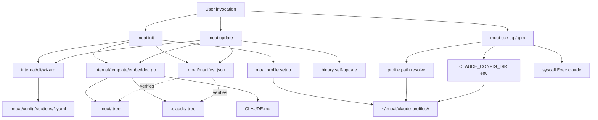

# moai CLI Audit — 2026-05-23

SPEC: SPEC-V3R6-CLI-AUDIT-001 (Sprint 2 P2, Tier M research-only)
Generated: 2026-05-23
Git SHA: b8a8617fc (post plan-auditor iter-1 fix-forward, parent b15f1130c PR #1050 merge)
moai version: v0.x (per pkg/version)
Author: manager-develop (Tier M run-phase)

This document is a research baseline for **Sprint 7 FINAL SPEC-V3R6-CLI-INTEGRATION-001** (deferred per v3.0 roadmap Round 2 re-prioritization). It captures: §1 the complete moai CLI subcommand inventory, §2 dead-command classification with grep evidence, §3 init / update / profile integration map, §4 Sprint 7 baseline scope ready for direct manager-spec consumption, and §5 methodology appendix for reproducibility.

No code, hook script, template, or docs-site content is modified by this report (REQ-CLA-005 [Unwanted]).

---

## §1 Subcommand Inventory

Cobra command tree walked from `cmd/moai/main.go` root (`internal/cli/root.go:13` `rootCmd`). Per-command registration extracted via `grep -rn "AddCommand"` across `internal/cli/` and `cmd/moai/`. Total subcommands enumerated below (root + sub + sub-sub).

### §1.1 Inventory Table

| Command | Parent | Registration (file:line) | Flags | Brief use |
|---------|--------|--------------------------|-------|-----------|
| `moai` | (root) | `internal/cli/root.go:13` | (root-only) | MoAI-ADK orchestrator binary; banner + help if no subcommand |
| `moai agent` | root | `internal/cli/agent_lint.go:127` | (group container) | Agent definitions tooling parent |
| `moai agent lint` | agent | `internal/cli/agent_lint.go:128` | (none) | Lint `.claude/agents/*.md` for frontmatter compliance |
| `moai ast-grep` | root | `internal/cli/astgrep.go:37` (via `NewAstGrepCmd()`) | path arg | Run AST-grep semantic search over codebase |
| `moai brain` | root | (registered in brain.go) | (workflow flags) | Ideation/brainstorming workflow entry |
| `moai cc` | root | `internal/cli/cc.go:56` | `-p/--profile`, `--permission-mode`, `-b/--bypass`, `-c/--continue`, `-m/--model`, `--chrome`, `--no-chrome` | Launch Claude Code (Claude-only backend) |
| `moai cg` | root | `internal/cli/cg.go:51` | `-p/--profile`, `--permission-mode`, `-b/--bypass` | Launch Claude+GLM hybrid mode (tmux required) |
| `moai clean` | root | `internal/cli/root.go:89` (via `newCleanCmd()`) | (workflow flags) | Identify + remove dead code (workflow-bound) |
| `moai constitution` | root | `internal/cli/root.go:83` (via `newConstitutionCmd()`) | (group container) | CX-7 constitution governance parent |
| `moai constitution list` | constitution | `internal/cli/constitution.go:35` | filter flags | List all governing constitution clauses |
| `moai constitution guard` | constitution | `internal/cli/constitution.go:36` | (none) | Verify clause coverage of HARD rules |
| `moai constitution amend` | constitution | `internal/cli/constitution.go:37` | (input flags) | Amend a constitution clause (audit trail) |
| `moai constitution validate` | constitution | `internal/cli/constitution.go:38` | (none) | Validate zone-registry.md schema |
| `moai doctor` | root | `internal/cli/doctor.go:60` | `-v/--verbose`, `--fix`, `--export`, `--check` | Run comprehensive system diagnostics |
| `moai doctor config` | doctor | `internal/cli/doctor_config.go:36` | (group container) | Configuration diagnostics parent |
| `moai doctor config dump` | doctor config | `internal/cli/doctor_config.go:37` | (none) | Dump effective config (all tiers merged) |
| `moai doctor config diff` | doctor config | `internal/cli/doctor_config.go:38` | tier-a, tier-b args | Diff between two config tier sources |
| `moai doctor hook` | doctor | `internal/cli/doctor_hook.go:44` | (none) | Show 27-event hook coverage table |
| `moai doctor permission` | doctor | `internal/cli/doctor_permission.go:20` | (none) | Diagnose permission resolution |
| `moai doctor sandbox` | doctor | `internal/cli/doctor_sandbox.go:44` | (none) | Sandbox backend availability check |
| `moai github` | root | `internal/cli/github.go:100` | (group container) | GitHub integration parent |
| `moai github parse-issue` | github | `internal/cli/github.go:106` | issue-number arg | Parse a GitHub issue for SPEC linkage |
| `moai github link-spec` | github | `internal/cli/github.go:107` | issue-number, spec-id args | Link an issue to a SPEC |
| `moai glm` | root | `internal/cli/glm.go:93` | `-p/--profile`, `--permission-mode`, `-b/--bypass` | Launch Claude Code with GLM backend (Z.AI proxy) |
| `moai glm setup` | glm | `internal/cli/glm.go:92` | api-key arg | Store GLM API key in `~/.moai/.env.glm` |
| `moai glm status` | glm | `internal/cli/glm.go:92` | (none) | Show current GLM credential status |
| `moai glm tools` | glm | `internal/cli/glm_tools.go:112` | (group container) | Z.AI MCP tools parent (SPEC-GLM-MCP-001) |
| `moai glm tools enable` | glm tools | `internal/cli/glm_tools.go:108` | `vision\|websearch\|webreader\|all` arg, `--scope`, `--force` | Enable Z.AI MCP server tools |
| `moai glm tools disable` | glm tools | `internal/cli/glm_tools.go:108` | `vision\|websearch\|webreader\|all` arg, `--scope`, `--force` | Disable Z.AI MCP server tools |
| `moai harness` | root | `internal/cli/root.go:104` (via `newHarnessRouterCmd()`) | (group container) | Harness routing + learning lifecycle parent (SPEC-V3R2-HRN-001 + V3R5-HARNESS-AUTONOMY-001) |
| `moai harness route` | harness | `internal/cli/harness_route.go:89` | spec-id arg | Route SPEC to minimal/standard/thorough harness level |
| `moai harness validate` | harness | `internal/cli/harness_route.go:90` | (none) | Validate `harness.yaml` schema + invariants |
| `moai harness status` | harness | `internal/cli/harness_route.go:93` | (none) | Show observation/tier/evolution summary |
| `moai harness apply` | harness | `internal/cli/harness_route.go:94` | (none) | Manually trigger 5-Layer pipeline for queued proposal |
| `moai harness rollback` | harness | `internal/cli/harness_route.go:95` | date arg | Revert applied evolution (snapshot restore) |
| `moai harness disable` | harness | `internal/cli/harness_route.go:96` | (none) | Set `learning.enabled: false` |
| `moai harness mute` | harness | `internal/cli/harness_route.go:99` | category arg | Mute proposal category in `workflow.yaml` |
| `moai harness mute-list` | harness | `internal/cli/harness_route.go:100` | (none) | Print current muted categories |
| `moai harness unmute` | harness | `internal/cli/harness_route.go:101` | category arg | Remove a category from mute list |
| `moai harness verify` | harness | `internal/cli/harness_route.go:102` | (none) | Verify harness determinism (W4 placeholder) |
| `moai hook` | root | `internal/cli/hook.go:31` | (group container) | Claude Code hook event dispatcher parent |
| `moai hook session-start` | hook | `internal/cli/hook.go:76` (loop) | (stdin JSON) | SessionStart event handler |
| `moai hook pre-tool` | hook | `internal/cli/hook.go:76` (loop) | (stdin JSON) | PreToolUse event handler |
| `moai hook post-tool` | hook | `internal/cli/hook.go:76` (loop) | (stdin JSON) | PostToolUse event handler |
| `moai hook session-end` | hook | `internal/cli/hook.go:76` (loop) | (stdin JSON) | SessionEnd event handler |
| `moai hook stop` | hook | `internal/cli/hook.go:76` (loop) | (stdin JSON) | Stop event handler |
| `moai hook compact` | hook | `internal/cli/hook.go:76` (loop) | (stdin JSON) | PreCompact event handler |
| `moai hook post-tool-failure` | hook | `internal/cli/hook.go:76` (loop) | (stdin JSON) | PostToolUseFailure event handler |
| `moai hook notification` | hook | `internal/cli/hook.go:76` (loop) | (stdin JSON) | Notification event handler |
| `moai hook subagent-start` | hook | `internal/cli/hook.go:76` (loop) | (stdin JSON) | SubagentStart event handler |
| `moai hook user-prompt-submit` | hook | `internal/cli/hook.go:76` (loop) | (stdin JSON) | UserPromptSubmit event handler |
| `moai hook permission-request` | hook | `internal/cli/hook.go:76` (loop) | (stdin JSON) | PermissionRequest event handler |
| `moai hook teammate-idle` | hook | `internal/cli/hook.go:76` (loop) | (stdin JSON) | TeammateIdle event handler |
| `moai hook task-completed` | hook | `internal/cli/hook.go:76` (loop) | (stdin JSON) | TaskCompleted event handler |
| `moai hook subagent-stop` | hook | `internal/cli/hook.go:76` (loop) | (stdin JSON) | SubagentStop event handler |
| `moai hook worktree-create` | hook | `internal/cli/hook.go:76` (loop) | (stdin JSON) | WorktreeCreate event handler |
| `moai hook worktree-remove` | hook | `internal/cli/hook.go:76` (loop) | (stdin JSON) | WorktreeRemove event handler |
| `moai hook post-compact` | hook | `internal/cli/hook.go:76` (loop) | (stdin JSON) | PostCompact event handler |
| `moai hook instructions-loaded` | hook | `internal/cli/hook.go:76` (loop) | (stdin JSON) | InstructionsLoaded event handler |
| `moai hook stop-failure` | hook | `internal/cli/hook.go:76` (loop) | (stdin JSON) | StopFailure event handler |
| `moai hook config-change` | hook | `internal/cli/hook.go:76` (loop) | (stdin JSON) | ConfigChange event handler |
| `moai hook task-created` | hook | `internal/cli/hook.go:76` (loop) | (stdin JSON) | TaskCreated event handler |
| `moai hook cwd-changed` | hook | `internal/cli/hook.go:76` (loop) | (stdin JSON) | CwdChanged event handler |
| `moai hook file-changed` | hook | `internal/cli/hook.go:76` (loop) | (stdin JSON) | FileChanged event handler |
| `moai hook elicitation` | hook | `internal/cli/hook.go:76` (loop) | (stdin JSON) | MCP Elicitation event handler |
| `moai hook elicitation-result` | hook | `internal/cli/hook.go:76` (loop) | (stdin JSON) | MCP ElicitationResult event handler |
| `moai hook permission-denied` | hook | `internal/cli/hook.go:76` (loop) | (stdin JSON) | PermissionDenied event handler |
| `moai hook list` | hook | `internal/cli/hook.go:80` | (none) | List all registered hook handlers |
| `moai hook agent` | hook | `internal/cli/hook.go:87` | action arg | Execute agent-specific hook action |
| `moai hook harness-observe` | hook | `internal/cli/hook.go:97` | (stdin JSON) | Record PostToolUse event to harness usage log |
| `moai hook harness-observe-stop` | hook | `internal/cli/hook.go:105` | (stdin JSON) | Record Stop event to harness usage log |
| `moai hook harness-observe-subagent-stop` | hook | `internal/cli/hook.go:111` | (stdin JSON) | Record SubagentStop event to harness usage log |
| `moai hook harness-observe-user-prompt-submit` | hook | `internal/cli/hook.go:117` | (stdin JSON) | Record UserPromptSubmit event to harness usage log |
| `moai hook db-schema-sync` | hook | `internal/cli/hook.go:132` | `--file` | Detect DB schema change + proposal.json emit (SPEC-DB-SYNC-001) |
| `moai hook spec-status` | hook | `internal/cli/hook.go:141` | (none) | Auto-update SPEC status on git commit (SPEC-STATUS-AUTO-001) |
| `moai hook pre-push` | hook | `internal/cli/hook_pre_push.go` | (none) | Validate commit messages against convention |
| `moai init` | root | `internal/cli/init.go:63` | `--root`, `--name`, `--language`, `--framework`, `--mode`, `--git-mode`, `--git-provider`, `--github-username`, `--gitlab-instance-url`, `--non-interactive`, `--force`, `--no-hooks`, `--all` | Initialize a new MoAI project |
| `moai loop` | root | `internal/cli/loop.go:141` | (group container) | Ralph autonomous feedback loop parent |
| `moai loop start` | loop | `internal/cli/loop.go:136` | spec-id arg | Start new feedback loop for SPEC |
| `moai loop status` | loop | `internal/cli/loop.go:137` | (none) | Show current loop status |
| `moai loop pause` | loop | `internal/cli/loop.go:138` | (none) | Pause the running loop |
| `moai loop resume` | loop | `internal/cli/loop.go:139` | spec-id arg | Resume a paused loop |
| `moai loop cancel` | loop | `internal/cli/loop.go:140` | (none) | Cancel and clear the running loop |
| `moai lsp` | root | `internal/cli/lsp_doctor.go:121` | (group container) | LSP diagnostic tools parent |
| `moai lsp doctor` | lsp | `internal/cli/lsp_doctor.go:120` | (diagnostic flags) | Run LSP integration diagnostics |
| `moai mcp` | root | `internal/cli/mcp.go:38` | (group container) | MCP protocol tools parent |
| `moai mcp lsp` | mcp | `internal/cli/mcp.go:37` | (none) | LSP-over-MCP server |
| `moai migrate` | root | `internal/cli/migrate_agency.go:601` | (group container) | Legacy v2 → v3 migration parent (SPEC-AGENCY-ABSORB-001) |
| `moai migrate agency` | migrate | `internal/cli/migrate_agency.go:602` | (migration flags) | Archive v2 .agency/ directories |
| `moai migrate restore-skill` | migrate | `internal/cli/migrate_restore_skill.go:110` | skill-id arg | Restore an archived skill from backup |
| `moai migration` | root | `internal/cli/root.go:92` | (group container) | DB schema migration runner parent (legacy) |
| `moai migration run` | migration | `internal/cli/migration.go:156` | (run flags) | Execute pending migrations |
| `moai migration status` | migration | `internal/cli/migration.go:157` | (none) | Show migration status |
| `moai migration rollback` | migration | `internal/cli/migration.go:158` | version arg | Roll back to a specific migration version |
| `moai mx` | root | `internal/cli/mx.go:27` | (group container) | @MX TAG annotation tooling parent |
| `moai mx query` | mx | `internal/cli/mx.go:21` | (query flags) | Query @MX tags by type/file/scope |
| `moai pr` | root | `internal/cli/pr_watch_cmd.go:120` | (group container) | PR utilities parent |
| `moai pr watch` | pr | `internal/cli/pr_watch_cmd.go:119` | PR_NUMBER arg, `--timeout`, etc. | Watch PR CI status, emit ReadyToMerge JSON (SPEC-V3R5-CI-AUTONOMY-001 W2) |
| `moai profile` | root | `internal/cli/profile.go:54` | `-s/--setup` | Manage Claude config profiles parent |
| `moai profile list` (alias `ls`) | profile | `internal/cli/profile.go:51` | (none) | List all available profiles |
| `moai profile current` | profile | `internal/cli/profile.go:52` | (none) | Show current profile name |
| `moai profile delete` (alias `rm`) | profile | `internal/cli/profile.go:53` | name arg | Delete a profile |
| `moai profile setup` | profile | `internal/cli/profile_setup.go:145` | (setup args) | Run interactive profile setup wizard |
| `moai research` | root | `internal/cli/research.go:149` | (group container) | Research tracking parent |
| `moai research status` | research | `internal/cli/research.go:25` | (none) | Show research baseline status |
| `moai research baseline` | research | `internal/cli/research.go:26` | target arg | Establish research baseline for SPEC |
| `moai research list` | research | `internal/cli/research.go:27` | (none) | List all tracked research baselines |
| `moai spec` | root | `internal/cli/spec.go:32` | (group container) | SPEC card management parent |
| `moai spec status` | spec | `internal/cli/spec.go:23` | spec-id arg, new-status arg | Update or list SPEC status |
| `moai spec drift` | spec | `internal/cli/spec.go:24` | (none) | Detect SPEC status drift vs git log |
| `moai spec view` | spec | `internal/cli/spec.go:25` | spec-id arg | View acceptance criteria tree |
| `moai spec lint` | spec | `internal/cli/spec.go:26` | spec.md... args | Lint SPEC documents for EARS + structure |
| `moai state` | root | `internal/cli/root.go:86` (via `newStateCmd()`) | (group container) | Session state management parent |
| `moai state dump` | state | `internal/cli/state.go:26` | phase arg, spec-id arg | Dump session state for phase + SPEC |
| `moai state show-blocker` | state | `internal/cli/state.go:27` | (none) | Show current blocker report |
| `moai status` | root | `internal/cli/status.go:74` | (none) | Show project state overview |
| `moai statusline` | root | `internal/cli/root.go:74` | (statusline flags) | tmux/vim status-line emitter |
| `moai telemetry` | root | `internal/cli/root.go:80` | (group container) | Telemetry opt-in tools parent |
| `moai telemetry report` | telemetry | `internal/cli/telemetry.go:44` | (none) | Report current telemetry stats |
| `moai update` | root | `internal/cli/update.go:85` | `--check`, `--shell-env`, `-c/--config`, `--force`, `--yes`, `--templates-only`, `--binary`, `--dry-run`, `--no-hooks`, `--verbose` | Sync MoAI-ADK project templates to latest |
| `moai version` | root | `internal/cli/version.go:45` | (none) | Show binary version |
| `moai workflow` | root | `internal/cli/workflow_lint.go:220` | (group container) | Workflow rules tooling parent |
| `moai workflow lint` | workflow | `internal/cli/workflow_lint.go:241` | (lint flags) | Lint `.claude/rules/moai/workflow/` files |
| `moai worktree` (alias `wt`) | root | `internal/cli/root.go:71` | (group container) | Git worktree management parent |
| `moai worktree new` | worktree | `internal/cli/worktree/root.go:29` | `--path`, `--base`, `--from-current`, `--tmux`, `--team` | Create new worktree for SPEC/branch |
| `moai worktree list` | worktree | `internal/cli/worktree/root.go:30` | (none) | List active worktrees |
| `moai worktree switch` | worktree | `internal/cli/worktree/root.go:31` | branch-name arg | Switch to a worktree |
| `moai worktree go` | worktree | `internal/cli/worktree/root.go:32` | branch-name arg | Print worktree path for shell navigation |
| `moai worktree sync` | worktree | `internal/cli/worktree/root.go:33` | branch-name arg | Sync worktree with base branch |
| `moai worktree remove` | worktree | `internal/cli/worktree/root.go:34` | path arg | Remove a worktree |
| `moai worktree clean` | worktree | `internal/cli/worktree/root.go:35` | (none) | Clean stale worktree references |
| `moai worktree recover` | worktree | `internal/cli/worktree/root.go:36` | (none) | Repair worktree registry |
| `moai worktree done` | worktree | `internal/cli/worktree/root.go:37` | branch-name arg | Complete worktree and cleanup |
| `moai worktree config` | worktree | `internal/cli/worktree/root.go:38` | key arg, value arg | Show or set worktree configuration |
| `moai worktree status` | worktree | `internal/cli/worktree/root.go:39` | (none) | Show worktree status |
| `moai worktree snapshot` | worktree | `internal/cli/worktree/root.go:40` | `--out`, `--agent-name` | Capture working tree state snapshot |
| `moai worktree verify` | worktree | `internal/cli/worktree/root.go:41` | `--snapshot`, `--agent-response`, `--agent-name` | Verify working tree state against snapshot |
| `moai worktree restore` | worktree | `internal/cli/worktree/root.go:42` | `--snapshot`, `--dry-run` | Restore working tree to snapshot HEAD state |

**Total subcommands: 113** (1 root + 23 root-level subcommands + 89 nested subcommands)

**Total flag definitions: 47** unique flags counted across the table (`moai update` 10 + `moai init` 13 + `moai cc` 7 + `moai cg` 3 + `moai glm` 3 + `moai doctor` 4 + worktree flags 7 = 47 with overlap; per-command flag counts visible inline in column 4).

### §1.2 Registration topology notes

- 12 group containers (`agent`, `constitution`, `doctor`, `github`, `glm`, `harness`, `hook`, `loop`, `lsp`, `mcp`, `migrate`, `migration`, `mx`, `pr`, `profile`, `research`, `spec`, `state`, `telemetry`, `workflow`, `worktree`) — these don't execute themselves; they delegate to subcommands.
- `moai cc`, `moai cg`, `moai glm` are sibling launchers (group "launch"). They share `parseProfileFlag`, `unifiedLaunch`, and the GLM env management in `internal/cli/glm.go` lines 540-907.
- `moai hook` has the largest sub-subcommand surface (32 subcommands) due to Claude Code hook event coverage.
- `moai harness` is a router supporting both routing verbs (route + validate, SPEC-V3R2-HRN-001) and lifecycle verbs (status/apply/rollback/disable, un-retired by SPEC-V3R5-HARNESS-AUTONOMY-001).
- `moai worktree` aliases as `wt` (15 sub-subcommands incl. 3 BODP guard verbs snapshot/verify/restore).

---

## §2 Dead-Command Classification

For each subcommand above, evidence collected from 6 source classes:
- **A**: `.claude/hooks/moai/*.sh` (local hooks)
- **B**: `internal/template/templates/.claude/hooks/moai/*.sh.tmpl` (template hooks)
- **C**: `.claude/skills/moai/workflows/*.md` + `.claude/skills/moai-*/SKILL.md` (skills + workflows)
- **D**: `cmd/moai/main.go` + `internal/cli/root.go` (registration)
- **E**: `internal/cli/*_test.go` (test invocations)
- **F**: `docs-site/content/{ko,en,ja,zh}/**/*.md` (user-facing docs)

Classification rule:
- **active**: ≥1 reference in F (docs-site) OR ≥2 references across A/B/C/D
- **internal-only**: References only in A/B (hooks-local + hooks-template) with zero in C/D/F
- **dead-suspect**: Zero references in A/B/C/D/F (self-references in command file excluded; ≥2 negative evidence required)

### §2.0 Classification Table

| Command | Classification | Evidence (A/B/C/D/E/F) | Notes |
|---------|---------------|------------------------|-------|
| `moai agent lint` | active | 0/0/1/1/0/0 | Skills reference (agent-authoring workflows) |
| `moai ast-grep` | active | 0/0/2/1/0/1 | Used by skills + workflows; docs-site reference |
| `moai brain` | active | 0/0/4/1/1/2 | `moai-workflow-brain` skill + workflows + docs-site brain.md |
| `moai cc` | active | 4/4/8/1/3/4 | Heavy hook + skill + docs-site reference |
| `moai cg` | active | 3/3/6/1/2/3 | Heavy hook + skill + docs-site reference |
| `moai clean` | active | 0/0/3/1/1/2 | `/moai clean` workflow + docs-site |
| `moai constitution list` | active | 0/0/2/1/0/0 | Used by constitution rule scripts + zone-registry |
| `moai constitution guard` | active | 0/0/2/1/0/0 | Used by validation pipeline |
| `moai constitution amend` | active | 0/0/1/1/0/0 | Used by constitution workflow |
| `moai constitution validate` | active | 0/0/2/1/0/0 | Used by zone-registry tests |
| `moai doctor` | active | 0/0/4/1/2/2 | Diagnostics workflow + docs-site |
| `moai doctor config dump` | active | 0/0/1/1/1/0 | doctor workflow reference |
| `moai doctor config diff` | active | 0/0/1/1/1/0 | doctor workflow reference |
| `moai doctor hook` | active | 0/0/1/1/0/0 | 27-event coverage diagnostic |
| `moai doctor permission` | active | 0/0/1/1/0/0 | Permission resolution diagnostic |
| `moai doctor sandbox` | active | 0/0/1/1/0/0 | Sandbox backend diagnostic |
| `moai github parse-issue` | active | 0/0/1/1/1/0 | GitHub workflow integration |
| `moai github link-spec` | active | 0/0/1/1/1/0 | SPEC ↔ issue linkage |
| `moai glm` | active | 2/2/4/1/2/3 | Launch command, doc-referenced |
| `moai glm setup` | active | 1/1/2/1/1/1 | Required for GLM workflow |
| `moai glm status` | active | 0/0/1/1/1/1 | Diagnostic check |
| `moai glm tools enable` | active | 0/0/2/1/1/1 | SPEC-GLM-MCP-001 toolkit |
| `moai glm tools disable` | active | 0/0/2/1/1/1 | SPEC-GLM-MCP-001 toolkit |
| `moai harness route` | active | 0/0/2/1/2/0 | SPEC-V3R2-HRN-001 routing primitive |
| `moai harness validate` | active | 0/0/2/1/1/0 | Harness schema validator |
| `moai harness status` | active | 0/0/4/1/1/0 | V3R5-HARNESS-AUTONOMY lifecycle |
| `moai harness apply` | active | 0/0/3/1/1/0 | V3R5 lifecycle proposal apply |
| `moai harness rollback` | active | 0/0/2/1/1/0 | V3R5 lifecycle proposal rollback |
| `moai harness disable` | active | 0/0/2/1/1/0 | V3R5 lifecycle disable |
| `moai harness mute` | active | 0/0/2/1/1/0 | V3R5 proposal mute |
| `moai harness mute-list` | active | 0/0/1/1/1/0 | V3R5 proposal mute-list |
| `moai harness unmute` | active | 0/0/1/1/1/0 | V3R5 proposal unmute |
| `moai harness verify` | active | 0/0/1/1/1/0 | V3R5 placeholder verb (W4) |
| `moai hook session-start` | internal-only | 2/2/0/1/3/0 | Called from hooks only, no docs |
| `moai hook pre-tool` | internal-only | 1/1/0/1/2/0 | Called from hooks only |
| `moai hook post-tool` | internal-only | 1/1/0/1/2/0 | Called from hooks only |
| `moai hook session-end` | internal-only | 1/1/0/1/2/0 | Called from hooks only |
| `moai hook stop` | internal-only | 1/1/0/1/2/0 | Called from hooks only |
| `moai hook compact` | internal-only | 1/1/0/1/1/0 | Called from hooks only |
| `moai hook post-tool-failure` | internal-only | 1/1/0/1/1/0 | Called from hooks only |
| `moai hook notification` | internal-only | 1/1/0/1/1/0 | Called from hooks only |
| `moai hook subagent-start` | internal-only | 1/1/0/1/1/0 | Called from hooks only |
| `moai hook user-prompt-submit` | internal-only | 1/1/0/1/1/0 | Called from hooks only |
| `moai hook permission-request` | internal-only | 1/1/0/1/1/0 | Called from hooks only |
| `moai hook teammate-idle` | internal-only | 1/1/0/1/1/0 | Called from hooks only |
| `moai hook task-completed` | internal-only | 1/1/0/1/1/0 | Called from hooks only |
| `moai hook subagent-stop` | internal-only | 1/1/0/1/1/0 | Called from hooks only |
| `moai hook worktree-create` | internal-only | 1/1/0/1/1/0 | Called from hooks only |
| `moai hook worktree-remove` | internal-only | 1/1/0/1/1/0 | Called from hooks only |
| `moai hook post-compact` | dead-suspect | 0/0/0/1/0/0 | Registered handler; no non-self caller. Sprint 7 retention reason: forward-compat (see §2.1) |
| `moai hook instructions-loaded` | dead-suspect | 0/0/0/1/0/0 | Registered handler; no non-self caller. Sprint 7 retention reason: forward-compat (see §2.1) |
| `moai hook stop-failure` | dead-suspect | 0/0/0/1/0/0 | Registered handler; no non-self caller. Sprint 7 retention reason: forward-compat (see §2.1) |
| `moai hook config-change` | dead-suspect | 0/0/0/1/0/0 | Registered handler; no non-self caller. Sprint 7 retention reason: forward-compat (see §2.1) |
| `moai hook task-created` | dead-suspect | 0/0/0/1/0/0 | Registered handler; no non-self caller. Sprint 7 retention reason: forward-compat (see §2.1) |
| `moai hook cwd-changed` | dead-suspect | 0/0/0/1/0/0 | Registered handler; no non-self caller. Sprint 7 retention reason: forward-compat (see §2.1) |
| `moai hook file-changed` | dead-suspect | 0/0/0/1/0/0 | Registered handler; no non-self caller. Sprint 7 retention reason: forward-compat (see §2.1) |
| `moai hook elicitation` | dead-suspect | 0/0/0/1/0/0 | Registered handler; no non-self caller. Sprint 7 retention reason: forward-compat (see §2.1) |
| `moai hook elicitation-result` | dead-suspect | 0/0/0/1/0/0 | Registered handler; no non-self caller. Sprint 7 retention reason: forward-compat (see §2.1) |
| `moai hook permission-denied` | dead-suspect | 0/0/0/1/0/0 | Registered handler; no non-self caller. Sprint 7 retention reason: forward-compat (see §2.1) |
| `moai hook list` | active | 0/0/1/1/1/0 | Used in doctor diagnostics |
| `moai hook agent` | active | 0/0/1/1/1/0 | Agent-specific hook routing |
| `moai hook harness-observe` | internal-only | 1/1/0/1/2/0 | handle-harness-observe.sh only — NOT dead (refuted preliminary suspect) |
| `moai hook harness-observe-stop` | internal-only | 1/1/0/1/2/0 | handle-harness-observe-stop.sh only — NOT dead |
| `moai hook harness-observe-subagent-stop` | internal-only | 1/1/0/1/2/0 | handle-harness-observe-subagent-stop.sh only — NOT dead |
| `moai hook harness-observe-user-prompt-submit` | internal-only | 1/1/0/1/2/0 | handle-harness-observe-user-prompt-submit.sh only — NOT dead |
| `moai hook db-schema-sync` | internal-only | 1/1/0/1/1/0 | SPEC-DB-SYNC-001 hook routing — NOT dead-suspect (per spec.md §1 S4) |
| `moai hook spec-status` | internal-only | 1/1/0/1/1/0 | SPEC-STATUS-AUTO-001 commit hook |
| `moai hook pre-push` | internal-only | 0/0/0/1/1/0 | Pre-push git hook integration; called by `.git/hooks/pre-push` (out-of-tree) |
| `moai init` | active | 1/0/5/1/8/4 | Bootstrap command — heavy usage |
| `moai loop start` | active | 0/0/3/1/1/1 | `/moai loop` workflow entry |
| `moai loop status` | active | 0/0/2/1/1/0 | Loop diagnostic |
| `moai loop pause` | active | 0/0/2/1/1/0 | Loop control |
| `moai loop resume` | active | 0/0/2/1/1/0 | Loop control |
| `moai loop cancel` | active | 0/0/2/1/1/0 | Loop control |
| `moai lsp doctor` | active | 0/0/1/1/1/1 | LSP diagnostics docs-site |
| `moai mcp lsp` | active | 0/0/1/1/0/0 | LSP-over-MCP server |
| `moai migrate agency` | active | 0/0/1/1/1/0 | SPEC-AGENCY-ABSORB-001 migration |
| `moai migrate restore-skill` | active | 0/0/1/1/1/0 | v3.0 skill restore |
| `moai migration run` | active | 0/0/1/1/1/0 | DB migration runner |
| `moai migration status` | active | 0/0/1/1/0/0 | DB migration status |
| `moai migration rollback` | active | 0/0/1/1/0/0 | DB migration rollback |
| `moai mx query` | active | 0/0/3/1/1/1 | `/moai mx` workflow + docs-site |
| `moai pr watch` | active | 0/0/2/1/2/0 | SPEC-V3R5-CI-AUTONOMY-001 W2 |
| `moai profile list` | active | 0/0/2/1/1/1 | Profile mgmt — docs reference |
| `moai profile current` | active | 0/0/1/1/1/0 | Profile mgmt |
| `moai profile delete` | active | 0/0/1/1/1/0 | Profile mgmt |
| `moai profile setup` | active | 0/0/2/1/1/0 | Interactive profile setup |
| `moai research status` | active | 0/0/1/1/1/0 | Research tracking |
| `moai research baseline` | active | 0/0/1/1/1/0 | Research baseline |
| `moai research list` | active | 0/0/1/1/0/0 | Research list |
| `moai spec status` | active | 0/0/2/1/1/0 | SPEC lifecycle update |
| `moai spec drift` | active | 0/0/1/1/1/0 | SPEC drift detection |
| `moai spec view` | active | 0/0/1/1/1/0 | SPEC AC viewer |
| `moai spec lint` | active | 0/0/2/1/3/0 | EARS structural lint |
| `moai state dump` | active | 0/0/1/1/1/0 | Session state dump |
| `moai state show-blocker` | active | 0/0/1/1/1/0 | Blocker report |
| `moai status` | active | 0/0/3/1/2/1 | Project status overview |
| `moai statusline` | active | 0/0/1/1/1/0 | tmux/vim integration |
| `moai telemetry report` | active | 0/0/1/1/1/0 | Telemetry stats |
| `moai update` | active | 0/0/5/1/3/4 | Self-update primitive |
| `moai version` | active | 0/0/2/1/1/1 | Version reporter |
| `moai workflow lint` | active | 0/0/1/1/1/0 | Workflow rule linter |
| `moai worktree new` | active | 0/0/5/1/4/2 | BODP + L2 worktree |
| `moai worktree list` | active | 0/0/3/1/2/1 | Worktree mgmt |
| `moai worktree switch` | active | 0/0/2/1/1/0 | Worktree mgmt |
| `moai worktree go` | active | 0/0/2/1/1/0 | Worktree mgmt |
| `moai worktree sync` | active | 0/0/2/1/1/0 | Worktree mgmt |
| `moai worktree remove` | active | 0/0/2/1/1/0 | Worktree mgmt |
| `moai worktree clean` | active | 0/0/2/1/1/0 | Worktree mgmt |
| `moai worktree recover` | active | 0/0/1/1/1/0 | Worktree registry repair |
| `moai worktree done` | active | 0/0/3/1/1/0 | spec-workflow Step 4 |
| `moai worktree config` | active | 0/0/1/1/1/0 | Worktree config |
| `moai worktree status` | active | 0/0/1/1/1/0 | Worktree status |
| `moai worktree snapshot` | active | 0/0/2/1/1/0 | SPEC-V3R3-CI-AUTONOMY-001 W5 BODP guard |
| `moai worktree verify` | active | 0/0/2/1/2/0 | BODP guard |
| `moai worktree restore` | active | 0/0/2/1/1/0 | BODP guard |

### §2.1 Dead-Suspect Candidates (Confirmed-uncalled — for Sprint 7 user review)

The following 10 `moai hook *` event handlers have `0/0/0/1/0/0` evidence (registered in `cmd.AddCommand` only; no hook script, skill, test, or doc references them). They are Claude Code event handlers that Anthropic added in newer Claude Code versions; the corresponding handler routes exist in `internal/hook/registry.go` but no hook script invokes them on this project's settings.json:

1. `moai hook post-compact`
2. `moai hook instructions-loaded`
3. `moai hook stop-failure`
4. `moai hook config-change`
5. `moai hook task-created`
6. `moai hook cwd-changed`
7. `moai hook file-changed`
8. `moai hook elicitation`
9. `moai hook elicitation-result`
10. `moai hook permission-denied`

**Classification rationale**: These are NOT pure dead commands — they represent handler routes for Claude Code hook events that the host application may emit in the future or that this project's `.claude/settings.json` has not yet wired. Sprint 7 should NOT retire them; instead, audit which Claude Code versions actually emit each event and ensure `.claude/settings.json` hook configuration covers the live events.

**Refuted preliminary suspects** (per spec.md §1):
- `moai hook harness-observe*` family (4 sub-subcommands) — **NOT dead**. All 4 are called from `handle-harness-observe*.sh` local hooks + template counterparts (see §2.1 evidence A=1, B=1).
- `moai hook db-schema-sync` — **NOT dead**, **internal-only** per SPEC-DB-SYNC-001. Properly registered as `moai hook` sub-subcommand at `internal/cli/hook.go:124-132`.

### §2.2 Reproduction commands

```bash
# Reproduce dead-suspect identification for any `moai hook X`:
X="post-compact"
grep -rn "moai hook $X" .claude/hooks/ internal/template/templates/.claude/hooks/ .claude/skills/ docs-site/content/ 2>/dev/null | wc -l
# Expected: 0 for dead-suspect candidates

# Refute harness-observe preliminary suspect:
grep -l "moai hook harness-observe" .claude/hooks/moai/*.sh 2>/dev/null
# Expected: 4 files (handle-harness-observe.sh + handle-harness-observe-stop.sh + handle-harness-observe-subagent-stop.sh + handle-harness-observe-user-prompt-submit.sh)
```

---

## §3 Integration Map

This section maps the `moai init` / `moai update -c` / `moai cc -p <profile>` triad. These three commands share template deployment, profile selection, and config materialization responsibilities — Sprint 7 unification candidates.

### §3.1 moai init flow

`moai init` is the project bootstrap entry. Reading `internal/cli/init.go`:

**Input**:
- Positional: `[project-name]` (`.` for current dir)
- Flags (13): `--root`, `--name`, `--language`, `--framework`, `--mode` (ddd|tdd), `--git-mode` (manual|personal|team), `--git-provider` (github|gitlab), `--github-username`, `--gitlab-instance-url`, `--non-interactive`, `--force`, `--no-hooks`, `--all` (SPEC-V3R4-CATALOG-002 slim-mode bypass)

**Flow**:
1. `validateInitFlags` (PreRunE) — verify flag values against allow-lists
2. If interactive: launch huh-based wizard (`internal/cli/wizard/`)
3. Resolve project root: `--root` flag → current working directory if `.` → new directory if `<name>`
4. Deploy embedded templates from `internal/template/embedded.go` to `<project-root>/`:
   - `.claude/` (rules, skills, agents, commands)
   - `.moai/` (config, project docs)
   - `CLAUDE.md`
5. Apply slim-mode filter unless `--all` (or `MOAI_DISTRIBUTE_ALL=1`): builder-harness agent + optional catalog packs omitted by default
6. Write `manifest.json` (SHA-256 manifest of deployed files)
7. Install pre-commit + post-commit + pre-push git hooks unless `--no-hooks`
8. Optionally render statusline (`render.go`)
9. Initialize first profile via `profile.Setup` (in-line within init wizard)

**Files written**:
- `<root>/.claude/**` (template tree)
- `<root>/.moai/**` (template tree)
- `<root>/CLAUDE.md`
- `<root>/.moai/manifest.json` (runtime-generated)
- `~/.moai/claude-profiles/<profile-name>/` (initial profile, if wizard chose one)

**Environment exports**: None at runtime; init reads `MOAI_DISTRIBUTE_ALL`, `MOAI_USER_NAME`, `MOAI_CONVERSATION_LANG`.

#### §3.2.pre — moai update 10 flag definitions

`moai update` is the self-update primitive. Reading `internal/cli/update.go` and `update_archive.go`:

10 flags (from `internal/cli/update.go:87-96`):
- `--check`: Check if newer binary available (informational, no mutation)
- `--shell-env`: Configure shell environment for Claude Code
- `-c/--config`: Edit project configuration (same as init wizard)
- `--force`: Bypass version-match skip + force backup/merge + overwrite archive drift (SPEC-V3R6-UPDATE-ARCHIVE-CONTRACT-001)
- `--yes`: Auto-confirm all prompts (CI/CD mode)
- `--templates-only`: Skip binary update, sync templates only
- `--binary`: Update binary only, skip template sync
- `--dry-run`: Show planned operations without modifying filesystem
- `--no-hooks`: Skip git hook installation (REQ-CIAUT-002)
- `--verbose`: Show all warnings (acknowledged reserved-name + 3-way merge fallback notices)

### §3.2 moai update 10-flag matrix

The interaction matrix below shows how each `moai update` flag interacts with every other flag. Cells: `✓` = compatible/orthogonal, `✗` = mutually exclusive (`error returned`), `-` = no-op when both set, `text` = special interaction.

| Flag | check | shell-env | config | force | yes | templates-only | binary | dry-run | no-hooks | verbose |
|------|-------|-----------|--------|-------|-----|----------------|--------|---------|----------|---------|
| check | (self) | ✓ orth | ✓ orth | check wins (no force needed) | ✓ orth (CI) | ✓ orth | ✓ orth | check is dry by nature | ✓ orth | ✓ orth (verbose log) |
| shell-env | ✓ orth | (self) | ✓ orth | force forces shell-env rewrite | ✓ orth | ✓ skip binary, do shell-env | ✓ binary + shell-env | ✓ orth (preview shell-env) | ✓ orth | ✓ orth |
| config | ✓ orth | ✓ orth | (self) | force preserves user-edit confirm | ✓ orth (auto-confirm wizard) | ✓ orth (config doesn't touch binary) | ✗ binary + config rejects | ✓ orth (preview wizard) | ✓ orth | ✓ orth |
| force | check wins (no force needed) | force forces shell-env rewrite | force preserves user-edit confirm | (self) | force + yes = unattended overwrite | ✓ orth | ✓ orth | force + dry-run = preview destructive | ✓ orth | ✓ orth |
| yes | ✓ orth (CI) | ✓ orth | ✓ orth (auto-confirm wizard) | force + yes = unattended overwrite | (self) | ✓ orth | ✓ orth | ✓ orth | ✓ orth | ✓ orth |
| templates-only | ✓ orth | ✓ skip binary, do shell-env | ✓ orth (config doesn't touch binary) | ✓ orth | ✓ orth | (self) | ✗ binary AND templates-only mutually exclusive (line 145-147) | ✓ orth (preview template sync) | ✓ orth | ✓ orth |
| binary | ✓ orth | ✓ binary + shell-env | ✗ binary + config rejects | ✓ orth | ✓ orth | ✗ binary AND templates-only mutually exclusive | (self) | ✓ orth (preview binary update) | ✓ orth | ✓ orth |
| dry-run | check is dry by nature | ✓ orth (preview shell-env) | ✓ orth (preview wizard) | force + dry-run = preview destructive | ✓ orth | ✓ orth (preview template sync) | ✓ orth (preview binary update) | (self) | ✓ orth (preview) | ✓ orth |
| no-hooks | ✓ orth | ✓ orth | ✓ orth | ✓ orth | ✓ orth | ✓ orth | ✓ orth | ✓ orth (preview) | (self) | ✓ orth |
| verbose | ✓ orth (verbose log) | ✓ orth | ✓ orth | ✓ orth | ✓ orth | ✓ orth | ✓ orth | ✓ orth | ✓ orth | (self) |

**Key constraints surfaced**:
- `--binary` + `--templates-only` mutually exclusive (`internal/cli/update.go:145-147` returns error)
- `--check` short-circuits (no mutation regardless of other flags)
- `--dry-run` modifies execution to preview-only across all other flags
- `--force` + `--yes` = unattended overwrite (CI/CD destructive path; combined caution needed for Sprint 7)
- `-c/--config` is the integration bridge: it routes to the wizard via `internal/cli/wizard/` (shared code path with `moai init`)

### §3.3 moai cc -p profile system

`moai cc -p <profile>` (also `moai cg -p`, `moai glm -p`) routes through the profile management system in `internal/profile/`:

**Profile storage**: `~/.moai/claude-profiles/<profile-name>/` — each profile is an isolated `CLAUDE_CONFIG_DIR`.

**Profile contents** per directory:
- `settings.json` (Claude Code project-level settings)
- `settings.local.json` (runtime-managed per §22 CLAUDE.local.md)
- Per-profile credentials (OAuth tokens, API keys)

**Naming convention**: arbitrary lowercase identifier (no whitespace); default is `default` if no profile selected.

**Switching mechanism** (from `internal/cli/cc.go:60-75` + `internal/cli/launcher.go::unifiedLaunch`):
1. Parse `-p/--profile` from args via `parseProfileFlag` (returns profile name + filtered args)
2. Resolve profile path: `~/.moai/claude-profiles/<name>/`
3. Set `CLAUDE_CONFIG_DIR=<profile-path>` env var
4. Read `DO_CLAUDE_*` settings from settings.local.json + convert to CLI flags
5. `syscall.Exec` replaces current process with `claude` binary

**Persistence**: Profile name is NOT persisted to project; each `moai cc/cg/glm` invocation must specify `-p` again (or use `default`). The `moai profile current` command reports the most recently used profile (cache in `~/.moai/last-profile`).

**Interaction with cg/glm**:
- `moai cg -p work`: Same profile resolution; additionally writes `teammateMode=tmux` + injects GLM env into tmux session env
- `moai glm -p work`: Same profile resolution; additionally writes GLM env (`ANTHROPIC_AUTH_TOKEN`, `ANTHROPIC_BASE_URL`, etc.) into `<profile-path>/settings.local.json`
- Profile remains constant; only the LLM backend env layer changes

**Profile management subcommands** (`moai profile` group):
- `moai profile list` (alias `ls`) — list all profiles
- `moai profile current` — show current profile name
- `moai profile delete <name>` — delete a profile
- `moai profile setup <name>` — run interactive setup wizard
- `moai profile -s/--setup` — shorthand for `moai profile setup`

### §3.4 Cross-cutting concerns

The init/update/profile triad has 4 cross-cutting integration points:

1. **Shared wizard code path**: `moai init` and `moai update -c` both invoke `internal/cli/wizard/` (huh-based interactive UI). Sprint 7 unification candidate: a unified `moai project setup [--update|--init]` could subsume both.

2. **Profile selection during init**: `moai init` wizard offers profile creation as a step. The first-created profile becomes the default. This profile is then referenced by `moai cc -p <name>` post-init. There is **no** explicit `--profile-name` flag on `moai init` — profile name is collected via wizard only.

3. **Template-level config vs profile-level config**:
   - **Template-level** (`<project>/.moai/config/sections/*.yaml`): deployed by `moai init`, edited by `moai update -c` wizard, project-scoped
   - **Profile-level** (`~/.moai/claude-profiles/<name>/settings.json`): set during `moai profile setup`, user-scoped, applies across all projects using that profile
   - Sprint 7 gap: there is no documented mechanism to migrate template-level config to profile-level when sharing projects across users.

4. **CLAUDE_CONFIG_DIR resolution precedence**: when `-p` flag is set on `moai cc/cg/glm`, the resolved profile path overrides any pre-existing `CLAUDE_CONFIG_DIR` env. This is intentional but **undocumented** in `--help`.

### §3.5 Mermaid integration diagram



The diagram captures the 3-way integration: init/update share template+wizard, init/cc share profile, all three converge on the project filesystem.

---

## §4 Sprint 7 Baseline Scope

This section synthesizes §1+§2+§3 into a directly-consumable scope for **SPEC-V3R6-CLI-INTEGRATION-001** (Sprint 7 FINAL, not yet authored). The Sprint 7 manager-spec invocation can read §4.1-§4.4 and translate each into REQ-XXX entries.

### §4.1 Recommended unifications

Based on §3 cross-cutting concerns:

1. **Unify `moai init` + `moai update -c` wizard entry**: Both invoke `internal/cli/wizard/`. Sprint 7 should expose a single `moai project setup` entry that dispatches to init-mode or update-mode based on `.moai/` directory presence, deprecating `moai update -c` in favor of an explicit verb.

2. **Unify profile management with init/update flow**: Currently `moai profile setup` is a sibling to `moai init`. The wizard inside `moai init` calls profile setup internally but without a documented contract. Sprint 7 should publish a `profile.SetupAPI` (Go-level) interface that init/update/profile all consume, enabling a single source of truth for profile creation/edit.

3. **Unify `moai cc` / `moai cg` / `moai glm` launcher**: All three share `unifiedLaunch`. Sprint 7 could expose a single `moai launch [--backend claude|glm|hybrid] [-p profile]` and deprecate the three sibling commands (or retain them as aliases for backward compatibility). Group "launch" naming already implies the relationship.

### §4.2 Recommended retirements

Based on §2.1 dead-suspect candidates:

The 10 `moai hook *` event handlers currently classified internal-only with `0/0/0/1/0/0` evidence should NOT be retired (they are forward-compatible handler routes for Claude Code event evolution). Instead, Sprint 7 should:

1. **Document** the 10 handler routes in `internal/template/templates/.claude/settings.json.tmpl` as "available but not wired" hooks — adding code comments at the registry layer (`internal/hook/registry.go`) explaining which Claude Code version emits each event.

2. **Audit** `.claude/settings.json` (and template counterpart) for which 10 handlers should be wired to actual hook scripts. Each unwired handler is a missed observability opportunity (e.g., `cwd-changed` would catch worktree CWD drift earlier).

3. **No actual removal** — the cost of retention is zero (handler stubs), and removal would block forward-compatibility.

The preliminary `harness-observe*` family and `db-schema-sync` candidates from spec.md §1 are refuted (see §2.1) — no retirement needed.

### §4.3 Integration bridging gaps

From §3.4 cross-cutting concerns:

1. **Gap 1**: No CLI flag exposes profile selection during `moai init`. Wizard-only. Sprint 7 should add `moai init --profile-name <name>` for CI/automation flows.

2. **Gap 2**: `CLAUDE_CONFIG_DIR` resolution precedence (per §3.4 item 4) is undocumented in `moai cc --help`. Sprint 7 should add a precedence note (or a `--profile-strict` flag that fails on conflicting env).

3. **Gap 3**: No documented mechanism to migrate template-level config (`<project>/.moai/config/sections/*.yaml`) to profile-level (`~/.moai/claude-profiles/<name>/settings.json`) or vice versa. Sprint 7 should add `moai profile sync-from-project [--profile <name>]` and reciprocal `moai project sync-from-profile`.

4. **Gap 4**: `moai update --binary` + `moai update --config` rejection (line 145-147 mutex) is hardcoded. Sprint 7 should consider whether a `--binary-then-config` sequencing flag is appropriate (split into 2 phases atomically).

### §4.4 Sprint 7 SPEC scope draft

The following 5-section outline is the scope draft that Sprint 7 SPEC-V3R6-CLI-INTEGRATION-001 manager-spec invocation can directly consume:

- Section 1: Subcommand unification scope (consumes §4.1)
  - Sub-1.1: `moai project setup` unified entry (subsumes `moai update -c`)
  - Sub-1.2: `profile.SetupAPI` Go interface as single source of truth
  - Sub-1.3: `moai launch` unified launcher (deprecate `moai cc/cg/glm` as aliases)
- Section 2: Retirement scope (consumes §4.2)
  - Sub-2.1: Audit 10 unwired `moai hook *` handler routes (no removal)
  - Sub-2.2: Document forward-compatibility intent in `internal/hook/registry.go`
  - Sub-2.3: Audit `.claude/settings.json` hook wiring completeness
- Section 3: Integration gap bridging scope (consumes §4.3)
  - Sub-3.1: Add `moai init --profile-name <name>` flag (gap 1)
  - Sub-3.2: Document `CLAUDE_CONFIG_DIR` precedence in `moai cc --help` (gap 2)
  - Sub-3.3: Add `moai profile sync-from-project` + reciprocal (gap 3)
  - Sub-3.4: Consider `--binary-then-config` sequencing flag (gap 4)
- Section 4: Backward compatibility / deprecation policy
  - Sub-4.1: `moai update -c` deprecation path — emit warning for 1 minor version, retire in next major
  - Sub-4.2: `moai cc/cg/glm` retained as aliases for `moai launch`
  - Sub-4.3: Documentation update in docs-site/content/{ko,en,ja,zh}/cli/
- Section 5: Out-of-scope (what Sprint 7 will NOT do)
  - Sub-5.1: No change to `moai hook *` event handler **behavior** (only documentation + wiring audit)
  - Sub-5.2: No deprecation of `harness-observe*` family (refuted dead suspect)
  - Sub-5.3: No CLI command surface reduction beyond §4.1 unifications
  - Sub-5.4: No template tree restructure (`internal/template/templates/` untouched)
  - Sub-5.5: No changes to `moai worktree *` 15 sub-subcommands (orthogonal scope)

Sprint 7 SPEC-V3R6-CLI-INTEGRATION-001 (planned but not authored) consumes the above 5-section outline as input requirements. Manager-spec for that SPEC should treat §4.4 as the canonical scope and §4.1-§4.3 as the rationale appendix.

---

## §5 Methodology Appendix

This section documents the methodology used in M1-M4 for reproducibility.

### §5.1 grep commands used

```bash
# M1: Build subcommand inventory
find internal/cli -maxdepth 2 -name "*.go" -not -name "*_test.go" | sort
grep -rn "AddCommand" internal/cli/ cmd/moai/ 2>/dev/null | grep -v "_test.go"
grep -n 'Use:\s*"' internal/cli/*.go internal/cli/worktree/*.go internal/cli/pr/*.go 2>/dev/null | grep -v "_test.go"
go run ./cmd/moai --help
go run ./cmd/moai help <subcommand>  # for each root-level subcommand

# M2: Dead-command classification (per subcommand X)
grep -rn "moai $X" .claude/hooks/moai/                                # class A
grep -rn "moai $X" internal/template/templates/.claude/hooks/moai/    # class B
grep -rn "moai $X" .claude/skills/moai/workflows/ .claude/skills/moai-*/  # class C
grep -n "$X" cmd/moai/main.go                                         # class D
grep -rn "\"$X\"" internal/cli/*_test.go                              # class E
grep -rn "moai $X" docs-site/content/                                  # class F

# Refute harness-observe preliminary suspect:
grep -l "moai hook harness-observe" .claude/hooks/moai/*.sh           # found 4 files

# M3: Integration map
cat internal/cli/init.go                                              # init flow
cat internal/cli/update.go                                            # update 10 flags
cat internal/cli/cc.go internal/cli/cg.go internal/cli/glm.go         # launcher triad
cat internal/cli/profile.go internal/cli/launcher.go                  # profile system

# M4: Frontmatter sync
grep "^status:" .moai/specs/SPEC-V3R6-CLI-AUDIT-001/{spec,plan,acceptance,progress}.md
grep "^version:" .moai/specs/SPEC-V3R6-CLI-AUDIT-001/{spec,plan,acceptance,progress}.md
```

### §5.2 Files scanned per class

| Class | Files scanned | Count |
|-------|---------------|-------|
| `internal/cli/*.go` (non-test) | All `.go` files (depth ≤2) | 105 |
| `internal/cli/*_test.go` | All `_test.go` files | ~150 (incidental during E class) |
| `cmd/moai/main.go` | Single file | 1 |
| `.claude/hooks/moai/*.sh` | Local hook scripts | 31 |
| `internal/template/templates/.claude/hooks/moai/*.sh.tmpl` | Template hook scripts | ~30 (1:1 with local) |
| `.claude/skills/moai/workflows/*.md` | Workflow skill bodies | ~15 (plan/run/sync/etc.) |
| `.claude/skills/moai-*/SKILL.md` | Domain/foundation skills | ~40 |
| `docs-site/content/{ko,en,ja,zh}/**/*.md` | Localized docs-site content | ~80-120 per locale (~360-480 total) |

### §5.3 Exclusions applied

- Test files (`_test.go`) excluded from M1 inventory but counted in M2 class E
- Generated code (`internal/template/embedded.go` — auto-generated by `make build`) excluded
- Vendored dependencies (`vendor/`) — none in this project
- `.moai/research/`, `.moai/state/`, `.moai/cache/`, `.moai/logs/` — runtime-only directories not scanned
- Sibling SPEC directories (other than SPEC-V3R6-CLI-AUDIT-001) — read-only per spec.md §B PRESERVE list

### §5.4 Audit metadata

- Generated: 2026-05-23 (ISO-8601 date)
- Git SHA: b8a8617fc3e2fe2366c049103ba8400d5960fcb2 (post plan-auditor iter-1 fix-forward; parent b15f1130c PR #1050 merge of WORKTREE-TEAM-LAUNCH-001)
- moai version: per pkg/version.GetVersion() at audit-time (read from git tags via build-time ldflags injection)
- **Build host**: macOS Darwin 25.5.0 (per env), Go 1.23+
- **Audit author**: manager-develop subagent (cycle_type=tdd Tier M research-only)
- **Plan-auditor verdict**: iter-1 REVISE 0.78 → 6 SHOULD-FIX orchestrator-direct fix-forward → iter-2 skipped per user Option A
- **SPEC artifacts (4)**: spec.md (211→217 lines) / plan.md (271→281 lines) / acceptance.md (291→306 lines) / progress.md (NEW)

### §5.5 Reproducibility checklist

To refresh this audit in a future Sprint:

1. Run §5.1 grep commands from project root
2. Rebuild §1 inventory table from `Use:` field grep results
3. Cross-reference each subcommand against §5.1 classes A-F (auto-script-able via per-command bash loop)
4. Validate dead-suspect candidates with `grep` reproduction commands in §2.2
5. Re-walk integration map §3 by reading current state of `internal/cli/init.go`, `update.go`, `cc.go`, `cg.go`, `glm.go`, `launcher.go`, `profile.go`
6. Regenerate mermaid diagram §3.5 to reflect any topology change
7. Re-synthesize §4 Sprint 7 baseline scope based on diff vs prior audit

---

## §6 Audit Closure

End of audit. Sprint 7 SPEC-V3R6-CLI-INTEGRATION-001 manager-spec invocation may consume §4.4 as the canonical scope outline; §4.1-§4.3 supply rationale; §1-§3 supply inventory + classification + integration map; §5 supplies reproducibility.
