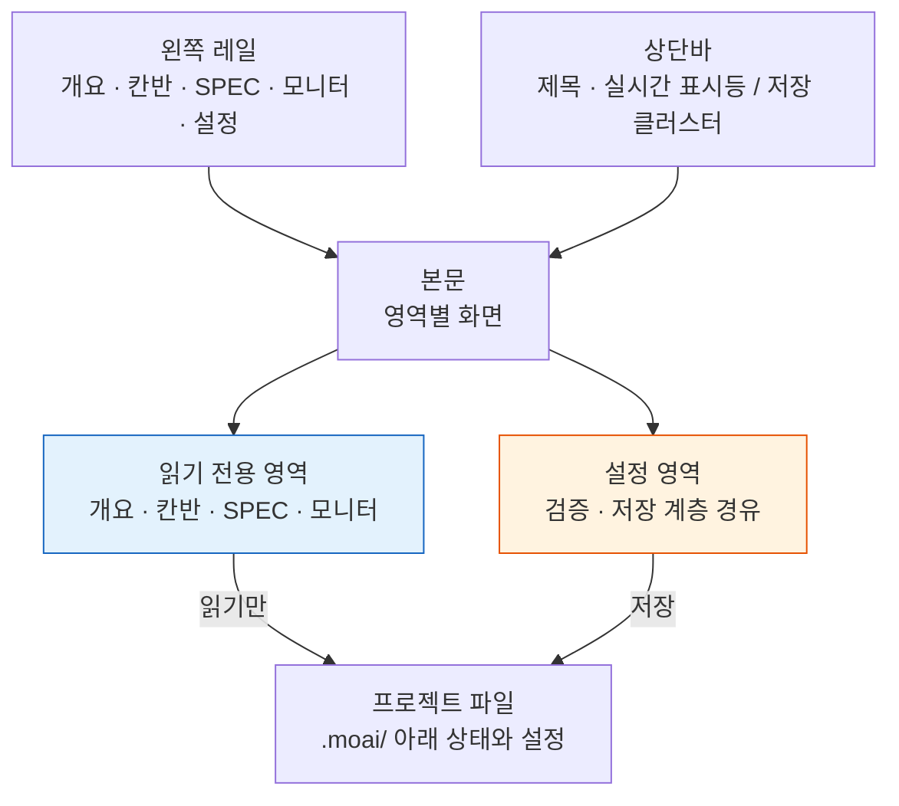

# MoAI Web Console

**MoAI Web Console** 은 `moai web` 으로 켜는 로컬 운영 화면입니다. 프로젝트의 SPEC 카탈로그, 칸반 체인, 세션과 목표, 검증 이력을 한자리에서 보고, 같은 화면 안에서 설정까지 고칩니다. 브라우저는 `127.0.0.1` 로만 붙고, 데이터베이스도 로그인도 없습니다.


**한 줄 요약:** 콘솔은 관측 화면 넷과 설정 화면 하나를 왼쪽 레일로 묶은 운영 셸입니다. 관측 화면은 읽기만 하고, 설정 화면은 터미널 마법사와 같은 검증·저장 계층을 씁니다.


## 운영 셸 — 왼쪽 레일과 상단바

화면은 세 조각으로 나뉩니다. 왼쪽 **레일**에 다섯 영역이 세로로 놓이고, 위쪽 **상단바**에 현재 화면 제목과 상태 표시가 오고, 나머지가 **본문**입니다. 어느 영역에 있든 레일과 상단바는 같은 자리에 남습니다.

| 영역 | 경로 | 하는 일 |
|------|------|---------|
| 개요(Overview) | `/` | 프로젝트 전체 요약 — 통계 타일, 칸반 체인, 진행 중 SPEC, 주의 목록, 세션 |
| 칸반(Kanban) | `/kanban` | 체인 세션 보드 + SPEC 파이프라인 4컬럼 |
| SPEC(Specs) | `/specs` | SPEC 카탈로그 검색·필터·상세, 종료 부채와 MUST-FIX drift |
| 모니터(Monitor) | `/monitor` | 세션 · 목표 · 검증 · 에픽 네 패널 |
| 설정(Settings) | `/settings` | 프로필 선호도와 프로젝트 섹션 편집 (11개 탭) |

상단바 오른쪽에 오는 것은 영역에 따라 다릅니다. 관측 영역 넷에서는 **실시간 표시등**이, 설정 영역에서는 **저장 클러스터**(변경 개수와 저장 버튼)가 놓입니다. 문맥 칩(`lang` · `model` · `effort` · `dev`)은 설정 영역에서만 렌더됩니다 — 지금 편집 중인 프로필의 핵심 값을 저장 전에 눈으로 확인하라는 용도이기 때문입니다.

레일 아래쪽에는 프로필 버튼, 프로젝트 이름, 인터페이스 언어 선택기, 종료 버튼이 모여 있습니다. 프로필 버튼을 누르면 팝오버가 열려 전환 · 생성 · 이름 변경 · 삭제가 한자리에서 끝납니다. 어느 화면에서 열어도 같은 팝오버라, 프로필을 다루는 표면은 콘솔 전체에 하나뿐입니다.

## 개요 — 지금 프로젝트가 어떤 상태인가

개요는 네 개의 통계 타일로 시작합니다. **SPEC**(전체 개수와 진행 중 개수), **drift**(MUST-FIX 건수), **session**(PID 확인된 수 / 레지스트리 등록 수), **verify**(마지막 검증 결과와 키 개수)입니다.

그 아래 **칸반 체인 바**는 현재 카드가 `lead → plan → run → sync` 네 역할을 어디까지 지나왔는지 한 줄로 보여 줍니다. 세션이 없는 역할이 있으면 그 지점을 체인이 멈춘 자리로 표시합니다. 이어서 **진행 중 SPEC** 목록, **주의 필요** 패널(MUST-FIX drift · 실패한 검증 · 정체된 목표 · 비어 있는 역할만 모읍니다), 오른쪽에 **세션** 패널이 놓입니다.

## 칸반 — 두 개의 보드

칸반 영역에는 성격이 다른 보드 두 개가 위아래로 놓입니다.

**체인 세션 보드**는 다섯 역할을 카드로 늘어놓고 각 역할의 세션 id, 백엔드, 모델, 추론 강도, 컨텍스트 사용량, 마지막 하트비트를 적습니다. 단계 상태는 하트비트에서 **추정한** 값이라 추정 표식이 함께 붙고, 모델·추론 강도·컨텍스트는 아직 기록되지 않는 값이라 비워 둡니다 — 채워 넣지 않는 것이 규율입니다.

**SPEC 파이프라인**은 SPEC 을 status 기준 네 컬럼(`draft` · `in-progress` · `implemented` · `completed`)으로 늘어놓습니다. `superseded` · `archived` · `rejected` 는 이 보드에 오지 않고 SPEC 영역의 필터로만 봅니다.

## SPEC — 카탈로그와 두 개의 경고 패널

SPEC 영역 맨 위에는 검색창과 status 필터 칩이 있습니다. 그 바로 아래에 경고 패널 두 개가 목록보다 **먼저** 옵니다.

- **종료 부채(Close debt)** — 구현은 끝났는데(`implemented`) lifecycle 이 `completed` 로 닫히지 않은 SPEC 입니다. 건수가 많으면 최근 갱신순 몇 건만 보여 주고, 잘랐다는 사실과 전체 건수를 함께 적습니다.
- **MUST-FIX drift** — 조치 명령을 동반한 drift 입니다. 명령은 **복사만** 됩니다. 콘솔은 어떤 명령도 서버에서 실행하지 않습니다 — 복사해서 자기 터미널에서 직접 실행하는 구조입니다.

두 패널이 목록 위에 오는 이유는 단순합니다. 카탈로그가 수백 줄일 때 아래에 두면 화면 한참 밑으로 밀려나 사실상 없는 것과 같아지기 때문입니다.

목록은 ID · 제목 · status · Tier · era · 갱신일 · drift 열로 이뤄집니다. 행을 고르면 오른쪽에서 상세 패널이 열려 문서 목록, 파일 경로, drift 상세를 보여 줍니다.

## 모니터 — 네 개의 관측 패널

| 패널 | 읽는 것 |
|------|---------|
| 세션(Sessions) | 세션 id, SPEC, 백엔드, 하트비트, 작업 디렉터리 |
| 목표(Goals) | 무장된 목표의 조건, 진행한 턴 수, 정체 여부, 판정 |
| 검증(Verification) | 키별 최근 이력 스파크라인과 통과 여부 |
| 에픽(Epics) | `moai epic status` 가 계산한 에픽별 진행률 |

## 실시간 갱신 — 신호만 보내고 다시 가져온다

관측 영역은 파일이 바뀌면 스스로 갱신됩니다. 서버는 `GET /events` 에 SSE(Server-Sent Events — 서버가 브라우저로 단방향 이벤트를 흘려보내는 표준) 스트림을 열어 두고, `.moai/` 아래를 감시하다가 변경을 250밀리초 단위로 묶어서 내보냅니다.

핵심은 **이벤트가 데이터를 나르지 않는다**는 점입니다. 서버는 "이 영역이 바뀌었다"는 이름만 보내고, 브라우저는 그 신호를 받아 현재 화면을 다시 가져와 본문만 갈아끼웁니다. 렌더링의 진실이 서버 한 곳에만 남으므로, 화면과 파일이 서로 다른 말을 하는 상태가 생기지 않습니다.

| 이벤트 | 감시 대상 |
|--------|-----------|
| `spec` | `.moai/specs` |
| `session` | `.moai/state` |
| `goal` | `.moai/state/goal` |
| `verify` | `.moai/state/verify` |
| `kanban` | `.moai/state/kanban` |
| `config` | `.moai/config/sections` |

`config` 이벤트만 다르게 다룹니다. 설정을 편집하는 중에 화면이 밑에서 바뀌면 입력하던 값이 사라지므로, 갱신하지 않고 "설정 파일이 바뀌었다"는 배너만 띄웁니다.

연결이 끊기면 조용히 멈추지 않습니다. 상단바 표시등이 끊김 상태로 바뀌고, 브라우저가 재연결을 시도하다 세 번 실패하면 30초 간격 폴링으로 내려갑니다. 폴링 중이라는 사실은 표시등에 그대로 남습니다.

## 모르는 것을 아는 것처럼 쓰지 않는다

콘솔이 지키는 규율 하나가 화면 곳곳에 드러납니다.

- **세션 활성** 은 프로세스 생존을 확인한 것만 활성으로 올립니다. 레지스트리에 기록이 남아 있어도 프로세스가 이미 끝났을 수 있으므로, 확인되지 않은 항목은 낡음으로 표시합니다.
- **단계 상태** 는 하트비트에서 추정한 값이며, 추정이라는 사실을 표식으로 함께 적습니다.
- **기록되지 않은 값**(역할별 모델 · 추론 강도 · 컨텍스트 사용량)은 그럴듯한 값으로 채우지 않고 비워 둡니다.
- **빈 목록**은 빈 채로 두지 않고 "없다"고 적습니다. 빈 패널은 "아직 읽지 못했다"로 읽히기 때문입니다.

## 설정 — 같은 검사, 같은 파일

설정 영역은 콘솔에서 유일하게 파일을 쓰는 곳입니다. 콘솔은 자체 검증 규칙을 두지 않고 터미널 마법사(`moai profile`, `moai update -c`)와 **같은 검증·영속화 계층**을 호출합니다. 어느 쪽으로 고쳐도 결과가 같은 이유입니다.

레일에서 설정을 고르면 그 아래로 11개 탭이 세로 목록으로 펼쳐집니다.

1. **사용자 정보(Identity)** — 표시 이름과 프로젝트 단위 identity 필드
2. **언어(Language)** — 대화 · 커밋 메시지 · 코드 주석 · 문서 언어
3. **LLM** — 권한 모드 · 모델 · 추론 강도
4. **서드파티 LLM(3rd Party LLM)** — 티어별 GLM 모델, 티어별 추론 강도, GLM API 키
5. **워크플로우(Workflow)** — 실행 모드 · 기본 모드 · agentic-loop · loop-prevention
6. **Git·워크트리(Git & Worktree)** — `git_strategy.mode`, 프로필별 `merge_method`, 워크트리 · branch-guard 토글
7. **감사(Audit)** — 감사 모델과 백엔드별 게이트
8. **에이전트(Agents)** — 에이전트별 프로필 · 모델 할당
9. **리포트(Report)** — 리포트 형식과 출력 선호
10. **MCP** — `moai mcp-server` 도구별 활성 토글. 쓰기 가능 도구에는 구분 표식이 붙습니다
11. **교차 세션(Cross-Session)** — 세션 간 메시징의 수신 자세(posture): 인바운드 처리 방식(`accept` · `hold` · `refuse`), 머신 간 전송 격리, 보류 대화 만료. `crosssession.yaml`을 편집하며, 런처가 다음 `moai cc`/`glm`/`cg` 실행부터 이 값을 세션에 주입합니다 — 이미 돌고 있는 세션은 띄울 때의 자세를 유지합니다

각 탭 옆의 숫자는 그 탭이 렌더하는 필드 수입니다. 오류가 있는 탭은 숫자 대신 경고 표식이 붙어, 어느 탭을 열어야 하는지 목록에서 바로 보입니다.

### 위젯 정직성

필드는 값의 실제 도메인에 맞는 위젯으로 렌더됩니다. bool 필드는 체크박스가 아니라 2옵션 라디오 그룹으로 그립니다 — 체크박스는 현재 선택을 감추지만 라디오 쌍은 드러냅니다. `execution_mode` 나 `audit.model` 같은 닫힌 집합은 select 나 라디오로 두고, 집합 밖의 값은 저장 시 거부합니다. 저장소 경로나 API 키처럼 도메인이 정말로 열린 값만 자유 텍스트로 남습니다.

### GLM 정직 배지

추론 강도의 런타임 전달 채널은 세션 단위 환경변수 하나뿐이라, 티어별로 적어 둔 추론 강도는 **저장 전용**입니다. 설정에는 남지만 런타임은 세션 단위 값만 읽습니다. 서드파티 LLM 탭에는 적용 원천을 명시하는 배지가 있어, 이 사실이 암시가 아니라 명시로 드러납니다.

### 편집 범위

편집 가능한 범위는 단일 진실 공급원 하나로 정해져 있고, 콘솔은 그 안에서만 씁니다. `user` · `language` · `quality` · `git-convention` · `git-strategy` · `llm` 은 typed 검증 경로로 저장되고, `workflow` 와 `report` 는 파일 안의 주석과 줄 순서를 보존하는 seam 으로 저장됩니다. 기계 · 상태 섹션과 대형 정책 파일은 제외군이며, 새 섹션도 명시적으로 등재되기 전까지는 기본 거부됩니다. 각 섹션의 키는 [config 섹션 레퍼런스](/ko/advanced/config-sections/) 에서 다룹니다.

## 보안 모델

**루프백 전용.** 콘솔은 `127.0.0.1` 에만 바인딩됩니다. 같은 머신의 다른 계정이나 원격 호스트에서는 닿지 않습니다.

**데이터베이스 없음.** 별도 DB 를 띄우지 않습니다. 읽고 쓰는 값은 현재 프로젝트의 `.moai/` 아래 파일이 전부입니다.

**인증 없음.** 루프백 전용이 전제이므로 로그인이나 토큰 계층이 없습니다.

**명령 실행 없음.** 관측 영역은 GET 이외의 메서드를 거부하고, 어떤 화면도 서버에서 명령을 실행하지 않습니다. SPEC 의 status 전이도 콘솔이 하지 않습니다 — 전이의 소유자는 각 단계의 관리자 에이전트입니다.


루프백 전용이 인증 없음의 전제입니다. 역방향 프록시나 `0.0.0.0` 바인딩으로 외부에 노출하는 구성은 지원하지 않습니다. 원격에서 봐야 하면 SSH 터널로 로컬 포트를 전달하세요.


## 4-로케일 인터페이스

인터페이스 언어는 레일 아래 선택기에서 **English · 한국어 · 日本語 · 中文** 가운데 고릅니다. 고른 언어는 브라우저에 남아 다음에 열 때 첫 렌더부터 적용됩니다. docs-site 의 [4-로케일 문서](/ko/resources/i18n-docs/) 와 같은 언어 세트라 화면과 문서를 모국어로 함께 볼 수 있습니다.

## 켜고 끄는 방법

프로젝트 디렉터리에서 `moai web` 을 실행하면 `127.0.0.1:3041` 에 바인딩되고 브라우저가 자동으로 열립니다.

| 플래그 | 기본값 | 동작 |
|--------|--------|------|
| `--port <int>` | `3041` | 바인딩할 루프백 포트 |
| `--no-open` | `false` | 브라우저 자동 열기를 끕니다 |
| `--no-reuse` | `false` | 포트를 쓰는 오래된 moai 인스턴스를 회수하지 않고 충돌로 끝냅니다 |

종료는 터미널에서 `Ctrl+C`, 혹은 레일 아래의 종료 버튼입니다. 세부 동작은 [CLI 레퍼런스 — moai web](/ko/cli-reference/web/) 을 참조하세요.

## 관련 문서

- [CLI 레퍼런스 — moai web](/ko/cli-reference/web/) — 플래그와 라우트 세부 사항
- [칸반 모드](/ko/advanced/kanban-mode/) — 콘솔이 그리는 체인의 원본 규약
- [config 섹션 레퍼런스](/ko/advanced/config-sections/) — 설정 영역이 다루는 키
- [moai epic status](/ko/cli-reference/epic/) — 모니터의 에픽 패널이 읽는 산출물
