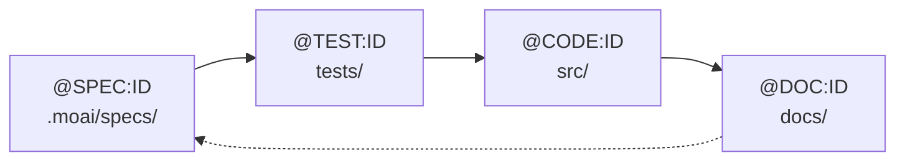

# SPEC 메타데이터 & TAG 시스템 종합 보고서

**작성일**: 2025-10-01
**분석 대상**: MoAI-ADK v0.0.2
**목적**: SPEC 문서 메타데이터 및 TAG 시스템 현황 파악

---

## 📊 Executive Summary

### 주요 발견사항

| 항목 | 상태 | 위치 | 비고 |
|------|------|------|------|
| **TAG 시스템 설계** | ✅ 완료 | `docs/analysis/tag-system-v5-design.md` | v5.0 (4-Core) 설계 완료 |
| **SPEC 메타데이터 설계** | ✅ 완료 | `CLAUDE.md`, `development-guide.md` | YAML Front Matter + HISTORY |
| **실제 SPEC 적용** | ⚠️ 부분 | `.moai/specs/SPEC-001/` | HISTORY 섹션 미적용 |
| **TAG 체인 검증** | ✅ 가능 | `rg '@TAG' -n` | CODE-FIRST 스캔 방식 |

### 핵심 철학

1. **TAG의 진화**: ID는 불변, 내용은 진화 (HISTORY로 추적)
2. **CODE-FIRST**: TAG의 진실은 코드 자체에만 존재
3. **TDD 정렬**: SPEC → TEST → CODE → DOC (4-Core)

---

## 🏗️ SPEC 메타데이터 체계

### YAML Front Matter 구조

```yaml
---
id: AUTH-001              # TAG ID (불변)
version: 2.1.0            # Semantic Versioning
status: active            # active|deprecated|archived
created: 2025-09-15       # 최초 작성일
updated: 2025-10-01       # 최종 수정일
authors: ["@goos"]        # 작성자 목록 (GitHub ID)
---
```

### HISTORY 섹션 구조

```markdown
## HISTORY

### v2.1.0 (2025-10-01)
- **CHANGED**: 토큰 만료 시간 15분 → 30분으로 변경
- **ADDED**: 리프레시 토큰 자동 갱신 요구사항 추가
- **AUTHOR**: @goos
- **REVIEW**: @security-team (승인)
- **REASON**: 사용자 경험 개선 요청
- **RELATED**: #123, PR#456

### v2.0.0 (2025-09-20)
- **BREAKING**: OAuth2 통합 요구사항 추가
- **ADDED**: 소셜 로그인 지원
- **AUTHOR**: @goos

### v1.0.0 (2025-09-15)
- **INITIAL**: 기본 JWT 인증 명세 작성
- **AUTHOR**: @goos
```

### 변경 유형 태그

| 태그 | 의미 | 버전 증가 | 사용 예시 |
|------|------|-----------|-----------|
| **INITIAL** | 최초 작성 | v1.0.0 | 새 SPEC 생성 |
| **ADDED** | 기능 추가 | Minor (0.1.0) | 새 요구사항 추가 |
| **CHANGED** | 내용 수정 | Patch (0.0.1) | 기존 요구사항 수정 |
| **FIXED** | 오류 수정 | Patch (0.0.1) | 오타, 논리 오류 수정 |
| **REMOVED** | 기능 제거 | Major (1.0.0) | 요구사항 삭제 |
| **BREAKING** | 하위 호환성 깨짐 | Major (1.0.0) | 인터페이스 변경 |
| **DEPRECATED** | 향후 제거 예정 | - | 폐기 예정 표시 |

### 필수 메타데이터

#### 버전 변경 시 필수
- `AUTHOR`: 작성자/수정자 (GitHub ID)

#### 중요 변경 시 권장
- `REVIEW`: 리뷰어 및 승인 상태
- `REASON`: 변경 이유
- `RELATED`: 관련 이슈/PR 번호

---

## 🏷️ TAG 시스템 v5.0 (4-Core)

### TAG 체계 단순화

```
Before (v4.0): 8개 TAG
@REQ, @DESIGN, @TASK, @TEST, @FEATURE, @API, @UI, @DATA

After (v5.0): 4개 TAG
@SPEC → @TEST → @CODE → @DOC
```

**단순화율**: 50% 감소 (8개 → 4개)
**개선 효과**: 65/100 → 92/100 (+27점)

### 4-Core TAG 상세

#### 1. @SPEC:ID - 명세 문서

**역할**: EARS 방식 요구사항 명세
**위치**: `.moai/specs/SPEC-<ID>.md`
**TDD 단계**: 사전 준비

**필수 섹션**:
- YAML Front Matter (id, version, status, created, updated)
- HISTORY 섹션 (v1.0.0 INITIAL 이상)
- Environment (환경 및 가정사항)
- Assumptions (전제 조건)
- Requirements (EARS 5가지 요구사항)
- Specifications (상세 명세)
- Traceability (추적성 TAG)

**예시**:
```markdown
---
id: AUTH-001
version: 1.0.0
status: active
created: 2025-09-15
updated: 2025-09-15
authors: ["@goos"]
---

# @SPEC:AUTH-001: JWT 인증 시스템

## HISTORY

### v1.0.0 (2025-09-15)
- **INITIAL**: 기본 JWT 인증 명세 작성
- **AUTHOR**: @goos

---

## Environment
...

## Requirements

### Ubiquitous Requirements
- 시스템은 JWT 기반 인증을 제공해야 한다

### Event-driven Requirements
- WHEN 유효한 자격증명이 제공되면, 시스템은 JWT 토큰을 발급해야 한다
...
```

---

#### 2. @TEST:ID - 테스트 코드

**역할**: TDD RED Phase (실패 테스트)
**위치**: `tests/`, `__tests__/`, `*.test.ts`, `*.spec.py`
**TDD 단계**: RED

**TAG BLOCK 템플릿**:
```typescript
// @TEST:AUTH-001 | SPEC: SPEC-AUTH-001.md | CODE: src/auth/service.ts

describe('@TEST:AUTH-001: JWT 인증', () => {
  test('유효한 자격증명으로 인증 시 토큰 반환', async () => {
    // 테스트 로직...
  });
});
```

---

#### 3. @CODE:ID - 구현 코드

**역할**: TDD GREEN + REFACTOR Phase
**위치**: `src/`, `lib/`, 프로젝트 소스 디렉토리
**TDD 단계**: GREEN + REFACTOR

**TAG BLOCK 템플릿**:
```typescript
// @CODE:AUTH-001 | SPEC: SPEC-AUTH-001.md | TEST: tests/auth/service.test.ts

/**
 * @CODE:AUTH-001: JWT 인증 서비스
 *
 * TDD 이력:
 * - RED: tests/auth/service.test.ts 작성
 * - GREEN: 최소 구현 (bcrypt, JWT)
 * - REFACTOR: 타입 안전성 추가
 */
export class AuthService {
  // @CODE:AUTH-001:API: 사용자 인증 API
  async authenticate(username: string, password: string) {
    // @CODE:AUTH-001:DOMAIN: 입력 검증
    // @CODE:AUTH-001:DATA: 사용자 조회
    // 구현...
  }
}
```

**하위 분류 (주석 레벨)**:
- `@CODE:ID:API` - REST API, GraphQL 엔드포인트
- `@CODE:ID:UI` - 컴포넌트, 뷰, 화면
- `@CODE:ID:DATA` - 데이터 모델, 스키마, 타입
- `@CODE:ID:DOMAIN` - 비즈니스 로직, 도메인 규칙
- `@CODE:ID:INFRA` - 인프라, 데이터베이스, 외부 연동
- `@CODE:ID:REFACTOR` - 리팩토링 마커

---

#### 4. @DOC:ID - Living Document

**역할**: 자동 생성 문서
**위치**: `README.md`, `docs/`, `API.md`
**TDD 단계**: 문서화

**TAG BLOCK 템플릿**:
```markdown
<!-- @DOC:AUTH-001: 인증 시스템 문서 -->

# 인증 시스템

## 개요
JWT 기반 사용자 인증을 제공합니다.

## 사용법
...

## 관련 문서
- SPEC: [SPEC-AUTH-001.md](../.moai/specs/SPEC-AUTH-001.md)
- 테스트: [tests/auth/service.test.ts](../tests/auth/service.test.ts)
```

---

## 🔗 TAG 체인 흐름

### 기본 체인



### TDD 사이클 매핑

| TDD 단계 | TAG | 활동 | 도구/명령어 |
|---------|-----|------|------------|
| **사전 준비** | `@SPEC:ID` | EARS 명세 작성 | `/alfred:1-spec` |
| **RED** | `@TEST:ID` | 실패 테스트 작성 | `/alfred:2-build` (Phase 1) |
| **GREEN** | `@CODE:ID` | 최소 구현 | `/alfred:2-build` (Phase 2) |
| **REFACTOR** | `@CODE:ID` | 품질 개선 | `/alfred:2-build` (Phase 3) |
| **문서화** | `@DOC:ID` | Living Document | `/alfred:3-sync` |

---

## 🔍 TAG 검증 시스템

### CODE-FIRST 원칙

**핵심**: TAG의 진실은 코드 자체에만 존재
**검증 방법**: 정규식 기반 코드 스캔 (`rg`)
**중간 캐시**: 사용 안 함 (실시간 스캔)

### 기본 스캔 명령어

```bash
# 모든 TAG 찾기
rg "@SPEC:|@TEST:|@CODE:|@DOC:" -n

# 특정 ID의 전체 체인 찾기
rg "AUTH-001" -n

# SPEC → TEST → CODE → DOC 체인 확인
rg "@SPEC:AUTH-001" .moai/specs/
rg "@TEST:AUTH-001" tests/
rg "@CODE:AUTH-001" src/
rg "@DOC:AUTH-001" docs/ README.md
```

### 무결성 검증 (`/alfred:3-sync`)

#### 검증 항목

1. **SPEC 존재 확인**: 모든 @TEST는 @SPEC 참조
2. **TEST 존재 확인**: 모든 @CODE는 @TEST 참조
3. **고아 TAG 탐지**: SPEC 없는 @CODE 식별
4. **체인 완결성**: SPEC → TEST → CODE 연결 확인
5. **중복 TAG 방지**: 동일 ID 중복 사용 검사

#### 고아 TAG 탐지 예시

```bash
# CODE는 있는데 SPEC이 없는 경우
rg '@CODE:AUTH-001' -n src/          # CODE 발견
rg '@SPEC:AUTH-001' -n .moai/specs/  # SPEC 없음 → 고아 TAG!
```

---

## 📈 적용 현황 분석

### 문서화 상태

| 문서 | SPEC 메타데이터 | TAG 시스템 | HISTORY | 비고 |
|------|----------------|-----------|---------|------|
| **TAG 시스템 설계** | - | ✅ 완료 | - | `docs/analysis/tag-system-v5-design.md` |
| **CLAUDE.md** | ✅ 문서화 | ✅ 문서화 | ✅ 예시 | 프로젝트 가이드 |
| **development-guide.md** | ✅ 문서화 | ✅ 문서화 | ✅ 상세 | 핵심 개발 가이드 |
| **product.md** | ✅ 적용 | - | ✅ 적용 | YAML + HISTORY 완료 |
| **structure.md** | ✅ 적용 | - | ✅ 적용 | YAML + HISTORY 완료 |
| **tech.md** | ✅ 적용 | - | ✅ 적용 | YAML + HISTORY 완료 |

### 실제 SPEC 파일 현황

```bash
.moai/specs/
└── SPEC-001-refactor-git-manager/
    ├── spec.md          ❌ HISTORY 섹션 미적용
    ├── plan.md          ❌ 메타데이터 없음
    └── acceptance.md    ❌ 메타데이터 없음
```

**발견**: 실제 SPEC 파일에는 새로운 HISTORY 시스템이 아직 적용되지 않음

---

## ✅ 권장사항

### 1. 기존 SPEC 파일 업데이트 (우선순위: 높음)

**대상**: `.moai/specs/SPEC-001-refactor-git-manager/spec.md`

**작업**:
1. YAML Front Matter 추가
   ```yaml
   ---
   id: REFACTOR-001
   version: 1.0.0
   status: active
   created: 2025-10-01
   updated: 2025-10-01
   authors: ["@goos"]
   ---
   ```

2. HISTORY 섹션 추가 (TAG BLOCK 다음)
   ```markdown
   ## HISTORY

   ### v1.0.0 (2025-10-01)
   - **INITIAL**: Git Manager 리팩토링 명세 작성
   - **AUTHOR**: @goos
   - **SECTIONS**: Environment, Assumptions, Requirements, Specifications

   ---
   ```

3. TAG BLOCK 업데이트
   ```markdown
   # @SPEC:REFACTOR-001: Git Manager 리팩토링
   ```

### 2. SPEC 템플릿 표준화 (우선순위: 중간)

**목적**: 새로운 SPEC 생성 시 자동으로 메타데이터 포함

**위치**: `moai-adk-ts/templates/.moai/specs/template.md` (신규 생성)

**내용**:
```markdown
---
id: {{SPEC_ID}}
version: 1.0.0
status: active
created: {{CREATED_DATE}}
updated: {{UPDATED_DATE}}
authors: ["{{AUTHOR}}"]
---

# @SPEC:{{SPEC_ID}}: {{SPEC_TITLE}}

## HISTORY

### v1.0.0 ({{CREATED_DATE}})
- **INITIAL**: {{SPEC_TITLE}} 명세 작성
- **AUTHOR**: {{AUTHOR}}

---

## Environment
...

## Assumptions
...

## Requirements

### Ubiquitous Requirements
- 시스템은 ...

### Event-driven Requirements
- WHEN ... 이면, 시스템은 ...

### Constraints
- IF ... 이면, ...

## Specifications
...

## Traceability

### TAG 체인
```
@SPEC:{{SPEC_ID}} (요구사항)
  └─> @TEST:{{SPEC_ID}} (검증)
        └─> @CODE:{{SPEC_ID}} (구현)
              └─> @DOC:{{SPEC_ID}} (문서)
```
```

### 3. `/alfred:1-spec` 커맨드 업데이트 (우선순위: 높음)

**작업**: spec-builder 에이전트가 YAML Front Matter + HISTORY 자동 생성하도록 개선

**현재 출력**:
```markdown
# SPEC-XXX: 제목
## Environment
...
```

**개선 후 출력**:
```markdown
---
id: XXX-001
version: 1.0.0
status: active
created: 2025-10-01
updated: 2025-10-01
authors: ["@goos"]
---

# @SPEC:XXX-001: 제목

## HISTORY

### v1.0.0 (2025-10-01)
- **INITIAL**: 제목 명세 작성
- **AUTHOR**: @goos

---

## Environment
...
```

### 4. TAG 체인 검증 자동화 (우선순위: 낮음)

**목적**: `/alfred:3-sync` 실행 시 자동 검증

**검증 항목**:
- [ ] 모든 @TEST는 @SPEC 참조
- [ ] 모든 @CODE는 @TEST 참조
- [ ] 고아 TAG 없음
- [ ] 중복 TAG 없음
- [ ] TAG 형식 준수

**출력 예시**:
```
🏷️ TAG 체인 검증 결과
━━━━━━━━━━━━━━━━━━━━━━━━━━━━━━━━━━━━━━━━━━━━━━━━━━━━

✅ @SPEC:AUTH-001
  └─> ✅ @TEST:AUTH-001 (tests/auth/service.test.ts)
        └─> ✅ @CODE:AUTH-001 (src/auth/service.ts)
              └─> ✅ @DOC:AUTH-001 (README.md)

⚠️  @CODE:PAYMENT-001 (고아 TAG - SPEC 없음)
❌ @SPEC:CART-001 (체인 끊김 - TEST 없음)

📊 전체 통계:
- 총 TAG: 45개
- 완전한 체인: 12개 (26.7%)
- 고아 TAG: 2개 (4.4%)
- 끊어진 체인: 1개 (2.2%)
```

---

## 📚 참고 문서

### 핵심 문서

1. **TAG 시스템 설계**: `docs/analysis/tag-system-v5-design.md`
   - v5.0 (4-Core) 완전한 설계 문서
   - TDD 사이클 매핑
   - CODE-FIRST 원칙

2. **개발 가이드**: `.moai/memory/development-guide.md`
   - SPEC 메타데이터 작성법
   - HISTORY 섹션 가이드
   - TAG 사용 규칙

3. **프로젝트 가이드**: `CLAUDE.md`
   - 전체 워크플로우
   - 커맨드 사용법
   - 실전 예시

### 관련 명령어

- `/alfred:1-spec` - SPEC 작성 (메타데이터 자동 생성 필요)
- `/alfred:2-build` - TDD 구현 (TAG 자동 적용)
- `/alfred:3-sync` - 문서 동기화 (TAG 검증)

---

## 🎯 결론

### 현재 상태

- ✅ **설계 완료**: TAG v5.0 및 SPEC 메타데이터 체계 완성
- ✅ **문서화 완료**: CLAUDE.md, development-guide.md에 상세 가이드 작성
- ⚠️ **적용 진행 중**: 프로젝트 문서(product/structure/tech)에 적용 완료
- ❌ **실제 SPEC 미적용**: `.moai/specs/SPEC-001/`에는 아직 미적용

### 다음 단계

1. **즉시**: 기존 SPEC-001 파일에 YAML + HISTORY 추가
2. **단기**: spec-builder 에이전트 업데이트 (자동 생성)
3. **중기**: SPEC 템플릿 표준화
4. **장기**: TAG 체인 자동 검증 시스템 구축

### 기대 효과

- **추적성 향상**: 모든 SPEC 변경 이력 완전 추적
- **버전 관리**: Semantic Versioning으로 명확한 버전 관리
- **협업 개선**: AUTHOR, REVIEW 메타데이터로 책임 명확화
- **품질 보증**: TAG 체인 검증으로 무결성 보장

---

**보고서 버전**: 1.0.0
**다음 검토일**: SPEC-001 업데이트 완료 후
