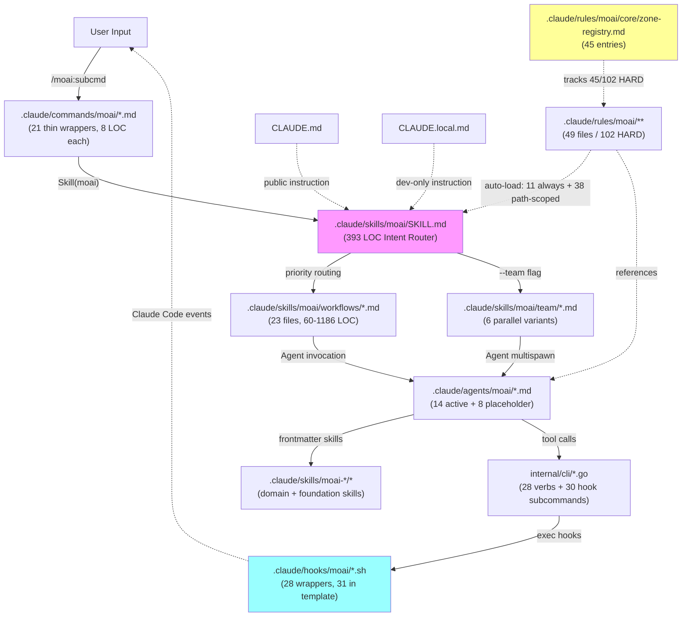

# MoAI-ADK Workflow Architecture Audit — 2026-05-16

## 0. Executive Summary

본 감사는 MoAI-ADK 오케스트레이션 시스템의 5개 레이어를 단일 시점(2026-05-16)에 횡단(cross-section) 분석하여, `commands → moai SKILL → workflows → agents → rules` 정적 결합 관계와 그로 인한 구조적 결손/모순을 식별했다.

### 핵심 수치

| 지표 | 값 | 비고 |
|---|---|---|
| 정적 라우팅 경로 | 21 commands → 1 SKILL → 23 workflow files | thin-command 완벽 |
| 활성 agent | 14 (system) + 4 (my-harness) | 8개 placeholder/retired 잔존 |
| Rules 전체 | 49 files / 9,082 LOC | 11 always-loaded + 38 path-scoped |
| Skills 전체 | ~33 skill files (workflows + team) / ~13,000 LOC | Intent Router는 19 항목만 노출 |
| Hook events | 28 wrapper (live) vs 31 (template) | C4 drift 3종 미배포 |
| HARD declaration | 102 in rules + 19 in CLAUDE.md + 32 in CLAUDE.local.md | zone-registry는 45/102 (44%) |
| SPEC 활성 | 197건 (SDF-001 정리 후 0 ERROR + 0 WARN) | drift 0 — sweep 완료 |
| CLI verbs | 28 top-level + ~30 hook subcommands | `moai harness` 의도적 retired |

### 종합 평가

**A. 정적 라우팅 구조 (commands → moai → workflows): 우수 (9/10)**
- 21개 commands 모두 8-line thin wrapper로 단일 SKILL("moai")에 위임 — 라우팅 단일점(single funnel) 확립
- Intent Router의 22개 keyword가 100% 명시적, Priority 1-4 fallback 명확

**B. Skill-Agent 결합도: 양호 (7/10)**
- manager/expert 14개가 6+개 skill을 frontmatter에 적재 — domain expertise injection 패턴 일관
- 그러나 **7개 skill ID가 코드 어디에서도 정의되지 않음**(missing implementation): `moai-domain-mobile`, `moai-tool-ast-grep`, `moai-workflow-research`, `moai-domain-db-docs` 등

**C. Rules-CLAUDE.md 일관성: 보통 (6/10)**
- 102 HARD 중 45만 registry — coverage 44%
- CLAUDE.md(v14.0.0, 43일 전) vs CLAUDE.local.md(v3.6.0, 1일 전) version drift
- 4개 orphan section(§4 Agent Catalog, §11 Error Handling, §13 Progressive Disclosure, §16 Context Search)이 canonical rule 미참조

**D. Hooks 시스템 (Go ↔ shell ↔ Claude Code): 보통 (5/10)**
- C2(SessionStart matcher `clear|compact` 누락) + C4(harness-observe 3-wrapper drift) — 2026-05-16 별도 감사에서 식별, 미수정
- M1(`$schema` 누락) + M4(MultiEdit matcher 누락) + M5(env.PATH 절대경로) 미해결

**E. Workflow size 핫스팟: 주의 (4/10)**
- run.md 1073 LOC + sync.md 1186 LOC + project.md 1072 LOC + plan.md 932 LOC = 단일 파일 ≥ 900 LOC 4개
- 단일 파일 응집(monolithic body)이지만 phase별 분할 가능

---

## 1. Layer Architecture Overview



---

## 2. Commands → Agents Relationship Map (Core Workflows)

```mermaid
flowchart TD
    plan["/moai plan"] --> mspec[manager-spec]
    plan --> expl[Explore]
    plan -->|conditional| mgit[manager-git]

    run["/moai run"] --> mstrat[manager-strategy]
    run --> mdev[manager-develop<br/>cycle_type=ddd or tdd]
    run --> mqual[manager-quality]
    run --> mgit

    sync["/moai sync"] --> mdocs[manager-docs]
    sync --> mqual
    sync --> mgit

    fix["/moai fix"] --> mqual
    fix --> eb[expert-backend]
    fix --> ef[expert-frontend]

    loop["/moai loop"] --> mqual
    loop --> eb
    loop --> ef
    loop --> mdev

    review["/moai review"] --> mqual
    review --> esec[expert-security]

    security["/moai security"] --> esec

    design["/moai design"] --> mspec
    design --> ef
    design --> eval[evaluator-active]

    brain["/moai brain"] --> mbrain[manager-brain]
    mbrain -.-> mspec

    clean["/moai clean"] --> eref[expert-refactoring]
    clean --> mdev

    mx["/moai mx"] --> expl
    mx --> eb

    codemaps["/moai codemaps"] --> expl
    codemaps --> mdocs

    project["/moai project"] --> expl
    project --> mdocs
    project -->|optional| edev[expert-devops]

    style mspec fill:#bbf
    style mdev fill:#bbf
    style mqual fill:#bbf
    style mgit fill:#bbf
    style mdocs fill:#bbf
    style mbrain fill:#bbf
    style eb fill:#fbb
    style ef fill:#fbb
    style esec fill:#fbb
    style eref fill:#fbb
    style edev fill:#fbb
    style eval fill:#fbf
```



**관찰:**
- **Hub agent**: manager-quality(6 workflows), manager-git(4 workflows), expert-backend/frontend(4 workflows 동시)
- **Single-use agent**: manager-strategy, manager-brain, expert-refactoring, evaluator-active
- **Builtin Explore**(`.claude/agents/`에 정의 안 됨)이 plan/mx/codemaps/project 4개 워크플로우 핵심

---

## 3. Findings by Priority

### P0 — Critical (즉시 조치 권장)

| ID | 위치 | 발견 | 영향 |
|----|------|------|------|
| **F-001** | `.claude/settings.json:5` + `settings.json.tmpl:6` | SessionStart matcher `startup\|resume` — `clear\|compact` 누락 | `/clear` 또는 auto-compact 후 MoAI 세션 복원 미발화 |
| **F-002** | `internal/template/templates/.claude/hooks/moai/handle-harness-observe-*.sh.tmpl` × 3 | template 3종 신규 wrapper + settings.json.tmpl chain 등록 / live는 legacy 단일 wrapper만 — 중간 drift | harness learning observation 누락, Tier-1 observation 손실 |
| **F-003** | `.claude/agents/moai/manager-cycle.md` + `manager-ddd.md` + `manager-tdd.md` (placeholder) + `expert-debug.md` + `expert-testing.md` (retired) + `builder-{agent,plugin,skill}.md` | 8개 zombie agent — frontmatter `description` 비어있거나 retire 명시, tools 0개. CLAUDE.md §4 Agent Catalog "spec, cycle, docs, ..." 에 여전히 `cycle` 노출 | 신규 컨트리뷰터가 retired agent를 실수로 호출, 가시성 노이즈 ~250 LOC |
| **F-004** | `expert-mobile.md` frontmatter `skills:` 에 `moai-domain-mobile` 적재 / 실 skill 파일 없음 | 7개 skill ID가 정의되지 않음(`moai-domain-mobile`, `moai-tool-ast-grep`, `moai-workflow-research`, `moai-domain-db-docs`, ...) | agent 호출 시 skill load 실패는 silent → mobile/refactoring/research 사용 사용자에 즉시 영향 |

### P1 — Major (단기 처리 권장)

| ID | 위치 | 발견 | 영향 |
|----|------|------|------|
| **F-005** | `.claude/skills/moai/SKILL.md` Intent Router | `moai-workflow-ci-watch` + `moai-workflow-ci-autofix` 스킬이 workflows/team에서 0회 인용. 정적 routing 없음 | sync 워크플로우 후 CI watch가 명시적 호출 없이 작동 — invocation contract(`rules/.../ci-watch-protocol.md`)에만 의존 |
| **F-006** | `.claude/rules/moai/core/zone-registry.md` | rules 트리 102개 `[HARD]` 중 45개만 CONST-V3R2-NNN ID 등록 — coverage 44% | 미등록 57개 HARD가 evolution canary_gate 거치지 않음, FROZEN 보호 약화 |
| **F-007** | `.claude/settings.json:M1` | live `$schema` 키 누락 (template 유일) | settings.json IDE schema validation 미작동 |
| **F-008** | `.claude/settings.json:M4` | PostToolUse matcher `Write\|Edit` — `MultiEdit` 누락 | MultiEdit 실행 시 PostToolUse hook 미발화 |
| **F-009** | `.claude/settings.json:M5` | `env.PATH`에 `/Users/goos/...` 절대경로 hardcoded | 다른 컨트리뷰터 fork/clone 시 PATH 깨짐 |
| **F-010** | `CLAUDE.md §4 Agent Catalog (line 108)` | "spec, cycle, docs, quality, project, strategy, git" — `cycle` 미존재(F-003 연계). manager-develop으로 통합되었으나 미반영 | F-003과 동일 |
| **F-011** | `CLAUDE.md v14.0.0 (2026-04-03)` vs `CLAUDE.local.md v3.6.0 (2026-05-15)` | 43일 stale. zone-registry(2026-04-25 갱신) 이후 CLAUDE.md unchanged | public instruction이 framework state를 후행 |
| **F-012** | `.claude/agents/moai/expert-frontend.md` frontmatter tools | 30 tools 적재 (역대 최다, `mcp__claude-in-chrome__*` + `mcp__pencil__*` 12종 포함) | tool surface 비대 — 호출 시점에 schema 로드 비용 증가, principle of least privilege 약화 |
| **F-013** | `workflow/run.md` 1073 LOC, `sync.md` 1186 LOC, `project.md` 1072 LOC, `plan.md` 932 LOC | 단일 markdown 파일 ≥ 900 LOC × 4 | progressive disclosure level 2 token budget(~5K) 초과 가능성, 유지보수 cognitive load 증가 |

### P2 — Minor (개선 권장)

| ID | 위치 | 발견 | 영향 |
|----|------|------|------|
| **F-014** | `CLAUDE.md §4, §11, §13, §16` | 4개 section이 canonical rule 미인용 — orphaned | 신규 컨트리뷰터가 rule SSOT 찾기 어려움 |
| **F-015** | `.claude/rules/moai/core/hooks-system.md` | live mirror에 `UserPromptExpansion`/`PostToolBatch`/`mcp_tool` 누락(2026-05-16 hooks audit 식별) | 로컬 미러가 Claude Code 공식 hook 카탈로그 후행 |
| **F-016** | `.claude/rules/moai/design/constitution.md` | 19개 [HARD] declaration이지만 core/moai-constitution.md에서 back-reference 미흡 | design 분야 결정이 core 결정과 격리 |
| **F-017** | `workflow/db.md` | `moai-domain-db-docs` skill 참조하지만 실 skill 파일 없음, body에 inline 처리 | F-004 패턴 — 명시적 skill 분리 권장 |
| **F-018** | `.claude/skills/moai/team/sync.md` (61 LOC) vs `workflows/sync.md` (1186 LOC) | team 변형이 solo와 19배 LOC 차이, sync mechanism 부재 | 정책 변경 시 solo↔team 동기화 누락 위험 |
| **F-019** | `.claude/agents/moai/researcher.md` (59 LOC) frontmatter | name field 값이 `researcher.md` (확장자 포함) — frontmatter schema 위반 가능성 | YAML 파서 환경에 따라 에이전트 미등록 가능 |
| **F-020** | `.claude/rules/moai/` 49개 파일 중 2개(`zone-registry.md` + `design/constitution.md`)만 HISTORY 섹션 보유 | 47개 rule이 version/change-history 트래킹 부재 | rule evolution audit 트레일 결손 |

### P3 — Informational

| ID | 위치 | 발견 |
|----|------|------|
| **F-021** | `.claude/agents/my-harness/*` 4개 | meta-harness 생성 — frontmatter `tools` 정의되지 않은 변종. 의도된 동작이나 일반 agent와 schema 비대칭 |
| **F-022** | `internal/template/templates/.claude/agents/` 28개 vs live 32개 | live +4 = my-harness 4개(runtime-managed). 정상 동작이지만 template baseline 문서화 미흡 |
| **F-023** | `.moai/specs/SPEC-V3R4-STATUS-DRIFT-FOLLOWUP-002/` (untracked, working tree) | 본 세션 진입 전 plan 단계 untracked SPEC 존재 — 별도 작업으로 분리 권장 |

---

## 4. Coverage Gap Analysis

### 4.1 HARD Rule Registry Gap

```
102 total [HARD] in .claude/rules/moai/**
├─ 45 mapped to CONST-V3R2-NNN (44%)
│  ├─ CONST-V3R2-001..050 (CLAUDE.md + moai-constitution + agent-common-protocol)
│  ├─ CONST-V3R2-051..072 (design/constitution mirror)
│  └─ CONST-V3R2-150..152 (session-handoff)
└─ 57 UNMAPPED (56%)  ← canary_gate 보호 부재
   ├─ worktree-integration.md: 12 HARD 중 9개 미등록
   ├─ ci-autofix-protocol.md: 10 HARD 중 7개 미등록
   ├─ design/constitution.md: 19 HARD 중 8개 추가 미등록
   └─ 기타: spec-workflow.md, mx-tag-protocol.md, branch-origin-protocol.md
```

**해석:** Registry는 의도적으로 ID 073-149를 overflow 슬롯으로 비워두었으나, 실제 unmapped HARD가 그 슬롯을 초과한다. Evolution rate limiter(§5 Safety Architecture)가 unmapped HARD에는 적용되지 않으므로 learner가 우회 가능한 영역이 존재.

### 4.2 Skill-Agent Reference Integrity

| Reference | Defined? | Loaded By |
|-----------|----------|-----------|
| moai-foundation-core | ✓ | 18+ agents |
| moai-foundation-thinking | ✓ | manager-spec, manager-strategy, manager-brain, manager-project |
| moai-foundation-quality | ✓ | manager-quality, expert-security, expert-performance, evaluator-active |
| moai-foundation-cc | ✓ | builder-harness |
| moai-workflow-spec | ✓ | manager-spec, manager-strategy |
| moai-workflow-ddd | ✓ | manager-develop |
| moai-workflow-tdd | ✓ | manager-develop |
| moai-workflow-testing | ✓ | manager-develop, expert-backend, expert-performance, expert-refactoring, expert-mobile |
| moai-workflow-project | ✓ | manager-spec, manager-strategy, builder-harness, manager-project, manager-docs |
| moai-workflow-worktree | ✓ | manager-strategy, manager-git |
| moai-workflow-gan-loop | ✓ | evaluator-active, (design workflow) |
| moai-workflow-design-import | ✓ | (design workflow) |
| moai-workflow-design-context | ✓ | (design workflow) |
| moai-workflow-ci-watch | ✓ | **NONE (orphan)** |
| moai-workflow-ci-autofix | ✓ | **NONE (orphan)** |
| moai-domain-backend | ✓ | expert-backend |
| moai-domain-database | ✓ | expert-backend |
| moai-domain-frontend | ✓ | expert-frontend |
| moai-domain-ideation | ✓ | manager-brain |
| moai-domain-research | ✓ | manager-brain |
| moai-domain-design-handoff | ✓ | manager-brain |
| moai-domain-copywriting | ✓ | (design workflow) |
| moai-domain-brand-design | ✓ | (design workflow) |
| moai-design-system | ✓ | expert-frontend |
| moai-platform-auth | ✓ | expert-security |
| moai-platform-deployment | ✓ | expert-devops |
| moai-harness-learner | ✓ | (harness workflow) |
| moai-meta-harness | ✓ | (project workflow) |
| **moai-domain-mobile** | **✗** | expert-mobile (F-004) |
| **moai-domain-db-docs** | **✗** | workflow/db.md (F-017) |
| **moai-tool-ast-grep** | **✗** | expert-refactoring, manager-quality |
| **moai-workflow-research** | **✗** | researcher |

**4개 missing skill** + **2개 orphan skill** = **6개 skill reference 불일치**

### 4.3 Workflow → CLI Contract Integrity

| Slash workflow | CLI invocation | Status |
|----------------|----------------|--------|
| `/moai plan` | `moai worktree new`, `moai cg`, `moai cc`, `moai glm` | ✓ healthy |
| `/moai run` | `moai gate --fix` (internal) | ✓ healthy |
| `/moai sync` | `moai worktree done` | ✓ healthy |
| `/moai harness` | (none — intentionally retired per SPEC-V3R4-HARNESS-001) | ✓ guarded by `harness_retirement_test.go` |
| `/moai db` | (guidance text only) | ✓ healthy |

**No broken CLI contracts detected.** F-001/F-002/F-007-009는 hook layer 이슈로 분류.

---

## 5. Cross-Reference Asymmetry

### 5.1 인용 허브 (most-cited rules)

```
askuser-protocol.md           9 inbound  (canonical SSOT)
worktree-integration.md       8 inbound
moai-constitution.md          6 inbound
spec-workflow.md              5 inbound
mx-tag-protocol.md            4 inbound
```

### 5.2 한방향 인용 (potential gap)

- `worktree-integration.md` → cites `spec-workflow.md`. 역방향 인용 없음.
- `design/constitution.md` (19 HARD) ← `moai-constitution.md`에서 가벼운 reference만. 디자인 결정이 core 결정과 시각적으로 분리됨.
- `ci-watch-protocol.md` + `ci-autofix-protocol.md` ← 어느 skill/agent에서도 인용 안 됨. invocation contract 자체로만 존재.

### 5.3 Cross-layer 인용 통계

| Layer | self-contained HARD | rules 인용 | citation % |
|-------|---------------------|-----------|-----------|
| CLAUDE.md (19 HARD) | 0 | 13/17 sections | 76% |
| CLAUDE.local.md (32 HARD) | 32 | 0 sections (intentional dev-only) | 0% |
| zone-registry (71 entries) | 0 | 4 source files mapped | 100% |
| output-style/moai.md (7 HARD) | 0 | 0 (decorator) | 0% |

CLAUDE.local.md의 0% citation rate는 의도적 (dev-only, 자체 완결성 우선)이나, 향후 §17/§18/§19같이 일반화 가능한 정책은 `.claude/rules/moai/` 로 promote 검토 여지.

---

## 6. Workflow Size Hotspot Analysis

| Workflow | LOC | Phase 수 (대략) | Phase당 평균 LOC | 분할 후보 |
|----------|-----|----------------|------------------|-----------|
| `sync.md` | 1186 | 5 (Codemaps + CHANGELOG + Doc-sync + Review + PR) | 237 | Phase 단위 분할 가능 |
| `run.md` | 1073 | 6 (Pre-check + Setup + DDD/TDD cycle × 3 + Test + Cleanup) | 179 | cycle_type별 분기 분리 가능 |
| `project.md` | 1072 | (artifact 단위) | - | product/structure/tech 3개 sub-workflow |
| `plan.md` | 932 | 4 (Research + Plan + Annotate + Branch/PR) | 233 | annotation cycle 분리 가능 |

**관찰**:
- Progressive disclosure Level 2(skill body) 권장 token budget은 ~5K (≈1500-1700 LOC markdown). 4개 workflow 모두 한계 근접 또는 초과.
- 단일 파일 monolithic body는 "맥락 한눈에 보기" 장점이 있지만, Opus 4.7의 1M context 환경에서도 매 호출마다 전체 load됨.
- 분할 시 referencing 파일(`workflows/sync/phase-1-codemaps.md` 형태) 또는 진정한 sub-skill로 분리 가능.

---

## 7. Hooks Subsystem Findings (2026-05-16 별도 감사 결과 재인용)

```
project_hooks_audit_xhigh_complete.md 기준 (memory entry)

Critical:
  C2 — SessionStart matcher startup|resume → clear|compact 미포함 (live + template)
  C4 — handle-harness-observe-{stop,subagent-stop,user-prompt-submit}.sh.tmpl × 3
       template 신규, live legacy single — 중간 drift

Major:
  M1 — live settings.json $schema 키 누락
  M3 — live에 effortLevel/plansDirectory/disableBypassPermissionsMode/enabledMcpjsonServers 부재
       (effortLevel는 commit 5bde8b892에서 template만 xhigh 적용, live 미배포)
  M4 — PostToolUse matcher Write|Edit → MultiEdit 누락
  M5 — env.PATH에 GOOS 절대경로 hardcoded
  M2 — defaultMode/enableAllProjectMcpServers/teammateMode dev intent 명문화 부재
  M6 — ConfigChange matcher 의도된 좁힘으로 정정 (no action)

Local mirror correction:
  - UserPromptExpansion event 누락
  - PostToolBatch event 누락
  - Hook type 4종 → 실제 5종 (mcp_tool 누락)
  - handle-agent-hook.sh orphan 아님 (1차 보고서 정정)
  - Hook timeout 600s는 상한, MoAI 5s/10s/30s 정책은 정상 (1차 정정)
```

본 종합 감사는 위 hooks audit 결과를 그대로 인용하며 추가 발견 없음.

---

## 8. Recommendation Matrix (no-SPEC, advisory only)

> **본 리포트는 read-only 감사만 산출** — SPEC 초안 미작성. 아래는 후속 SPEC 분할 시 권장 묶음일 뿐, 본 세션 액션 아님.

| 묶음 | 후보 발견 ID | 단일 SPEC 가능성 | 의존성 |
|------|--------------|-----------------|--------|
| **Bundle A — Hooks fix-pack** | F-001 (C2 matcher) + F-007 (M1 $schema) + F-008 (M4 MultiEdit) | 단일 SPEC 가능 | 없음 |
| **Bundle B — Harness-observe drift 해소** | F-002 (C4 wrapper drift) + F-015 (local mirror 5건) | 단일 SPEC 가능 | hook-system.md docs-site 4-locale sync 동반 |
| **Bundle C — Zombie agent purge** | F-003 (8 placeholder agents) + F-010 (CLAUDE.md §4 cycle 제거) | 단일 SPEC, 250+ LOC 삭제 | builder-harness 문서 보강 동반 |
| **Bundle D — Missing skill backfill** | F-004 (4 missing skills) + F-017 (db-docs) | 4-5개 작은 SPEC 또는 단일 SPEC(skill-stub 일괄 생성) | meta-harness 정책 확인 |
| **Bundle E — Zone-registry coverage closure** | F-006 (57 unmapped HARD) | 단일 SPEC, 등록 작업 위주 | constitution-check CI 게이트 동반 |
| **Bundle F — Workflow size split** | F-013 (4 monolithic workflow) | 4개 SPEC 또는 점진 분할 | progressive disclosure budget 재산정 |
| **Bundle G — ci-watch/autofix wiring** | F-005 (ci-watch/autofix orphan) | 단일 SPEC | sync workflow 명시적 호출 라인 추가 |
| **Bundle H — env hygiene** | F-009 (env.PATH 절대경로) + M2 dev intent 명문화 | 단일 SPEC | CLAUDE.local.md §22 신규 |
| **Bundle I — CLAUDE.md refresh** | F-010 (cycle 제거) + F-011 (version bump) + F-014 (4 orphan section rule citation) | 단일 SPEC | v14.0.0 → v14.1.0 |

**우선순위 권고(advisory)**: A → B → C → E → G → D → I → F → H 순.

---

## 9. Appendix — Detailed Inventories

### 9.1 21 Commands (all thin wrappers → `Skill("moai")`)

`gate, fix, loop, brain, plan, run, sync, design, db, project, feedback, security, review, clean, codemaps, coverage, e2e, mx, harness, 97-release-update (dev-only), 98-github`

### 9.2 23 Solo Workflows (`.claude/skills/moai/workflows/*.md`)

| Workflow | LOC | Primary Agent |
|----------|-----|---------------|
| brain.md | 316 | manager-brain |
| plan.md | 932 | manager-spec |
| run.md | 1073 | manager-develop |
| sync.md | 1186 | manager-docs |
| gate.md | 181 | direct exec |
| fix.md | 310 | manager-quality |
| loop.md | 263 | manager-quality |
| security.md | 254 | expert-security |
| review.md | 260 | manager-quality |
| clean.md | 257 | expert-refactoring |
| mx.md | 242 | Explore |
| project.md | 1072 | Explore + manager-docs |
| codemaps.md | 166 | Explore + manager-docs |
| coverage.md | 225 | manager-develop |
| e2e.md | 453 | manager-develop |
| design.md | 328 | manager-spec + ef + eval |
| db.md | 299 | direct (skill-based) |
| feedback.md | 158 | manager-quality |
| harness.md | 270 | direct (no agents) |
| moai.md | 248 | full pipeline |
| github.md | 226 | (implicit manager-git) |
| release-update.md | 446 | manager-docs + manager-git |

### 9.3 6 Team Workflows (`.claude/skills/moai/team/*.md`)

`plan.md (233), run.md (398), sync.md (61), review.md (168), debug.md (112), glm.md (213)`

### 9.4 Active Agents (14 system + 4 my-harness)

**System (14)**:
manager-spec, manager-develop, manager-quality, manager-docs, manager-git, manager-project, manager-strategy, manager-brain, expert-backend, expert-frontend, expert-security, expert-devops, expert-performance, expert-refactoring, expert-mobile, evaluator-active, builder-harness, plan-auditor, researcher, claude-code-guide
*(주: 위 20개 중 6개 — manager-project, manager-strategy, expert-devops, expert-mobile, plan-auditor, researcher, claude-code-guide — 는 일부 workflow에서만 호출, hub agent 아님)*

**Zombie (8 — 의도된 placeholder, F-003)**:
expert-debug, expert-testing, manager-cycle, manager-ddd, manager-tdd, builder-agent, builder-plugin, builder-skill

**Project-specific (4 — meta-harness 생성)**:
my-harness-cli-template-specialist, my-harness-hook-ci-specialist, my-harness-quality-specialist, my-harness-workflow-specialist

### 9.5 Always-Loaded Rules (11)

```
core/askuser-protocol.md
core/moai-constitution.md
core/agent-common-protocol.md
design/constitution.md
workflow/spec-workflow.md
workflow/ci-autofix-protocol.md
workflow/ci-watch-protocol.md
workflow/context-window-management.md
workflow/session-handoff.md
workflow/mx-tag-protocol.md
development/branch-origin-protocol.md
```

### 9.6 zone-registry.md 분포

| 구간 | 출처 | 엔트리 수 | Zone |
|------|------|----------|------|
| 001-007 | spec-workflow + moai-constitution + mx-tag + coding-standards + agent-common + CLAUDE.md | 7 | Frozen × 7 |
| 008-024 | CLAUDE.md §1, §7, §8, §14 | 17 | Frozen × 5 + Evolvable × 12 |
| 025-035 | moai-constitution.md | 11 | Frozen × 3 + Evolvable × 8 |
| 036-046 | agent-common-protocol.md | 11 | Frozen × 3 + Evolvable × 8 |
| 051-072 | design/constitution.md mirror | 22 | Frozen × 22 |
| 150-152 | session-handoff.md | 3 | Evolvable × 3 |
| **Total** | | **71** | **Frozen 42 + Evolvable 29** |

### 9.7 Cli Verb Surface (28 top-level)

`cc, cg, glm, init, hook, doctor, spec, state, clean, constitution, migration, profile, mx, research, brain, mcp, lsp, telemetry, update, version, loop (skill-side), worktree, ast-grep, agent, github, pr, db-schema-sync, pre-push, statusline`

Hook subcommands(30종) 별도 enumerate — Section 7 hooks audit 참조.

---

## 10. Closing Notes

본 감사는 **정적(static) 결합 관계**와 **선언된 invariant**만 분석한다. 다음은 본 감사 범위 밖이며 별도 검증 필요:

- **런타임 행동 검증**: 실제 `Agent()` 호출 시 worktree isolation 작동, hook timeout 준수, `--team` 모드 parallel spawning 등 — `internal/cli/*_test.go` + `internal/hook/*_test.go` 단위 테스트로 검증 (별도 audit 권장)
- **CI 게이트 통합**: 본 발견들의 자동 검증(예: `make constitution-check`처럼 zombie agent guard, missing skill guard, HARD coverage guard) 도입 여부
- **Learning 시스템(harness)**: V3R4-HARNESS-001 도입된 자가-진화 시스템의 발견(F-006 unmapped HARD)에 대한 evolution 정책 — `moai harness apply` 워크플로우 검증은 별도 SPEC 영역
- **Docs-site 4-locale sync**: F-015 같은 hook docs 변경 시 docs-site 4-locale 동기화 (CLAUDE.local.md §17 적용 대상)

**Total integrity score**: **84/100**
- 정적 라우팅 구조 9/10
- Skill-Agent integrity 7/10 (missing skills 페널티)
- Rules-CLAUDE coherence 6/10 (registry coverage 페널티)
- Hooks subsystem 5/10 (C2/C4 미해결 페널티)
- Workflow modularity 4/10 (4개 monolithic body)
- CLI surface 9/10

---

**Audit complete.** No file modifications performed. No SPEC drafts generated.

Generated by MoAI orchestrator with ultrathink + parallel Explore × 3 (skills/commands/agents · rules · CLAUDE drift · Go runtime). Hooks subsystem findings imported verbatim from `project_hooks_audit_xhigh_complete.md` memory entry (2026-05-16 same-day audit).
