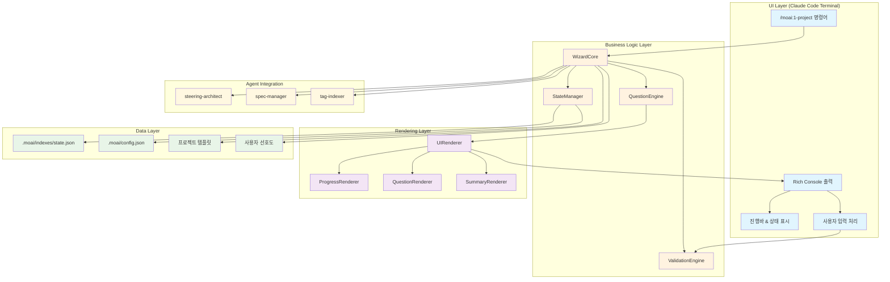
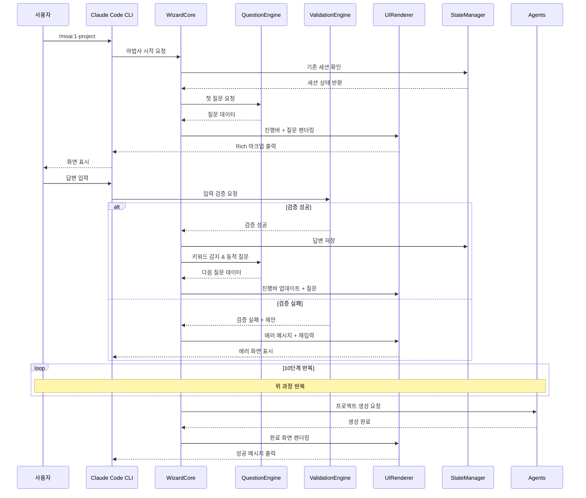
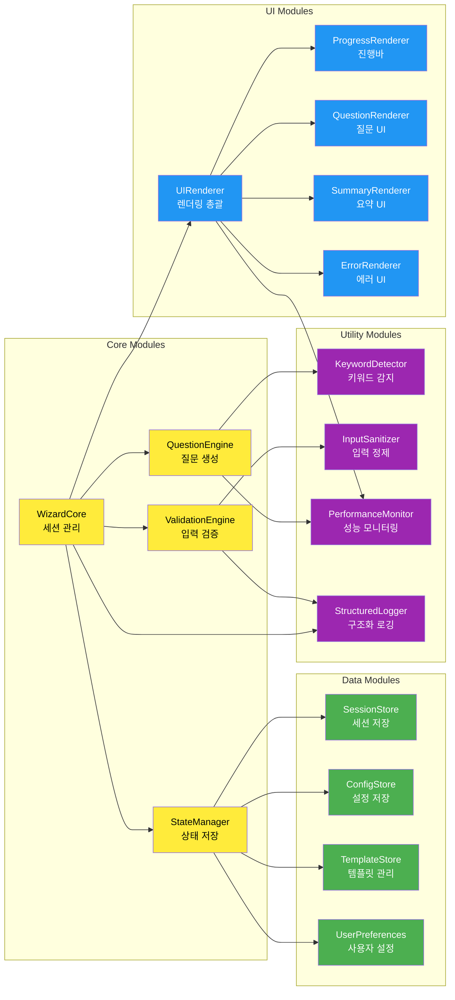
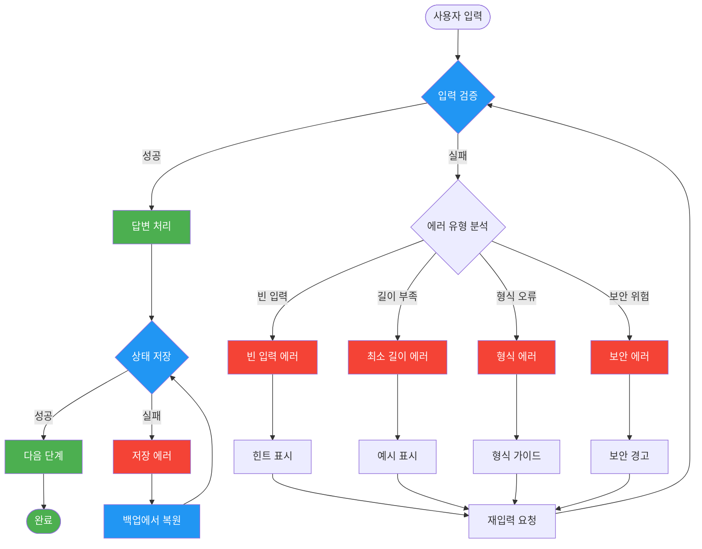
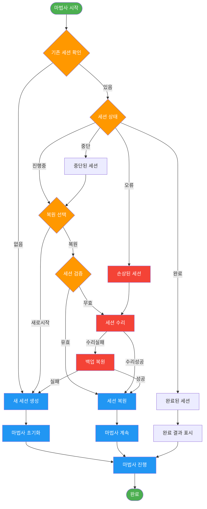
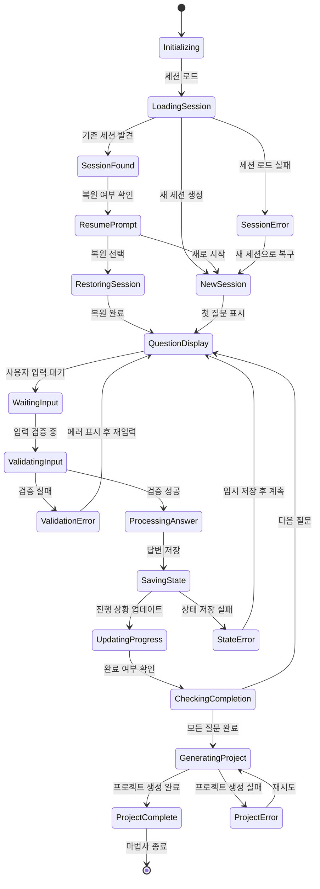
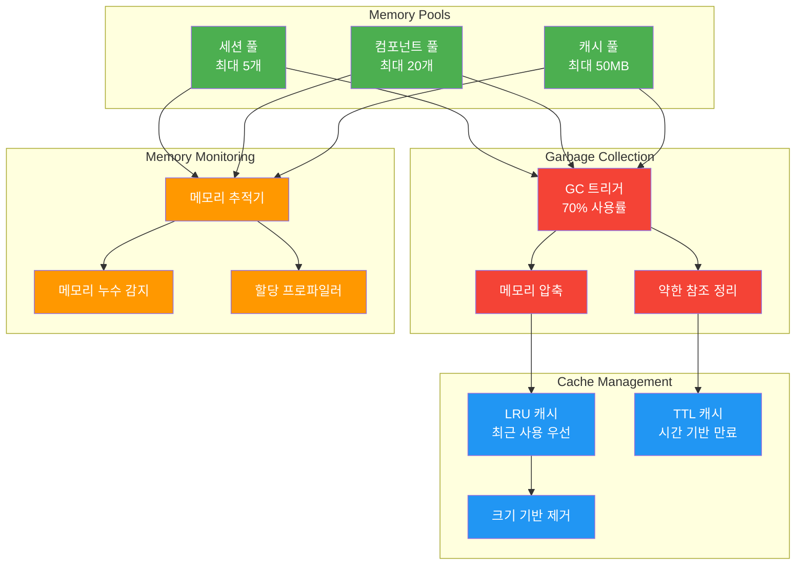
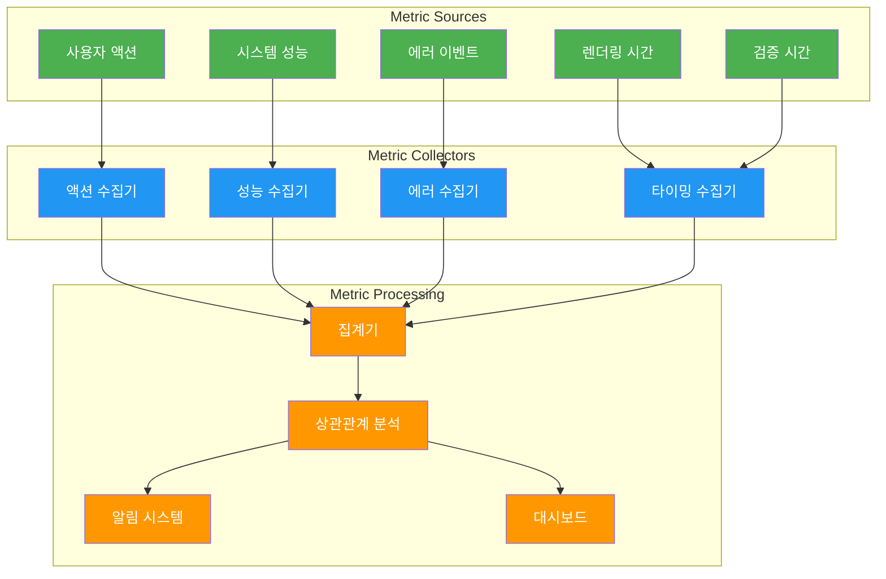

# Architecture Diagram: 마법사 UX 시스템 @DESIGN:WIZARD-UX

> **@DESIGN:WIZARD-UX** "3계층 아키텍처 기반 시각적 설계"

## 🏗️ 전체 시스템 아키텍처

### 1. 고수준 컴포넌트 다이어그램

### 2. 데이터 흐름 다이어그램

### 3. 모듈 의존성 다이어그램

## 🔄 에러 처리 및 복구 플로우

### 1. 에러 처리 전략

### 2. 세션 복구 메커니즘

## 🎨 UI 컴포넌트 구조

### 1. 렌더링 컴포넌트 계층

```mermaid
graph TD
    %% 최상위 렌더러
    subgraph "Top Level Renderer"
        MasterRenderer[MasterRenderer<br/>전체 화면 조율]
    end

    %% 메인 컴포넌트들
    subgraph "Main Components"
        HeaderRenderer[HeaderRenderer<br/>🗿 타이틀 & 브랜딩]
        ProgressRenderer[ProgressRenderer<br/>진행바 & 단계 표시]
        QuestionRenderer[QuestionRenderer<br/>질문 & 입력 폼]
        SummaryRenderer[SummaryRenderer<br/>설정 요약 패널]
        FooterRenderer[FooterRenderer<br/>도움말 & 단축키]
    end

    %% 서브 컴포넌트들
    subgraph "Sub Components"
        ProgressBar[ProgressBar<br/>시각적 진행바]
        StepIndicator[StepIndicator<br/>단계 인디케이터]
        QuestionText[QuestionText<br/>질문 텍스트]
        InputField[InputField<br/>입력 필드]
        ValidationMsg[ValidationMsg<br/>검증 메시지]
        HintPanel[HintPanel<br/>힌트 & 예시]
        ConfigPreview[ConfigPreview<br/>설정 미리보기]
        ActionButtons[ActionButtons<br/>액션 버튼들]
    end

    %% 유틸리티 컴포넌트들
    subgraph "Utility Components"
        ColorScheme[ColorScheme<br/>색상 관리]
        LayoutManager[LayoutManager<br/>레이아웃 계산]
        ResponsiveHandler[ResponsiveHandler<br/>화면 크기 대응]
        AnimationEngine[AnimationEngine<br/>애니메이션 효과]
    end

    %% 연결 관계
    MasterRenderer --> HeaderRenderer
    MasterRenderer --> ProgressRenderer
    MasterRenderer --> QuestionRenderer
    MasterRenderer --> SummaryRenderer
    MasterRenderer --> FooterRenderer

    ProgressRenderer --> ProgressBar
    ProgressRenderer --> StepIndicator

    QuestionRenderer --> QuestionText
    QuestionRenderer --> InputField
    QuestionRenderer --> ValidationMsg
    QuestionRenderer --> HintPanel

    SummaryRenderer --> ConfigPreview
    SummaryRenderer --> ActionButtons

    %% 유틸리티 연결
    MasterRenderer --> ColorScheme
    MasterRenderer --> LayoutManager
    MasterRenderer --> ResponsiveHandler
    MasterRenderer --> AnimationEngine

    %% 스타일링
    classDef masterClass fill:#673ab7,color:#fff
    classDef mainClass fill:#3f51b5,color:#fff
    classDef subClass fill:#2196f3,color:#fff
    classDef utilClass fill:#009688,color:#fff

    class MasterRenderer masterClass
    class HeaderRenderer,ProgressRenderer,QuestionRenderer,SummaryRenderer,FooterRenderer mainClass
    class ProgressBar,StepIndicator,QuestionText,InputField,ValidationMsg,HintPanel,ConfigPreview,ActionButtons subClass
    class ColorScheme,LayoutManager,ResponsiveHandler,AnimationEngine utilClass
```

### 2. 상태 기반 UI 전환

## 🔧 성능 최적화 아키텍처

### 1. 렌더링 최적화

```mermaid
graph LR
    %% 입력 처리
    UserInput[사용자 입력] --> InputBuffer[입력 버퍼]
    InputBuffer --> Debouncing[디바운싱<br/>300ms]

    %% 검증 파이프라인
    Debouncing --> QuickValidation[빠른 검증<br/>< 50ms]
    QuickValidation --> ValidationCache[검증 캐시]
    ValidationCache --> FullValidation[전체 검증<br/>< 200ms]

    %% 렌더링 파이프라인
    FullValidation --> RenderQueue[렌더링 큐]
    RenderQueue --> ComponentCache[컴포넌트 캐시]
    ComponentCache --> VirtualDOM[가상 DOM]
    VirtualDOM --> DiffEngine[차이점 계산]
    DiffEngine --> ActualRender[실제 렌더링]

    %% 성능 모니터링
    ActualRender --> PerformanceLog[성능 로그]
    PerformanceLog --> MetricsCollection[메트릭 수집]

    %% 피드백 루프
    MetricsCollection --> AdaptiveThrottling[적응형 스로틀링]
    AdaptiveThrottling --> InputBuffer

    %% 스타일링
    classDef inputClass fill:#4caf50,color:#fff
    classDef validationClass fill:#ff9800,color:#fff
    classDef renderClass fill:#2196f3,color:#fff
    classDef monitorClass fill:#9c27b0,color:#fff

    class UserInput,InputBuffer,Debouncing inputClass
    class QuickValidation,ValidationCache,FullValidation validationClass
    class RenderQueue,ComponentCache,VirtualDOM,DiffEngine,ActualRender renderClass
    class PerformanceLog,MetricsCollection,AdaptiveThrottling monitorClass
```

### 2. 메모리 관리 전략

## 📊 모니터링 및 관찰성

### 1. 실시간 메트릭 수집

## 🚀 배포 및 확장성 고려사항

### 1. 모듈화 전략

| 모듈 | 책임 | 독립성 | 확장성 |
|------|------|--------|--------|
| **WizardCore** | 세션 관리, 전체 흐름 제어 | High | Medium |
| **QuestionEngine** | 질문 생성, 동적 분기 | High | High |
| **ValidationEngine** | 입력 검증, 보안 검사 | High | High |
| **UIRenderer** | 화면 렌더링, 사용자 경험 | High | Medium |
| **StateManager** | 데이터 저장, 상태 관리 | Medium | High |

### 2. 성능 목표 및 제약사항

| 지표 | 목표 | 제약사항 | 모니터링 |
|------|------|----------|----------|
| **응답 시간** | < 500ms | 네트워크 지연 | 실시간 |
| **메모리 사용** | < 100MB | 시스템 RAM | 연속 모니터링 |
| **CPU 사용률** | < 20% | 백그라운드 실행 | 주기적 체크 |
| **완료율** | > 85% | 사용자 이탈 | 세션 추적 |

---

## 🔗 연관 태그 시스템

**@DESIGN:WIZARD-UX**와 연결된 주요 태그들:
- **@REQ:WIZARD-UX-001** → 요구사항 추적
- **@DATA:WIZARD-UX** → 데이터 모델 연결
- **@TASK:ARCH-IMPL** → 구현 작업 연결
- **@TEST:ARCH-VALIDATION** → 아키텍처 검증 테스트
- **@PERF:WIZARD-METRICS** → 성능 모니터링

---

> **@DESIGN:WIZARD-UX**를 통해 이 아키텍처 설계가 전체 시스템에서 완벽하게 추적됩니다.
>
> **3계층 아키텍처와 모듈형 설계로 확장성과 유지보수성을 보장합니다.**