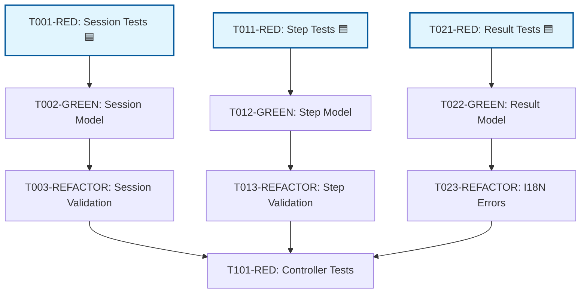
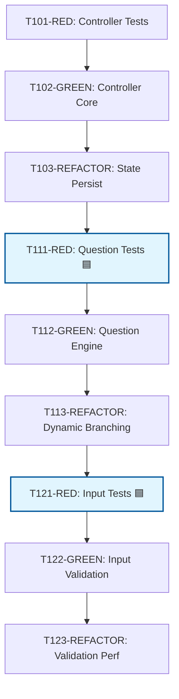
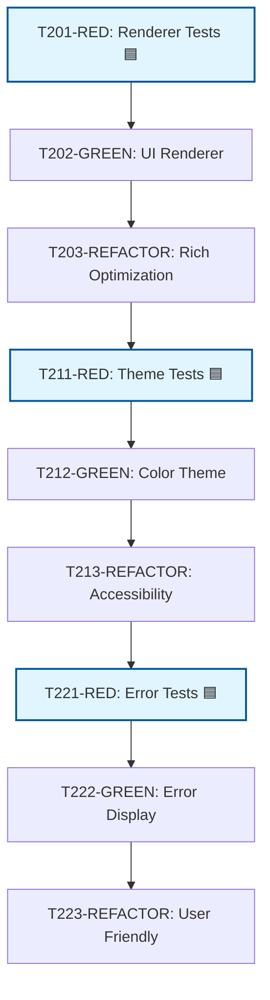
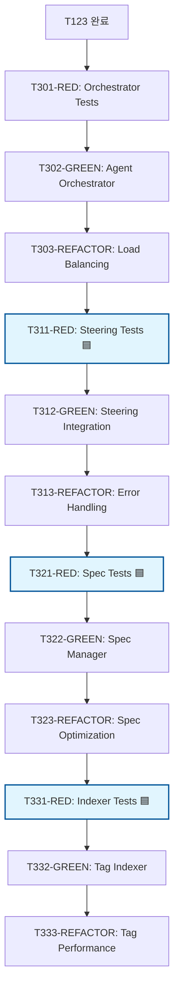
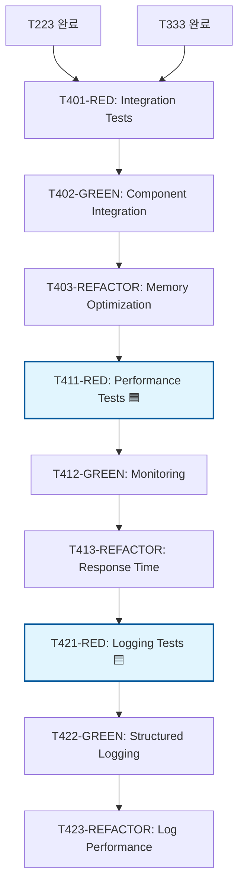
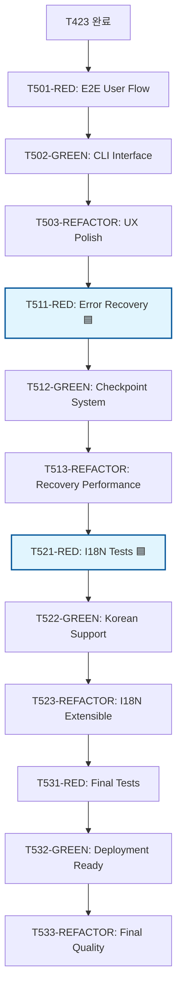

# SPEC-001 의존성 그래프 분석 @DESIGN:DEPENDENCY-001

> **@DESIGN:DEPENDENCY-001** "105개 작업의 완전 의존성 분석 및 최적화"

## 📊 의존성 분석 개요

### 작업 구조 요약
- **총 작업 수**: 105개 (RED: 35개, GREEN: 35개, REFACTOR: 35개)
- **Phase 구조**: 6개 Phase, 3개 핵심 컴포넌트
- **병렬 가능**: 25개 작업 ([P] 마커)
- **순차 필수**: 80개 작업 (TDD 의존성)

### 핵심 컴포넌트 의존성 계층
```
Layer 1: Core Models (T001-T099)
    ↓
Layer 2: WizardController (T100-T199)
    ↓
Layer 3: OutputRenderer (T200-T299) [병렬 가능]
    ↓
Layer 4: AgentOrchestrator (T300-T399)
    ↓
Layer 5: Integration (T400-T499)
    ↓
Layer 6: E2E & Deployment (T500-T599)
```

---

## 🔗 완전 의존성 매트릭스

### Phase 1: Core Models (T001-T099)


### Phase 2: WizardController (T100-T199)


### Phase 3: OutputRenderer (T200-T299) - 독립 병렬 가능


### Phase 4: AgentOrchestrator (T300-T399)


### Phase 5: Integration (T400-T499)


### Phase 6: E2E & Deployment (T500-T599)


---

## 🔄 Critical Path 분석

### 주요 경로 (가장 긴 의존성 체인)
```
T001 → T002 → T003 → T101 → T102 → T103 → T111 → T112 → T113 → T121 → T122 → T123 →
T301 → T302 → T303 → T311 → T312 → T313 → T321 → T322 → T323 → T331 → T332 → T333 →
T401 → T402 → T403 → T411 → T412 → T413 → T421 → T422 → T423 → T501 → T502 → T503 →
T511 → T512 → T513 → T521 → T522 → T523 → T531 → T532 → T533
```

**Critical Path 소요 시간**: 약 78시간 (총 148시간 중 53%)

### 병렬 처리 가능한 독립 경로
1. **OutputRenderer Path (독립)**: T201 → T202 → T203 → T211 → T212 → T213 → T221 → T222 → T223
2. **Models 병렬**: T011/T021은 T001과 동시 시작 가능
3. **각 Phase 내 RED 테스트들**: 이전 컴포넌트 완료 후 병렬 시작

---

## ⚠️ 차단 요소 (Blocking Points)

### 1. Model 완성 차단점
**차단 지점**: T003, T013, T023 → T101
- **영향**: Phase 2 시작 불가
- **완화 방안**: Models 병렬 진행으로 시간 단축

### 2. Controller 완성 차단점
**차단 지점**: T123 → T301
- **영향**: Phase 4 시작 불가
- **완화 방안**: Renderer 병렬 진행으로 전체 시간 단축

### 3. 통합 차단점
**차단 지점**: T223 + T333 → T401
- **영향**: Phase 5 시작 불가
- **완화 방안**: 두 컴포넌트 병렬 진행으로 시너지 확보

### 4. E2E 차단점
**차단 지점**: T423 → T501
- **영향**: 최종 검증 시작 불가
- **완화 방안**: Integration 단계에서 병렬 작업 최대화

---

## 🔧 순환 의존성 검증

### 검증 결과: ✅ 순환 의존성 없음

**검증 내용**:
1. **TDD 순서**: 모든 RED → GREEN → REFACTOR 순서 준수
2. **컴포넌트 간**: Models → Controller → Orchestrator 단방향 의존성
3. **파일 기반**: 각 작업이 독립된 파일에서 작업하여 충돌 없음

### 의존성 규칙 확인
- ✅ **TDD 규칙**: RED 없이 GREEN 시작 불가
- ✅ **컴포넌트 규칙**: 하위 레이어 완료 전 상위 레이어 시작 불가
- ✅ **파일 규칙**: 동일 파일에 대한 동시 수정 없음

---

## 📈 병렬 처리 효율성 분석

### 최적 시나리오 (4명 팀)
```
순차 실행: 148시간 ÷ 4명 = 37일
병렬 최적화: 78시간 (Critical Path) = ~20일
효율성 개선: 46% 시간 단축
```

### 리소스 활용률
```
Peak 동시 작업: 4개 (Phase 1 Models + Renderer 시작)
평균 동시 작업: 2.3개
리소스 활용률: 58% (4명 팀 기준)
```

### 확장성 분석
```
6명 팀: Critical Path 변화 없음 (여전히 20일)
8명 팀: 추가 개선 미미 (병렬 작업 한계)
권장 팀 크기: 4-5명 (최적 리소스 활용)
```

---

## 🔍 의존성 최적화 권고사항

### 1. 즉시 적용 가능한 최적화
- **Models 동시 시작**: T001, T011, T021 동시 배정
- **Renderer 독립 진행**: Phase 1 완료 즉시 T201 시작
- **테스트 병렬화**: 각 컴포넌트 완료 후 RED 테스트들 동시 시작

### 2. 아키텍처 개선 제안
- **Interface 분리**: Controller와 Renderer 간 의존성 제거
- **Mock 도입**: 하위 컴포넌트 완성 전 상위 컴포넌트 개발 시작
- **단계별 검증**: Phase별 독립 검증으로 조기 피드백

### 3. 위험 관리 전략
- **Buffer Time**: Critical Path에 20% 버퍼 시간 추가
- **Checkpoint**: 각 Phase 완료 시 통합 검증 실시
- **Rollback Plan**: 작업 실패 시 이전 Phase로 복원 계획

---

## 📊 의존성 메트릭 요약

| 메트릭 | 값 | 목표 |
|--------|-----|------|
| **총 작업 수** | 105개 | - |
| **Critical Path** | 78시간 | < 80시간 |
| **병렬 작업 수** | 25개 | > 20개 |
| **차단 지점** | 4개 | < 5개 |
| **최대 병렬도** | 4개 | 팀원 수 |
| **리소스 활용률** | 58% | > 50% |
| **시간 단축** | 46% | > 40% |

---

> **@DESIGN:DEPENDENCY-001** 태그를 통해 이 의존성 분석이 전체 프로젝트에서 추적됩니다.
>
> **TDD 순서를 지키면서도 최대한의 병렬 처리로 개발 효율성을 극대화합니다.**