# SPEC-001 TDD 작업 분해 @TASK:WIZARD-UX-001

> **@TASK:WIZARD-UX-001** "마법사 UX 개선의 완전 TDD 기반 작업 분해"

## 📋 작업 분해 개요

**Constitution Check 통과**: ✅ 100% 준수 (5/5)
**예상 개발 기간**: 3-4주 (4인 팀 기준)
**핵심 목표**: 마법사 완료율 85% 이상 달성
**TDD 사이클**: Red → Green → Refactor 강제 적용

### 3-Component Architecture 기반 작업 구조

1. **WizardController**: 상태 관리 및 질문 제어 (T100-T199)
2. **OutputRenderer**: 터미널 출력 렌더링 (T200-T299)
3. **AgentOrchestrator**: Task 도구 기반 에이전트 연동 (T300-T399)

---

## 🏗️ Phase 1: Core Models & Data Structures (T001-T099)

### T001-RED: WizardSession 모델 테스트 작성 @TEST:UNIT-SESSION
**파일**: `tests/unit/test_wizard_session.py`
**의존성**: 없음
**소요 시간**: 30분
**TDD 단계**: RED
**병렬 실행**: [P]

```python
def test_wizard_session_initialization():
    """세션 초기화 테스트"""
    session = WizardSession()
    assert session.session_id is not None
    assert session.current_step == 0
    assert len(session.answers) == 0
    assert session.start_time is not None

def test_session_state_transitions():
    """세션 상태 전환 테스트"""
    session = WizardSession()
    assert session.status == SessionStatus.INITIALIZED
    session.start()
    assert session.status == SessionStatus.IN_PROGRESS
```

### T002-GREEN: WizardSession 모델 최소 구현 @DATA:SESSION-MODEL
**파일**: `src/moai_wizard/models/session.py`
**의존성**: T001-RED
**소요 시간**: 45분
**TDD 단계**: GREEN
**병렬 실행**: -

```python
@dataclass
class WizardSession:
    session_id: str = field(default_factory=lambda: str(uuid4()))
    current_step: int = 0
    status: SessionStatus = SessionStatus.INITIALIZED
    answers: Dict[str, str] = field(default_factory=dict)
    start_time: datetime = field(default_factory=datetime.now)
```

### T003-REFACTOR: WizardSession 유효성 검증 강화 @TEST:UNIT-VALIDATION
**파일**: `src/moai_wizard/models/session.py`
**의존성**: T002-GREEN
**소요 시간**: 60분
**TDD 단계**: REFACTOR
**병렬 실행**: -

- Pydantic V2 모델로 리팩터링
- 입력 유효성 검증 로직 추가
- 성능 최적화 및 메모리 효율성 개선

---

### T011-RED: StepState 모델 테스트 작성 @TEST:UNIT-STEPSTATE
**파일**: `tests/unit/test_step_state.py`
**의존성**: 없음
**소요 시간**: 25분
**TDD 단계**: RED
**병렬 실행**: [P]

### T012-GREEN: StepState 모델 구현 @DATA:STEP-MODEL
**파일**: `src/moai_wizard/models/step.py`
**의존성**: T011-RED
**소요 시간**: 35분
**TDD 단계**: GREEN
**병렬 실행**: -

### T013-REFACTOR: StepState 검증 로직 개선 @TEST:UNIT-STEPVAL
**파일**: `src/moai_wizard/models/step.py`
**의존성**: T012-GREEN
**소요 시간**: 45분
**TDD 단계**: REFACTOR
**병렬 실행**: -

---

### T021-RED: ValidationResult 모델 테스트 @TEST:UNIT-RESULT
**파일**: `tests/unit/test_validation_result.py`
**의존성**: 없음
**소요 시간**: 20분
**TDD 단계**: RED
**병렬 실행**: [P]

### T022-GREEN: ValidationResult 모델 구현 @DATA:VALIDATION-MODEL
**파일**: `src/moai_wizard/models/validation.py`
**의존성**: T021-RED
**소요 시간**: 30분
**TDD 단계**: GREEN
**병렬 실행**: -

### T023-REFACTOR: 에러 메시지 다국어화 @FEATURE:I18N-ERRORS
**파일**: `src/moai_wizard/models/validation.py`
**의존성**: T022-GREEN
**소요 시간**: 50분
**TDD 단계**: REFACTOR
**병렬 실행**: -

---

## 🎮 Phase 2: WizardController (T100-T199)

### T101-RED: WizardController 초기화 테스트 @TEST:UNIT-CONTROLLER
**파일**: `tests/unit/test_wizard_controller.py`
**의존성**: T001-T023 완료
**소요 시간**: 40분
**TDD 단계**: RED
**병렬 실행**: -

```python
def test_controller_initialization():
    """컨트롤러 초기화 테스트"""
    controller = WizardController()
    assert controller.session is not None
    assert controller.question_engine is not None
    assert controller.current_step == 0

def test_step_progression():
    """단계 진행 테스트"""
    controller = WizardController()
    can_advance = controller.can_advance_step()
    assert not can_advance  # 답변 없이는 진행 불가
```

### T102-GREEN: WizardController 기본 구현 @FEATURE:WIZARD-CORE
**파일**: `src/moai_wizard/core/controller.py`
**의존성**: T101-RED
**소요 시간**: 90분
**TDD 단계**: GREEN
**병렬 실행**: -

### T103-REFACTOR: 상태 저장/복원 기능 추가 @FEATURE:STATE-PERSIST
**파일**: `src/moai_wizard/core/controller.py`
**의존성**: T102-GREEN
**소요 시간**: 120분
**TDD 단계**: REFACTOR
**병렬 실행**: -

---

### T111-RED: QuestionEngine 테스트 작성 @TEST:UNIT-QUESTIONS
**파일**: `tests/unit/test_question_engine.py`
**의존성**: T101-T103 완료
**소요 시간**: 45분
**TDD 단계**: RED
**병렬 실행**: [P]

### T112-GREEN: QuestionEngine 기본 구현 @FEATURE:QUESTION-ENGINE
**파일**: `src/moai_wizard/core/questions.py`
**의존성**: T111-RED
**소요 시간**: 75분
**TDD 단계**: GREEN
**병렬 실행**: -

### T113-REFACTOR: 동적 분기 로직 최적화 @PERF:QUESTION-FAST
**파일**: `src/moai_wizard/core/questions.py`
**의존성**: T112-GREEN
**소요 시간**: 90분
**TDD 단계**: REFACTOR
**병렬 실행**: -

---

### T121-RED: 입력 검증 테스트 작성 @TEST:UNIT-INPUT
**파일**: `tests/unit/test_input_validation.py`
**의존성**: T111-T113 완료
**소요 시간**: 35분
**TDD 단계**: RED
**병렬 실행**: [P]

### T122-GREEN: 입력 검증 로직 구현 @FEATURE:INPUT-VALIDATION
**파일**: `src/moai_wizard/core/validation.py`
**의존성**: T121-RED
**소요 시간**: 60분
**TDD 단계**: GREEN
**병렬 실행**: -

### T123-REFACTOR: 검증 성능 최적화 @PERF:VALIDATION-500MS
**파일**: `src/moai_wizard/core/validation.py`
**의존성**: T122-GREEN
**소요 시간**: 75분
**TDD 단계**: REFACTOR
**병렬 실행**: -

---

## 🎨 Phase 3: OutputRenderer (T200-T299)

### T201-RED: UIRenderer 테스트 작성 @TEST:UNIT-RENDERER
**파일**: `tests/unit/test_ui_renderer.py`
**의존성**: 없음
**소요 시간**: 30분
**TDD 단계**: RED
**병렬 실행**: [P]

```python
def test_progress_bar_rendering():
    """진행바 렌더링 테스트"""
    renderer = UIRenderer()
    progress = renderer.render_progress_bar(3, 10)
    assert "[3/10]" in str(progress)
    assert "30%" in str(progress)
    assert "█" in str(progress)  # 진행바 문자

def test_question_formatting():
    """질문 포맷팅 테스트"""
    renderer = UIRenderer()
    question = Question("프로젝트 이름을 입력하세요", examples=["MyApp"])
    formatted = renderer.render_question(question)
    assert "프로젝트 이름을 입력하세요" in str(formatted)
    assert "MyApp" in str(formatted)
```

### T202-GREEN: UIRenderer 기본 구현 @FEATURE:UI-RENDERER
**파일**: `src/moai_wizard/ui/renderer.py`
**의존성**: T201-RED
**소요 시간**: 120분
**TDD 단계**: GREEN
**병렬 실행**: -

### T203-REFACTOR: Rich 라이브러리 최적화 @PERF:RENDER-FAST
**파일**: `src/moai_wizard/ui/renderer.py`
**의존성**: T202-GREEN
**소요 시간**: 90분
**TDD 단계**: REFACTOR
**병렬 실행**: -

---

### T211-RED: 색상 테마 테스트 작성 @TEST:UNIT-THEME
**파일**: `tests/unit/test_color_theme.py`
**의존성**: T201-T203 완료
**소요 시간**: 25분
**TDD 단계**: RED
**병렬 실행**: [P]

### T212-GREEN: 색상 테마 시스템 구현 @FEATURE:COLOR-THEME
**파일**: `src/moai_wizard/ui/theme.py`
**의존성**: T211-RED
**소요 시간**: 45분
**TDD 단계**: GREEN
**병렬 실행**: -

### T213-REFACTOR: 접근성 개선 @FEATURE:ACCESSIBILITY
**파일**: `src/moai_wizard/ui/theme.py`
**의존성**: T212-GREEN
**소요 시간**: 60분
**TDD 단계**: REFACTOR
**병렬 실행**: -

---

### T221-RED: 에러 표시 테스트 작성 @TEST:UNIT-ERROR
**파일**: `tests/unit/test_error_display.py`
**의존성**: T211-T213 완료
**소요 시간**: 30분
**TDD 단계**: RED
**병렬 실행**: [P]

### T222-GREEN: 에러 표시 로직 구현 @FEATURE:ERROR-DISPLAY
**파일**: `src/moai_wizard/ui/errors.py`
**의존성**: T221-RED
**소요 시간**: 50분
**TDD 단계**: GREEN
**병렬 실행**: -

### T223-REFACTOR: 사용자 친화적 메시지 @FEATURE:USER-FRIENDLY
**파일**: `src/moai_wizard/ui/errors.py`
**의존성**: T222-GREEN
**소요 시간**: 75분
**TDD 단계**: REFACTOR
**병렬 실행**: -

---

## 🤖 Phase 4: AgentOrchestrator (T300-T399)

### T301-RED: AgentOrchestrator 테스트 @TEST:UNIT-ORCHESTRATOR
**파일**: `tests/unit/test_agent_orchestrator.py`
**의존성**: T121-T123 완료
**소요 시간**: 50분
**TDD 단계**: RED
**병렬 실행**: -

```python
def test_agent_selection():
    """에이전트 선택 테스트"""
    orchestrator = AgentOrchestrator()
    agent = orchestrator.select_agent("steering-architect")
    assert agent is not None
    assert agent.agent_type == "steering-architect"

def test_task_execution():
    """Task 도구 실행 테스트"""
    orchestrator = AgentOrchestrator()
    result = orchestrator.execute_task("test-task", {"param": "value"})
    assert result.success is True
    assert result.output is not None
```

### T302-GREEN: AgentOrchestrator 기본 구현 @FEATURE:AGENT-ORCHESTRATOR
**파일**: `src/moai_wizard/agents/orchestrator.py`
**의존성**: T301-RED
**소요 시간**: 180분
**TDD 단계**: GREEN
**병렬 실행**: -

### T303-REFACTOR: 에이전트 로드밸런싱 @PERF:AGENT-FAST
**파일**: `src/moai_wizard/agents/orchestrator.py`
**의존성**: T302-GREEN
**소요 시간**: 120분
**TDD 단계**: REFACTOR
**병렬 실행**: -

---

### T311-RED: steering-architect 연동 테스트 @TEST:INT-STEERING
**파일**: `tests/integration/test_steering_architect.py`
**의존성**: T301-T303 완료
**소요 시간**: 45분
**TDD 단계**: RED
**병렬 실행**: [P]

### T312-GREEN: steering-architect 연동 구현 @FEATURE:STEERING-INTEGRATION
**파일**: `src/moai_wizard/agents/steering.py`
**의존성**: T311-RED
**소요 시간**: 90분
**TDD 단계**: GREEN
**병렬 실행**: -

### T313-REFACTOR: 에러 처리 강화 @FEATURE:ERROR-HANDLING
**파일**: `src/moai_wizard/agents/steering.py`
**의존성**: T312-GREEN
**소요 시간**: 75분
**TDD 단계**: REFACTOR
**병렬 실행**: -

---

### T321-RED: spec-manager 연동 테스트 @TEST:INT-SPEC
**파일**: `tests/integration/test_spec_manager.py`
**의존성**: T311-T313 완료
**소요 시간**: 40분
**TDD 단계**: RED
**병렬 실행**: [P]

### T322-GREEN: spec-manager 연동 구현 @FEATURE:SPEC-INTEGRATION
**파일**: `src/moai_wizard/agents/spec.py`
**의존성**: T321-RED
**소요 시간**: 75분
**TDD 단계**: GREEN
**병렬 실행**: -

### T323-REFACTOR: SPEC 생성 최적화 @PERF:SPEC-FAST
**파일**: `src/moai_wizard/agents/spec.py`
**의존성**: T322-GREEN
**소요 시간**: 90분
**TDD 단계**: REFACTOR
**병렬 실행**: -

---

### T331-RED: tag-indexer 연동 테스트 @TEST:INT-INDEXER
**파일**: `tests/integration/test_tag_indexer.py`
**의존성**: T321-T323 완료
**소요 시간**: 35분
**TDD 단계**: RED
**병렬 실행**: [P]

### T332-GREEN: tag-indexer 연동 구현 @FEATURE:TAG-INTEGRATION
**파일**: `src/moai_wizard/agents/indexer.py`
**의존성**: T331-RED
**소요 시간**: 60분
**TDD 단계**: GREEN
**병렬 실행**: -

### T333-REFACTOR: TAG 성능 최적화 @PERF:TAG-FAST
**파일**: `src/moai_wizard/agents/indexer.py`
**의존성**: T332-GREEN
**소요 시간**: 70분
**TDD 단계**: REFACTOR
**병렬 실행**: -

---

## 🔗 Phase 5: Integration & Performance (T400-T499)

### T401-RED: 전체 통합 테스트 작성 @TEST:INT-FULL
**파일**: `tests/integration/test_wizard_flow.py`
**의존성**: T331-T333 완료
**소요 시간**: 120분
**TDD 단계**: RED
**병렬 실행**: -

### T402-GREEN: 컴포넌트 통합 구현 @FEATURE:INTEGRATION
**파일**: `src/moai_wizard/main.py`
**의존성**: T401-RED
**소요 시간**: 180분
**TDD 단계**: GREEN
**병렬 실행**: -

### T403-REFACTOR: 메모리 최적화 @PERF:MEMORY-FAST
**파일**: `src/moai_wizard/main.py`
**의존성**: T402-GREEN
**소요 시간**: 150분
**TDD 단계**: REFACTOR
**병렬 실행**: -

---

### T411-RED: 성능 벤치마크 테스트 @TEST:LOAD-PERFORMANCE
**파일**: `tests/performance/test_benchmarks.py`
**의존성**: T401-T403 완료
**소요 시간**: 90분
**TDD 단계**: RED
**병렬 실행**: [P]

### T412-GREEN: 성능 모니터링 구현 @FEATURE:MONITORING
**파일**: `src/moai_wizard/monitoring/metrics.py`
**의존성**: T411-RED
**소요 시간**: 120분
**TDD 단계**: GREEN
**병렬 실행**: -

### T413-REFACTOR: 응답시간 최적화 @PERF:RESPONSE-500MS
**파일**: `src/moai_wizard/monitoring/metrics.py`
**의존성**: T412-GREEN
**소요 시간**: 180분
**TDD 단계**: REFACTOR
**병렬 실행**: -

---

### T421-RED: 로깅 시스템 테스트 @TEST:UNIT-LOGGING
**파일**: `tests/unit/test_logging_system.py`
**의존성**: T411-T413 완료
**소요 시간**: 45분
**TDD 단계**: RED
**병렬 실행**: [P]

### T422-GREEN: 구조화된 로깅 구현 @FEATURE:STRUCTURED-LOGGING
**파일**: `src/moai_wizard/logging/logger.py`
**의존성**: T421-RED
**소요 시간**: 75분
**TDD 단계**: GREEN
**병렬 실행**: -

### T423-REFACTOR: 로그 성능 최적화 @PERF:LOG-FAST
**파일**: `src/moai_wizard/logging/logger.py`
**의존성**: T422-GREEN
**소요 시간**: 90분
**TDD 단계**: REFACTOR
**병렬 실행**: -

---

## 🚀 Phase 6: E2E Testing & Deployment (T500-T599)

### T501-RED: E2E 사용자 시나리오 테스트 @TEST:E2E-USER-FLOW
**파일**: `tests/e2e/test_user_scenarios.py`
**의존성**: T421-T423 완료
**소요 시간**: 180분
**TDD 단계**: RED
**병렬 실행**: -

### T502-GREEN: CLI 인터페이스 구현 @FEATURE:CLI-INTERFACE
**파일**: `src/moai_wizard/cli/main.py`
**의존성**: T501-RED
**소요 시간**: 120분
**TDD 단계**: GREEN
**병렬 실행**: -

### T503-REFACTOR: 사용성 개선 @FEATURE:UX-POLISH
**파일**: `src/moai_wizard/cli/main.py`
**의존성**: T502-GREEN
**소요 시간**: 150분
**TDD 단계**: REFACTOR
**병렬 실행**: -

---

### T511-RED: 에러 복구 테스트 @TEST:E2E-ERROR-RECOVERY
**파일**: `tests/e2e/test_error_recovery.py`
**의존성**: T501-T503 완료
**소요 시간**: 90분
**TDD 단계**: RED
**병렬 실행**: [P]

### T512-GREEN: 체크포인트 시스템 구현 @FEATURE:CHECKPOINT-SYSTEM
**파일**: `src/moai_wizard/recovery/checkpoint.py`
**의존성**: T511-RED
**소요 시간**: 150분
**TDD 단계**: GREEN
**병렬 실행**: -

### T513-REFACTOR: 복구 성능 최적화 @PERF:RECOVERY-FAST
**파일**: `src/moai_wizard/recovery/checkpoint.py`
**의존성**: T512-GREEN
**소요 시간**: 120분
**TDD 단계**: REFACTOR
**병렬 실행**: -

---

### T521-RED: 다국어 지원 테스트 @TEST:E2E-I18N
**파일**: `tests/e2e/test_internationalization.py`
**의존성**: T511-T513 완료
**소요 시간**: 75분
**TDD 단계**: RED
**병렬 실행**: [P]

### T522-GREEN: 한국어 완전 지원 구현 @FEATURE:KOREAN-SUPPORT
**파일**: `src/moai_wizard/i18n/korean.py`
**의존성**: T521-RED
**소요 시간**: 90분
**TDD 단계**: GREEN
**병렬 실행**: -

### T523-REFACTOR: 다국어 확장성 @FEATURE:I18N-EXTENSIBLE
**파일**: `src/moai_wizard/i18n/korean.py`
**의존성**: T522-GREEN
**소요 시간**: 105분
**TDD 단계**: REFACTOR
**병렬 실행**: -

---

### T531-RED: 최종 통합 테스트 @TEST:E2E-FINAL
**파일**: `tests/e2e/test_complete_wizard.py`
**의존성**: T521-T523 완료
**소요 시간**: 240분
**TDD 단계**: RED
**병렬 실행**: -

### T532-GREEN: 배포 준비 구현 @FEATURE:DEPLOYMENT-READY
**파일**: `pyproject.toml`, `setup.py`
**의존성**: T531-RED
**소요 시간**: 120분
**TDD 단계**: GREEN
**병렬 실행**: -

### T533-REFACTOR: 최종 품질 개선 @FEATURE:QUALITY-FINAL
**파일**: 전체 프로젝트
**의존성**: T532-GREEN
**소요 시간**: 300분
**TDD 단계**: REFACTOR
**병렬 실행**: -

---

## 📊 작업 분해 통계

### 총 작업 수
- **RED 단계**: 35개 작업
- **GREEN 단계**: 35개 작업
- **REFACTOR 단계**: 35개 작업
- **총 작업**: 105개

### 예상 소요 시간
- **RED 단계**: 약 1,890분 (31.5시간)
- **GREEN 단계**: 약 3,255분 (54.3시간)
- **REFACTOR 단계**: 약 3,735분 (62.3시간)
- **총 소요**: 약 148시간 (4인 팀 기준 약 37일, 실제 3-4주)

### 병렬 실행 가능성
- **병렬 가능 작업**: 25개 ([P] 마커)
- **순차 실행 작업**: 80개
- **최대 동시 작업**: 4개 (팀원 수 기준)

### 테스트 커버리지 목표
- **WizardController**: 95% 목표
- **OutputRenderer**: 90% 목표
- **AgentOrchestrator**: 95% 목표
- **전체 평균**: 85% 이상

---

## 🛡️ Constitution 5원칙 준수 확인

### 1. Simplicity (단순성) ✅
- 3개 핵심 컴포넌트로 제한
- 각 모듈 최대 300 LOC 유지
- 복잡한 의존성 회피

### 2. Architecture (아키텍처) ✅
- 모든 기능이 라이브러리로 분리 가능
- 표준 Python 패턴 사용
- 플러그인 확장 구조

### 3. Testing (테스트) ✅
- TDD Red-Green-Refactor 강제
- 최소 85% 커버리지 목표
- 단위/통합/E2E 테스트 완비

### 4. Observability (관찰 가능성) ✅
- 구조화된 로깅 (structlog)
- 실시간 성능 메트릭
- 완전한 에러 추적

### 5. Versioning (버전 관리) ✅
- MAJOR.MINOR.BUILD 체계
- Git 기반 체크포인트
- 호환성 유지 전략

---

## 🔄 의존성 다이어그램

```mermaid
graph TD
    T001[T001-RED: Session Tests] --> T002[T002-GREEN: Session Model]
    T002 --> T003[T003-REFACTOR: Session Validation]

    T011[T011-RED: Step Tests] --> T012[T012-GREEN: Step Model]
    T012 --> T013[T013-REFACTOR: Step Validation]

    T021[T021-RED: Result Tests] --> T022[T022-GREEN: Result Model]
    T022 --> T023[T023-REFACTOR: I18N Errors]

    T003 --> T101[T101-RED: Controller Tests]
    T013 --> T101
    T023 --> T101

    T101 --> T102[T102-GREEN: Controller Core]
    T102 --> T103[T103-REFACTOR: State Persist]

    T103 --> T111[T111-RED: Question Tests]
    T111 --> T112[T112-GREEN: Question Engine]
    T112 --> T113[T113-REFACTOR: Dynamic Branching]

    T113 --> T121[T121-RED: Input Tests]
    T121 --> T122[T122-GREEN: Input Validation]
    T122 --> T123[T123-REFACTOR: Validation Perf]

    T201[T201-RED: Renderer Tests] --> T202[T202-GREEN: UI Renderer]
    T202 --> T203[T203-REFACTOR: Rich Optimization]

    T203 --> T211[T211-RED: Theme Tests]
    T211 --> T212[T212-GREEN: Color Theme]
    T212 --> T213[T213-REFACTOR: Accessibility]

    T213 --> T221[T221-RED: Error Tests]
    T221 --> T222[T222-GREEN: Error Display]
    T222 --> T223[T223-REFACTOR: User Friendly]

    T123 --> T301[T301-RED: Orchestrator Tests]
    T301 --> T302[T302-GREEN: Agent Orchestrator]
    T302 --> T303[T303-REFACTOR: Load Balancing]

    T303 --> T311[T311-RED: Steering Tests]
    T311 --> T312[T312-GREEN: Steering Integration]
    T312 --> T313[T313-REFACTOR: Error Handling]

    T313 --> T321[T321-RED: Spec Tests]
    T321 --> T322[T322-GREEN: Spec Manager]
    T322 --> T323[T323-REFACTOR: Spec Optimization]

    T323 --> T331[T331-RED: Indexer Tests]
    T331 --> T332[T332-GREEN: Tag Indexer]
    T332 --> T333[T333-REFACTOR: Tag Performance]

    T333 --> T401[T401-RED: Integration Tests]
    T223 --> T401
    T401 --> T402[T402-GREEN: Component Integration]
    T402 --> T403[T403-REFACTOR: Memory Optimization]

    T403 --> T411[T411-RED: Performance Tests]
    T411 --> T412[T412-GREEN: Monitoring]
    T412 --> T413[T413-REFACTOR: Response Time]

    T413 --> T421[T421-RED: Logging Tests]
    T421 --> T422[T422-GREEN: Structured Logging]
    T422 --> T423[T423-REFACTOR: Log Performance]

    T423 --> T501[T501-RED: E2E User Flow]
    T501 --> T502[T502-GREEN: CLI Interface]
    T502 --> T503[T503-REFACTOR: UX Polish]

    T503 --> T511[T511-RED: Error Recovery]
    T511 --> T512[T512-GREEN: Checkpoint System]
    T512 --> T513[T513-REFACTOR: Recovery Performance]

    T513 --> T521[T521-RED: I18N Tests]
    T521 --> T522[T522-GREEN: Korean Support]
    T522 --> T523[T523-REFACTOR: I18N Extensible]

    T523 --> T531[T531-RED: Final Tests]
    T531 --> T532[T532-GREEN: Deployment Ready]
    T532 --> T533[T533-REFACTOR: Final Quality]
```



---

## ⚡ 다음 단계

### 즉시 시작 가능한 병렬 작업
1. **T001-RED**: WizardSession 모델 테스트 작성
2. **T011-RED**: StepState 모델 테스트 작성
3. **T021-RED**: ValidationResult 모델 테스트 작성
4. **T201-RED**: UIRenderer 테스트 작성

### 실행 명령어
```bash
# 전체 작업 상태 확인
/moai:7-dashboard

# 첫 번째 작업 시작
/moai:5-dev T001

# 병렬 작업 시작 (다른 팀원)
/moai:5-dev T011  # 병렬로 실행 가능
/moai:5-dev T021  # 병렬로 실행 가능
/moai:5-dev T201  # 병렬로 실행 가능
```

---

> **@TASK:WIZARD-UX-001** 태그를 통해 이 작업 분해가 전체 프로젝트에서 추적됩니다.
>
> **TDD Red-Green-Refactor 사이클을 엄격히 준수하여 안정적이고 품질 높은 마법사 UX를 구현합니다.**