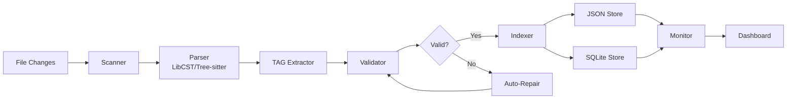

# @DATA:TAG-MODEL "16-Core TAG 관리 시스템 데이터 모델"

> **SPEC-002 Phase 1 Design**: 코드 TAG 관리 시스템의 핵심 데이터 모델 및 아키텍처 설계

## 📊 개요

본 문서는 SPEC-002의 Phase 1 설계로, 16-Core TAG 관리 시스템의 데이터 모델, 플로우 설계, 저장 전략 및 성능 고려사항을 다룹니다.

## 🏗️ 핵심 엔티티 모델

### 1. Tag 엔티티

```python
@dataclass
class Tag:
    """16-Core TAG 시스템의 핵심 엔티티"""

    # 기본 식별 정보
    id: str  # @REQ:CODE-TAG-002 형식
    category: TagCategory  # SPEC, STEERING, IMPLEMENTATION, QUALITY
    type: TagType  # REQ, DESIGN, TASK, etc.
    topic: str  # CODE-TAG, USER-AUTH, etc.
    sequence: Optional[str]  # 002, 001, etc.

    # 메타데이터
    description: str
    created_at: datetime
    updated_at: datetime
    status: TagStatus  # active, draft, deprecated
    priority: Optional[int]  # 1-5 우선순위

    # 위치 정보
    file_path: str
    line_number: int
    context: Optional[str]  # 주변 코드 컨텍스트

    # 추적성 정보
    parent_tags: List[str]  # 상위 TAG 참조
    child_tags: List[str]   # 하위 TAG 참조
    related_tags: List[str] # 연관 TAG 참조

    # 품질 정보
    auto_generated: bool = False
    confidence_score: float = 1.0  # 0.0-1.0
    validation_status: ValidationStatus = ValidationStatus.PENDING

    # 변경 추적
    created_by: Optional[str]
    last_modified_by: Optional[str]
    change_reason: Optional[str]
```

### 2. TagIndex 엔티티

```python
@dataclass
class TagIndex:
    """TAG 인덱스 관리 엔티티"""

    # 인덱스 메타데이터
    version: str  # 16-core
    created_at: datetime
    last_updated: datetime
    total_tags: int

    # 카테고리별 통계
    category_stats: Dict[TagCategory, int]
    status_stats: Dict[TagStatus, int]

    # 인덱스 데이터
    tags: Dict[str, Tag]  # tag_id -> Tag
    file_mappings: Dict[str, List[str]]  # file_path -> [tag_ids]

    # 관계 그래프
    relationships: Dict[str, List[TagRelationship]]

    # 성능 메트릭
    index_size_bytes: int
    last_scan_duration_ms: int
    last_validation_duration_ms: int
```

### 3. FileMapping 엔티티

```python
@dataclass
class FileMapping:
    """파일과 TAG 간의 매핑 정보"""

    # 파일 정보
    file_path: str
    file_hash: str  # SHA-256 hash
    file_size_bytes: int
    last_modified: datetime

    # TAG 정보
    tags: List[str]  # TAG IDs in this file
    tag_count: int

    # 파일 메타데이터
    language: str  # python, javascript, etc.
    encoding: str  # utf-8
    line_count: int
    function_count: int
    class_count: int
    complexity_score: float

    # 파싱 정보
    parser_used: ParserType  # libcst, tree_sitter, ast
    parse_time_ms: int
    syntax_errors: List[str]
    warnings: List[str]

    # 상태 추적
    scan_status: ScanStatus  # success, error, skipped
    last_scanned: datetime
    scan_duration_ms: int
```

### 4. ValidationResult 엔티티

```python
@dataclass
class ValidationResult:
    """TAG 검증 결과"""

    # 검증 세션 정보
    validation_id: str  # UUID
    timestamp: datetime
    validation_type: ValidationType  # format, consistency, traceability

    # 검증 대상
    target_tags: List[str]
    target_files: List[str]
    scope: ValidationScope  # project, directory, file

    # 검증 결과
    status: ValidationStatus  # passed, failed, warning
    total_checks: int
    passed_checks: int
    failed_checks: int
    warnings: int

    # 상세 결과
    issues: List[ValidationIssue]
    suggestions: List[str]
    auto_fixes_applied: List[str]

    # 성능 정보
    duration_ms: int
    memory_usage_mb: float
    processed_items: int
```

## 🔄 데이터 플로우 설계

### 1. Scan → Validate → Index → Monitor 파이프라인



### 2. 실시간 변경 감지 플로우

```python
class ChangeDetectionFlow:
    """실시간 파일 변경 감지 및 처리"""

    def __init__(self):
        self.file_watcher = WatchdogObserver()
        self.change_queue = asyncio.Queue()
        self.batch_processor = BatchProcessor()

    async def process_file_change(self, event: FileSystemEvent):
        """파일 변경 이벤트 처리"""
        if event.src_path.endswith('.py'):
            change = FileChange(
                file_path=event.src_path,
                change_type=event.event_type,
                timestamp=datetime.now()
            )
            await self.change_queue.put(change)

    async def batch_process_changes(self):
        """변경사항 배치 처리"""
        changes = await self.batch_processor.collect_changes(
            timeout_ms=1000,  # 1초 대기
            max_batch_size=50
        )

        # 스캔 → 검증 → 인덱싱 파이프라인 실행
        scan_results = await self.scanner.scan_files(changes)
        validation_results = await self.validator.validate_tags(scan_results)
        await self.indexer.update_index(validation_results)

        # 모니터링 이벤트 발생
        await self.monitor.emit_change_event(changes, validation_results)
```

### 3. 검증 체인 플로우

```python
class ValidationChain:
    """TAG 검증 체인 처리"""

    validators = [
        FormatValidator(),      # TAG 형식 검증
        NamingValidator(),      # 명명 규칙 검증
        ConsistencyValidator(), # 일관성 검증
        TraceabilityValidator(), # 추적성 검증
        DuplicateValidator(),   # 중복 검증
        OrphanValidator()       # 고아 TAG 검증
    ]

    async def validate(self, tags: List[Tag]) -> ValidationResult:
        """검증 체인 실행"""
        result = ValidationResult()

        for validator in self.validators:
            validator_result = await validator.validate(tags)
            result.merge(validator_result)

            # 심각한 오류 시 체인 중단
            if validator_result.has_critical_errors():
                break

        return result
```

## 💾 저장 전략 - JSON + SQLite 하이브리드 접근

### 1. JSON 저장소 (메인 인덱스)

```json
{
  "meta": {
    "version": "16-core",
    "created": "2025-09-18T10:00:00Z",
    "last_updated": "2025-09-18T15:30:00Z",
    "total_tags": 1247,
    "index_size_bytes": 2048576
  },
  "categories": {
    "SPEC": {
      "description": "문서 추적 - 필수",
      "tags": ["REQ", "DESIGN", "TASK"],
      "count": 425
    },
    "STEERING": {
      "description": "원칙 추적 - 필수",
      "tags": ["VISION", "STRUCT", "TECH", "ADR"],
      "count": 156
    },
    "IMPLEMENTATION": {
      "description": "코드 추적 - 필수",
      "tags": ["FEATURE", "API", "TEST", "DATA"],
      "count": 498
    },
    "QUALITY": {
      "description": "품질 추적 - 선택",
      "tags": ["PERF", "SEC", "DEBT", "TODO"],
      "count": 168
    }
  },
  "active_tags": {
    "@REQ:CODE-TAG-002": {
      "category": "SPEC",
      "topic": "CODE-TAG",
      "id": "002",
      "description": "src/moai_adk 코드베이스 전체에 16-Core TAG 시스템 적용",
      "file": ".moai/specs/SPEC-002/spec.md",
      "line": 3,
      "created": "2025-09-18T10:00:00Z",
      "updated": "2025-09-18T15:30:00Z",
      "status": "active",
      "priority": 2,
      "relationships": {
        "implements": ["@VISION:MOAI-ADK"],
        "references": ["@TECH:MOAI-ADK"],
        "traces_to": ["@TASK:TAG-SCAN-001", "@TASK:TAG-VALIDATE-001"]
      }
    }
  },
  "file_mappings": {
    "src/moai_adk/core/engine.py": {
      "tags": ["@FEATURE:ENGINE-CORE", "@API:GET-STATUS"],
      "last_scanned": "2025-09-18T15:25:00Z",
      "hash": "a1b2c3d4e5f6...",
      "size_bytes": 1024,
      "line_count": 45,
      "complexity": 3.2
    }
  },
  "statistics": {
    "by_category": {
      "SPEC": 425,
      "STEERING": 156,
      "IMPLEMENTATION": 498,
      "QUALITY": 168
    },
    "by_status": {
      "active": 1180,
      "draft": 45,
      "deprecated": 22
    },
    "health_metrics": {
      "orphaned_tags": 12,
      "duplicate_tags": 3,
      "broken_references": 5,
      "health_score": 0.94
    }
  }
}
```

### 2. SQLite 저장소 (관계형 데이터)

```sql
-- 테이블 스키마
CREATE TABLE tags (
    id TEXT PRIMARY KEY,
    category TEXT NOT NULL,
    type TEXT NOT NULL,
    topic TEXT NOT NULL,
    sequence TEXT,
    description TEXT NOT NULL,
    file_path TEXT NOT NULL,
    line_number INTEGER NOT NULL,
    created_at TIMESTAMP DEFAULT CURRENT_TIMESTAMP,
    updated_at TIMESTAMP DEFAULT CURRENT_TIMESTAMP,
    status TEXT DEFAULT 'active',
    priority INTEGER,
    auto_generated BOOLEAN DEFAULT FALSE,
    confidence_score REAL DEFAULT 1.0,
    created_by TEXT,
    last_modified_by TEXT
);

CREATE TABLE tag_relationships (
    id INTEGER PRIMARY KEY AUTOINCREMENT,
    source_tag TEXT NOT NULL,
    target_tag TEXT NOT NULL,
    relationship_type TEXT NOT NULL, -- implements, references, traces_to
    strength REAL DEFAULT 1.0,
    created_at TIMESTAMP DEFAULT CURRENT_TIMESTAMP,
    FOREIGN KEY (source_tag) REFERENCES tags(id),
    FOREIGN KEY (target_tag) REFERENCES tags(id)
);

CREATE TABLE file_mappings (
    file_path TEXT PRIMARY KEY,
    file_hash TEXT NOT NULL,
    file_size_bytes INTEGER,
    last_modified TIMESTAMP,
    last_scanned TIMESTAMP,
    scan_duration_ms INTEGER,
    tag_count INTEGER DEFAULT 0,
    language TEXT,
    line_count INTEGER,
    complexity_score REAL
);

CREATE TABLE validation_history (
    id TEXT PRIMARY KEY,
    timestamp TIMESTAMP DEFAULT CURRENT_TIMESTAMP,
    validation_type TEXT NOT NULL,
    status TEXT NOT NULL,
    total_checks INTEGER,
    passed_checks INTEGER,
    failed_checks INTEGER,
    warnings INTEGER,
    duration_ms INTEGER
);

-- 인덱스 생성
CREATE INDEX idx_tags_category ON tags(category);
CREATE INDEX idx_tags_type ON tags(type);
CREATE INDEX idx_tags_status ON tags(status);
CREATE INDEX idx_tags_file_path ON tags(file_path);
CREATE INDEX idx_relationships_source ON tag_relationships(source_tag);
CREATE INDEX idx_relationships_target ON tag_relationships(target_tag);
CREATE INDEX idx_file_mappings_last_scanned ON file_mappings(last_scanned);
```

### 3. 하이브리드 접근법의 장점

| 저장소 | 용도 | 장점 | 성능 특성 |
|--------|------|------|-----------|
| **JSON** | 메인 인덱스, 빠른 읽기 | 단순함, 가독성, 백업 용이 | 읽기: O(1), 쓰기: O(n) |
| **SQLite** | 복잡한 쿼리, 관계형 데이터 | 강력한 쿼리, 트랜잭션, 무결성 | 읽기: O(log n), 쓰기: O(log n) |

## ⚡ 성능 고려사항

### 1. 목표 성능 지표

| 메트릭 | 목표 | 현재 기준 |
|--------|------|-----------|
| **스캔 속도** | 5초/1000파일 | 1000 LOC Python 파일 기준 |
| **메모리 사용량** | <500MB | 10,000 TAG 프로젝트 기준 |
| **인덱스 업데이트** | <100ms | 단일 파일 변경 기준 |
| **검색 응답** | <50ms | 단순 텍스트 검색 기준 |
| **검증 속도** | <10초 | 전체 프로젝트 검증 기준 |

### 2. LibCST + Tree-sitter 하이브리드 파싱 전략

```python
class HybridParser:
    """LibCST와 Tree-sitter를 조합한 하이브리드 파서"""

    def __init__(self):
        self.libcst_parser = LibCSTParser()  # 정확한 Python AST
        self.tree_sitter_parser = TreeSitterParser()  # 빠른 구문 분석

    async def parse_file(self, file_path: str) -> ParseResult:
        """파일 크기와 복잡도에 따른 적응형 파싱"""
        file_info = await self.analyze_file(file_path)

        if file_info.size_bytes > 100_000 or file_info.complexity > 10:
            # 큰 파일: Tree-sitter로 빠른 파싱
            return await self.tree_sitter_parser.parse(file_path)
        else:
            # 작은 파일: LibCST로 정확한 파싱
            return await self.libcst_parser.parse(file_path)

    async def extract_tags(self, parse_result: ParseResult) -> List[Tag]:
        """파싱 결과에서 TAG 추출"""
        visitor = TagExtractionVisitor()

        if parse_result.parser_type == ParserType.LIBCST:
            # LibCST AST 순회
            parse_result.tree.visit(visitor)
        else:
            # Tree-sitter 노드 순회
            visitor.visit_tree_sitter(parse_result.tree)

        return visitor.extracted_tags
```

### 3. orjson을 활용한 고성능 JSON 처리

```python
import orjson
from typing import Any, Dict

class HighPerformanceJSONStore:
    """orjson 기반 고성능 JSON 저장소"""

    def __init__(self, file_path: str):
        self.file_path = file_path
        self._cache: Optional[Dict[str, Any]] = None
        self._cache_timestamp: Optional[float] = None

    async def load(self) -> Dict[str, Any]:
        """비동기 JSON 로드 (캐싱 포함)"""
        current_time = time.time()

        if (self._cache is None or
            current_time - self._cache_timestamp > 60):  # 1분 캐시

            async with aiofiles.open(self.file_path, 'rb') as f:
                content = await f.read()
                self._cache = orjson.loads(content)
                self._cache_timestamp = current_time

        return self._cache

    async def save(self, data: Dict[str, Any]) -> None:
        """비동기 JSON 저장 (최적화된 직렬화)"""
        serialized = orjson.dumps(
            data,
            option=orjson.OPT_INDENT_2 | orjson.OPT_SORT_KEYS
        )

        async with aiofiles.open(self.file_path, 'wb') as f:
            await f.write(serialized)

        # 캐시 업데이트
        self._cache = data
        self._cache_timestamp = time.time()
```

### 4. Watchdog를 활용한 파일 모니터링

```python
import asyncio
from watchdog.observers import Observer
from watchdog.events import FileSystemEventHandler

class TagFileWatcher(FileSystemEventHandler):
    """실시간 파일 변경 모니터링"""

    def __init__(self, change_handler):
        self.change_handler = change_handler
        self.change_buffer = {}
        self.buffer_timeout = 1.0  # 1초 버퍼링

    def on_modified(self, event):
        if not event.is_directory and event.src_path.endswith('.py'):
            # 버퍼링으로 연속 변경 통합
            self.change_buffer[event.src_path] = time.time()
            asyncio.create_task(self._process_buffered_changes())

    async def _process_buffered_changes(self):
        """버퍼링된 변경사항 처리"""
        await asyncio.sleep(self.buffer_timeout)

        current_time = time.time()
        changes_to_process = []

        for file_path, change_time in list(self.change_buffer.items()):
            if current_time - change_time >= self.buffer_timeout:
                changes_to_process.append(file_path)
                del self.change_buffer[file_path]

        if changes_to_process:
            await self.change_handler.process_file_changes(changes_to_process)
```

## 🔒 보안 및 무결성

### 1. 입력 검증 및 정규화

```python
class TagInputValidator:
    """TAG 입력 검증 및 정규화"""

    TAG_PATTERN = re.compile(
        r'^@(REQ|DESIGN|TASK|VISION|STRUCT|TECH|ADR|FEATURE|API|TEST|DATA|PERF|SEC|DEBT|TODO):'
        r'[A-Z0-9_-]+(?:-\d{3})?$'
    )

    def validate_tag_format(self, tag: str) -> ValidationResult:
        """TAG 형식 검증"""
        if not isinstance(tag, str):
            return ValidationResult.error("TAG must be string")

        if len(tag) > 100:
            return ValidationResult.error("TAG too long (max 100 chars)")

        if not self.TAG_PATTERN.match(tag):
            return ValidationResult.error(f"Invalid TAG format: {tag}")

        return ValidationResult.success()

    def sanitize_description(self, description: str) -> str:
        """설명 문자열 정규화"""
        # HTML 태그 제거
        description = re.sub(r'<[^>]*>', '', description)

        # 특수 문자 이스케이핑
        description = html.escape(description)

        # 길이 제한
        if len(description) > 500:
            description = description[:497] + "..."

        return description.strip()
```

### 2. 접근 제어 및 감사 로깅

```python
class TagAccessControl:
    """TAG 시스템 접근 제어"""

    def __init__(self):
        self.audit_logger = AuditLogger()

    def check_permission(self, user: str, action: str, resource: str) -> bool:
        """권한 검사"""
        permissions = self.get_user_permissions(user)

        required_permission = f"{action}:{resource}"
        has_permission = required_permission in permissions

        # 감사 로그 기록
        self.audit_logger.log_access_attempt(
            user=user,
            action=action,
            resource=resource,
            granted=has_permission,
            timestamp=datetime.now()
        )

        return has_permission

    @contextmanager
    def audit_context(self, user: str, operation: str):
        """감사 컨텍스트 매니저"""
        operation_id = str(uuid.uuid4())
        start_time = time.time()

        self.audit_logger.log_operation_start(
            operation_id=operation_id,
            user=user,
            operation=operation,
            timestamp=datetime.now()
        )

        try:
            yield operation_id
            duration = time.time() - start_time
            self.audit_logger.log_operation_success(
                operation_id=operation_id,
                duration_ms=int(duration * 1000)
            )
        except Exception as e:
            duration = time.time() - start_time
            self.audit_logger.log_operation_failure(
                operation_id=operation_id,
                error=str(e),
                duration_ms=int(duration * 1000)
            )
            raise
```

## 📈 모니터링 및 관찰가능성

### 1. 구조화된 로깅

```python
import structlog

# 로거 설정
logger = structlog.get_logger()

class TagSystemLogger:
    """TAG 시스템 전용 로거"""

    def __init__(self):
        self.logger = logger.bind(component="tag-system")

    def log_scan_start(self, files: List[str], user: str):
        """스캔 시작 로그"""
        self.logger.info(
            "tag_scan_started",
            file_count=len(files),
            user=user,
            operation_id=str(uuid.uuid4())
        )

    def log_validation_result(self, result: ValidationResult):
        """검증 결과 로그"""
        self.logger.info(
            "tag_validation_completed",
            validation_id=result.validation_id,
            status=result.status.value,
            total_checks=result.total_checks,
            failed_checks=result.failed_checks,
            duration_ms=result.duration_ms
        )

    def log_performance_metric(self, operation: str, duration_ms: int,
                             memory_mb: float, items_processed: int):
        """성능 메트릭 로그"""
        self.logger.info(
            "performance_metric",
            operation=operation,
            duration_ms=duration_ms,
            memory_mb=memory_mb,
            items_processed=items_processed,
            throughput=items_processed / (duration_ms / 1000) if duration_ms > 0 else 0
        )
```

### 2. 메트릭 수집

```python
from prometheus_client import Counter, Histogram, Gauge

class TagSystemMetrics:
    """Prometheus 메트릭 수집"""

    def __init__(self):
        # 카운터
        self.scans_total = Counter('tag_scans_total', 'Total TAG scans')
        self.validations_total = Counter('tag_validations_total', 'Total validations')
        self.errors_total = Counter('tag_errors_total', 'Total errors', ['error_type'])

        # 히스토그램 (응답시간)
        self.scan_duration = Histogram('tag_scan_duration_seconds', 'Scan duration')
        self.validation_duration = Histogram('tag_validation_duration_seconds', 'Validation duration')

        # 게이지 (현재 상태)
        self.active_tags = Gauge('tag_active_total', 'Active TAGs')
        self.index_size_bytes = Gauge('tag_index_size_bytes', 'Index size in bytes')
        self.memory_usage = Gauge('tag_system_memory_bytes', 'Memory usage')

    def record_scan(self, duration_seconds: float, tags_found: int):
        """스캔 메트릭 기록"""
        self.scans_total.inc()
        self.scan_duration.observe(duration_seconds)
        self.active_tags.set(tags_found)

    def record_error(self, error_type: str):
        """에러 메트릭 기록"""
        self.errors_total.labels(error_type=error_type).inc()
```

## 🚀 Constitution 준수 및 아키텍처 결정

### 1. 모듈 통합 (4 → 3)

Constitution의 Simplicity 원칙에 따라 모듈을 통합:

```python
# 기존 4개 모듈
# - tag-scanner.py
# - tag-validator.py
# - tag-indexer.py
# - tag-repair.py

# 통합된 3개 모듈
class CoreEngine:
    """핵심 엔진: 스캔 + 검증 통합"""
    scanner: TagScanner
    validator: TagValidator

class IntegrationModule:
    """통합 모듈: 인덱싱 + Git 연동"""
    indexer: TagIndexer
    git_integration: GitIntegration

class MonitoringModule:
    """모니터링 모듈: 대시보드 + 복구"""
    monitor: TagMonitor
    auto_repair: TagRepair
```

### 2. TDD 준비 설계

모든 컴포넌트에 명확한 인터페이스와 테스트 가능한 구조:

```python
# 추상 인터페이스
class TagScannerInterface(ABC):
    @abstractmethod
    async def scan_files(self, file_paths: List[str]) -> ScanResult: ...

    @abstractmethod
    async def suggest_tags(self, file_content: str) -> List[Tag]: ...

# 구현 클래스
class LibCSTTagScanner(TagScannerInterface):
    async def scan_files(self, file_paths: List[str]) -> ScanResult:
        # 구현
        pass

# 테스트 가능한 구조
class TestableTagScanner(TagScannerInterface):
    def __init__(self, mock_responses: Dict[str, ScanResult]):
        self.mock_responses = mock_responses

    async def scan_files(self, file_paths: List[str]) -> ScanResult:
        return self.mock_responses.get(file_paths[0], ScanResult.empty())
```

### 3. 구조화된 로깅 및 관찰가능성

모든 컴포넌트에 일관된 로깅 적용:

```python
class ObservableComponent:
    """관찰 가능한 컴포넌트 베이스 클래스"""

    def __init__(self, component_name: str):
        self.logger = structlog.get_logger().bind(component=component_name)
        self.metrics = ComponentMetrics(component_name)

    @contextmanager
    def operation_context(self, operation: str, **kwargs):
        """작업 컨텍스트 with 로깅 및 메트릭"""
        operation_id = str(uuid.uuid4())
        start_time = time.time()

        self.logger.info(f"{operation}_started", operation_id=operation_id, **kwargs)

        try:
            yield operation_id
            duration = time.time() - start_time
            self.metrics.record_success(operation, duration)
            self.logger.info(f"{operation}_completed",
                           operation_id=operation_id, duration_ms=int(duration * 1000))
        except Exception as e:
            duration = time.time() - start_time
            self.metrics.record_error(operation, duration)
            self.logger.error(f"{operation}_failed",
                            operation_id=operation_id, error=str(e))
            raise
```

### 4. 버전 관리 전략

MAJOR.MINOR.BUILD 형식으로 엄격한 버전 관리:

```python
@dataclass
class SystemVersion:
    """시스템 버전 관리"""
    major: int  # Breaking changes
    minor: int  # New features
    build: int  # Bug fixes

    def __str__(self) -> str:
        return f"{self.major}.{self.minor}.{self.build}"

    def is_compatible_with(self, other: 'SystemVersion') -> bool:
        """하위 호환성 검사"""
        return self.major == other.major

# 버전 기반 마이그레이션
class VersionMigrator:
    def migrate_index(self, from_version: SystemVersion,
                     to_version: SystemVersion) -> MigrationResult:
        """인덱스 버전 마이그레이션"""
        migrations = self.get_migrations_between(from_version, to_version)

        for migration in migrations:
            migration.apply()

        return MigrationResult.success()
```

---

> **@DATA:TAG-MODEL** 태그를 통해 이 데이터 모델이 SPEC-002 구현의 기반이 됩니다.
>
> **다음 단계**: `/moai:4-tasks SPEC-002`로 TDD 기반 구현 작업 분해