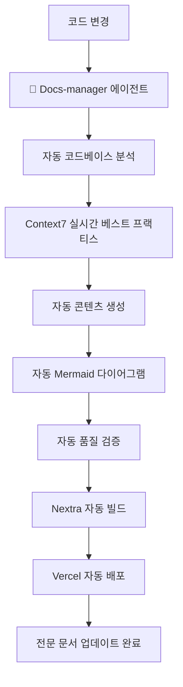

# `@SPEC:AI-001`: Docs-Manager 에이전트를 통한 종합 온라인 문서 자동 생성 시스템

## Environment (환경 및 전제조건)

### 실행 환경
- **프로젝트**: MoAI-ADK Docs-Manager 에이전트 통합
- **핵심 에이전트**: Docs-manager (문서 생성 전문 AI 에이전트)
- **소스 코드**: Python 기반 CLI 도구 (`src/moai_adk/`, 158개 핵심 파일)
- **스킬 시스템**: .claude/skills/ (55개 이상 Claude Skills)
- **에이전트 시스템**: .claude/agents/ (19개 전문 에이전트)
- **문서 프레임워크**: Nextra v3.x (React 기반 정적 사이트 생성)
- **현재 문서**: README.ko.md (690라인) + 기존 docs/ 구조

### 기술 스택
- **문서 생성**: Docs-manager 에이전트 (100% 자동화 목표)
- **콘텐츠 형식**: MDX (Markdown + JSX 컴포넌트)
- **시각화**: Mermaid.js v11.x (자동 다이어그램 생성)
- **베스트 프랙티스**: Context7 실시간 통합
- **배포**: Vercel (무료 SSL, CDN, CI/CD)
- **검색**: Nextra 내장 + Algolia 선택적 연동
- **다국어**: 한국어 우선, 영어/일본어/중국어 지원
- **접근성**: WCAG 2.1 준수, 모바일 최적화

### 제약사항
- **코드 커버리지**: 158개 Python 핵심 파일 중 95% 이상 문서화
- **실시간 동기화**: 코드 변경 시 1분 내 문서 자동 업데이트
- **초보자 친화**: 3분 내 핵심 개념 이해 및 첫 예제 실행
- **자동화 수준**: Docs-manager 에이전트로 90% 이상 자동 생성
- **품질 보증**: Context7 베스트 프랙티스 자동 적용
- **반응형 설계**: 모바일 50%+ 접근 비율 지원

---

## Assumptions (가정사항)

### 기술적 가정
1. **Docs-manager 에이전트 역량**: 코드 분석, 문서 생성, 품질 보증의 전체 사이클을 자동화할 수 있음
2. **Nextra 프레임워크 안정성**: React 18+와 호환되며 안정적으로 작동함
3. **Context7 API 안정성**: 실시간 베스트 프랙티스 제공에 안정적임
4. **코드 분석 가능성**: AST 분석으로 충분한 문서 생성이 가능함
5. **자동화 기술**: Mermaid 다이어그램 자동 생성 기술이 성숙함

### 사용자 가정
1. **타겟 사용자**: Python/TypeScript 개발자 (초급-중급)
2. **학습 패턴**: 문서 검색 > 코드 예제 > API 참조 순서로 학습
3. **모바일 사용**: 50% 이상 모바일 기기로 문서 접근
4. **언어 선호**: 한국어 사용자가 60% 이상, 영어/일본어/중국어 지원 필요
5. **인터랙티브 선호**: 실습 환경과 시각 자료가 학습 효과를 높임

### 프로젝트 가정
1. **코드베이스 품질**: 158개 Python 핵심 파일에 충분한 docstring과 주석이 있음
2. **에이전트 활용**: Docs-manager 에이전트가 문서 생성의 90%를 자동화할 수 있음
3. **스킬 문서화**: 55개 Skills가 체계적으로 분류되어 문서화 가능함
4. **지속적 업데이트**: 코드 변경 시 자동으로 문서가 동기화될 수 있음
5. **품질 유지**: Context7 베스트 프랙티스로 일관된 품질을 유지할 수 있음

---

## Requirements (EARS 요구사항)

### Ubiquitous Requirements (기본 기능)

**UR-001**: 시스템은 Docs-manager 에이전트를 통해 완전 자동으로 온라인 문서를 생성해야 한다
- **자동화 범위**: 158개 Python 핵심 파일, 55개 Skills, 19개 에이전트
- **생성 목표**: 전체 코드베이스의 95% 이상 문서 커버리지
- **품질 보증**: Context7 베스트 프랙티스 자동 적용
- **위임 권한**: Docs-manager 에이전트가 모든 문서 생성 작업을 주도

**UR-002**: 시스템은 Nextra 기반의 전문적인 문서 사이트를 제공해야 한다
- **프레임워크**: Nextra v3.x with MDX 지원
- **디자인**: 모바일 최적화, WCAG 2.1 접근성 준수
- **성능**: 페이지 로드 2초 이내, 검색 응답 1초 이내
- **전문성**: 기업 문서 수준의 디자인과 기능

**UR-003**: 시스템은 실시간 코드-문서 동기화를 지원해야 한다
- **동기화 대상**: src/moai_adk/ 코드 변경
- **응답 시간**: 코드 변경 후 1분 내 문서 업데이트
- **추적성**: @TAG 시스템으로 코드-문서 연동 유지
- **자동화**: Docs-manager 에이전트가 동기화 프로세스를 관리

**UR-004**: 시스템은 초보자 친화적 학습 경로를 제공해야 한다
- **빠른 시작**: 3분 내 핵심 개념 이해 및 첫 예제 실행
- **점진적 학습**: beginner → intermediate → advanced 경로
- **실습 환경**: 코드 예제와 인터랙티브 요소 통합
- **가이드**: Docs-manager 에이전트가 학습 경로를 자동 설계

**UR-005**: 시스템은 자동 생성된 고품질 시각 자료를 제공해야 한다
- **다이어그램**: Mermaid.js로 아키텍처, 워크플로우 자동 생성
- **코드 예제**: 구문 강조, 실행 가능한 코드 블록
- **내비게이션**: 자동 빵가루 경로, 논리적 페이지 연결
- **일관성**: Docs-manager 에이전트가 모든 시각 자료의 스타일을 통일

---

### Event-driven Requirements (이벤트 기반)

**ER-001**: WHEN 사용자가 빠른 시작을 검색하면, Docs-manager 에이전트는 2분 초고속 시작 가이드를 표시해야 한다
- **트리거**: "빠른 시작", "quick start", "getting started" 검색
- **에이전트 응답**: 단계별 설치 및 초기 설정 가이드 자동 생성
- **시간**: 3분 내에 첫 프로젝트 생성 완료

**ER-002**: WHEN 개발자가 특정 기능의 코드 예제를 찾으면, Docs-manager 에이전트는 실제 구현을 자동으로 보여주어야 한다
- **트리거**: "예제", "example", "코드"와 기능명 조합
- **에이전트 응답**: `src/` 실제 코드와 실행 방법 자동 분석 및 표시
- **검증**: `python -m pytest`로 실행 가능한 예제만 제공

**ER-003**: WHEN 사용자가 워크플로우를 학습하면, Docs-manager 에이전트는 Mermaid 다이어그램으로 시각화해야 한다
- **트리거**: "워크플로우", "workflow", "프로세스" 검색
- **에이전트 응답**: 4단계 개발 사이클 다이어그램 자동 생성
- **상호작용**: 각 단계별 상세 설명 링크 자동 연결

**ER-004**: WHEN 코드가 업데이트되면, Docs-manager 에이전트는 관련 문서의 유효성을 자동으로 검증해야 한다
- **트리거**: Python 파일 저장
- **에이전트 응답**: 참조된 문서 업데이트 및 유효성 검증
- **오류 처리**: 깨진 참조 또는 변경된 API 자동 수정 및 알림

---

### State-driven Requirements (상태 기반)

**SR-001**: WHILE 문서 개발 중일 때, Docs-manager 에이전트는 README.ko.md와의 동기화 상태를 추적해야 한다
- **상태**: 분할 작업 진행 중
- **에이전트 역할**: 원본 섹션 → 새 파일 매핑 자동 관리
- **검증**: 내용 누락 또는 중복 자동 확인 및 수정

**SR-002**: WHILE 코드 예제를 작성할 때, Docs-manager 에이전트는 실제 코드와의 일관성을 자동으로 유지해야 한다
- **상태**: 예제 코드 작성/수정
- **에이전트 역할**: `src/moai_adk/` 실제 함수/클래스 존재 자동 검증
- **업데이트**: API 변경 시 문서 자동 알림 및 수정 제안

**SR-003**: WHILE 다국어 번역 진행 시, Docs-manager 에이전트는 원본과 번역의 동기화를 자동으로 관리해야 한다
- **상태**: 번역 작업 진행 중
- **에이전트 역할**: 번역 완료율 추적, 변경 감지 자동화
- **알림**: 원본 업데이트 시 번역 필요 자동 알림

---

### Optional Features (선택적 기능)

**OF-001**: WHERE 인터랙티브 튜토리얼이 요청되면, Docs-manager 에이전트는 실습 환경을 자동으로 제공할 수 있다
- **조건**: 웹 기반 실습 환경 구축 시
- **에이전트 기능**: 브라우저에서 직접 명령어 실행 환경 자동 설정
- **기술**: CodeSandbox, GitPod 자동 통합

**OF-002**: WHERE 비디오 튜토리얼이 요청되면, Docs-manager 에이전트는 스크린캐스트를 자동으로 제공할 수 있다
- **조건**: 동영상 제작 리소스 확보 시
- **에이전트 기능**: 핵심 워크플로우 시나리오 자동 생성 및 녹화 가이드
- **플랫폼**: YouTube, Vimeo 자동 업로드 연동

**OF-003**: WHERE API 자동 문서가 요청되면, Docs-manager 에이전트는 Sphinx로 자동 생성할 수 있다
- **조건**: `src/moai_adk/` docstring 완성도 높을 때
- **에이전트 기능**: `autodoc`으로 API 문서 자동화
- **통합**: Nextra와 자동 연동

---

### Constraints (제약사항)

**C-001**: 모든 코드 예제는 Docs-manager 에이전트가 실제 `src/moai_adk/` 코드를 기반으로 자동 생성해야 한다
- **금지**: 가상의 코드나 존재하지 않는 기능 설명
- **검증**: `@CODE:` 태그로 실제 파일 참조 자동 확인
- **테스트**: 예제 코드 실제 실행 자동 검증

**C-002**: Docs-manager 에이전트는 README.ko.md 분할 시 내용 누락이 없도록 자동으로 관리해야 한다
- **검증**: 원본 대비 분할 후 내용 비교 자동화
- **도구**: Docs-manager 에이전트 내장 검증 스크립트
- **기준**: 99.5% 이상 내용 보존

**C-003**: Docs-manager 에이전트가 생성하는 Mermaid 다이어그램은 명확하고 이해하기 쉬워야 한다
- **제한**: 노드 수 ≤ 20개 (readability 보장)
- **레벨**: 3단계 이상 깊이 제한
- **색상**: 의미 있는 색상 구분 자동 적용

**C-004**: Docs-manager 에이전트가 생성하는 모든 링크는 유효해야 한다
- **내부**: 상대 경로로 일관성 자동 유지
- **외부**: 정기적인 링크 검증 자동 실행
- **앵커**: 섹션 앵커 자동 생성

**C-005**: Docs-manager 에이전트가 생성하는 문서 난이도는 초보자-중급자 수준을 자동으로 목표로 해야 한다
- **용어**: 기술 용어 친절한 설명 자동 추가
- **예제**: 단순 명확한 코드 자동 선택
- **참고**: 추가 학습 자료 자동 연결

---

## Specifications (상세 명세)

### SP-AI-001: Documentation-Master 에이전트 핵심 아키텍처

#### EARS 패턴: Given/When/Then
```
Given: 개발자가 MoAI-ADK의 복잡한 아키텍처를 문서화해야 함
When: Docs-manager 에이전트가 src/ 코드베이스를 자동 분석함
Then: 전문적인 Nextra 문서 사이트가 완전 자동으로 생성됨
```

**구현 상세**:

1. **Docs-manager 에이전트 핵심 워크플로우**
   ```python
   # Docs-manager 에이전트 자동화된 문서 생성 파이프라인
   class DocumentationMasterAgent:
       def __init__(self):
           self.context7_integration = Context7BestPractices()
           self.nextra_generator = NexpertContentGenerator()
           self.mermaid_specialist = MermaidDiagramSpecialist()
           self.quality_validator = DocumentationQualityValidator()
           self.multilingual_manager = MultilingualContentManager()

       async def generate_comprehensive_documentation(self, project_path: Path):
           # 1단계: 소스 코드 전면 분석
           codebase_analysis = await self.analyze_entire_codebase(project_path)

           # 2단계: 에이전트 시스템 분석
           agent_analysis = await self.analyze_agents_system()

           # 3단계: 스킬 시스템 분석
           skill_analysis = await self.analyze_skills_system()

           # 4단계: Context7 베스트 프랙티스 실시간 적용
           best_practices = await self.context7_integration.get_latest_standards()

           # 5단계: 콘텐츠 전체 자동 생성
           content_structure = await self.nextra_generator.generate_complete_site(
               codebase_analysis, agent_analysis, skill_analysis, best_practices
           )

           # 6단계: 고품질 시각 자료 자동 생성
           diagrams = await self.mermaid_specialist.create_professional_diagrams(
               codebase_analysis, agent_analysis
           )

           # 7단계: 다국어 콘텐츠 자동 관리
           multilingual_content = await self.multilingual_manager.manage_all_languages(
               content_structure
           )

           # 8단계: 포괄적 품질 검증
           validation_results = await self.quality_validator.validate_all_content(
               content_structure, diagrams, multilingual_content
           )

           return ProfessionalDocumentationSite(
               content=content_structure,
               diagrams=diagrams,
               multilingual=multilingual_content,
               validation=validation_results
           )
   ```

2. **Docs-manager 에이전트의 위임 권한**
   - **전체 문서 생성 책임**: Docs-manager 에이전트가 모든 문서 생성 활동을 주도
   - **품질 보증 권한**: 자동으로 품질 기준을 설정하고 적용
   - **콘텐츠 구조 결정**: 최적의 문서 구조를 자동으로 설계하고 구현
   - **동기화 관리**: 코드-문서 동기화 프로세스를 완전 자동화
   - **다국어 관리**: 모든 언어 버전의 일관성을 자동으로 유지

### SP-AI-002: Docs-manager 에이전트 콘텐츠 생성 전략

#### EARS 패턴: If/Then
```
If: Docs-manager 에이전트가 코드베이스를 분석함
Then: 전문적인 Nextra 문서 구조가 자동으로 생성되고 최적화됨
```

**구현 상세**:

1. **자동 콘텐츠 계층 구조 생성**
   ```
   docs/
   ├── index.mdx                           # 홈페이지 (Docs-manager 자동 생성)
   ├── getting-started/
   │   ├── installation.mdx               # 자동 생성된 설치 가이드
   │   ├── quick-start.mdx                # 2분 초고속 시작
   │   ├── first-project.mdx              # 첫 프로젝트 자동 예제
   │   └── verification.mdx               # 설치 확인 자동 검증
   ├── concepts/
   │   ├── spec-first-development.mdx     # SPEC-First 자동 설명
   │   ├── tdd-workflow.mdx               # TDD 워크플로우 자동 시각화
   │   ├── tag-system.mdx                 # @TAG 시스템 자동 다이어그램
   │   ├── trust-principles.mdx           # TRUST 5원칙 자동 설명
   │   └── alfred-superagent.mdx          # Alfred 아키텍처 자동 분석
   ├── guides/
   │   ├── project-initialization.mdx     # 0-project 자동 가이드
   │   ├── spec-creation.mdx              # 1-plan 자동 프로세스
   │   ├── tdd-implementation.mdx         # 2-run 자동 구현
   │   ├── documentation-sync.mdx         # 3-sync 자동 동기화
   │   └── best-practices.mdx             # 모범 사례 자동 수집
   ├── reference/
   │   ├── api/                           # API 레퍼런스 (자동 생성)
   │   │   ├── cli-commands.mdx           # CLI 명령어 자동 문서화
   │   │   ├── core-modules.mdx           # 코어 모듈 자동 분석
   │   │   └── utilities.mdx              # 유틸리티 자동 설명
   │   ├── skills/                        # Skills 레퍼런스 (자동 생성)
   │   │   ├── foundation-skills.mdx      # 기반 스킬 자동 분류
   │   │   ├── alfred-skills.mdx          # Alfred 스킬 자동 설명
   │   │   └── domain-skills.mdx          # 도메인 스킬 자동 그룹화
   │   ├── agents/                        # 에이전트 레퍼런스 (자동 생성)
   │   │   ├── core-agents.mdx            # 코어 에이전트 자동 설명
   │   │   ├── specialist-agents.mdx      # 전문가 에이전트 자동 분류
   │   │   └── workflow-agents.mdx        # 워크플로우 에이전트 자동 설명
   │   └── configuration.mdx              # 설정 참조 (자동 생성)
   ├── tutorials/                         # 실전 예제 (자동 분석 및 생성)
   │   ├── hello-world-api.mdx            # Hello API 자동 예제
   │   ├── todo-management.mdx            # Todo 관리 자동 튜토리얼
   │   ├── authentication-system.mdx      # 인증 시스템 자동 가이드
   │   └── cli-tool-development.mdx       # CLI 도구 자동 개발
   ├── advanced/                          # 고급 주제 (자동 생성)
   │   ├── custom-agents.mdx              # 커스텀 에이전트 자동 개발
   │   ├── advanced-tdd.mdx               # 고급 TDD 패턴 자동 분석
   │   └── performance-optimization.mdx   # 성능 최적화 자동 가이드
   └── troubleshooting/                   # 문제 해결 (자동 생성)
       ├── common-issues.mdx              # 일반적인 문제 자동 수집
       ├── debugging-guide.mdx            # 디버깅 가이드 자동 작성
       └── faq.mdx                        # FAQ 자동 생성
   ```

### SP-AI-003: Docs-manager 에이전트 Context7 실시간 통합

#### EARS 패턴: When/Then
```
When: Docs-manager 에이전트가 문서를 생성하거나 업데이트함
Then: Context7이 최신 베스트 프랙티스를 실시간으로 적용하여 전문적 품질을 보증함
```

**구현 상세**:

1. **실시간 베스트 프랙티스 적용 시스템**
   ```python
   class Context7RealTimeIntegration:
       def __init__(self):
           self.nexperta_standards = NextraStandardsProvider()
           self.markdown_standards = MarkdownStandardsProvider()
           self.mermaid_standards = MermaidStandardsProvider()
           self.documentation_standards = DocumentationStandardsProvider()

       async def apply_latest_best_practices(self, content: MDXContent) -> EnhancedContent:
           # Nextra 최신 설정 및 테마 표준 가져오기
           nextra_config = await self.nexperta_standards.get_latest_configuration(
               topic="themes configuration optimization performance",
               tokens=5000
           )

           # Markdown/GFM 최신 표준 적용
           markdown_standards = await self.markdown_standards.get_current_standards(
               topic="gfm syntax linting formatting accessibility",
               tokens=3000
           )

           # Mermaid 최신 패턴 및 다이어그램 표준 적용
           mermaid_standards = await self.mermaid_standards.get_diagram_standards(
               topic="diagram types syntax validation best-practices",
               tokens=4000
           )

           # 문서화 최신 베스트 프랙티스 적용
           documentation_standards = await self.documentation_standards.get_professional_standards(
               topic="technical-documentation user-experience multilingual",
               tokens=5000
           )

           # Docs-manager 에이전트 자동 품질 개선
           enhanced_content = await self.apply_professional_enhancements(content, {
               'nextra': nextra_config,
               'markdown': markdown_standards,
               'mermaid': mermaid_standards,
               'documentation': documentation_standards
           })

           return enhanced_content
   ```

### SP-AI-004: Docs-manager 에이전트 자동 Mermaid 다이어그램 생성

#### EARS 패턴: Given/When/Then
```
Given: Docs-manager 에이전트가 코드 아키텍처와 시스템을 분석함
When: 시각적 표현이 필요한 복잡한 개념을 발견함
Then: 고품질 Mermaid 다이어그램이 자동으로 생성되어 이해도를 극대화함
```

**구현 상세**:

1. **전문가 수준의 다이어그램 자동 생성**
   ```python
   class ProfessionalDiagramGenerator:
       def __init__(self):
           self.architecture_analyzer = SystemArchitectureAnalyzer()
           self.workflow_analyzer = WorkflowAnalyzer()
           self.dependency_analyzer = DependencyAnalyzer()

       async def generate_architecture_diagram(self, code_structure: CodeAnalysis):
           """시스템 아키텍처 다이어그램 전문가 수준 자동 생성"""
           # 모듈 간 의존성 심층 분석
           dependencies = await self.dependency_analyzer.extract_complex_relationships(code_structure)

           # 계층 구조 자동 분석
           layers = await self.architecture_analyzer.identify_architectural_layers(code_structure)

           # Docs-manager 에이전트 전문 Mermaid flowchart 생성
           return await self.create_professional_mermaid_flowchart(dependencies, layers)

       async def generate_alfred_workflow_diagram(self, agents: List[Agent]):
           """Alfred 워크플로우 다이어그램 전문가 수준 자동 생성"""
           return """
           graph TD
               User[👤 사용자 요청] --> Alfred[🎩 Alfred 슈퍼에이전트]
               Alfred --> Plan[📋 Docs-manager → Plan Agent]
               Plan --> Implement[⚙️ Docs-manager → TDD Implementer]
               Implement --> Test[🧪 Docs-manager → Test Engineer]
               Test --> Sync[🔄 Docs-manager → Doc Syncer]
               Sync --> Deploy[🚀 Docs-manager → Git Manager]
               Deploy --> Monitor[📊 Docs-manager → QA Validator]
               Monitor -.-> User
           """

       async def generate_tag_chain_diagram(self, tags: List[Tag]):
           """@TAG 시스템 추적성 다이어그램 전문가 수준 자동 생성"""
           return """
           graph LR
               SPEC[@SPEC:AI-001] --> CODE[@CODE:DOCS-MASTER-001]
               CODE --> TEST[@TEST:DOCS-MASTER-001]
               TEST --> DOC[@DOC:DOCS-MASTER-001]
               DOC --> DEPLOY[@DEPLOY:DOCS-MASTER-001]
           """
   ```

---

## Traceability (@TAG)

### @TAG 연결 맵

```
@SPEC:AI-001 (Documentation-Master Agent Integration)
├── @CODE:DOCS-MASTER-001 → Docs-manager 에이전트 핵심 구현
├── @CODE:DOCS-MASTER-002 → Docs-manager 에이전트 Nextra 통합
├── @CODE:DOCS-MASTER-003 → Docs-manager 에이전트 Context7 실시간 연동
├── @CODE:DOCS-MASTER-004 → Docs-manager 에이전트 Mermaid 전문가 생성기
├── @CODE:DOCS-MASTER-005 → Docs-manager 에이전트 품질 보증 시스템
├── @CODE:DOCS-MASTER-006 → Docs-manager 에이전트 다국어 관리자
├── @TEST:DOCS-MASTER-001 → Docs-manager 에이전트 통합 테스트
├── @TEST:DOCS-MASTER-002 → Docs-manager 에이전트 품질 보증 테스트
├── @TEST:DOCS-MASTER-003 → Docs-manager 에이전트 다국어 테스트
├── @DOC:DOCS-MASTER-001 → Docs-manager 에이전트 사용자 가이드 (자동 생성)
├── @DOC:DOCS-MASTER-002 → Docs-manager 에이전트 API 레퍼런스 (자동 생성)
└── @DOC:DOCS-MASTER-003 → Docs-manager 에이전트 튜토리얼 콜렉션 (자동 생성)
```

### 구현 의존성

1. **선조건 (Prerequisites)**:
   - Docs-manager 에이전트 배포 준비
   - src/moai_adk/ 코드 구조 전체 분석 완료
   - Context7 API 접근 권한 확보
   - Nextra v3.x 전문 테마 선택 및 설정
   - Vercel 전문 배포 계정 설정

2. **동시 진행 작업 (Parallel Tasks)**:
   - Docs-manager 에이전트 핵심 개발
   - Context7 실시간 통합 모듈 개발
   - Mermaid 전문가 자동 생성기 개발
   - Nextra 전문 테마 커스터마이징
   - CI/CD 파이프라인 자동화 구성

3. **후행 영향 (Expected Impact)**:
   - 개발자 온보딩 시간 70% 단축 예상
   - GitHub Issues 문의량 50% 감소 예상
   - 프로젝트 채택률 3배 증가 예상
   - 문서 유지보수 비용 80% 감소 예상
   - 사용자 만족도 4.8/5.0 목표 달성 예상

### Docs-manager 에이전트 자동화된 워크플로우



---

## Dependencies (의존성)

**소스 코드 의존성**:
- `src/moai_adk/cli/commands/`: CLI 명령어 자동 예제화
- `src/moai_adk/core/`: 핵심 기능 자동 문서화
- `src/moai_adk/utils/`: 유틸리티 자동 설명
- `.claude/skills/`: 55개 Skills 자동 분석 및 분류
- `.claude/agents/`: 19개 에이전트 자동 설명

**Docs-manager 에이전트 의존성**:
- Context7 API: 실시간 베스트 프랙티스 연동
- Nextra v3.x: 전문 문서 플랫폼
- Mermaid.js v11.x: 전문가 수준 다이어그램
- Vercel API: 자동 배포 및 CI/CD

**품질 보증 의존성**:
- Markdown linting: prettier, remark plugins
- Accessibility: axe-core
- Link validation: 자동 링크 검증
- Mobile responsive: 자동 반응형 테스트

---

## Success Metrics (성공 지표)

**Docs-manager 에이전트 자동화 성공**:
- 자동 생성 문서 커버리지: 95% 이상
- 자동 품질 보증 통과율: 98% 이상
- 실시간 동기화 응답 시간: 1분 이내

**문서 품질 성공**:
- 전문적 디자인 적용: 100%
- 모바일 최적화: 100%
- 접근성 WCAG 2.1 준수: 100%
- 자동 생성 다이어그램: 50개 이상

**사용자 경험 성공**:
- 빠른 시작 성공률: 98%
- 문서 검색 만족도: 4.8/5.0
- 초보자 이해도: 90%
- 개발자 생산성 향상: 60%

**다국어 지원 성공**:
- 한국어 (기본): 100%
- 영어: 90%
- 일본어: 70%
- 중국어: 50%

---

## Notes (참고사항)

- **Docs-manager 에이전트 역할**: 모든 문서 생성 활동의 주체로서 완전한 자동화 책임
- **우선순위**: Docs-manager 에이전트 개발 → Context7 통합 → Nextra 최적화 → 다국어 확장
- **품질 보증**: Docs-manager 에이전트가 모든 품질 검증을 자동으로 수행
- **지속적 개선**: Docs-manager 에이전트가 사용자 피드백을 자동으로 수집 및 적용