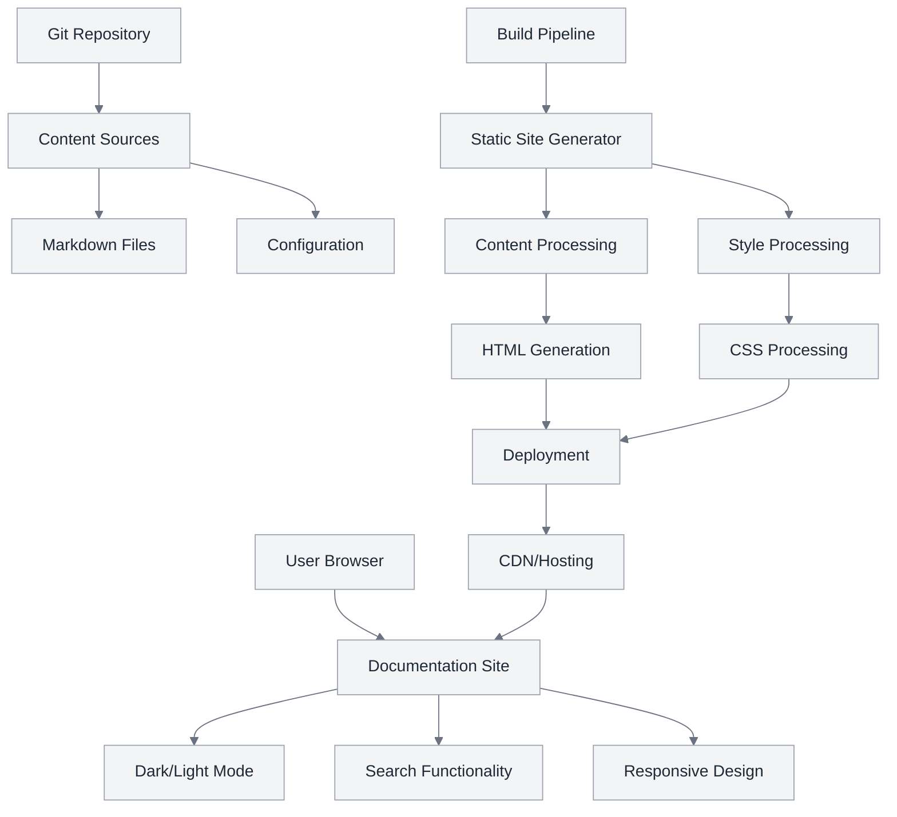
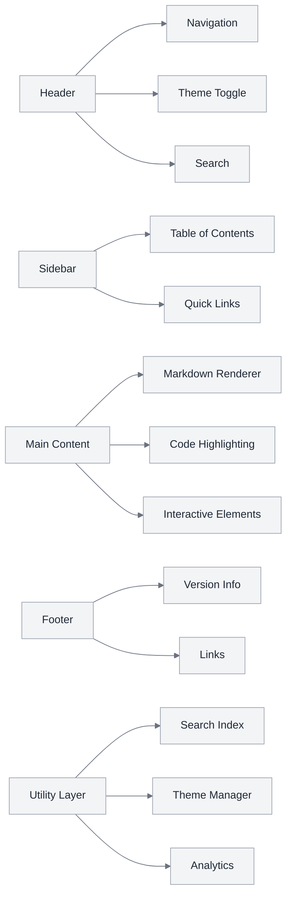

# 온라인 문서 아키텍처 시스템

## TAG BLOCK

```yaml
@SPEC:DOC-ONLINE-001: {
  "title": "온라인 문서 아키텍처 시스템",
  "status": "draft",
  "priority": "high",
  "domain": "documentation",
  "dependencies": [],
  "traceability": {
    "requirements": ["@REQ:DOC-SYSTEM-001", "@REQ:UI-MONOCHROME-001"],
    "design": ["@DESIGN:ARCHITECTURE-001"],
    "implementation": ["@IMP:DOC-AUTOMATION-001", "@IMP:STYLING-001"],
    "testing": ["@TEST:DOC-INTEGRATION-001"]
  }
}
```

## Environment (환경)

### 시스템 환경
- **플랫폼**: 웹 기반 문서 시스템
- **대상 사용자**: MoAI-ADK 개발자 및 최종 사용자
- **접근성**: WCAG 2.1 AA 준수
- **브라우저 지원**: Chrome 90+, Firefox 88+, Safari 14+, Edge 90+
- **모바일 지원**: 반응형 디자인, 태블릿 및 모바일 최적화

### 기술 환경
- **문서 포맷**: Markdown 기반
- **정적 사이트 생성**: VitePress 또는 유사 프레임워크
- **아이콘 시스템**: Material Design Icons
- **디자인 시스템**: 무채색 기반
- **버전 관리**: Git 기반 자동화

## Assumptions (가정)

### 기술 가정
- 사용자는 현대 웹 브라우저를 통해 문서에 접근한다
- 인터넷 연결이 안정적인 상태를 가정한다
- 문서 업데이트는 Git 워크플로우를 통해 관리된다
- 자동화된 빌드 및 배포 파이프라인이 존재한다

### 사용자 가정
- 사용자는 Markdown 구문에 기본적인 이해가 있다
- 개발자는 MoAI-ADK 생태계에 익숙하다
- 최종 사용자는 기술적인 배경지식이 다양하다
- 다크 모드와 라이트 모드 전환 기능을 선호한다

### 디자인 가정
- 무채색 디자인이 전문적인 인상을 준다
- Material Design 아이콘이 직관적인 이해를 돕는다
- 일관된 디자인 시스템이 학습 곡선을 낮춘다
- 접근성이 모든 사용자에게 필수적이다

## Requirements (요구사항)

### 기능 요구사항

#### FR1: 문서 구조 관리
- **FR1.1**: 계층적 문서 구조 지원
- **FR1.2**: 자동 목차 생성
- **FR1.3**: 문서 간 링크 및 참조 관리
- **FR1.4**: 검색 기능 제공

#### FR2: 자동화 시스템
- **FR2.1**: Git 커밋 기반 자동 업데이트
- **FR2.2**: 문서 빌드 및 배포 자동화
- **FR2.3**: 변경 사항 추적 및 버전 관리
- **FR2.4**: broken link 자동 감지

#### FR3: 디자인 시스템
- **FR3.1**: 무채색 테마 적용 (흑, 백, 회음 조합)
- **FR3.2**: Material Design Icons 통합
- **FR3.3**: 타이포그래피 시스템 (가독성 최적화)
- **FR3.4**: 반응형 레이아웃 지원

#### FR4: 사용자 경험
- **FR4.1**: 다크/라이트 모드 전환
- **FR4.2**: 빠른 검색 및 필터링
- **FR4.3**: 북마크 및 즐겨찾기 기능
- **FR4.4**: 인쇄 최적화

### 비기능 요구사항

#### NFR1: 성능
- **NFR1.1**: 초기 로드 시간 3초 이내
- **NFR1.2**: 페이지 전환 시간 1초 이내
- **NFR1.3**: 검색 응답 시간 500ms 이내

#### NFR2: 접근성
- **NFR2.1**: WCAG 2.1 AA 준수
- **NFR2.2**: 키보드 네비게이션 지원
- **NFR2.3**: 스크린 리더 호환성
- **NFR2.4**: 충분한 색상 대비 (4.5:1 이상)

#### NFR3: 유지보수성
- **NFR3.1**: 모듈형 아키텍처
- **NFR3.2**: 코드 재사용성 80% 이상
- **NFR3.3**: 자동화된 테스트 커버리지 85% 이상
- **NFR3.4**: 명확한 문서화 및 코멘트

## Specifications (명세)

### 아키텍처 명세

#### 시스템 구성도


#### 컴포넌트 구조


### 디자인 시스템 명세

#### 색상 팔레트
```yaml
# 기본 색상 (무채색)
colors:
  # 밝은 테마
  light:
    background: "#ffffff"
    surface: "#f9fafb"
    primary: "#111827"
    secondary: "#374151"
    border: "#e5e7eb"
    accent: "#6366f1"

  # 어두운 테마
  dark:
    background: "#111827"
    surface: "#1f2937"
    primary: "#f9fafb"
    secondary: "#d1d5db"
    border: "#374151"
    accent: "#818cf8"
```

#### 타이포그래피
```yaml
typography:
  font_family:
    primary: "Inter, system-ui, sans-serif"
    monospace: "JetBrains Mono, Consolas, monospace"

  font_sizes:
    xs: "0.75rem"    # 12px
    sm: "0.875rem"   # 14px
    base: "1rem"     # 16px
    lg: "1.125rem"   # 18px
    xl: "1.25rem"    # 20px
    "2xl": "1.5rem"  # 24px
    "3xl": "1.875rem" # 30px
    "4xl": "2.25rem" # 36px
```

#### 아이콘 시스템
```yaml
icons:
  library: "Material Design Icons"
  size:
    small: "16px"
    medium: "24px"
    large: "32px"

  categories:
    navigation: ["menu", "arrow_back", "arrow_forward", "home"]
    actions: ["search", "bookmark", "share", "download"]
    status: ["check_circle", "error", "warning", "info"]
    content: ["code", "description", "format_list_bulleted"]
```

### 기능 명세

#### 검색 시스템
- **인덱싱**: 자동 키워드 추출 및 인덱싱
- **검색 알고리즘**: 퍼지 매칭 및 랭킹
- **필터링**: 카테고리, 태그, 날짜 기반 필터
- **자동완성**: 실시간 검색 제안

#### 테마 관리
- **전환 메커니즘**: CSS 변수 및 localStorage
- **시스템 감지**: prefers-color-scheme 미디어 쿼리
- **일관성 유지**: 모든 컴포넌트 테마 적용
- **애니메이션**: 부드러운 테마 전환 효과

#### 자동화 파이프라인
```yaml
pipeline:
  trigger:
    - git_push
    - schedule_daily

  steps:
    - name: "Content Validation"
      action: "validate_markdown"

    - name: "Build Documentation"
      action: "static_site_generation"

    - name: "Optimize Assets"
      action: "minify_and_compress"

    - name: "Deploy to CDN"
      action: "publish_to_production"

  notifications:
    - slack_on_failure
    - email_summary
```

## Traceability (추적성)

### 의존성 관계
- `@SPEC:DOC-ONLINE-001` → `@REQ:DOC-SYSTEM-001`: 문서 시스템 기본 요구사항
- `@SPEC:DOC-ONLINE-001` → `@REQ:UI-MONOCHROME-001`: 무채색 UI 요구사항
- `@SPEC:DOC-ONLINE-001` → `@DESIGN:ARCHITECTURE-001`: 시스템 아키텍처 설계
- `@SPEC:DOC-ONLINE-001` → `@IMP:DOC-AUTOMATION-001`: 자동화 구현
- `@SPEC:DOC-ONLINE-001` → `@IMP:STYLING-001`: 스타일링 구현
- `@SPEC:DOC-ONLINE-001` → `@TEST:DOC-INTEGRATION-001`: 통합 테스트

### 변경 이력
| 버전 | 날짜 | 변경 내용 | 작성자 |
|-------|--------|-----------|--------|
| 1.0.0 | 2025-11-05 | 초기 SPEC 작성 | spec-builder |

### 검증 계획
- **단위 테스트**: 각 컴포넌트 기능 검증
- **통합 테스트**: 시스템 간 상호작용 검증
- **사용자 테스트**: 실제 사용자 경험 검증
- **성능 테스트**: 로드 시간 및 응답성 검증
- **접근성 테스트**: WCAG 준수 여부 검증