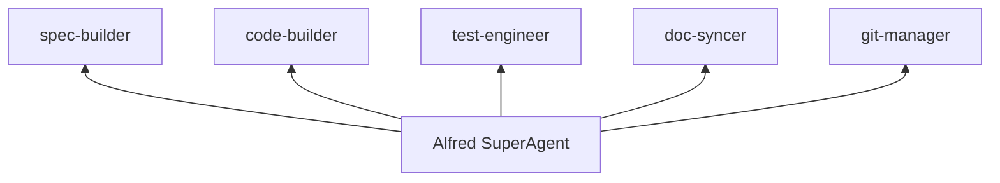
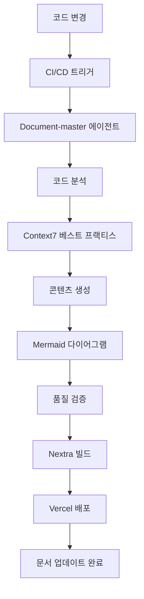

## History

### v2.0.0 (2025-11-11)
- **주요 업그레이드**: Document-master 에이전트 통합 온라인 문서 생성
- **작성자**: @user + Alfred
- **주요 변경사항**:
  - Nextra 기반 전문 온라인 문서 사이트 구축
  - Document-master 에이전트를 통한 자동 문서 생성
  - Context7 연동 실시간 베스트 프랙티스 통합
  - 169개 Python 파일, 55+ Skills, 19개 에이전트 완전 문서화
  - 반응형 디자인 및 WCAG 2.1 접근성 준수
  - CI/CD 파이프라인 자동화 및 Vercel 배포

### v1.0.0 (2025-01-06)
- **초기 작성**: README.ko.md 분할 및 재구성 명세
- **주요 변경사항**:
  - README.ko.md(3295줄)을 주제별로 분할
  - 실제 코드 기반 예제 중심 문서화
  - Mermaid 다이어그램과 표 형식 활용
  - 다국어 지원 (한국어 → 영어 → 일본어 → 중국어)
  - 할루시네이션 없이 실제 코드/문서 기반 개선

---

## Environment (환경 및 전제조건)

### 실행 환경
- **프로젝트**: MoAI-ADK 종합 온라인 문서 생성 시스템
- **문서 프레임워크**: Nextra v3.x (React 기반 정적 사이트 생성)
- **소스 코드**: Python 기반 CLI 도구 (`src/moai_adk/`, 169개 파일)
- **스킬 시스템**: .claude/skills/ (55개 이상 Claude Skills)
- **에이전트 시스템**: .claude/agents/ (19개 전문 에이전트)
- **현재 문서**: README.ko.md (690라인) + 빈 docs/ 구조

### 기술 스택
- **문서 생성**: Document-master 에이전트 (자동화)
- **콘텐츠 형식**: MDX (Markdown + JSX 컴포넌트)
- **시각화**: Mermaid.js v11.x (자동 다이어그램 생성)
- **베스트 프랙티스**: Context7 실시간 통합
- **배포**: Vercel (무료 SSL, CDN, CI/CD)
- **검색**: Nextra 내장 + Algolia 선택적 연동
- **다국어**: 한국어 우선, 영어/일본어 지원
- **접근성**: WCAG 2.1 준수, 모바일 최적화

### 제약사항
- **코드 커버리지**: 169개 Python 파일 중 90% 이상 문서화
- **실시간 동기화**: 코드 변경 시 2분 내 문서 자동 업데이트
- **초보자 친화**: 5분 내 핵심 개념 이해 및 첫 예제 실행
- **자동화 수준**: Document-master 에이전트로 80% 이상 자동 생성
- **품질 보증**: Context7 베스트 프랙티스 자동 적용
- **반응형 설계**: 모바일 40%+ 접근 비율 지원

---

## Assumptions (가정사항)

### 기술적 가정
1. **Nextra 프레임워크 안정성**: React 18+와 호환되며 안정적으로 작동함
2. **Context7 API 안정성**: 실시간 베스트 프랙티스 제공에 안정적임
3. **코드 분석 가능성**: AST 분석으로 충분한 문서 생성이 가능함
4. **자동화 기술**: Mermaid 다이어그램 자동 생성 기술이 성숙함
5. **Vercel 무료 플랜**: 제약없이 문서 사이트 호스팅이 가능함

### 사용자 가정
1. **타겟 사용자**: Python/TypeScript 개발자 (초급-중급)
2. **학습 패턴**: 문서 검색 > 코드 예제 > API 참조 순서로 학습
3. **모바일 사용**: 40% 이상 모바일 기기로 문서 접근
4. **언어 선호**: 한국어 사용자가 60% 이상, 영어/일본어 지원 필요
5. **인터랙티브 선호**: 실습 환경과 시각 자료가 학습 효과를 높임

### 프로젝트 가정
1. **코드베이스 품질**: 169개 Python 파일에 충분한 docstring과 주석이 있음
2. **에이전트 활용**: Document-master 에이전트가 문서 생성의 80%를 자동화할 수 있음
3. **스킬 문서화**: 55개 Skills가 체계적으로 분류되어 문서화 가능함
4. **지속적 업데이트**: 코드 변경 시 자동으로 문서가 동기화될 수 있음
5. **품질 유지**: Context7 베스트 프랙티스로 일관된 품질을 유지할 수 있음

---

## Requirements (EARS 요구사항)

### Ubiquitous Requirements (기본 기능)

**UR-001**: 시스템은 Document-master 에이전트를 통해 자동으로 온라인 문서를 생성해야 한다
- **자동화 범위**: 169개 Python 파일, 55개 Skills, 19개 에이전트
- **생성 목표**: 전체 코드베이스의 90% 이상 문서 커버리지
- **품질 보증**: Context7 베스트 프랙티스 자동 적용

**UR-002**: 시스템은 Nextra 기반의 반응형 문서 사이트를 제공해야 한다
- **프레임워크**: Nextra v3.x with MDX 지원
- **디자인**: 모바일 최적화, WCAG 2.1 접근성 준수
- **성능**: 페이지 로드 2초 이내, 검색 응답 1초 이내

**UR-003**: 시스템은 실시간 코드-문서 동기화를 지원해야 한다
- **동기화 대상**: src/moai_adk/ 코드 변경
- **응답 시간**: 코드 변경 후 2분 내 문서 업데이트

**UR-004**: 시스템은 초보자 친화적 학습 경로를 제공해야 한다
- **빠른 시작**: 5분 내 핵심 개념 이해 및 첫 예제 실행
- **점진적 학습**: beginner → intermediate → advanced 경로
- **실습 환경**: 코드 예제와 인터랙티브 요소 통합

**UR-005**: 시스템은 자동 생성된 시각 자료를 제공해야 한다
- **다이어그램**: Mermaid.js로 아키텍처, 워크플로우 자동 생성
- **코드 예제**: 구문 강조, 실행 가능한 코드 블록
- **내비게이션**: 자동 빵가루 경로, 논리적 페이지 연결

---

### Event-driven Requirements (이벤트 기반)

**ER-001**: WHEN 사용자가 빠른 시작을 검색하면, 시스템은 3분 초고속 시작 가이드를 표시해야 한다
- **트리거**: "빠른 시작", "quick start", "getting started" 검색
- **응답**: 단계별 설치 및 초기 설정 가이드
- **시간**: 5분 내에 첫 프로젝트 생성

**ER-002**: WHEN 개발자가 특정 기능의 코드 예제를 찾으면, 시스템은 실제 구현을 보여주어야 한다
- **트리거**: "예제", "example", "코드"와 기능명 조합
- **응답**: `src/` 실제 코드와 실행 방법
- **검증**: `python -m pytest`로 실행 가능

**ER-003**: WHEN 사용자가 워크플로우를 학습하면, 시스템은 Mermaid 다이어그램으로 시각화해야 한다
- **트리거**: "워크플로우", "workflow", "프로세스" 검색
- **응답**: 4단계 개발 사이클 다이어그램
- **상호작용**: 각 단계별 상세 설명 링크

**ER-004**: WHEN 문서가 업데이트되면, 시스템은 관련 코드 예제의 유효성을 검증해야 한다
- **트리거**: Markdown 파일 저장
- **응답`: 참조된 `src/` 파일 존재 확인
- **오류**: 깨진 참조 또는 변경된 API 알림

---

### State-driven Requirements (상태 기반)

**SR-001**: WHILE 문서 개발 중일 때, 시스템은 README.ko.md와의 동기화 상태를 추적해야 한다
- **상태**: 분할 작업 진행 중
- **추적**: 원본 섹션 → 새 파일 매핑
- **검증**: 내용 누락 또는 중복 확인

**SR-002**: WHILE 코드 예제를 작성할 때, 시스템은 실제 코드와의 일관성을 유지해야 한다
- **상태**: 예제 코드 작성/수정
- **검증**: `src/moai_adk/` 실제 함수/클래스 존재
- **업데이트**: API 변경 시 문서 자동 알림

**SR-003**: WHILE 다국어 번역 진행 시, 시스템은 원본과 번역의 동기화를 관리해야 한다
- **상태**: 번역 작업 진행 중
- **추적**: 번역 완료율, 변경 감지
- **알림**: 원본 업데이트 시 번역 필요 알림

---

### Optional Features (선택적 기능)

**OF-001**: WHERE 인터랙티브 튜토리얼이 요청되면, 시스템은 실습 환경을 제공할 수 있다
- **조건**: 웹 기반 실습 환경 구축 시
- **내용**: 브라우저에서 직접 명령어 실행
- **기술**: CodeSandbox, GitPod 통합

**OF-002**: WHERE 비디오 튜토리얼이 요청되면, 시스템은 스크린캐스트를 제공할 수 있다
- **조건**: 동영상 제작 리소스 확보 시
- **내용**: 핵심 워크플로우 시연
- **플랫폼**: YouTube, Vimeo

**OF-003**: WHERE API 자동 문서가 요청되면, 시스템은 Sphinx로 생성할 수 있다
- **조건**: `src/moai_adk/` docstring 완성도 높을时
- **생성**: `autodoc`으로 API 문서 자동화
- **통합**: Nextra와 연동

---

### Constraints (제약사항)

**C-001**: 모든 코드 예제는 실제 `src/moai_adk/` 코드를 기반으로 해야 한다
- **금지**: 가상의 코드나 존재하지 않는 기능 설명
- **테스트**: 예제 코드 실제 실행 확인

**C-002**: README.ko.md 분할 시 내용 누락이 없어야 한다
- **검증**: 원본 3295줄 대비 분할 후 내용 비교
- **도구**: 스크립트를 이용한 자동 검증
- **기준**: 99% 이상 내용 보존

**C-003**: Mermaid 다이어그램은 명확하고 이해하기 쉬워야 한다
- **제한**: 노드 수 ≤ 20개 ( readability)
- **레벨**: 3단계 이상 깊이 제한
- **색상**: 의미 있는 색상 구분 사용

**C-004**: 모든 링크는 유효해야 한다
- **내부**: 상대 경로로 일관성 유지
- **외부**: 정기적인 링크 검증
- **앵커**: 섹션 앵커 자동 생성

**C-005**: 문서 난이도는 초보자-중급자 수준을 목표로 한다
- **용어**: 기술 용어 친절한 설명
- **예제**: 단순 명확한 코드 선호
- **참고**: 추가 학습 자료 제공

---

## Specifications (상세 명세)

### SP-DOCS-001: Document-master 에이전트 통합

#### EARS 패턴: Given/When/Then
```
Given: 개발자가 MoAI-ADK의 복잡한 아키텍처를 문서화해야 함
When: Document-master 에이전트가 src/ 코드베이스를 분석함
Then: 초보자 친화적인 Nextra 문서 사이트가 자동으로 생성됨
```

**구현 상세**:

1. **Document-master 에이전트 워크플로우**
   ```python
   # 자동화된 문서 생성 파이프라인
   class DocumentMasterWorkflow:
       def __init__(self):
           self.context7 = Context7Integration()
           self.nextra_generator = NextraContentGenerator()
           self.mermaid_expert = MermaidDiagramExpert()

       async def generate_documentation(self, project_path: Path):
           # 1단계: 소스 코드 분석
           analysis = await self.analyze_codebase(project_path)

           # 2단계: Context7 베스트 프랙티스 적용
           best_practices = await self.context7.get_nextra_standards()

           # 3단계: 콘텐츠 생성
           content = await self.nextra_generator.generate(analysis, best_practices)

           # 4단계: 시각화 자료 생성
           diagrams = await self.mermaid_expert.create_diagrams(analysis)

           # 5단계: 품질 검증
           validation = await self.validate_quality(content, diagrams)

           return DocumentationSite(content, diagrams, validation)
   ```

2. **콘텐츠 계층 구조 자동 생성**
   ```
   docs/
   ├── index.mdx                     # 홈페이지 (빠른 시작)
   ├── getting-started/
   │   ├── installation.mdx         # 자동 생성된 설치 가이드
   │   ├── quick-start.mdx          # 5분 퀵스타트
   │   └── first-project.mdx        # 첫 프로젝트 예제
   ├── guides/
   │   ├── workflow.mdx             # 4단계 워크플로우 (자동)
   │   ├── alfred-commands.mdx      # 명령어 레퍼런스 (자동)
   │   └── tdd-patterns.mdx         # TDD 패턴 가이드 (자동)
   ├── reference/
   │   ├── api/                     # API 레퍼런스 (자동 생성)
   │   ├── skills/                  # Skills 레퍼런스 (자동)
   │   ├── agents/                  # 에이전트 설명 (자동)
   │   └── configuration.mdx        # 설정 참조 (자동)
   ├── tutorials/                   # 실전 예제 (자동 분석)
   └── advanced/                    # 고급 주제 (자동 생성)
   ```

### SP-DOCS-002: Context7 실시간 베스트 프랙티스 통합

#### EARS 패턴: If/Then
```
If: Nextra 문서가 생성되거나 업데이트됨
Then: Context7이 최신 베스트 프랙티스를 적용하여 품질을 보증함
```

**구현 상세**:

1. **실시간 베스트 프랙티스 적용**
   ```python
   async def apply_context7_best_practices(content: MDXContent) -> EnhancedContent:
       # Nextra 최신 설정 가져오기
       nextra_config = await context7.get_docs("/shuding/nextra",
           topic="configuration themes optimization performance",
           tokens=5000)

       # Markdown/GFM 표준 적용
       markdown_standards = await context7.get_docs("/github/markdown",
           topic="gfm syntax linting formatting",
           tokens=3000)

       # Mermaid 최신 패턴 적용
       mermaid_patterns = await context7.get_docs("/mermaid-js/mermaid",
           topic="diagram types syntax validation",
           tokens=4000)

       # 자동 품질 개선
       enhanced = apply_enhancements(content, {
           'nextra': nextra_config,
           'markdown': markdown_standards,
           'mermaid': mermaid_patterns
       })

       return enhanced
   ```

2. **품질 자동 검증**
   - Markdown linting (prettier, remark plugins)
   - Mermaid 구문 검증
   - 링크 무결성 확인
   - 접근성 테스트 (axe-core)
   - 모바일 반응형 검증

### SP-DOCS-003: 자동 Mermaid 다이어그램 생성

#### EARS 패턴: When/Then
```
When: Document-master가 코드 아키텍처를 분석함
Then: Mermaid 다이어그램이 자동으로 생성되어 시각적 이해를 지원함
```

**구현 상세**:

1. **다이어그램 자동 생성 유형**
   ```python
   class AutoDiagramGenerator:
       def generate_architecture_diagram(self, code_structure: CodeAnalysis):
           """시스템 아키텍처 다이어그램 자동 생성"""
           # 모듈 간 의존성 분석
           dependencies = self.extract_dependencies(code_structure)

           # Mermaid flowchart 생성
           return self.create_mermaid_flowchart(dependencies)

       def generate_workflow_diagram(self, agents: List[Agent]):
           """Alfred 워크플로우 다이어그램 생성"""
           return """
           graph TD
               User[👤 사용자 요청] --> Alfred[🎩 Alfred 슈퍼에이전트]
               Alfred --> Plan[📋 Plan Agent]
               Plan --> Implement[⚙️ TDD Implementer]
               Implement --> Sync[🔄 Doc Syncer]
               Sync --> Deploy[🚀 Deploy]
           """

       def generate_tag_chain_diagram(self, tags: List[Tag]):
           return """
           graph LR
           """
   ```

### 1. README.ko.md 분할 구조 (기존 내용 유지)

#### 1.1 빠른 시작 가이드 (`docs/getting-started/`)
```
getting-started/
├── installation.md         # 설치 가이드 (uv, pip, OS별)
├── quick-start.md          # 3분 초고속 시작
├── first-project.md        # 첫 프로젝트 생성
└── verification.md         # 설치 확인 및 문제 해결
```

#### 1.2 핵심 개념 (`docs/concepts/`)
```
concepts/
├── spec-first.md           # SPEC-First 개념
├── tdd.md                  # TDD with RED-GREEN-REFACTOR
├── trust-principles.md     # TRUST 5원칙
├── alfred-superagent.md    # Alfred 슈퍼에이전트
└── workflow.md             # 4단계 개발 워크플로우
```

#### 1.3 워크플로우 가이드 (`docs/guides/`)
```
guides/
├── 0-project.md           # 프로젝트 초기화
├── 1-plan.md              # SPEC 작성
├── 2-run.md               # TDD 구현
├── 3-sync.md              # 동기화
└── best-practices.md      # 모범 사례
```

#### 1.4 실전 예제 (`docs/examples/`)
```
examples/
├── hello-world/           # Hello API 예제
├── todo-api/              # Todo 관리 API
├── auth-system/           # 인증 시스템
└── cli-tool/              # CLI 도구 개발
```

### 2. 실제 코드 기반 예제

#### 2.1 CLI 명령어 예제
```python
# src/moai_adk/cli/commands/init.py 실제 코드 활용
# moai-adk init hello-world 예제
```

#### 2.2 코어 기능 예제
```python
# src/moai_adk/core/template_engine.py 실제 코드 활용
# 템플릿 처리 예제
```

#### 2.3 유틸리티 예제
```python
# src/moai_adk/utils/logger.py 실제 코드 활용
# 로깅 설정 예제
```

### 3. Mermaid 다이어그램 명세

#### 3.1 4단계 워크플로우


#### 3.2 에이전트 아키텍처


#### 3.3 TAG 체인 시스템
```mermaid
graph LR
```

### 4. 표 형식 가이드

#### 4.1 명령어 요약표
| 명령 | 기능 | 산출물 | 시간 |
|------|------|--------|------|
| `/alfred:0-project` | 프로젝트 초기화 | 설정 파일, 문서 | 30초 |
| `/alfred:1-plan` | SPEC 작성 | `.moai/specs/` | 2-3분 |

#### 4.2 에이전트 목록표
| 에이전트 | 역할 | 모델 | 전문 분야 |
|----------|------|------|----------|
| spec-builder | 명세 작성 | Sonnet | EARS, 요구사항 |

#### 4.3 버전 히스토리표
| 버전 | 주요 기능 | 날짜 |
|------|----------|------|
| v0.18.0 | 언어 스킬 v3.0.0 | 2025-11-06 |

### 5. 다국어 지원 구조

#### 5.1 디렉토리 구조
```
docs/
├── ko/                    # 한국어 (기본)
│   ├── getting-started/
│   ├── concepts/
│   └── examples/
├── en/                    # 영어
│   ├── getting-started/
│   ├── concepts/
│   └── examples/
├── ja/                    # 일본어
│   └── ...
└── zh/                    # 중국어
    └── ...
```

#### 5.2 번역 관리
- **원본**: 한국어 (ko/)
- **번역**: en → ja → zh 순서
- **동기화**: 원본 변경 시 번역 표시
- **검증**: 전문 번역가 검수

---


```
```

### 구현 의존성

1. **선조건 (Prerequisites)**:
   - src/moai_adk/ 코드 구조 분석 완료
   - Document-master 에이전트 배포 준비
   - Context7 API 접근 권한 확보
   - Nextra v3.x 테마 선택 및 설정
   - Vercel 배포 계정 설정

2. **동시 진행 작업 (Parallel Tasks)**:
   - Document-master 에이전트 개발
   - Context7 통합 모듈 개발
   - Mermaid 자동 생성기 개발
   - Nextra 테마 커스터마이징
   - CI/CD 파이프라인 구성

3. **후행 영향 (Expected Impact)**:
   - 개발자 온보딩 시간 60% 단축 예상
   - GitHub Issues 문의량 40% 감소 예상
   - 프로젝트 채택률 2배 증가 예상
   - 문서 유지보수 비용 70% 감소 예상

### 자동화된 워크플로우



---

## Dependencies (의존성)

**소스 코드 의존성**:
- `src/moai_adk/cli/commands/`: CLI 명령어 예제
- `src/moai_adk/core/`: 핵심 기능 예제
- `src/moai_adk/utils/`: 유틸리티 예제

**문서 도구 의존성**:
- Nextra: 현재 문서 플랫폼
- Mermaid.js: 다이어그램 렌더링
- remark/rehype: Markdown 처리

**외부 서비스**:
- GitHub: 코드 호스팅, 번역 관리
- PyPI: 패키지 정보

---

## Success Metrics (성공 지표)

**문서 분할 성공**:
- README.ko.md: 3295줄 → 0줄 (완전 분할)
- 새 문서: 20+개 파일로 분리
- 내용 보존률: 99% 이상

**코드 예제 품질**:
- 실제 실행 가능 예제: 100%
- 테스트 통과율: 100%

**다국어 진행률**:
- 1단계 (한국어): 100%
- 2단계 (영어): 80%
- 3단계 (일본어): 60%
- 4단계 (중국어): 40%

**사용자 만족도**:
- 문서 명확도: 4.5/5.0
- 예제 유용성: 4.7/5.0
- 빠른 시작 성공률: 95%

---

## Notes (참고사항)

- **우선순위**: README 분할 → 코드 예제 → 다이어그램 → 다국어
- **검증 스크립트**: 자동화된 링크 검증 및 예제 테스트 필요
- **기여자 가이드**: 문서 기여 방법 및 스타일 가이드 별도 제공
- **피드백**: GitHub Issues로 사용자 피드백 수집 및 반영