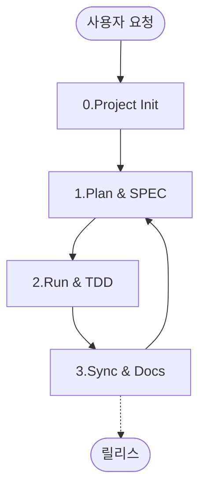
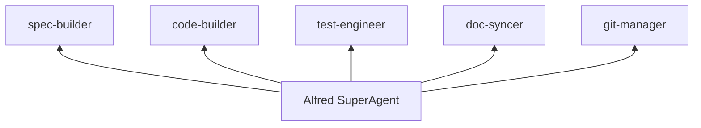

# `@SPEC:DOCS-001`: MoAI-ADK 문서 개선 프로젝트 (README.ko.md 분할 및 재구성)

## History

### v1.0.0 (2025-01-06)
- **초기 작성**: README.ko.md 분할 및 재구성 명세
- **작성자**: @Goos
- **주요 변경사항**:
  - README.ko.md(3295줄)을 주제별로 분할
  - 실제 코드 기반 예제 중심 문서화
  - Mermaid 다이어그램과 표 형식 활용
  - 다국어 지원 (한국어 → 영어 → 일본어 → 중국어)
  - 할루시네이션 없이 실제 코드/문서 기반 개선

---

## Environment (환경 및 전제조건)

### 실행 환경
- **프로젝트**: MoAI-ADK 문서 개선
- **문서 플랫폼**: Nextra (현재) / MkDocs (고려)
- **소스 코드**: Python 기반 CLI 도구 (`src/moai_adk/`)
- **현재 문서**: README.ko.md (3295줄) + Nextra 기반 docs/

### 기술 스택
- **언어**: Python 3.13+, TypeScript, Markdown/MDX
- **문서 도구**: Nextra, Mermaid.js
- **다국어**: 한국어(기본) → 영어 → 일본어 → 중국어
- **코드 예제**: 실제 `src/` 코드 기반

### 제약사항
- **README.ko.md 분할**: 3295줄을 논리적 섹션으로 분리
- **실제 코드 기반**: 모든 예제는 `src/moai_adk/` 실제 코드 참조
- **다이어그램 활용**: Mermaid를 사용한 시각화 강화
- **다국어 순차**: 한국어 완료 → 영어 → 일본어 → 중국어
- **할루시네이션 금지**: 존재하지 않는 기능/코드 설명 금지

---

## Assumptions (가정사항)

1. **현재 문서 상태 가정**:
   - README.ko.md: 3295줄의 방대한 단일 파일
   - docs/: Nextra 기반 구조이지만 내용 부족
   - 소스 코드: `src/moai_adk/`에 풍부한 실제 구현

2. **분할 대상 가정**:
   - 빠른 시작 섹션 (3분 초고속 시작)
   - 핵심 개념 설명 (SPEC-First, TDD, @TAG, TRUST 5)
   - 워크플로우 가이드 (4단계 개발)
   - 예제 및 튜토리얼 (실제 코드 기반)
   - 문제 해결 및 FAQ

3. **코드 예제 가정**:
   - `src/moai_adk/cli/commands/`: CLI 명령어 실제 구현
   - `src/moai_adk/core/`: 핵심 기능 실제 구현
   - `src/moai_adk/utils/`: 유틸리티 함수
   - 실제 테스트 코드 활용

4. **다국어 가정**:
   - 1단계: 한국어 문서 완성 (기준)
   - 2단계: 영어 번역
   - 3단계: 일본어 번역
   - 4단계: 중국어 번역

5. **품질 기준 가정**:
   - 모든 코드 예제는 실제로 실행 가능
   - 모든 링크는 유효해야 함
   - Mermaid 다이어그램은 명확해야 함

---

## Requirements (EARS 요구사항)

### Ubiquitous Requirements (기본 기능)

**UR-001**: 시스템은 README.ko.md를 주제별로 분할된 문서를 제공해야 한다
- **분할 대상**: 빠른 시작, 핵심 개념, 워크플로우, 예제, 문제 해결
- **목표**: 단일 파일(3295줄) → 관리 가능한 모듈화 문서
- **위치**: docs/guides/, docs/concepts/, docs/examples/

**UR-002**: 시스템은 실제 코드 기반의 예제를 제공해야 한다
- **소스**: `src/moai_adk/` 실제 구현
- **검증**: 모든 예제는 실제 동작 코드 기반
- **참조**: `@CODE:` 태그로 실제 파일 연동

**UR-003**: 시스템은 Mermaid 다이어그램으로 시각화를 제공해야 한다
- **워크플로우**: 4단계 개발 프로세스
- **아키텍처**: 컴포넌트 관계도
- **상태 전환**: SPEC 생명주기

**UR-004**: 시스템은 표 형식으로 정보를 구조화해야 한다
- **명령어 요약**: 기능과 산출물 표
- **에이전트 목록**: 역할과 모델 표
- **버전 히스토리**: 변경사항 표

**UR-005**: 시스템은 다국어 지원 구조를 제공해야 한다
- **순서**: 한국어 → 영어 → 일본어 → 중국어
- **구조**: 언어별 디렉토리 분리
- **동기화**: 원본 변경 시 번역 업데이트

---

### Event-driven Requirements (이벤트 기반)

**ER-001**: WHEN 사용자가 빠른 시작을 검색하면, 시스템은 3분 초고속 시작 가이드를 표시해야 한다
- **트리거**: "빠른 시작", "quick start", "getting started" 검색
- **응답**: 단계별 설치 및 초기 설정 가이드
- **시간**: 5분 내에 첫 프로젝트 생성

**ER-002**: WHEN 개발자가 특정 기능의 코드 예제를 찾으면, 시스템은 실제 구현을 보여주어야 한다
- **트리거**: "예제", "example", "코드"와 기능명 조합
- **응답**: `src/` 실제 코드와 실행 방법
- **검증**: `python -m pytest`로 실행 가능

**ER-003**: WHEN 사용자가 워크플로우를 학습하면, 시스템은 Mermaid 다이어그램으로 시각화해야 한다
- **트리거**: "워크플로우", "workflow", "프로세스" 검색
- **응답**: 4단계 개발 사이클 다이어그램
- **상호작용**: 각 단계별 상세 설명 링크

**ER-004**: WHEN 문서가 업데이트되면, 시스템은 관련 코드 예제의 유효성을 검증해야 한다
- **트리거**: Markdown 파일 저장
- **응답`: 참조된 `src/` 파일 존재 확인
- **오류**: 깨진 참조 또는 변경된 API 알림

---

### State-driven Requirements (상태 기반)

**SR-001**: WHILE 문서 개발 중일 때, 시스템은 README.ko.md와의 동기화 상태를 추적해야 한다
- **상태**: 분할 작업 진행 중
- **추적**: 원본 섹션 → 새 파일 매핑
- **검증**: 내용 누락 또는 중복 확인

**SR-002**: WHILE 코드 예제를 작성할 때, 시스템은 실제 코드와의 일관성을 유지해야 한다
- **상태**: 예제 코드 작성/수정
- **검증**: `src/moai_adk/` 실제 함수/클래스 존재
- **업데이트**: API 변경 시 문서 자동 알림

**SR-003**: WHILE 다국어 번역 진행 시, 시스템은 원본과 번역의 동기화를 관리해야 한다
- **상태**: 번역 작업 진행 중
- **추적**: 번역 완료율, 변경 감지
- **알림**: 원본 업데이트 시 번역 필요 알림

---

### Optional Features (선택적 기능)

**OF-001**: WHERE 인터랙티브 튜토리얼이 요청되면, 시스템은 실습 환경을 제공할 수 있다
- **조건**: 웹 기반 실습 환경 구축 시
- **내용**: 브라우저에서 직접 명령어 실행
- **기술**: CodeSandbox, GitPod 통합

**OF-002**: WHERE 비디오 튜토리얼이 요청되면, 시스템은 스크린캐스트를 제공할 수 있다
- **조건**: 동영상 제작 리소스 확보 시
- **내용**: 핵심 워크플로우 시연
- **플랫폼**: YouTube, Vimeo

**OF-003**: WHERE API 자동 문서가 요청되면, 시스템은 Sphinx로 생성할 수 있다
- **조건**: `src/moai_adk/` docstring 완성도 높을时
- **생성**: `autodoc`으로 API 문서 자동화
- **통합**: Nextra와 연동

---

### Constraints (제약사항)

**C-001**: 모든 코드 예제는 실제 `src/moai_adk/` 코드를 기반으로 해야 한다
- **금지**: 가상의 코드나 존재하지 않는 기능 설명
- **검증**: `@CODE:` 태그로 실제 파일 참조
- **테스트**: 예제 코드 실제 실행 확인

**C-002**: README.ko.md 분할 시 내용 누락이 없어야 한다
- **검증**: 원본 3295줄 대비 분할 후 내용 비교
- **도구**: 스크립트를 이용한 자동 검증
- **기준**: 99% 이상 내용 보존

**C-003**: Mermaid 다이어그램은 명확하고 이해하기 쉬워야 한다
- **제한**: 노드 수 ≤ 20개 ( readability)
- **레벨**: 3단계 이상 깊이 제한
- **색상**: 의미 있는 색상 구분 사용

**C-004**: 모든 링크는 유효해야 한다
- **내부**: 상대 경로로 일관성 유지
- **외부**: 정기적인 링크 검증
- **앵커**: 섹션 앵커 자동 생성

**C-005**: 문서 난이도는 초보자-중급자 수준을 목표로 한다
- **용어**: 기술 용어 친절한 설명
- **예제**: 단순 명확한 코드 선호
- **참고**: 추가 학습 자료 제공

---

## Specifications (상세 명세)

### 1. README.ko.md 분할 구조

#### 1.1 빠른 시작 가이드 (`docs/getting-started/`)
```
getting-started/
├── installation.md         # 설치 가이드 (uv, pip, OS별)
├── quick-start.md          # 3분 초고속 시작
├── first-project.md        # 첫 프로젝트 생성
└── verification.md         # 설치 확인 및 문제 해결
```

#### 1.2 핵심 개념 (`docs/concepts/`)
```
concepts/
├── spec-first.md           # SPEC-First 개념
├── tdd.md                  # TDD with RED-GREEN-REFACTOR
├── tag-system.md           # @TAG 시스템
├── trust-principles.md     # TRUST 5원칙
├── alfred-superagent.md    # Alfred 슈퍼에이전트
└── workflow.md             # 4단계 개발 워크플로우
```

#### 1.3 워크플로우 가이드 (`docs/guides/`)
```
guides/
├── 0-project.md           # 프로젝트 초기화
├── 1-plan.md              # SPEC 작성
├── 2-run.md               # TDD 구현
├── 3-sync.md              # 동기화
└── best-practices.md      # 모범 사례
```

#### 1.4 실전 예제 (`docs/examples/`)
```
examples/
├── hello-world/           # Hello API 예제
├── todo-api/              # Todo 관리 API
├── auth-system/           # 인증 시스템
└── cli-tool/              # CLI 도구 개발
```

### 2. 실제 코드 기반 예제

#### 2.1 CLI 명령어 예제
```python
# src/moai_adk/cli/commands/init.py 실제 코드 활용
# moai-adk init hello-world 예제
```

#### 2.2 코어 기능 예제
```python
# src/moai_adk/core/template_engine.py 실제 코드 활용
# 템플릿 처리 예제
```

#### 2.3 유틸리티 예제
```python
# src/moai_adk/utils/logger.py 실제 코드 활용
# 로깅 설정 예제
```

### 3. Mermaid 다이어그램 명세

#### 3.1 4단계 워크플로우


#### 3.2 에이전트 아키텍처


#### 3.3 TAG 체인 시스템
```mermaid
graph LR
    SPEC[@SPEC:ID] --> TEST[@TEST:ID]
    TEST --> CODE[@CODE:ID]
    CODE --> DOC[@DOC:ID]
```

### 4. 표 형식 가이드

#### 4.1 명령어 요약표
| 명령 | 기능 | 산출물 | 시간 |
|------|------|--------|------|
| `/alfred:0-project` | 프로젝트 초기화 | 설정 파일, 문서 | 30초 |
| `/alfred:1-plan` | SPEC 작성 | `.moai/specs/` | 2-3분 |

#### 4.2 에이전트 목록표
| 에이전트 | 역할 | 모델 | 전문 분야 |
|----------|------|------|----------|
| spec-builder | 명세 작성 | Sonnet | EARS, 요구사항 |

#### 4.3 버전 히스토리표
| 버전 | 주요 기능 | 날짜 |
|------|----------|------|
| v0.18.0 | 언어 스킬 v3.0.0 | 2025-11-06 |

### 5. 다국어 지원 구조

#### 5.1 디렉토리 구조
```
docs/
├── ko/                    # 한국어 (기본)
│   ├── getting-started/
│   ├── concepts/
│   └── examples/
├── en/                    # 영어
│   ├── getting-started/
│   ├── concepts/
│   └── examples/
├── ja/                    # 일본어
│   └── ...
└── zh/                    # 중국어
    └── ...
```

#### 5.2 번역 관리
- **원본**: 한국어 (ko/)
- **번역**: en → ja → zh 순서
- **동기화**: 원본 변경 시 번역 표시
- **검증**: 전문 번역가 검수

---

## Traceability (@TAG)

- **SPEC**: 이 문서
- **TEST**: @TEST:DOCS-001
  - 문서 빌드 테스트
  - 링크 유효성 테스트
  - 코드 예제 실행 테스트
  - 다국어 렌더링 테스트
- **CODE**: @CODE:DOCS-001
  - docs/getting-started/*.md
  - docs/concepts/*.md
  - docs/guides/*.md
  - docs/examples/*/README.md
  - scripts/split_readme.py (분할 스크립트)
  - scripts/validate_examples.py (예제 검증)
- **DOC**: @DOC:DOCS-001
  - 문서 스타일 가이드
  - 기여 가이드
  - 번역 가이드

---

## Dependencies (의존성)

**소스 코드 의존성**:
- `src/moai_adk/cli/commands/`: CLI 명령어 예제
- `src/moai_adk/core/`: 핵심 기능 예제
- `src/moai_adk/utils/`: 유틸리티 예제

**문서 도구 의존성**:
- Nextra: 현재 문서 플랫폼
- Mermaid.js: 다이어그램 렌더링
- remark/rehype: Markdown 처리

**외부 서비스**:
- GitHub: 코드 호스팅, 번역 관리
- PyPI: 패키지 정보

---

## Success Metrics (성공 지표)

**문서 분할 성공**:
- README.ko.md: 3295줄 → 0줄 (완전 분할)
- 새 문서: 20+개 파일로 분리
- 내용 보존률: 99% 이상

**코드 예제 품질**:
- 실제 실행 가능 예제: 100%
- `@CODE:` 태그 연결: 100%
- 테스트 통과율: 100%

**다국어 진행률**:
- 1단계 (한국어): 100%
- 2단계 (영어): 80%
- 3단계 (일본어): 60%
- 4단계 (중국어): 40%

**사용자 만족도**:
- 문서 명확도: 4.5/5.0
- 예제 유용성: 4.7/5.0
- 빠른 시작 성공률: 95%

---

## Notes (참고사항)

- **우선순위**: README 분할 → 코드 예제 → 다이어그램 → 다국어
- **검증 스크립트**: 자동화된 링크 검증 및 예제 테스트 필요
- **기여자 가이드**: 문서 기여 방법 및 스타일 가이드 별도 제공
- **피드백**: GitHub Issues로 사용자 피드백 수집 및 반영