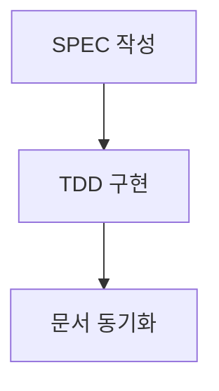

# SPEC-DOCS-003 수락 기준

> **VitePress → MkDocs Material 마이그레이션**
>
> 본 문서는 SPEC-DOCS-003의 수락 기준(Acceptance Criteria)을 정의합니다.

---

## 개요

SPEC-DOCS-003의 구현이 완료되었다고 인정되려면 다음 모든 시나리오가 충족되어야 합니다. 각 시나리오는 Given-When-Then 형식으로 작성되었습니다.

---

## Scenario 1: 마이그레이션 성공

### 시나리오 설명
VitePress 문서 22개가 모두 MkDocs Material로 정상 변환되어야 합니다.

### Given (전제 조건)
- VitePress 문서 22개가 `docs/` 디렉토리에 존재한다
- `mkdocs.yml` 설정 파일이 작성되었다
- `requirements.txt`에 모든 의존성이 명시되었다

### When (실행)
```bash
mkdocs build --strict
```

### Then (기대 결과)
- ✅ `site/` 디렉토리에 정적 HTML이 생성된다
- ✅ 모든 내부 링크가 정상 작동한다 (404 오류 0건)
- ✅ 빌드가 오류 없이 완료된다 (`--strict` 모드 통과)
- ✅ 22개 Markdown 파일이 모두 HTML로 변환된다

### 검증 방법
```bash
# 빌드 성공 확인
mkdocs build --strict

# HTML 파일 개수 확인
find site -name "*.html" | wc -l
# → 최소 22개 이상 (index.html 포함)

# 404 오류 확인
grep -r "404" site/ || echo "No 404 errors"
```

---

## Scenario 2: Vercel 배포 성공

### 시나리오 설명
MkDocs Material 문서가 Vercel에 정상 배포되어야 합니다.

### Given (전제 조건)
- `vercel.json` 설정 파일이 작성되었다
- `mkdocs.yml` 설정이 완료되었다
- Git 저장소가 Vercel과 연동되었다

### When (실행)
```bash
# Git push (Vercel 자동 배포 트리거)
git push origin feature/python-v0.3.0
```

### Then (기대 결과)
- ✅ Vercel 빌드가 성공한다
- ✅ 빌드 시간이 30초 미만이다
- ✅ 사이트가 정상 로딩된다 (HTTP 200 응답)
- ✅ 검색 기능이 작동한다

### 검증 방법
```bash
# Vercel 배포 로그 확인
vercel logs

# 빌드 시간 확인
# → Vercel 대시보드에서 확인

# 배포 URL 접속 테스트
curl -I https://moai-adk.vercel.app
# → HTTP/2 200 응답
```

---

## Scenario 3: Mermaid 다이어그램 렌더링

### 시나리오 설명
문서에 포함된 Mermaid 다이어그램이 정상 렌더링되어야 합니다.

### Given (전제 조건)
- 문서에 Mermaid 코드 블록이 포함되어 있다
- `mkdocs-mermaid2-plugin`이 설치되었다
- `mkdocs.yml`에 Mermaid 플러그인이 설정되었다

### When (실행)
```bash
mkdocs serve
# → http://127.0.0.1:8000 접속
```

### Then (기대 결과)
- ✅ Mermaid 코드 블록이 SVG 다이어그램으로 렌더링된다
- ✅ 라이트 모드에서 다이어그램이 명확히 보인다
- ✅ 다크 모드에서도 다이어그램 가독성이 유지된다
- ✅ 다이어그램이 인터랙티브하지 않다 (정적 이미지)

### 검증 방법
1. 브라우저에서 http://127.0.0.1:8000 접속
2. Mermaid 다이어그램이 포함된 페이지 접속
3. 개발자 도구 열기 → Elements 탭
4. `<svg>` 태그 존재 확인

**예시 Mermaid 코드**:
````markdown

````

---

## Scenario 4: 한글 검색 기능

### 시나리오 설명
Material for MkDocs의 검색 기능이 한글을 완벽히 지원해야 합니다.

### Given (전제 조건)
- `mkdocs.yml`에 검색 플러그인이 활성화되었다
- `lang: ko` 설정이 포함되었다
- 문서에 한글 콘텐츠가 포함되어 있다

### When (실행)
1. `mkdocs serve` 실행
2. 브라우저에서 http://127.0.0.1:8000 접속
3. 검색창 열기 (Ctrl/Cmd + K)
4. 다음 키워드 입력:
   - "Alfred"
   - "명세"
   - "TDD"
   - "@SPEC"

### Then (기대 결과)
- ✅ "Alfred" 검색 시 관련 문서가 즉시 검색된다
- ✅ "명세" 검색 시 SPEC 관련 문서가 검색된다
- ✅ 검색 결과 클릭 시 해당 페이지로 이동한다
- ✅ 검색 결과에 하이라이트가 표시된다

### 검증 방법
1. 브라우저에서 검색창 열기
2. "Alfred" 입력
3. 검색 결과 개수 확인 (최소 5개 이상)
4. 첫 번째 결과 클릭
5. 페이지 로딩 확인

**기대 검색 결과 예시**:
- `guides/alfred-commands.md`
- `guides/spec-builder.md`
- `index.md`

---

## Scenario 5: 개발 모드 실시간 프리뷰

### 시나리오 설명
`mkdocs serve` 실행 중 Markdown 파일 수정 시 브라우저가 자동으로 새로고침되어야 합니다.

### Given (전제 조건)
- `mkdocs serve` 실행 중이다
- 브라우저에서 http://127.0.0.1:8000 접속 중이다

### When (실행)
1. `docs/index.md` 파일 열기
2. 텍스트 수정 (예: "테스트" 추가)
3. 파일 저장

### Then (기대 결과)
- ✅ 브라우저가 자동으로 새로고침된다 (Live Reload)
- ✅ 수정 사항이 즉시 반영된다
- ✅ 콘솔 오류가 없다

### 검증 방법
1. 터미널에서 `mkdocs serve` 실행
2. 브라우저에서 http://127.0.0.1:8000 접속
3. `docs/index.md` 파일 수정
4. 브라우저 자동 새로고침 확인

**터미널 출력 예시**:
```
INFO     -  Building documentation...
INFO     -  Cleaning site directory
INFO     -  Documentation built in 0.23 seconds
INFO     -  [12:34:56] Browser connected: http://127.0.0.1:8000/
INFO     -  [12:34:58] Detected file change, rebuilding...
```

---

## Scenario 6: 네비게이션 구조 유지

### 시나리오 설명
VitePress의 사이드바 구조가 MkDocs Material의 네비게이션으로 완전히 변환되어야 합니다.

### Given (전제 조건)
- VitePress `config.mts`에 `sidebar` 구조가 정의되어 있다
- `mkdocs.yml`에 `nav` 섹션이 작성되었다

### When (실행)
```bash
mkdocs serve
```

### Then (기대 결과)
- ✅ VitePress의 모든 네비게이션 항목이 MkDocs에 존재한다
- ✅ 중첩 구조가 유지된다 (2단계 이상)
- ✅ 각 네비게이션 항목 클릭 시 해당 페이지로 이동한다
- ✅ 현재 페이지가 네비게이션에서 강조 표시된다

### 검증 방법
1. 브라우저에서 http://127.0.0.1:8000 접속
2. 사이드바의 모든 링크 클릭 테스트
3. VitePress 네비게이션과 비교

**VitePress 구조 예시**:
```
- 시작하기
  - Getting Started
  - Installation
- Alfred 커맨드
  - spec-builder
  - code-builder
```

**MkDocs 구조 예시**:
```yaml
nav:
  - 시작하기:
    - Getting Started: guides/getting-started.md
    - Installation: guides/installation.md
  - Alfred 커맨드:
    - spec-builder: guides/spec-builder.md
    - code-builder: guides/code-builder.md
```

---

## Scenario 7: 빌드 성능

### 시나리오 설명
MkDocs 빌드 시간이 VitePress 대비 50% 이하여야 합니다.

### Given (전제 조건)
- VitePress 빌드 시간이 측정되었다 (기준값)
- MkDocs 설정이 완료되었다

### When (실행)
```bash
# VitePress 빌드 시간 측정
time npm run docs:build
# → 예: 60초

# MkDocs 빌드 시간 측정
time mkdocs build
# → 목표: 30초 이하
```

### Then (기대 결과)
- ✅ MkDocs 빌드 시간 ≤ 30초 (VitePress 60초의 50%)
- ✅ 빌드가 오류 없이 완료된다
- ✅ 메모리 사용량이 합리적이다 (< 1GB)

### 검증 방법
```bash
# VitePress 빌드 시간
time npm run docs:build

# MkDocs 빌드 시간
time mkdocs build

# 비교
echo "VitePress: 60s"
echo "MkDocs: $(시간)s"
echo "개선율: $((100 - (시간 * 100 / 60)))%"
```

---

## Scenario 8: 404 오류 제로

### 시나리오 설명
모든 내부 링크가 정상 작동하여 404 오류가 0건이어야 합니다.

### Given (전제 조건)
- 모든 Markdown 파일이 변환되었다
- 내부 링크가 MkDocs 형식으로 변환되었다

### When (실행)
```bash
mkdocs build --strict
```

### Then (기대 결과)
- ✅ 빌드가 성공한다 (`--strict` 모드 통과)
- ✅ 콘솔에 404 경고가 없다
- ✅ 모든 링크가 정상 작동한다

### 검증 방법
```bash
# Strict 모드 빌드
mkdocs build --strict

# 오류 로그 확인
# → 오류가 없으면 빌드 성공
```

**예상 오류 (수정 필요)**:
```
ERROR    -  Doc file 'guides/missing.md' contains a link to 'api/unknown.md', but target not found.
```

---

## Scenario 9: SEO 메타데이터

### 시나리오 설명
빌드된 HTML 파일에 SEO 메타데이터가 포함되어야 합니다.

### Given (전제 조건)
- `mkdocs.yml`에 `site_name`, `site_description` 설정
- 각 Markdown 파일에 Front Matter (선택사항)

### When (실행)
```bash
mkdocs build
```

### Then (기대 결과)
- ✅ 모든 HTML 파일에 `<title>` 태그 존재
- ✅ 모든 HTML 파일에 `<meta name="description">` 존재
- ✅ Open Graph 메타 태그 존재 (선택사항)

### 검증 방법
```bash
# HTML 파일 메타데이터 확인
grep -r "<title>" site/ | head -5
grep -r '<meta name="description"' site/ | head -5

# 특정 페이지 확인
cat site/index.html | grep -A 5 "<head>"
```

---

## Scenario 10: 다크 모드 지원

### 시나리오 설명
Material 테마의 다크 모드가 정상 작동해야 합니다.

### Given (전제 조건)
- `mkdocs.yml`에 다크 모드 palette 설정

### When (실행)
1. `mkdocs serve` 실행
2. 브라우저에서 http://127.0.0.1:8000 접속
3. 우측 상단 테마 토글 버튼 클릭

### Then (기대 결과)
- ✅ 라이트 모드 ↔ 다크 모드 전환 가능
- ✅ 다크 모드에서 텍스트 가독성 유지
- ✅ Mermaid 다이어그램도 다크 모드 지원
- ✅ 코드 블록 구문 강조도 다크 모드 지원

### 검증 방법
1. 브라우저에서 테마 토글 클릭
2. 모든 페이지 접속하여 가독성 확인
3. 스크린샷 촬영 (라이트/다크)

---

## Definition of Done (완료 조건)

SPEC-DOCS-003가 완료되었다고 인정되려면 다음 모든 조건을 충족해야 합니다:

### 필수 조건 (Must Have)
- ✅ Scenario 1: 마이그레이션 성공
- ✅ Scenario 2: Vercel 배포 성공
- ✅ Scenario 4: 한글 검색 기능
- ✅ Scenario 5: 실시간 프리뷰
- ✅ Scenario 6: 네비게이션 구조 유지
- ✅ Scenario 7: 빌드 성능 (< 30초)
- ✅ Scenario 8: 404 오류 제로

### 권장 조건 (Should Have)
- ✅ Scenario 3: Mermaid 다이어그램 렌더링
- ✅ Scenario 9: SEO 메타데이터
- ✅ Scenario 10: 다크 모드 지원

### 문서화 조건
- ✅ README.md 업데이트 (MkDocs 사용법)
- ✅ CONTRIBUTING.md 업데이트 (로컬 문서 빌드)
- ✅ 마이그레이션 가이드 작성 (`docs/guides/migration/vitepress-to-mkdocs.md`)

### 코드 품질 조건
- ✅ VitePress 설정 파일 제거 (`.vitepress/`)
- ✅ `.gitignore`에 `site/`, `.venv/` 추가
- ✅ Git 커밋 메시지: `🔴 RED: SPEC-DOCS-003 마이그레이션 완료`

---

## 품질 게이트 (Quality Gate)

### 자동화 검증 (CI/CD)
```bash
# 빌드 성공 여부
mkdocs build --strict || exit 1

# 빌드 시간 측정
BUILD_TIME=$(time mkdocs build 2>&1 | grep real | awk '{print $2}')
if [ $BUILD_TIME -gt 30 ]; then
  echo "❌ 빌드 시간 초과: ${BUILD_TIME}s > 30s"
  exit 1
fi

# 링크 무결성 검사
mkdocs build --strict
```

### 수동 검증 (QA)
- [ ] 모든 페이지 접속 테스트
- [ ] 검색 기능 테스트 (한글/영문)
- [ ] Mermaid 다이어그램 렌더링 확인
- [ ] 모바일 반응형 테스트
- [ ] 다크 모드 테스트

---

## 회귀 테스트 (Regression Test)

마이그레이션 후 다음 기능이 여전히 작동해야 합니다:

### 기존 기능 유지
- ✅ 모든 문서 콘텐츠 유지 (22개 파일)
- ✅ 네비게이션 구조 유지
- ✅ 코드 블록 구문 강조
- ✅ Admonition (주의/경고/팁) 렌더링

### 성능 유지
- ✅ 페이지 로딩 속도 (< 2초)
- ✅ 검색 응답 속도 (< 1초)

---

**최종 업데이트**: 2025-10-14
**작성자**: @Goos
