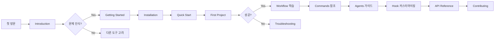

---

## 개요

**목표**: MoAI-ADK 문서를 사용자 여정 기반 11단계 구조로 전면 재구성

**범위**:
- 기존 26개 문서 → 53개 문서 (8개 유지, 18개 삭제, 45개 신규)
- MkDocs Material 테마 활용
- API 자동 문서화 (mkdocstrings)
- README.md 기반 스토리라인 유지

**우선순위**: High (문서는 프로젝트의 얼굴)

---

## 마일스톤

### 🎯 1차 목표: 핵심 스토리라인 구축 (Introduction → Getting Started → Workflow)

**산출물**:
1. `docs/introduction.md` - 바이브 코딩 한계 → MoAI-ADK 해결책
2. `docs/getting-started/installation.md` - PyPI 설치, 템플릿 다운로드
3. `docs/getting-started/quick-start.md` - 첫 프로젝트, 첫 SPEC
4. `docs/getting-started/first-project.md` - TODO 앱 실전 예제
5. `docs/workflow.md` - 기존 유지 (검증만)

**검증 기준**:
- [ ] Introduction에서 3가지 핵심 문제 명확히 제시 (플랑켄슈타인, 추적성 부재, 품질 일관성)
- [ ] Getting Started에서 15분 내 첫 SPEC 작성 가능
- [ ] 스토리 흐름이 자연스럽게 연결 (문제 → 해결책 → 실습)

**기술적 접근**:
- README.md의 "Why MoAI-ADK?" 섹션을 Introduction으로 확장
- 기존 Quick Start를 3개 파일로 분할 (설치/빠른시작/실전)
- workflow.md는 현재 상태 유지

**리스크**:
- ⚠️ README.md와 중복 우려 → Introduction은 더 상세하고, README는 요약본으로 정리
- ⚠️ 초급자 이탈 가능성 → 첫 프로젝트에서 실행 가능한 예제 필수

---

### 🎯 2차 목표: 설정 및 명령어 참조 (Configuration → Commands)

**산출물**:
1. `docs/configuration/config-json.md` - .moai/config.json 전체 구조 설명
2. `docs/configuration/personal-vs-team.md` - Personal/Team 모드 차이
3. `docs/configuration/advanced-settings.md` - TRUST 임계값, TAG 전략
4. `docs/commands/cli-reference.md` - MoAI-ADK CLI 명령어
5. `docs/commands/alfred-commands.md` - /alfred:0~3 상세 가이드
6. `docs/commands/agent-commands.md` - @agent-* 호출 방법

**검증 기준**:
- [ ] config.json 모든 필드 문서화 (16개 메타데이터 + git_strategy + pipeline 등)
- [ ] Personal vs Team 차이를 표로 명확히 비교
- [ ] 모든 Alfred 명령어에 실행 예제 포함

**기술적 접근**:
- config.json 스키마를 JSON Schema로 문서화 후 마크다운 테이블 생성
- Personal vs Team은 2열 비교 표 활용
- Alfred 명령어는 실제 실행 로그 포함

**리스크**:
- ⚠️ config.json 변경 가능성 → 자동 생성 스크립트 고려
- ⚠️ 명령어 예제 구식화 → CI/CD에서 자동 검증 추가

---

### 🎯 3차 목표: 에이전트 가이드 (9개 에이전트 상세 문서)

**산출물**:
1. `docs/agents/spec-builder.md` - 🏗️ 시스템 아키텍트
2. `docs/agents/code-builder.md` - 💎 수석 개발자
3. `docs/agents/doc-syncer.md` - 📖 테크니컬 라이터
4. `docs/agents/tag-agent.md` - 🏷️ 지식 관리자
5. `docs/agents/git-manager.md` - 🚀 릴리즈 엔지니어
6. `docs/agents/debug-helper.md` - 🔬 트러블슈팅 전문가
7. `docs/agents/trust-checker.md` - ✅ 품질 보증 리드
8. `docs/agents/cc-manager.md` - 🛠️ 데브옵스 엔지니어
9. `docs/agents/project-manager.md` - 📋 프로젝트 매니저

**검증 기준**:
- [ ] 각 에이전트별 페르소나 명확히 설명
- [ ] 전문 영역 및 책임 범위 정의
- [ ] 호출 방법 및 실제 예제 포함
- [ ] 다른 에이전트와의 협업 시나리오 설명

**기술적 접근**:
- 템플릿 기반 생성 (페르소나/전문영역/호출방법/예제 섹션 고정)
- .moai/memory/agents/ 디렉토리의 실제 프롬프트 참조
- 에이전트 간 협업 다이어그램 포함 (Mermaid)

**리스크**:
- ⚠️ 에이전트 프롬프트 변경 가능성 → 실제 프롬프트 파일 링크 포함
- ⚠️ 9개 파일 일관성 유지 어려움 → 템플릿 기반 자동 생성

---

### 🎯 4차 목표: Hook 시스템 (docs/hooks/)

**산출물**:
1. `docs/hooks/overview.md` - Hook 시스템 개요
2. `docs/hooks/session-start-hook.md` - SessionStartHook 상세
3. `docs/hooks/pre-tool-use-hook.md` - PreToolUseHook 상세
4. `docs/hooks/post-tool-use-hook.md` - PostToolUseHook 상세
5. `docs/hooks/custom-hooks.md` - 커스텀 Hook 작성 가이드

**검증 기준**:
- [ ] 각 Hook의 실행 시점 명확히 설명
- [ ] Hook 체인 다이어그램 포함 (Mermaid)
- [ ] 커스텀 Hook 예제 코드 실행 가능

**기술적 접근**:
- moai_adk/core/hooks/ 디렉토리 실제 코드 분석
- mkdocstrings로 HookBase, SessionStartHook 등 API 자동 생성
- 실제 사용 예제: Template Security Hook, Git Checkpoint Hook

**리스크**:
- ⚠️ Hook API 변경 가능성 → API 문서와 자동 연동
- ⚠️ 고급 주제라 초급자 이해 어려움 → "언제 사용하는가?" 명확히 설명

---

### 🎯 5차 목표: API 참조 (자동 생성)

**산출물**:
1. `docs/api-reference/core-installer.md` - moai_adk.core.installer
2. `docs/api-reference/core-git.md` - moai_adk.core.git_strategy
3. `docs/api-reference/core-tag.md` - moai_adk.core.tag_system
4. `docs/api-reference/core-template.md` - moai_adk.core.template_processor
5. `docs/api-reference/agents.md` - moai_adk.agents.*

**검증 기준**:
- [ ] 모든 public 클래스/함수 문서화
- [ ] 파라미터, 반환값, 예외 명시
- [ ] 사용 예제 포함 (docstring 또는 별도 섹션)

**기술적 접근**:
- mkdocstrings 플러그인 활용:
  ```yaml
  # mkdocs.yml
  plugins:
    - mkdocstrings:
        handlers:
          python:
            options:
              show_source: true
              show_root_heading: true
              show_signature_annotations: true
  ```
- Python docstring을 Google/NumPy 스타일로 통일
- 실제 코드와 자동 동기화 (수동 작업 최소화)

**리스크**:
- ⚠️ docstring 누락/불완전 → 코드 개선 필요 (별도 SPEC 후보)
- ⚠️ API 문서 자동 생성 실패 → mkdocstrings 설정 검증 필수

---

### 🎯 6차 목표: 기여 가이드 (docs/contributing/)

**산출물**:
1. `docs/contributing/overview.md` - 기여 가이드 개요
2. `docs/contributing/development-setup.md` - Poetry, pre-commit 설정
3. `docs/contributing/code-style.md` - ruff, mypy, black 규칙
4. `docs/contributing/testing.md` - pytest, coverage 가이드
5. `docs/contributing/pull-request-process.md` - PR 프로세스

**검증 기준**:
- [ ] 개발 환경 설정 5분 내 완료 가능
- [ ] 코드 스타일 자동 검증 (pre-commit 훅)
- [ ] PR 프로세스 체크리스트 제공

**기술적 접근**:
- Poetry 설치 및 가상환경 생성 스크립트 제공
- pre-commit 설정 자동화 (`.pre-commit-config.yaml` 참조)
- GitHub PR 템플릿 링크 포함

**리스크**:
- ⚠️ 개발 환경 OS별 차이 → Windows/macOS/Linux 별도 가이드 필요
- ⚠️ pre-commit 훅 업데이트 → 자동 동기화 스크립트 고려

---

### 🎯 7차 목표: 보안 및 문제 해결 (Security + Troubleshooting)

**산출물**:
1. `docs/security/overview.md` - 보안 개요
2. `docs/security/template-security.md` - 템플릿 보안 검증
3. `docs/security/best-practices.md` - 보안 모범 사례
4. `docs/security/checklist.md` - 보안 체크리스트
5. `docs/troubleshooting/common-errors.md` - 자주 발생하는 에러
6. `docs/troubleshooting/debugging-guide.md` - 디버깅 가이드
7. `docs/troubleshooting/faq.md` - FAQ

**검증 기준**:
- [ ] 템플릿 보안 검증 프로세스 명확히 설명
- [ ] 보안 체크리스트 10개 이상 항목
- [ ] 자주 발생하는 에러 20개 이상 문서화
- [ ] FAQ 30개 이상 항목

**기술적 접근**:
- 보안: moai_adk/core/template_processor.py의 보안 로직 문서화
- 에러: GitHub Issues에서 자주 발생한 에러 수집
- FAQ: 커뮤니티 질문 취합

**리스크**:
- ⚠️ 보안 취약점 노출 우려 → 일반적 지침만 제공, 구체적 공격 기법 제외
- ⚠️ FAQ 구식화 → 주기적 업데이트 필요

---

### 🎯 최종 목표: MkDocs 네비게이션 및 배포

**산출물**:
1. `mkdocs.yml` - 완전한 네비게이션 구조
2. `docs/index.md` - 랜딩 페이지 (README.md 기반)
3. GitHub Pages 배포 설정
4. CI/CD 자동화 (문서 빌드 검증)

**검증 기준**:
- [ ] 모든 53개 파일이 네비게이션에 포함
- [ ] 깨진 링크 0개
- [ ] MkDocs 빌드 성공 (`mkdocs build --strict`)
- [ ] GitHub Pages 자동 배포 성공

**기술적 접근**:
- mkdocs.yml nav 섹션 11단계 구조로 구성
- GitHub Actions 워크플로우 추가:
  ```yaml
  name: Deploy MkDocs
  on:
    push:
      branches: [main]
  jobs:
    deploy:
      runs-on: ubuntu-latest
      steps:
        - uses: actions/checkout@v3
        - uses: actions/setup-python@v4
        - run: pip install mkdocs-material mkdocstrings[python]
        - run: mkdocs gh-deploy --force
  ```

**리스크**:
- ⚠️ GitHub Pages 빌드 실패 → 로컬 테스트 철저히
- ⚠️ 네비게이션 구조 변경 가능성 → 모듈화된 yaml 구조 고려

---

## 기술 스택

### MkDocs 설정

**필수 패키지**:
```bash
pip install mkdocs>=1.5.0
pip install mkdocs-material>=9.0.0
pip install mkdocstrings[python]>=0.24.0
pip install pymdown-extensions>=10.0
```

**mkdocs.yml 핵심 설정**:
```yaml
site_name: MoAI-ADK Documentation
site_url: https://modu-ai.github.io/moai-adk/
repo_url: https://github.com/modu-ai/moai-adk
repo_name: modu-ai/moai-adk

theme:
  name: material
  palette:
    - scheme: default
      primary: indigo
      accent: indigo
      toggle:
        icon: material/brightness-7
        name: Switch to dark mode
    - scheme: slate
      primary: indigo
      accent: indigo
      toggle:
        icon: material/brightness-4
        name: Switch to light mode
  features:
    - navigation.tabs
    - navigation.sections
    - navigation.expand
    - navigation.path
    - navigation.indexes
    - toc.integrate
    - search.suggest
    - search.highlight
    - search.share
    - content.code.copy
    - content.code.annotate

plugins:
  - search:
      lang: en
  - mkdocstrings:
      handlers:
        python:
          options:
            show_source: true
            show_root_heading: true
            show_signature_annotations: true
            show_symbol_type_heading: true
            show_symbol_type_toc: true
            docstring_style: google
            merge_init_into_class: true

markdown_extensions:
  - admonition
  - pymdownx.details
  - pymdownx.superfences:
      custom_fences:
        - name: mermaid
          class: mermaid
          format: !!python/name:pymdownx.superfences.fence_code_format
  - pymdownx.tabbed:
      alternate_style: true
  - pymdownx.highlight:
      anchor_linenums: true
      line_spans: __span
      pygments_lang_class: true
  - pymdownx.inlinehilite
  - pymdownx.snippets
  - pymdownx.emoji:
      emoji_index: !!python/name:material.extensions.emoji.twemoji
      emoji_generator: !!python/name:material.extensions.emoji.to_svg
  - tables
  - def_list
  - attr_list
  - md_in_html

nav:
  - Home: index.md
  - Introduction: introduction.md
  - Getting Started:
      - Installation: getting-started/installation.md
      - Quick Start: getting-started/quick-start.md
      - First Project: getting-started/first-project.md
  - Configuration:
      - config.json: configuration/config-json.md
      - Personal vs Team: configuration/personal-vs-team.md
      - Advanced Settings: configuration/advanced-settings.md
  - Workflow: workflow.md
  - Commands:
      - CLI Reference: commands/cli-reference.md
      - Alfred Commands: commands/alfred-commands.md
      - Agent Commands: commands/agent-commands.md
  - Agents:
      - spec-builder: agents/spec-builder.md
      - code-builder: agents/code-builder.md
      - doc-syncer: agents/doc-syncer.md
      - tag-agent: agents/tag-agent.md
      - git-manager: agents/git-manager.md
      - debug-helper: agents/debug-helper.md
      - trust-checker: agents/trust-checker.md
      - cc-manager: agents/cc-manager.md
      - project-manager: agents/project-manager.md
  - Hooks:
      - Overview: hooks/overview.md
      - SessionStartHook: hooks/session-start-hook.md
      - PreToolUseHook: hooks/pre-tool-use-hook.md
      - PostToolUseHook: hooks/post-tool-use-hook.md
      - Custom Hooks: hooks/custom-hooks.md
  - API Reference:
      - Core Installer: api-reference/core-installer.md
      - Core Git: api-reference/core-git.md
      - Core Tag: api-reference/core-tag.md
      - Core Template: api-reference/core-template.md
      - Agents: api-reference/agents.md
  - Contributing:
      - Overview: contributing/overview.md
      - Development Setup: contributing/development-setup.md
      - Code Style: contributing/code-style.md
      - Testing: contributing/testing.md
      - Pull Request Process: contributing/pull-request-process.md
  - Security:
      - Overview: security/overview.md
      - Template Security: security/template-security.md
      - Best Practices: security/best-practices.md
      - Checklist: security/checklist.md
  - Troubleshooting:
      - Common Errors: troubleshooting/common-errors.md
      - Debugging Guide: troubleshooting/debugging-guide.md
      - FAQ: troubleshooting/faq.md
```

### 자동화 도구

**링크 검증**:
```bash
# pytest 기반 링크 검증
# tests/test_docs_links.py
import pytest
from pathlib import Path
import re

def test_no_broken_links():
    docs_dir = Path("docs")
    all_links = []
    for md_file in docs_dir.rglob("*.md"):
        content = md_file.read_text()
        links = re.findall(r'\[.*?\]\((.*?)\)', content)
        all_links.extend([(md_file, link) for link in links])

    broken = []
    for file, link in all_links:
        if link.startswith("http"):
            continue  # 외부 링크는 수동 검증
        target = (file.parent / link).resolve()
        if not target.exists():
            broken.append((file, link))

    assert len(broken) == 0, f"Broken links: {broken}"
```

**문서 빌드 CI/CD**:
```yaml
# .github/workflows/docs.yml
name: Docs

on:
  pull_request:
    paths:
      - 'docs/**'
      - 'mkdocs.yml'
  push:
    branches: [main]

jobs:
  build:
    runs-on: ubuntu-latest
    steps:
      - uses: actions/checkout@v3
      - uses: actions/setup-python@v4
        with:
          python-version: '3.13'
      - name: Install dependencies
        run: |
          pip install mkdocs mkdocs-material mkdocstrings[python] pymdown-extensions
      - name: Build docs
        run: mkdocs build --strict
      - name: Test links
        run: pytest tests/test_docs_links.py
      - name: Deploy to GitHub Pages
        if: github.ref == 'refs/heads/main'
        run: mkdocs gh-deploy --force
```

---

## 아키텍처 설계

### 문서 구조 다이어그램

```
docs/
├── index.md (README.md 기반 랜딩)
├── introduction.md (바이브 코딩 한계 → MoAI-ADK)
├── getting-started/
│   ├── installation.md
│   ├── quick-start.md
│   └── first-project.md
├── configuration/
│   ├── config-json.md
│   ├── personal-vs-team.md
│   └── advanced-settings.md
├── workflow.md (기존 유지)
├── commands/
│   ├── cli-reference.md
│   ├── alfred-commands.md
│   └── agent-commands.md
├── agents/ (9개)
│   ├── spec-builder.md
│   ├── code-builder.md
│   ├── doc-syncer.md
│   ├── tag-agent.md
│   ├── git-manager.md
│   ├── debug-helper.md
│   ├── trust-checker.md
│   ├── cc-manager.md
│   └── project-manager.md
├── hooks/ (5개)
│   ├── overview.md
│   ├── session-start-hook.md
│   ├── pre-tool-use-hook.md
│   ├── post-tool-use-hook.md
│   └── custom-hooks.md
├── api-reference/ (5개)
│   ├── core-installer.md
│   ├── core-git.md
│   ├── core-tag.md
│   ├── core-template.md
│   └── agents.md
├── contributing/ (5개)
│   ├── overview.md
│   ├── development-setup.md
│   ├── code-style.md
│   ├── testing.md
│   └── pull-request-process.md
├── security/ (4개)
│   ├── overview.md
│   ├── template-security.md
│   ├── best-practices.md
│   └── checklist.md
└── troubleshooting/ (3개)
    ├── common-errors.md
    ├── debugging-guide.md
    └── faq.md

총 53개 파일 (26개 기존 → 8개 유지 + 45개 신규)
```

### 사용자 여정 플로우



---

## 리스크 및 대응 방안

### 리스크 1: 기존 문서와 충돌
- **영향도**: High
- **발생 확률**: Medium
- **대응**: 기존 26개 문서 백업 → 8개 유지 확정 → 나머지 점진적 삭제

### 리스크 2: API 문서 자동 생성 실패
- **영향도**: Medium
- **발생 확률**: Medium
- **대응**: 사전 mkdocstrings 테스트 → docstring 품질 개선 → 수동 작성 백업 플랜

### 리스크 3: 사용자 여정 불명확
- **영향도**: High
- **발생 확률**: Low
- **대응**: 베타 테스터 피드백 → A/B 테스트 → 네비게이션 개선

### 리스크 4: 문서 업데이트 누락
- **영향도**: Medium
- **발생 확률**: High
- **대응**: CI/CD 자동 빌드 검증 → 링크 테스트 → 주기적 리뷰

---

## Definition of Done

### 완료 기준

- [ ] 53개 파일 모두 작성 완료
- [ ] MkDocs 빌드 성공 (`mkdocs build --strict`)
- [ ] 링크 검증 통과 (깨진 링크 0개)
- [ ] API 문서 자동 생성 성공
- [ ] GitHub Pages 배포 성공
- [ ] README.md 스토리라인 일관성 확인
- [ ] ❌ checkpoint-policies.md 등 18개 파일 삭제 확인

### 품질 게이트

- [ ] 모든 코드 예제 실행 가능
- [ ] 9개 에이전트 가이드 페르소나 일관성
- [ ] 11단계 스토리 흐름 자연스러움
- [ ] MkDocs Material 테마 완벽 호환

---

**작성일**: 2025-10-17
**버전**: v0.0.1 (INITIAL)
