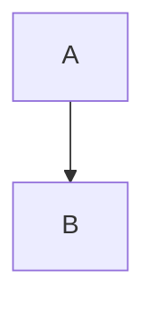

# @SPEC:DOCS-003: VitePress → MkDocs Material 마이그레이션

## HISTORY
### v0.0.1 (2025-10-14)
- **INITIAL**: VitePress → MkDocs Material 마이그레이션 명세 작성
- **AUTHOR**: @Goos
- **SCOPE**: 문서 시스템 Python 기반으로 전환
- **CONTEXT**: Python 개발자를 위한 네이티브 문서 도구 제공
- **RATIONALE**:
  - Python 네이티브 생태계 통합 (MoAI-ADK가 TypeScript + Python 양쪽 지원)
  - Vercel 배포 최적화 (더 빠른 빌드)
  - 검색 성능 개선 (Material for MkDocs의 강력한 내장 검색)
  - 유지보수 간편화 (VitePress보다 설정 단순)

---

## 개요

MoAI-ADK의 문서 시스템을 VitePress(TypeScript/Node.js 기반)에서 MkDocs Material(Python 기반)로 마이그레이션합니다. 이를 통해 Python 개발자에게 더 친숙한 문서 도구를 제공하고, Vercel 배포 성능을 개선하며, 강력한 검색 기능을 제공합니다.

### 현재 상황
- **문서 시스템**: VitePress (Node.js 기반)
- **문서 파일**: 22개 Markdown 파일 (docs/guides/, docs/api/)
- **설정 파일**: docs/.vitepress/config.mts
- **기능**: 복잡한 중첩 네비게이션, Mermaid 다이어그램 지원

### 마이그레이션 목표
- **새 시스템**: MkDocs Material (Python 기반)
- **배포 플랫폼**: Vercel (기존 유지)
- **빌드 시간**: VitePress 대비 50% 이하 (목표: < 30초)
- **검색**: 한글 검색 완벽 지원
- **호환성**: 기존 22개 Markdown 파일 100% 변환

---

## Environment (환경 및 가정사항)

### 기술 환경
- **Python 버전**: 3.9 이상
- **MkDocs Material 버전**: 9.5.0 이상
- **배포 플랫폼**: Vercel
- **브랜치 전략**: feature/python-v0.3.0

### 기존 문서 구조
```
docs/
├── .vitepress/
│   └── config.mts        # VitePress 설정 (네비게이션 정의)
├── guides/               # 가이드 문서 (15개)
│   ├── getting-started.md
│   ├── alfred-commands.md
│   ├── tdd-workflow.md
│   └── ...
├── api/                  # API 레퍼런스 (7개)
│   ├── spec-builder.md
│   ├── code-builder.md
│   └── ...
└── index.md              # 홈페이지
```

### 가정사항
1. 기존 Markdown 파일은 표준 CommonMark 형식을 따름
2. VitePress 전용 Vue 컴포넌트는 사용하지 않음
3. Mermaid 다이어그램은 코드 블록 형식으로 작성됨
4. Vercel 계정 및 배포 권한 보유

---

## Requirements (요구사항 - EARS 구조)

### Ubiquitous Requirements (기본 요구사항)

1. **완전한 마이그레이션**
   - 시스템은 기존 VitePress 문서를 MkDocs Material로 완전히 마이그레이션해야 한다
   - 시스템은 모든 Markdown 파일(22개)을 호환 가능한 형식으로 변환해야 한다

2. **Material 테마 적용**
   - 시스템은 Material for MkDocs 테마를 적용해야 한다
   - 시스템은 다크 모드를 지원해야 한다

3. **Vercel 배포**
   - 시스템은 Vercel에 정상적으로 배포되어야 한다
   - 시스템은 빌드 시간을 VitePress 대비 50% 이하로 유지해야 한다

4. **검색 기능**
   - 시스템은 한글 검색을 완벽히 지원해야 한다
   - 시스템은 Material for MkDocs의 내장 검색 엔진을 사용해야 한다

### Event-driven Requirements (이벤트 기반)

1. **WHEN** Markdown 파일이 변경되면, 시스템은 자동으로 MkDocs 빌드를 트리거해야 한다

2. **WHEN** Vercel 배포가 시작되면, 시스템은 `mkdocs build` 명령으로 정적 HTML을 생성해야 한다

3. **WHEN** 빌드가 실패하면, 시스템은 명확한 오류 메시지를 표시해야 한다

4. **WHEN** 개발자가 `mkdocs serve` 실행하면, 시스템은 http://127.0.0.1:8000 에서 실시간 프리뷰를 제공해야 한다

5. **WHEN** 내부 링크를 클릭하면, 시스템은 404 오류 없이 정확한 페이지로 이동해야 한다

### State-driven Requirements (상태 기반)

1. **WHILE** 개발 모드일 때, 시스템은 `mkdocs serve`로 실시간 프리뷰를 제공해야 한다

2. **WHILE** 프로덕션 빌드 시, 시스템은 SEO 최적화 및 검색 인덱스를 생성해야 한다

3. **WHILE** 문서 탐색 중일 때, 시스템은 사이드바 네비게이션을 유지해야 한다

4. **WHILE** 문서 검색 중일 때, 시스템은 한글 검색 기능을 완벽히 지원해야 한다

### Optional Features (선택적 기능)

1. **WHERE** Mermaid 다이어그램이 존재하면, 시스템은 mkdocs-mermaid2-plugin으로 렌더링할 수 있다

2. **WHERE** 다크 모드가 활성화되면, 시스템은 Material 테마의 다크 모드를 제공할 수 있다

3. **WHERE** 코드 블록이 존재하면, 시스템은 구문 강조 표시를 제공할 수 있다

4. **WHERE** 탭(Tab) 컴포넌트가 필요하면, 시스템은 Material 테마의 탭 기능을 제공할 수 있다

### Constraints (제약사항)

1. **IF** Mermaid 다이어그램이 존재하면, 시스템은 mkdocs-mermaid2-plugin으로 렌더링해야 한다

2. **IF** 빌드 시간이 30초를 초과하면, 시스템은 최적화 경고를 표시해야 한다

3. **IF** 내부 링크가 깨지면, 시스템은 빌드를 실패시켜야 한다

4. **IF** Python 버전이 3.9 미만이면, 시스템은 설치를 거부해야 한다

5. **IF** VitePress의 config.mts 네비게이션 구조가 존재하면, 시스템은 이를 mkdocs.yml로 완전히 변환해야 한다

---

## Specifications (상세 명세)

### 1. MkDocs Material 설정

#### 1.1 mkdocs.yml 구조
```yaml
site_name: MoAI-ADK Documentation
site_description: SPEC-First TDD 개발 프레임워크
site_author: MoAI Team
site_url: https://moai-adk.vercel.app

# 테마 설정
theme:
  name: material
  language: ko
  features:
    - navigation.instant       # SPA 모드
    - navigation.tracking      # URL 추적
    - navigation.tabs          # 상단 탭
    - navigation.sections      # 섹션 구분
    - navigation.expand        # 자동 확장
    - toc.follow               # 목차 따라가기
    - search.suggest           # 검색 자동완성
    - search.highlight         # 검색 결과 강조
    - content.code.copy        # 코드 복사 버튼
  palette:
    # 라이트 모드
    - scheme: default
      primary: indigo
      accent: indigo
      toggle:
        icon: material/brightness-7
        name: 다크 모드로 전환
    # 다크 모드
    - scheme: slate
      primary: indigo
      accent: indigo
      toggle:
        icon: material/brightness-4
        name: 라이트 모드로 전환

# 플러그인
plugins:
  - search:
      lang:
        - ko
        - en
  - mermaid2           # Mermaid 다이어그램

# Markdown 확장
markdown_extensions:
  - pymdownx.highlight      # 코드 강조
  - pymdownx.superfences:   # 코드 블록
      custom_fences:
        - name: mermaid
          class: mermaid
          format: !!python/name:mermaid2.fence_mermaid
  - pymdownx.tabbed:        # 탭
      alternate_style: true
  - admonition              # 어드몬ition (주의/경고/팁)
  - pymdownx.details        # 접기/펼치기
  - pymdownx.emoji:         # 이모지
      emoji_index: !!python/name:material.extensions.emoji.twemoji
      emoji_generator: !!python/name:material.extensions.emoji.to_svg

# 네비게이션 (VitePress config.mts에서 변환)
nav:
  - 홈: index.md
  - 시작하기:
    - guides/getting-started.md
    - guides/installation.md
  - Alfred 커맨드:
    - guides/alfred-commands.md
    - guides/spec-first-tdd.md
  - API 레퍼런스:
    - api/spec-builder.md
    - api/code-builder.md
    - api/doc-syncer.md
```

#### 1.2 requirements.txt
```txt
mkdocs>=1.5.0
mkdocs-material>=9.5.0
mkdocs-mermaid2-plugin>=1.1.0
pymdown-extensions>=10.0
```

#### 1.3 vercel.json
```json
{
  "buildCommand": "pip install -r requirements.txt && mkdocs build",
  "outputDirectory": "site",
  "framework": null,
  "devCommand": "mkdocs serve"
}
```

### 2. Markdown 파일 변환 규칙

#### 2.1 내부 링크 변환
**VitePress 형식**:
```markdown
[Getting Started](/guides/getting-started)
```

**MkDocs 형식**:
```markdown
[Getting Started](guides/getting-started.md)
```

**변환 규칙**:
- 절대 경로(`/guides/...`) → 상대 경로(`guides/...`)
- 확장자 명시 필수(`.md`)

#### 2.2 Mermaid 다이어그램
**기존 형식** (VitePress, MkDocs 모두 호환):
````markdown

````

**변환 필요 없음**: 기존 코드 블록 형식 그대로 사용

#### 2.3 Front Matter 변환
**VitePress 형식**:
```yaml
---
title: Getting Started
description: MoAI-ADK 시작하기
---
```

**MkDocs 형식** (선택사항):
```yaml
---
title: Getting Started
description: MoAI-ADK 시작하기
---
```

**변환 규칙**: Front Matter는 MkDocs에서도 지원하므로 변환 불필요

### 3. 네비게이션 구조 변환

#### 3.1 VitePress config.mts 분석
**예시 구조**:
```typescript
export default {
  themeConfig: {
    sidebar: [
      {
        text: '시작하기',
        items: [
          { text: 'Getting Started', link: '/guides/getting-started' },
          { text: 'Installation', link: '/guides/installation' }
        ]
      },
      {
        text: 'API 레퍼런스',
        items: [
          { text: 'spec-builder', link: '/api/spec-builder' }
        ]
      }
    ]
  }
}
```

#### 3.2 mkdocs.yml 변환
```yaml
nav:
  - 홈: index.md
  - 시작하기:
    - Getting Started: guides/getting-started.md
    - Installation: guides/installation.md
  - API 레퍼런스:
    - spec-builder: api/spec-builder.md
```

**변환 규칙**:
- `sidebar` → `nav`
- `text` → YAML 키
- `link` → YAML 값 (`.md` 확장자 추가)

### 4. 빌드 및 배포

#### 4.1 로컬 개발
```bash
# 의존성 설치
pip install -r requirements.txt

# 개발 서버 실행
mkdocs serve
# → http://127.0.0.1:8000
```

#### 4.2 프로덕션 빌드
```bash
# 정적 HTML 생성
mkdocs build
# → site/ 디렉토리에 생성
```

#### 4.3 Vercel 배포
1. **vercel.json 설정** (위 1.3 참조)
2. **Git push** → Vercel 자동 배포
3. **빌드 명령어**: `pip install -r requirements.txt && mkdocs build`
4. **출력 디렉토리**: `site`

### 5. 검증 및 테스트

#### 5.1 빌드 시간 측정
```bash
time mkdocs build
```
**목표**: < 30초

#### 5.2 404 링크 검사
```bash
# MkDocs 내장 검증 사용
mkdocs build --strict
# → 깨진 링크 시 빌드 실패
```

#### 5.3 검색 기능 테스트
- 로컬에서 `mkdocs serve` 실행
- 검색창에 한글 키워드 입력
- 결과 확인

---

## Traceability (@TAG)

- **SPEC**: @SPEC:DOCS-003 (이 문서)
- **TEST**: @TEST:DOCS-003
  - `tests/docs/test_mkdocs_build.py` (빌드 검증)
  - `tests/docs/test_links.py` (링크 무결성)
- **CODE**: @CODE:DOCS-003
  - `mkdocs.yml` (MkDocs 설정)
  - `requirements.txt` (Python 의존성)
  - `vercel.json` (Vercel 배포 설정)
  - `docs/` (Markdown 파일 - 변환 후)
- **DOC**: @DOC:DOCS-003
  - `docs/guides/migration/vitepress-to-mkdocs.md` (마이그레이션 가이드)

### 관련 SPEC
- **DEPENDS_ON**:
  - @SPEC:DOCS-001 (문서 구조 정의)
  - @SPEC:DOCS-002 (VitePress 초기 설정)
- **RELATED**:
  - @SPEC:DOCS-002 (기존 문서 시스템)

---

## 참고 자료

- [MkDocs Material 공식 문서](https://squidfunk.github.io/mkdocs-material/)
- [mkdocs-mermaid2-plugin](https://github.com/fralau/mkdocs-mermaid2-plugin)
- [Vercel MkDocs 배포 가이드](https://vercel.com/guides/deploying-mkdocs-with-vercel)
- [VitePress 공식 문서](https://vitepress.dev/)

---

**최종 업데이트**: 2025-10-14
**작성자**: @Goos
**상태**: draft
