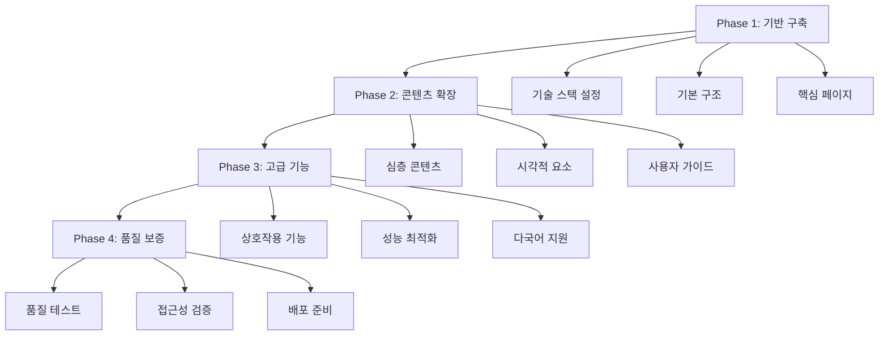
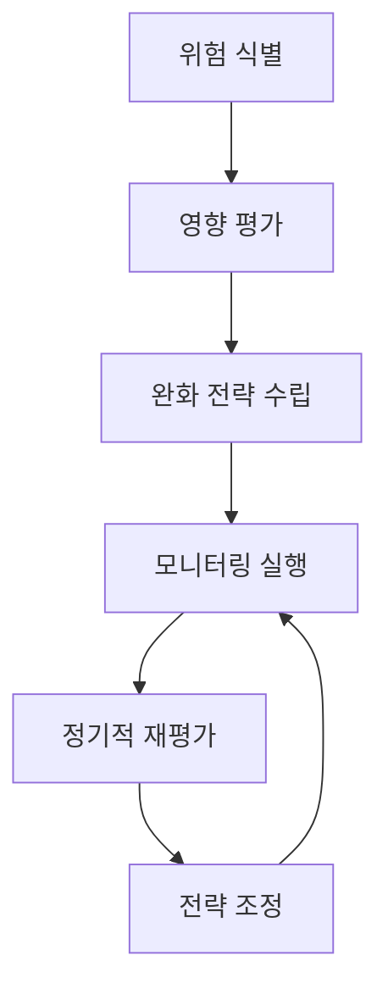

# MoAI-ADK 온라인 문서 개발 실행 계획

## 개요

본 계획은 SPEC-DOCS-005 명세서에 기반한 실용적인 구현 전략을 제공합니다. 책 수준의 학술적 문서를 체계적으로 개발하기 위한 단계별 접근 방식을 포함합니다.

## 구현 전략

### 점진적 개발 접근



## Phase 1: 기반 구축 (1-2주)

### 목표
- Next.js + Nextra 기술 스택 완전 설정
- 기본 문서 구조와 네비게이션 구현
- 핵심 페이지 프로토타입 개발

### 세부 계획

**1.1 기술 스택 설정**
- Next.js 15.1.8 설치 및 설정
- Nextra 3.3.1 테마 커스터마이징
- TypeScript 설정 및 타입 정의
- ESLint + Prettier 코드 품질 설정

**1.2 기본 구조 구현**
- 디렉토리 구조 표준화
- 메타데이터 및 SEO 설정
- 다크/라이트 모드 지원
- 검색 기능 설정

**1.3 핵심 페이지 프로토타입**
- 메인 페이지 뼈대
- 시작하기 섹션 기본 구조
- 네비게이션 및 메뉴 시스템
- 푸터 및 헤더 컴포넌트

### 기술적 명세

```typescript
// 프로젝트 구조
docs/
├── pages/
│   ├── ko/
│   │   ├── index.md
│   │   ├── getting-started/
│   │   ├── guides/
│   │   ├── alfred/
│   │   ├── features/
│   │   ├── architecture/
│   │   ├── skills/
│   │   ├── output-style/
│   │   └── reference/
│   └── meta.json
├── components/
├── styles/
├── public/
└── theme.config.tsx
```

## Phase 2: 콘텐츠 확장 (2-3주)

### 목표
- README.ko.md 내용 체계적 변환
- 학술적 수준의 상세한 문서 작성
- Mermaid 다이어그램 대규모 통합

### 세부 계획

**2.1 README.ko.md 콘텐츠 변환**
- 690줄 내용 분석 및 재구성
- 사용자 레벨별 콘텐츠 분리
- 논리적 학습 경로 재설계

**2.2 학술적 문서 작성**
- 각 섹션별 상세한 분석과 설명
- 이론적 기반과 실용적 적용 결합
- 깊이 있는 기술적 탐구

**2.3 시각적 요소 통합**
- 모든 주요 개념 Mermaid 다이어그램화
- 일관된 시각적 디자인 시스템
- 인터랙티브 다이어그램 구현

### 콘텐츠 품질 기준

```yaml
문서 품질:
  최소 길이: 1,000단어 이상
  코드 예제: 100% 실행 가능
  다이어그램: 모든 주요 개념 포함
  참조: 상호 연결 완벽함

학술적 수준:
  깊이: 이론적 배경 포함
  구조: 체계적 논리 흐름
  증거: 실제 코드와 예시
  정확성: 기술적 무결성
```

## Phase 3: 고급 기능 (2-3주)

### 목표
- 상호작용 기능 구현
- 성능 최적화 완료
- 다국어 지원 시스템 구축

### 세부 계획

**3.1 상호작용 기능**
- 실시간 코드 예제 실행
- 인터랙티브 다이어그램
- 사용자 피드백 시스템
- 검색 강화 기능

**3.2 성능 최적화**
- 페이지 로딩 속도 최적화
- 이미지 및 에셋 최적화
- 코드 스플리팅 및 레이지 로딩
- CDN 및 캐싱 전략

**3.3 다국어 지원**
- i18n 프레임워크 통합
- 한국어/영어 병행 개발
- 문화적 적응성 고려
- 번역 워크플로우 자동화

### 성능 목표

```yaml
성능 지표:
  Lighthouse: 90점 이상
  FCP: 1.8초 이하
  LCP: 2.5초 이하
  CLS: 0.1 이하

접근성:
  WCAG 2.1 AA: 100% 준수
  스크린 리더: 완벽 호환
  키보드: 모든 기능 지원
  색상 대비: 4.5:1 이상
```

## Phase 4: 품질 보증 (1-2주)

### 목표
- 포괄적인 품질 테스트 완료
- 접근성 검증 통과
- 프로덕션 배포 준비

### 세부 계획

**4.1 품질 테스트**
- 자동화된 테스트 스위트
- 링크 유효성 검사
- 크로스 브라우저 호환성
- 모바일 반응성 검증

**4.2 접근성 검증**
- WCAG 2.1 AA 준수 테스트
- 스크린 리더 테스트
- 키보드 네비게이션 테스트
- 색상 대비율 검증

**4.3 배포 준비**
- 프로덕션 빌드 최적화
- 배포 파이프라인 설정
- 모니터링 시스템 구축
- 롤백 전략 준비

### 품질 보증 체크리스트

```markdown
## 기능 테스트
- [ ] 모든 페이지 정상 로딩
- [ ] 네비게이션 완벽 동작
- [ ] 검색 기능 정상 작동
- [ ] 다크/라이트 모드 전환
- [ ] 다이어그램 렌더링

## 성능 테스트
- [ ] Lighthouse 점수 90+
- [ ] 페이지 로딩 3초 미만
- [ ] 모바일 최적화 완료
- [ ] 이미지 최적화 적용

## 접근성 테스트
- [ ] WCAG 2.1 AA 준수
- [ ] 스크린 리더 호환
- [ ] 키보드 네비게이션
- [ ] 색상 대비율 충족
```

## 리스크 관리

### 주요 위험 요소

**1. 기술적 위험**
- **위험**: Next.js/Nextra 호환성 문제
- **확률**: Medium
- **영향**: High
- **완화**: 사전 프로토타이핑 및 테스트

**2. 콘텐츠 위험**
- **위험**: README.ko.md 콘텐츠 변환 복잡성
- **확률**: High
- **영향**: High
- **완화**: 단계적 변환 및 지속적 검증

**3. 성능 위험**
- **위험**: 대용량 콘텐츠 로딩 속도
- **확률**: Medium
- **영향**: Medium
- **완화**: 코드 스플리팅 및 레이지 로딩

**4. 품질 위험**
- **위험**: 학술적 수준 유지 어려움
- **확률**: Medium
- **영향**: High
- **완화**: 전문가 검토 및 품질 게이트

### 위험 완화 전략



## 성공 지표

### 정량적 지표

**사용자 참여도**
- 페이지 방문 시간: 평균 5분 이상
- 페이지 이탈률: 30% 미만
- 검색 사용률: 60% 이상
- 문서 완독률: 40% 이상

**기술적 성능**
- Lighthouse 점수: 90점 이상
- 페이지 로딩 속도: 3초 미만
- 가동 시간: 99.9%
- 오류율: 0.1% 미만

### 정성적 지표

**콘텐츠 품질**
- 사용자 만족도: 4.5/5.0 이상
- 기술적 정확성: 100%
- 학습 효과성: 명확한 개선 확인
- 커뮤니티 피드백: 긍정적 반응

## 유지보수 계획

### 정기 업데이트
- 콘텐츠 검토: 월간
- 기술 스택 업데이트: 분기별
- 성능 최적화: 분기별
- 사용자 피드백 반영: 지속적

### 모니터링 시스템
- 성능 모니터링: 실시간
- 오류 추적: 자동화
- 사용자 행동 분석: 주간
- 콘텐츠 유효성 검사: 월간

### 확장성 계획
- 새로운 콘텐츠 추가: 점진적
- 기능 확장: 사용자 피드백 기반
- 다국어 확장: 단계적
- 커뮤니티 기여: 체계적

## 결론

본 실행 계획은 SPEC-DOCS-005 명세서의 요구사항을 충족시키는 체계적인 접근 방식을 제공합니다. 점진적 개발을 통해 안정성을 보장하고, 지속적인 품질 개선을 통해 세계적 수준의 온라인 문서를 구축할 수 있습니다.

성공적인 실행을 통해 MoAI-ADK 사용자들은 최고 수준의 학습 경험을 얻게 될 것이며, 이는 프로젝트의 성공적인 도입과 확산에 기여할 것입니다.