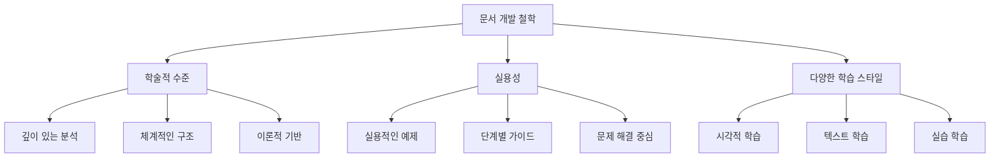

# MoAI-ADK 온라인 문서 개발 명세서

## 개요 (Overview)

### 프로젝트 배경

MoAI-ADK는 AI 기반 SPEC-First TDD 개발 프레임워크로서, 현재 690줄에 달하는 포괄적인 한국어 README.ko.md와 55개의 Claude Skills 시스템을 보유하고 있습니다. 그러나 현재 문서 구조는 단일 파일에 집중되어 있어, 사용자 경험 수준별로 체계적인 학습 경로를 제공하는 데 한계가 있습니다.

### 문서 개발의 필요성

현대 소프트웨어 개발에서 문서는 단순한 참고 자료를 넘어, 개발자들의 학습 경로와 성공적인 도입을 결정하는 핵심 요소입니다. 특히 MoAI-ADK와 같은 복잡한 개발 프레임워크의 경우, 체계적인 문서 구조가 없으면 사용자들은 방대한 정보 속에서 길을 잃기 쉽습니다.

### 프로젝트 목표

본 SPEC은 MoAI-ADK의 온라인 문서를 책 수준의 학술적 수준으로 개발하는 것을 목표로 합니다. 모든 문서는 전문적인 수준의 상세한 문단으로 구성되며, 각 주요 섹션에는 적절한 Mermaid 다이어그램을 포함하여 개념의 시각적 이해를 돕습니다.

### 문서 개발 철학



## 환경 (Environment)

### 기술 환경

**문서 생성 환경:**
- Next.js 14+ (App Router)
- Tailwind CSS
- Nextra (정적 사이트 생성)
- TypeScript
- MDX (Markdown + JSX)

**시각화 도구:**
- Mermaid.js (다이어그램 생성)
- Recharts (데이터 시각화)
- Figma (디자인 시스템)

**콘텐츠 관리:**
- Git 기반 버전 관리
- 다국어 지원 (i18n)
- 검색 엔진 최적화 (SEO)
- 다크/라이트 모드 지원

### 개발 환경

**빌드 도구:**
- Node.js 18+
- npm/yarn
- ESLint + Prettier
- TypeScript 컴파일러

**배포 환경:**
- Vercel (기본)
- Netlify (대안)
- 정적 호스팅 지원

### 품질 보증 환경

**자동화된 검증:**
- 링크 유효성 검사
- 스펠링 및 문법 검사
- 접근성 테스트
- 성능 최적화 검사

**문서 품질 측정:**
- Lighthouse 점수 (90+)
- 페이지 로딩 속도 (< 3초)
- 모바일 반응성
- 검색 엔진 순위

## 가정 (Assumptions)

### 사용자 가정

**기술 수준:**
- 사용자들은 기본적인 프로그래밍 개념을 이해하고 있음
- Git 및 명령어 라인 사용에 익숙함
- 현대적인 웹 개발 환경에 익숙함

**학습 선호도:**
- 시각적 학습 자료 선호 (다이어그램, 스크린샷)
- 실용적인 예제와 코드 중심 학습 선호
- 단계별 점진적 학습 경로 선호

### 기술적 가정

**프레임워크 안정성:**
- Next.js와 Nextra는 안정적이고 지속적으로 유지보수됨
- Mermaid.js는 웹 표준을 준수하며 호환성이 높음
- TypeScript는 강력한 타입 지원을 제공함

**성능 가정:**
- 정적 사이트 생성은 빠른 로딩 속도를 보장함
- CDN 배포는 전 세계적 접근성을 제공함
- 클라우드 호스팅은 확장성을 보장함

### 콘텐츠 가정

**기존 자료 활용:**
- README.ko.md의 690줄 내용은 신뢰할 수 있는 기반 자료임
- .claude/skills/의 55개 스킬 시스템은 기술적 깊이를 제공함
- src/moai_adk/의 소스 코드는 실제 구현 예시를 제공함

**다국어 지원:**
- 한국어 콘텐츠가 주요 언어로 우선 개발됨
- 영어, 일본어, 중국어로 확장 가능한 구조가 준비됨
- 문화적 맥락을 고려한 현지화가 가능함

## 요구사항 (Requirements)

### 기능적 요구사항

**FR-001: 문서 구조 설계**
- 사용자 수준별 명확한 구분 (초보자/중급자/고급자)
- 논리적인 학습 경로 제공
- 검색 기능과 탐색 용이성 확보

**FR-002: 콘텐츠 품질**
- 책 수준의 상세한 문단으로 구성
- 실용적인 코드 예제와 설명
- 최신 정보와 정확성 보장

**FR-003: 시각적 요소**
- 모든 주요 개념에 Mermaid 다이어그램 포함
- 일관된 시각적 디자인 시스템
- 다크/라이트 모드 지원

**FR-004: 상호작용 기능**
- 실시간 코드 예제 실행
- 인터랙티브 다이어그램
- 사용자 피드백 수집

**FR-005: 다국어 지원**
- 한국어 우선 개발
- i18n 기반의 다국어 확장
- 문화적 적응성 고려

### 비기능적 요구사항

**NFR-001: 성능**
- 페이지 로딩 속도 3초 미만
- Lighthouse 점수 90점 이상
- 모바일 최적화 완벽 지원

**NFR-002: 접근성**
- WCAG 2.1 AA 준수
- 스크린 리더 호환
- 키보드 네비게이션 지원

**NFR-003: 유지보수성**
- 자동화된 콘텐츠 동기화
- 버전 관리와 변경 추적
- 쉬운 업데이트 프로세스

**NFR-004: 확장성**
- 새로운 콘텐츠 추가 용이성
- 기능 확장 가능성
- 커뮤니티 기여 지원

## 명세 (Specifications)

### 문서 구조 명세

```mermaid
graph TD
    A[MoAI-ADK 문서] --> B[시작하기]
    A --> C[학습 경로]
    A --> D[Alfred 명령어]
    A --> E[핵심 기능]
    A --> F[아키텍처]
    A --> G[Skills]
    A --> H[Output Style]
    A --> I[참조 자료]

    B --> B1[설치]
    B --> B2[빠른 시작]
    B --> B3[첫 프로젝트]

    C --> C1[초보자]
    C --> C2[중급자]
    C --> C3[고급자]

    D --> D1[명령어]
    D --> D2[워크플로우]
    D --> D3[에이전트]

    E --> E1[SPEC-First]
    E --> E2[TDD]
    E --> E3[@TAG 시스템]
    E --> E4[Statusline]
    E --> E5[전문가 위임]
    E --> E6[시니어 사고]

    F --> F1[아키텍처 패턴]
    F --> F2[BaaS 통합]
    F --> F3[@TAG 내부 구조]

    G --> G1[Skills 개요]
    G --> G2[기초 Skills]
    G --> G3[TAG 관리]
    G --> G4[에이전트별 Skills]

    H --> H1[R2-D2 스타일]
    H --> H2[적응형 페르소나]
    H --> H3[모범 사례]

    I --> I1[설정]
    I --> I2[문제 해결]
    I --> I3[용어 사전]
```

### 콘텐츠 명세

**메인 페이지 (index.md)**
- MoAI-ADK 소개와 핵심 가치 제안
- 사용자 레벨별 빠른 시작 링크
- 최신 업데이트와 커뮤니티 정보

**시작하기 섹션**
- 설치 가이드 (환경 설정부터 실행까지)
- 5분 빠른 시작 (최소한의 단계로 즉시 경험)
- 첫 프로젝트 (실제 애플리케이션 구축)

**학습 경로 섹션**
- 초보자: 기본 개념과 간단한 프로젝트
- 중급자: 실용적인 기능과 프로덕션 준비
- 고급자: 엔터프라이즈급 개발과 팀 리더십

### 기술적 명세

**Nextra 설정**
```typescript
// theme.config.tsx
const config = {
  logo: <span>🗿 MoAI-ADK</span>,
  project: {
    link: 'https://github.com/modu-ai/moai-adk',
    icon: <GitHubIcon />
  },
  docsRepositoryBase: 'https://github.com/modu-ai/moai-adk/tree/main/docs',
  i18n: [
    { locale: 'ko', name: '한국어' },
    { locale: 'en', name: 'English' }
  ],
  sidebar: {
    defaultMenuCollapseLevel: 1,
    toggleButton: true
  },
  search: {
    placeholder: '검색...'
  }
}
```

**Mermaid 다이어그램 명세**
```yaml
# 다이어그램 유형
워크플로우:
  - Alfred 4단계 워크플로우
  - TDD RED-GREEN-REFACTOR 주기
  - 개발 생명주일

아키텍처:
  - 시스템 구조 다이어그램
  - 컴포넌트 관계도
  - 데이터 흐름

개념:
  - @TAG 추적성 시스템
  - Skills 시스템 아키텍처
  - 에이전트 협업 패턴
```

### 품질 명세

**콘텐츠 품질 기준**
- 각 문서는 최소 1,000단어 이상
- 코드 예제는 모두 실행 가능
- 모든 용어는 용어 사전에 정의됨
- 모든 개념은 다이어그램으로 시각화됨

**기술적 품질 기준**
- Lighthouse 점수: 90점 이상
- 페이지 로딩: 3초 미만
- 접근성: WCAG 2.1 AA 준수
- 모바일: 완벽한 반응형 지원

## 추적성 (Traceability)

### @TAG 체인 설계

```mermaid
graph TD
    A[@SPEC:DOCS-005] --> B[@TEST:DOCS-005]
    B --> C[@CODE:FOUNDATION-SETUP-001]
    C --> D[@CODE:CONTENT-CREATION-001]
    D --> E[@CODE:VISUALIZATION-001]
    E --> F[@CODE:I18N-SETUP-001]
    F --> G[@CODE:PERFORMANCE-OPT-001]
    G --> H[@CODE:QA-DEPLOYMENT-001]
    H --> I[@DOC:DOCS-005]
```

### 구현 추적성

**기반 구축 TAGs**
- @TAG:FOUNDATION-SETUP-001: Nextra 기반 구축
- @TEST:FOUNDATION-SETUP-001: 기반 기능 테스트
- @CODE:FOUNDATION-SETUP-001: 기반 구현 코드

**콘텐츠 생성 TAGs**
- @TAG:CONTENT-CREATION-001: 핵심 콘텐츠 생성
- @TEST:CONTENT-CREATION-001: 콘텐츠 품질 테스트
- @CODE:CONTENT-CREATION-001: 콘텐츠 생성 코드

**시각화 TAGs**
- @TAG:VISUALIZATION-001: Mermaid 다이어그램 통합
- @TEST:VISUALIZATION-001: 시각화 기능 테스트
- @CODE:VISUALIZATION-001: 시각화 구현 코드

### 문서 추적성

**문서화 TAGs**
- @DOC:DOCS-005: 온라인 문서 완성
- @DOC:GUIDE-001: 사용자 가이드
- @DOC:API-REF-001: API 레퍼런스
- @DOC:ARCH-001: 아키텍처 가이드

**품질 보증 TAGs**
- @TEST:QUALITY-001: 품질 테스트 결과
- @DOC:QUALITY-001: 품질 보증서
- @CODE:METRICS-001: 성능 측정 코드

### 변경 추적성

**버전 관리**
- 모든 변경은 Git 커밋으로 추적
- 각 TAG는 특정 버전과 연결
- 변경 로그는 자동으로 생성됨

**영향 분석**
- @TAG 시스템으로 변경 영향 즉시 파악
- 의존성 관계 자동 추적
- 회귀 테스트 자동 실행