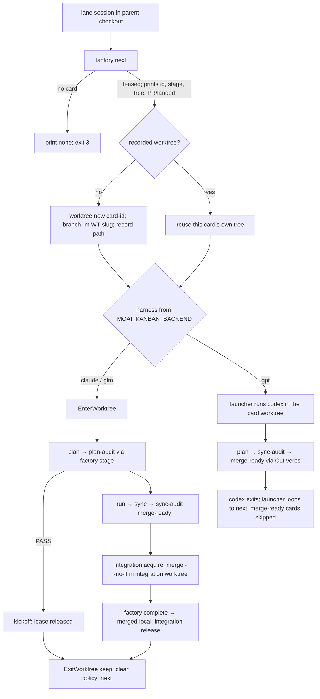

# Design — SPEC-FACTORY-SELF-DISPATCH-001

Mechanism notes for the run phase. Requirements live in `spec.md`; nothing here adds one.

## §1 Decision summary

| # | Decision | Chosen | Rejected | Why |
|---|---|---|---|---|
| D1 | Codex engine | interactive `codex` session per card, working directory = card worktree | headless `codex exec` (t1242 design §5) | Card text: "헤드리스 엔진 없음", "codex -C <wt> 대화형 재기동" |
| D2 | Codex integration | none — stop at `merge-ready`; `next` never re-leases such a card (REQ-SD-025) | self-integration; re-lease after expiry | Card text: "자가 통합 없이 merge-ready"; re-lease would livelock (plan-audit D1) |
| D3 | Lane selection order in `next` | own assigned → unowned picked → oldest queued (promote); other lanes' cards never | operator-picked only | Card text "카드를 스스로 임대(moai factory next [--wait])" and operator Q3; leader decision OD-1 (spec.md §D). Queue order only |
| D4 | Queue writes by a lane | only the promotion inside `next`; every other `todo` verb outside a read-only allowlist refused | per-verb blocklist | Card text; an allowlist covers verbs added later (plan-audit D7) |
| D5 | Lane predicate | role marker == value constant, on every path; label alone is not a lane | marker-or-label on MCP | One rule everywhere (plan-audit D5); the Codex MCP consequence is a stated residual (spec.md §E.1) |
| D6 | Integration branch and tree | the branch `moai integration acquire` records and the worktree that has it checked out (`internal/cli/integration.go:166-180`, `worktreeForBranch` `:218`) | worktree base branch; merging in the parent | One integration surface; the parent checkout never changes branch (plan-audit D2) |
| D7 | Harness identification | `MOAI_KANBAN_BACKEND` (`config.EnvMoaiKanbanBackend`, `envkeys.go:235`) with values `kanban.BackendClaude`/`BackendGLM`/`BackendGPT` (`internal/kanban/record.go:22-24`); `gpt` = Codex harness | a new variable | Existing name and constants; it is in the frozen Codex MCP allowlist, so the Codex MCP path sees it |
| D8 | Clear policy default | `clear-each` | `clear-when-full` | Card text: "기본 clear-each" |
| D9 | Where the next-card rule lives | SessionStart additionalContext on `startup` (every policy) and `clear` | a rule file | Always-loaded surface must not grow; the rule is per-session state |
| D10 | MCP tree resolution | caller-supplied `project_root`, required on the three lane verbs | server working directory | The server's cwd does not follow `EnterWorktree` (moai-mcp-tools rule) |

## §2 Card lifecycle per harness



## §3 Verbs

| CLI | MCP (`project_root`) | Caller | Record effect |
|---|---|---|---|
| `moai factory next [--wait]` | `factory_next` (required) | lane | T2/T3 (and T1 for a promoted card); queue pick for a promoted card |
| `moai factory stage <card> <state> [evidence]` | `factory_stage` (required) | lane, lease holder | one F1 edge + lease renew; Codex refused `merging` |
| `moai factory complete <card> [merge evidence]` | `factory_complete` (required) | lane, lease holder | T14/T16 (claude/glm); refused for Codex |
| `moai factory decide …` (F1) | `factory_decide` (optional) | not a lane | F1 REQ-FR-019..021 |
| `moai todo add <text>` | `todo_add` (optional) | not a lane | queue insert |
| `moai todo list` | `todo_list` (optional) | any | read only |

- One implementation per verb; the MCP handler calls the function the cobra `RunE` calls.
- Actor label: the lane-label variable (`MOAI_FACTORY_WORKER`, name kept under REQ-RNC-011).
- Exit status 3 = no card available (help text states it).
- PR/landed line: reuse the reader behind `moai todo pr` (`runTodoPR`, `internal/cli/todo_pr.go:177`).
- Promotion atomicity: queue store and `factory.db` are separate stores. `next` picks in the queue first,
  then writes T1-T3; a failed record write leaves the card `picked` and unowned, and the next `next`
  takes it as an unowned picked card. Concurrent lanes are serialized by F1's version check; the loser
  re-selects.

## §4 Launcher environment

- cc / glm: `enterFactoryWorkerMode` (`internal/cli/factory.go:402-418`) gains the marker (name and value
  constants); restored on return like the other keys. The backend value is already exported on both
  factory-lane paths: glm at `internal/cli/glm.go:267-268`, cc at `internal/cli/cc.go:220`
  (`exportFactoryLaunchFacts`, which delegates at `internal/cli/kanban.go:543` to
  `exportKanbanLaunchFacts`, whose `os.Setenv(config.EnvMoaiKanbanBackend, …)` is at `kanban.go:492-497`).
  No launcher change is needed for the backend value.
- Codex: the per-card child environment starts from `codexChildEnv` (`codex_launcher.go:607-625`) and
  then sets the marker, the lane label, the factory signal, `MOAI_KANBAN_BACKEND=gpt`, and the leased
  card id in `MOAI_KANBAN_CARD` (`config.EnvMoaiKanbanCard`, `envkeys.go:250`) — the hand-off the
  owned-card rule reads (REQ-SD-003, -019). Bare
  `moai codex` keeps the eleven-key scrub.
- The leader session gets no marker.

## §5 Lane predicate and refusal wording

```
laneAdmit(env)  = env[config.EnvFactoryRole] == <role-value constant>
laneRefuse(env) = laneAdmit(env)
               || env[config.EnvMoaiFactoryWorker] != ""
               || env[config.EnvMoaiKanbanBackend] == kanban.BackendGPT
```

`laneAdmit` gates `next`/`stage`/`complete` on every path. `laneRefuse` gates the queue guard, the
`decide` guard, and the contract guard's role gate on every path. The two extra clauses of `laneRefuse`
read variables the frozen Codex MCP allowlist already forwards (`configtoml.go:21`), so the Codex MCP
path refuses without widening it. Widening only the deny side can refuse more, never grant more.
Refusal lines are constants in one place per verb family; the REQ-SD-004 Codex line is one constant in
`codex_launcher.go` replacing `codexFactoryRefusalDiag` (`:743-744`); legacy role tokens on every
launcher go through t1256's REQ-RNC-003/-005/-007 producer.

## §6 Launcher shapes and clear policies

- `clear-each` / `clear-when-full`: unchanged exec model (`launch_exec_posix.go:37`); the policy value
  travels in the lane session's environment for the SessionStart rule and the `complete` output to read.
- `clear-when-full` reads the session's record at `<project>/.moai/state/context-usage/<session-id>.json`
  (`internal/statusline/context_usage.go:13-20`) and compares it with the model-specific handoff
  threshold (context-window-management rule); a missing record reads as below threshold.
- `relaunch` (Claude) and every Codex lane: a supervising loop — the launcher stays the parent, runs
  `next` and `worktree new` itself, starts the interactive child, waits for it to exit (the Claude child
  exits when the operator ends it after the end-session request), and loops. `syscall.Exec` is not used
  on this path.
- Windows: the loops use the existing child-process launch path; no new `syscall` use.

## §7 Superseded clauses of SPEC-CODEX-FACTORY-RETIRE-001

| Clause | Effect of this SPEC |
|---|---|
| REQ-CFR-002 | Narrowed: `-f lane` accepted; other factory shapes keep a refusal with new wording (REQ-SD-004) |
| REQ-CFR-006/007 | Narrowed: the `-f lane` child carries the lane keys; bare codex keeps the scrub |
| REQ-CFR-010 | Unchanged |
| REQ-CFR-020 | Unchanged (REQ-SD-022) |
| REQ-CFR-022 | Unchanged — Codex lanes need no hook peer; the record is the channel |

The sync phase records `partially_superseded_by: [SPEC-FACTORY-SELF-DISPATCH-001]` on that SPEC
(plan.md §F M7).

### §7.1 Superseded clause of SPEC-AUTONOMY-PRECONDITION-001

| Clause | Effect of this SPEC |
|---|---|
| REQ-AP-011 | Widened in the deny direction only: the role gate on `sign --signer llm`/`llm+jev` and `decide` also denies where the lane label is set or `MOAI_KANBAN_BACKEND=gpt` (lane refusal, REQ-SD-015/017). The allow direction and the leader's own `decide` path are unchanged — a session carrying none of the three lane variables is allowed exactly as before |

The sync phase also records `partially_superseded_by: [SPEC-FACTORY-SELF-DISPATCH-001]` on
SPEC-AUTONOMY-PRECONDITION-001 (plan.md §F M7).
