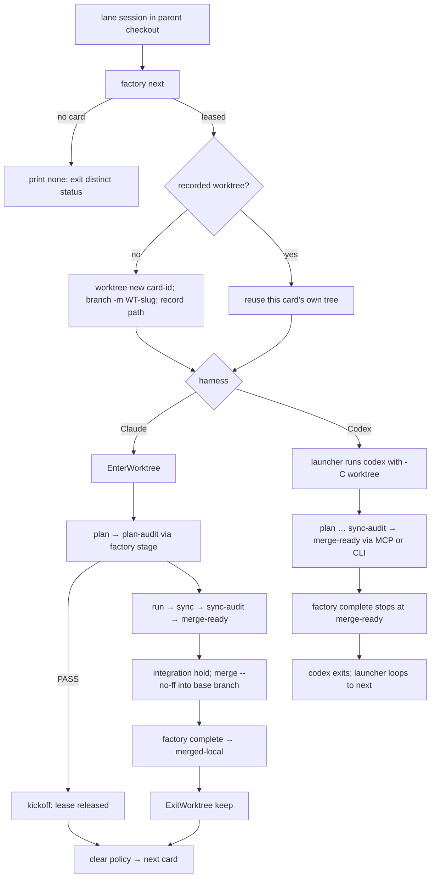

# Design — SPEC-FACTORY-SELF-DISPATCH-001

Mechanism notes for the run phase. Requirements live in `spec.md`; nothing here adds one.

## §1 Decision summary

| # | Decision | Chosen | Rejected | Why |
|---|---|---|---|---|
| D1 | Codex engine | interactive `codex` session per card, working directory = card worktree | headless `codex exec` (t1242 design §5) | Card text: "헤드리스 엔진 없음", "codex -C <wt> 대화형 재기동" |
| D2 | Codex integration | none — stop at `merge-ready` | self-integration | Card text: "자가 통합 없이 merge-ready" |
| D3 | Lane selection order in `next` | own assigned → unowned picked → oldest queued (promote) | operator-picked only | Operator Q3 (SPEC-ROLE-NAMING-CODE-001 plan.md §B): self-dispatch up to promoting a queued card. Queue order only — no inferred priority |
| D4 | Queue writes by a lane | only the promotion inside `next` | allow `todo add` from lanes | Card text: "에이전트 권한에서 큐 변경 … 제외" |
| D5 | Lane detection on the MCP path | role marker equals the value constant **or** the lane-label variable is non-empty | marker only | Codex MCP receives only allowlisted variables, and the allowlist is frozen (REQ-CFR-020, REQ-SD-022) |
| D6 | Integration branch for `complete` | the configured worktree base branch (`config.LoadWorktreeBaseBranch`, `session_worktree.go:228`) | a new setting | One source for "where cards branch from" and "where they merge into" |
| D7 | Clear policy default | `clear-each` | `clear-when-full` | Card text: "기본 clear-each" |
| D8 | Where the next-card rule lives | SessionStart additionalContext on `clear` (and on `startup` under `relaunch`) | a rule file | Always-loaded surface must not grow (REQ-CFR-021 precedent); the rule is per-session state |

## §2 Card lifecycle per harness



A card that returns from `kickoff` after the leader's `decide approve` comes back `assigned` to the same
lane with stage `run` (F1 REQ-FR-019); `next` picks it up first (D3) and re-enters its recorded tree.

## §3 Verbs

| CLI | MCP | Role allowed | Record effect |
|---|---|---|---|
| `moai factory next [--wait]` | `factory_next` | lane | T2/T3 (and T1 for a promoted card), queue pick for a promoted card |
| `moai factory stage <card> <state> [evidence flags]` | `factory_stage` | lane (lease holder) | one F1 edge + lease renew |
| `moai factory complete <card> [merge evidence]` | `factory_complete` | lane (lease holder) | T13/T14/T16 (Claude) or up to T13 (Codex) |
| `moai factory decide …` (F1) | `factory_decide` | not a lane | F1 REQ-FR-019..021 |
| `moai todo add <text>` | `todo_add` | not a lane | queue insert |
| `moai todo list` | `todo_list` | any | read only |

One implementation per verb; the MCP handler calls the same function the cobra `RunE` calls, so the
equivalence test (AC-SD-014) compares record rows and refusal text, not two code paths.

The actor label is read from the lane-label variable (`MOAI_FACTORY_WORKER`, name kept under REQ-RNC-011).
A call with no lane label on a lane-only verb is refused ("not a lane session").

## §4 Role marker stamping

- cc / glm: `enterFactoryWorkerMode` (`internal/cli/factory.go:402-418`) gains one `Setenv` of the
  marker name constant to the value constant, restored on return like the other keys.
- Codex: the per-card child environment starts from `codexChildEnv` (`codex_launcher.go:607-625`) and
  then sets the marker, the lane label, and the factory signal. This is the one path on which the
  eleven-key scrub of REQ-CFR-006 is deliberately not the final word; bare `moai codex` keeps it.
- The leader session gets no marker.

## §5 Lane check

```
isLane(env) = env[EnvFactoryRole] == <value constant>
           || (onMCPPath && env[EnvMoaiFactoryWorker] != "")
```

CLI verbs run inside the session's own shell, which carries the full launcher environment, so the
marker suffices there. The MCP path adds the label clause for Codex (D5). Both halves read constants.

## §6 Launcher shapes

- `clear-each` / `clear-when-full`: unchanged exec model (`launch_exec_posix.go:37`); the policy value
  travels in the lane session's environment for the SessionStart rule to read.
- `relaunch` (Claude) and every Codex lane: a supervising loop — the launcher stays the parent,
  runs `next` and `worktree new` itself, starts the interactive child, waits, and loops. `syscall.Exec`
  cannot be used on this path because it leaves no parent.
- Windows: the Codex and relaunch loops use the same child-process path the Windows launcher already
  uses; no new `syscall` use (REQ-CFR-016 precedent).

## §7 Superseded clauses of SPEC-CODEX-FACTORY-RETIRE-001

| Clause | Effect of this SPEC |
|---|---|
| REQ-CFR-002 | Narrowed: the `-f lane` shape is accepted; every other factory token stays refused (REQ-SD-004) |
| REQ-CFR-006/007 | Narrowed: the `-f lane` child carries the lane keys; bare codex keeps the scrub |
| REQ-CFR-010 | Unchanged |
| REQ-CFR-020 | Unchanged (REQ-SD-022) |
| REQ-CFR-022 | Unchanged — Codex lanes need no hook peer; the record is the channel |

The sync phase records `partially_superseded_by: [SPEC-FACTORY-SELF-DISPATCH-001]` on that SPEC
(plan.md §F M7).
