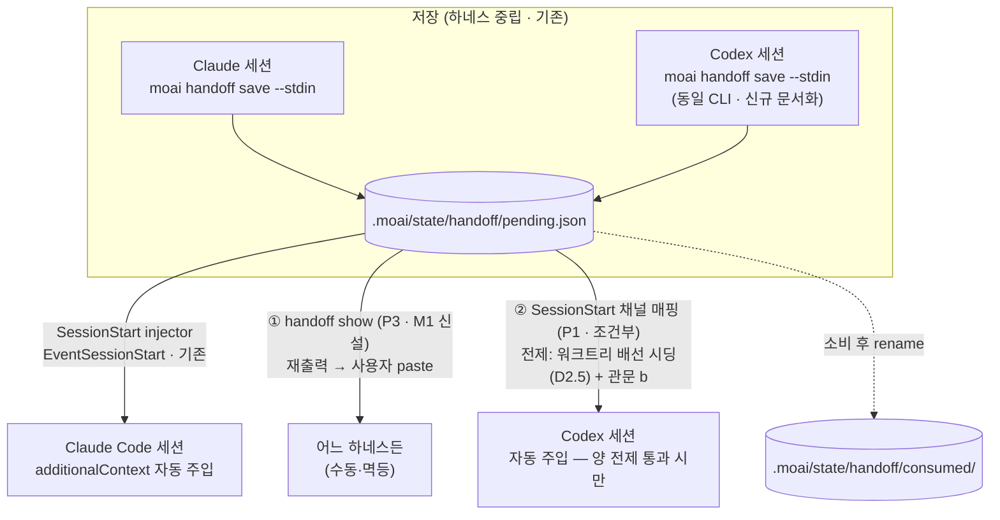

# Design — SPEC-HANDOFF-NEUTRAL-001 (핸드오프 하네스 중립화, card t1273)

> Tier L plan-phase 설계 문서. 근거 실측은 research.md (HEAD `1b7a88d78` 기준, 추보 커밋 `36326286f`→`fb51c8a59`). 리드 승인 마일스톤 구조: **M1 = 설계 + Codex 쪽 소비 경로(새 능력) + LIVE 검증**, M2 = ultrathink·하네스 고유 키워드 제거(SSOT 문서+렌더 코드 동시, t1175 병합 뒤), M3 = AGENTS.md 계약 배치(t1243 병합 뒤).
>
> M1 설계 골격은 리드 지시(2026-09-26)를 따른다: **P3 기본 + P1 조건부(관문 b 통과 시)**. 쿼터 차단(9/28 14:37)으로 LIVE 관문 (b)(c)는 그 이후 실행.

---

## §A — 목표 상태 (아키텍처)

저장은 이미 하네스 중립이다 (research §C.1: pending.json은 moai CLI가 쓰는 파일). M1이 만드는 것은 **소비의 대칭**이다:



- **P3 (기본)**: `moai handoff show` — 저장된 6블록을 붙여넣기 가능한 형태로 stdout 재출력. 어느 하네스의 세션에서도, 어느 하네스가 저장했든 소비 가능. 수동 경로의 사슬 끊김(research §D-1)을 막는 최소·확정 능력.
- **P1 (조건부)**: codexadapter `additionalContextEvents`에 `EventSessionStart` 추가 — Codex 세션 시작 시 자동 주입. 채택 조건: 관문 (b) 격리 실측 통과. 미통과 시 P3 단독으로 M1을 닫는다 (P1은 기각 사유와 함께 폐기).

## §B — 설계 결정

### D1 — `moai handoff show` 인터페이스 (P3 도구)

`internal/cli/handoff.go`에 네 번째 동사 신설 (기존: `handoff` 부모 + `save`·`clear`).

| 항목 | 설계 |
|---|---|
| 형식 | `moai handoff show [--project-dir <path>] [--json]` |
| 소스 우선순위 | ① `pending.json` (미소비) → ② `consumed/` 최신 항목 → ③ 둘 다 없으면 오류 (exit 1, "no saved handoff found" + 저장 방법 안내) |
| 출력 (기본) | 짧은 헤더(출처·spec·phase·lang·저장시각·소비 여부) + 구분선 + **저장된 Body verbatim** — 사용자가 그대로 복사·붙여넣기 |
| 출력 (`--json`) | PendingRecord 전체 (스크립트·다른 도구 소비용) |
| 상태 | **멱등·무상태** — claim/소비/rename 하지 않는다. auto-inject 흐름과 독립 (동시 실행 안전: 읽기만 함) |
| 언어 | 저장된 `ConversationLanguage` 그대로. 헤더 문구는 4-로케일 (ko/en/ja/zh) — 인젝터 렌더(`handoffLocaleStrings`)의 관례 재사용 |
| 하네스 결합 | 없음 — stdout에만 쓴다. Claude·Codex·사용자 터미널 어디서든 동일 |

실패 모드 (fail-open 정합): pending.json 파싱 실패 → consumed 최신으로 같은 시도, 그것도 실패하면 exit 1 + stderr 진단 (기존 handoff 패키지 오류 관례 준용). show가 인젝터·save를 방해하는 경로는 원천 없다 (읽기 전용).

### D2 — P1: SessionStart 채널 매핑 (조건부 · 전제 2개)

변경점은 한 곳: `internal/codexadapter/output.go` `additionalContextEvents` 집합에 `hook.EventSessionStart: true` 추가. 어댑터(`--harness codex` 경로)와 인젝터(SessionStart 등록)는 이미 존재한다 (research §C.4). 그러나 채택에는 관문이 **두 개**다:

- **전제 1 — 워크트리 배선 (D6)**: 프로젝트 레이어 `.codex/hooks.json`은 untracked 런타임 생성물이라 `git worktree`가 복제하지 않는다 — **워크트리에서 도는 Codex 세션에는 moai 훅이 아예 로드되지 않는다** (research §C.4 관측: 워크트리 t1273 체크아웃에 hooks.json 부재; 이 리포의 레인은 거의 항상 워크트리에서 돈다). 매핑을 고치기 전에 워크트리가 배선을 갖추는 경로(D6)가 선행돼야 한다.
- **전제 2 — 채택 관문 (b)**: 격리 CODEX_HOME·스크래치 프로젝트에서 Codex를 띄워 SessionStart additionalContext가 세션에 실제 도달하는지 관측. 어댑터 주석이 명시하듯 UserPromptSubmit만 측정된 채널이다 — 측정 없이 집합에 추가하면 "전달된다"는 관측 없는 주장(verification-claim-integrity §1.1)이 된다.
- **기각 시**: P1 폐기, M1은 P3로 닫는다. 기각 사유(예: Codex가 SessionStart 출력의 additionalContext를 무시)를 design.md 추보에 기록 — 이후 Codex 버전에서 재측정할 근거가 된다.
- **길이 상한 (관문 c)**: Codex `additionalContextLimit` 기본 2500 토큰. 6블록 실측(≈600-900 토큰 예상)이 통과해도, 초과 시 디스크 강등 동작(Codex 문서 관측, research §B.3)을 문서화한다 — 강등 시에도 P3가 붙여넣기 경로를 보존하므로 이중화의 이유가 된다.

### D2.5 — 워크트리 배선 시딩 (리드 지적 반영 · 옵션 비교)

워크트리 Codex 세션이 `.codex/hooks.json`을 갖추는 세 방법:

| 옵션 | 형상 | 판정 |
|---|---|---|
| **A — materializer 시딩 (권고 · 리드 조정 반영)** | 시딩 주체는 `moai worktree new`가 쓰는 **공용 트리 생성 경로(materializer)** — 레인 트리는 전부 이 경로로 만들어지므로 여기에 두면 오늘 이후 생성되는 모든 트리가 시딩을 받는다. (`moai cc -w`/`moai codex -w`는 기존 트리를 해석만 하므로 런처에 두면 안 된다 — 이미 만들어진 레인 트리가 누락된다.) 새 트리에 `.codex/hooks.json`을 moai 소유 항목만 담아 시딩, 생성 로직은 `internal/cli/update_codex_wiring.go` 재사용. 멱등: 파일이 이미 있으면 건드리지 않음(사용자 항목 보존 서술과 정합 — 새 파일에는 보존할 사용자 항목이 없음) | **M1 채택 권고** — 최소 변경, 사용자 파일 무오염, 모든 생성 경로 단일 진입점 |
| A-보완 — 기존 트리 채움 | 조정 시점에 이미 존재하는 워크트리(오늘 레인들이 만든 트리 포함)는 materializer를 다시 지나지 않는다. 보완 채택: **런처 진입 시 부재면 같은 멱등 시딩 로직으로 채운다** (진입당 stat 1회의 저렴한 비용, 사용자 항목 부재 시에만 동작하므로 오염 없음) | 채택 — 기존 트리가 P1 전제를 영원히 못 갖는 갭을 닫음 |
| B — 심볼릭 링크 | 워크트리의 hooks.json이 primary 것을 가리킴 | **기각** — primary 파일의 사용자 소유 항목이 워크트리 프로젝트에서도 실행되는 부작용 + 링크의 관리 주체 불명 + Codex trust 판단이 cwd 기준이라 링크가 우연히 작동하는지도 미측정 |
| C — 추적 파일(템플릿) 전환 | `internal/template/templates/.codex/hooks.json`을 넣어 모든 체크아웃·워크트리에 포함 | **후속 카드 후보** — hooks.json은 "moai 소유 + 사용자 소유가 같은 파일에 섞이는" 런타임 보존 계약(description 문구 실측, research §C.4)을 가진다. 템플릿화하려면 .claude 쪽 settings.json/settings.local.json 분리에 상응하는 Codex 측 분리 규칙 설계가 선행돼야 함 — M1 범위 초과, 별도 카드로 |

P1은 **옵션 A가 착지된 뒤에만** 매핑 추가가 의미를 갖는다 (전제 1). 옵션 A 자체는 P1 기각과 무관하게 독립 가치가 있다 — 워크트리 Codex 세션이 pre/post-tool 훅 등 다른 moai 훅 계열도 잃고 있는 상태를 고친다.

### D3 — 방향 중립성 (Codex→Claude 포함)

`moai handoff save`는 이미 CLI다 — Codex 세션도 shell에서 호출할 수 있다. M1은 코드 변경 없이 **문서화**로 이 방향을 연다:

- Codex 세션이 인계를 남기는 절차: 응답 본문에 6블록 렌더 → `moai handoff save --stdin --spec <ID> --phase <phase>` 로 파이프. 세션-하네스 판별 불필요 (파일이 곧 매체).
- Claude 인젝터는 pending.json의 출처를 묻지 않으므로 Codex가 저장한 인계를 다음 Claude 세션이 자동 소비한다 — **역방향은 이미 무상태로 성립**. 이 비대칭(정방향만 새 공사)이 M1의 실제 범위다.

### D4 — 6블록 형식 불변 (M1 경계)

M1은 렌더 형식을 바꾸지 않는다. `show`는 저장된 Body를 **바이트 그대로** 재출력한다 (ultrathink 라인 포함 — 제거는 M2에서 SSOT 문서와 렌더 코드를 같은 커밋 시퀀스로). 리드 조정의 준수: "M1 이 렌더 형식을 건드려야 한다면 현재 SSOT 와 일치하는 범위 안에서만" — show의 헤더(출처 표시)는 새 표면이지 6블록 본문의 변경이 아니다.

### D5 — AGENTS.md 소비 계약은 M3으로 이월

Codex 세션이 pending.json을 스스로 발견하게 하는 AGENTS.md 문구(예: "세션 시작 시 `moai handoff show`를 먼저 확인하라")는 t1243(지시 파일 통합)과 같은 파일을 다룬다 — M3(t1243 병합 후)에 배치한다. M1이 제공하는 것: 그 문구가 호출할 도구(`show`). 문구 초안(2-3줄, 영문)은 M3 착수 시 제출.

## §C — LIVE 검증 절차서 (9/28 14:37 이후 · 격리)

리드 조건② 준수 — 운영자 `~/.codex/config.toml`·primary `.codex/hooks.json` 무접촉.

```bash
# 스크래치 (격리 CODEX_HOME + 스크래치 프로젝트)
export CODEX_HOME=/tmp/t1273-live/codex-home   # 비어 있는 홈
mkdir -p /tmp/t1273-live/proj                  # 스크래치 프로젝트
# proj/.codex/config.toml: features.hooks 활성 (격리 본)
# proj/.codex/hooks.json: SessionStart → "moai hook session-start --harness codex" (격리 배선)
# proj/.moai/state/handoff/pending.json: 측정용 6블록 픽스처 (마커 문자열 포함)
```

| 관문 | 측정 | 통과 판정 |
|---|---|---|
| (a) moai 훅 발화 | 격리 홈에서 `codex exec` — stderr/출력에 moai session-start 실행 흔적, 또는 세션 트레이스에서 훅 완료 | moai 훅이 Codex에 의해 실행됨을 관측 |
| (b) additionalContext 도달 | 프롬프트 "마커 문자열이 보이면 그대로 답하라" — 응답에 마커 존재 | SessionStart 주입이 모델에 도달 (P1 채택) |
| (c) 길이 | (b) 통과 시 동일 세션에서 6블록 실측 토큰·강등 여부 | 강등 없음 확인 또는 강등 동작 기록 |

상한 (선언됨): 관문당 실행 3회·벽시계 30분. 쿼터 회복(9/28 14:37) 전에 격리 환경 구축·픽스처 준비까지 마쳐 둔다 (모델 호출 없이 가능한 부분).

## §D — 파일 변경 예측 (M1)

| 파일 | 변경 | 성격 |
|---|---|---|
| `internal/cli/handoff.go` | `newHandoffShowCmd` + 하위 등록 | 신규 (P3) |
| `internal/cli/handoff_show_test.go` (신설) | pending/consumed/없음 3분기·--json·멱등 | 신규 테스트 |
| 워크트리 materializer (`moai worktree new` 트리 생성 경로) + 런처 진입 보완 | 새 트리에 `.codex/hooks.json` 시딩 (D2.5 옵션 A; `update_codex_wiring.go` 생성 로직 재사용, 존재 시 무시) + 기존 트리 진입 시 부재면 채움 | 신규 (P1 전제, 독립 가치) |
| 워크트리 시딩 테스트 (신설) | 시딩·멱등(기존 파일 보존)·런처 보완·실패 fail-open | 신규 테스트 |
| `internal/codexadapter/output.go` | `additionalContextEvents` + `EventSessionStart` (전제 1·2 통과 시만) | 1행 (P1, 조건부) |
| `internal/codexadapter/output_test.go` | SessionStart 매핑 케이스 | 조건부 |
| `.moai/specs/SPEC-HANDOFF-NEUTRAL-001/*` | plan/design/acceptance/spec | 문서 |
| AGENTS.md.tmpl | **미변경 (M3)** | — |

Template-First 검토: `show`는 CLI 동사이며 템플릿 배포 파일(.codex 배선 등)을 만들지 않는다 — 이번 M1은 템플릿 무접촉 (P1의 어댑터 변경도 internal/ 코드). 배선 파일은 이미 런타임 생성 경로가 존재하므로 템플릿 추가 불요.

## §E — 리스크·트레이드오프

- **P1 기각 가능성**: Codex가 SessionStart의 additionalContext를 소비하지 않을 수 있다 (UserPromptSubmit만 측정된 이유가 그것일 수 있음). 또한 워크트리 배선 시딩(D2.5)이 착지돼지 않으면 매핑만으로는 아무 효과가 없다 — 전제 1과 전제 2 중 어느 하나라도 실패하면 P1 폐기. P3가 항상 병행되므로 M1은 P1 무관하게 닫힌다 — 설계상 이중화.
- **옵션 C 잔여**: hooks.json 템플릿화(사용자/moai 소유 분리 규칙 설계)는 후속 카드 후보로 남는다 — 옵션 A가 착지돼도 원격 clone(fresh clone에서 `moai update` 전)에는 워크트리 시딩 경로가 닿지 않는 갭이 남는다 (fresh clone 직후 첫 워크트리는 시딩으로 커버되므로 실질 갭은 update 미실행 primary뿐).
- **훅 표면의 버전 취약성**: Codex hooks는 feature flag 하의 젊은 표면 (폐기 별칭 `codex_hooks` 존재). P1 채택 후에도 Codex CLI 업그레이드마다 관문 (b) 재측정이 필요하다 — acceptance에 재측정 조건을 남긴다.
- **쿼터 의존**: 관문 (b)(c)는 쿼터 회복 시점(9/28 14:37)에 물려 있다. 회복 전 M1의 코드 반(P3)은 완료해 두고, P1 판정만 9/28로 남기는 것이 일정 리스크를 줄인다.
