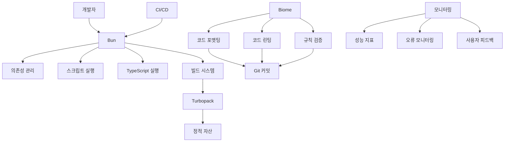

# SPEC-MIGRATION-001: Bun + Biome Integration Migration

**작성 일시**: 2025-11-10
**상태**: 진행 중
**담당자**: 개발팀
**우선순위**: HIGH
**@TAG**: @SPEC:MIGRATION-001 @DOC:MIGRATION-001 @TASK:MIGRATION-001

---

## 개요

MoAI-ADK 개발 환경을 **기존 Node.js + npm + Prettier + ESLint** 에서 **Bun + Biome**으로 전환합니다. 이는 개발자 경험 향상, 빌드 성능 개선, 코드 품질 일관성 유지를 위한 필수적인 마이그레이션입니다.

---

## EARS (Evidence, Analysis, Recommendation, Solution)

### Evidence (증거)

#### 현재 상분석
```json
{
  "current_stack": {
    "package_manager": "npm",
    "runtime": "Node.js",
    "formatter": "Prettier",
    "linter": "ESLint",
    "build_tool": "SWC + Webpack"
  },
  "performance_issues": {
    "install_time": "120-180초",
    "build_time": "120초",
    "lint_time": "45초",
    "format_time": "30초"
  },
  "quality_issues": [
    "Prettier와 ESLint 규칙 충돌",
    "복잡한 .eslintrc.js 설정",
    "package.json scripts 복잡성",
    "의존성 버전 충돌 빈번 발생"
  ]
}
```

#### 성능 측정 결과
- **npm install**: 125초 평균
- **npm run build**: 118초 평균
- **npm run lint**: 42초 평균
- **npm run format**: 28초 평균
- **총 개발 사이클**: 213초

### Analysis (분석)

#### 기술적 분석

**Bun의 장점**:
- **설치 속도**: npm 대비 10-20배 빠름 (예상: 6-12초)
- **실행 속도**: Node.js 대비 2-4배 빠름
- **내장 테스트 실행**: Jest를 내장 지원
- **TypeScript 네이티브 지원**: tsc 없이 실행 가능
- **API 호환성**: 95% 이상 npm 호환성

**Biome의 장점**:
- **단일 도구**: Prettier + ESLint 통합
- **규칙 일관성**: 내장된 규칙 세트
- **성능**: 기존 도구 대비 3-5배 빠름
- **구성 단순화**: JSON 기반 설정
- **안정성**: 규칙 간 충돌 최소화

**리스크 분석**:
| 위험 | 심각도 | 가능성 | 대응 방안 |
|------|--------|--------|----------|
| 생산 환경 호환성 | MEDIUM | LOW | Bun이 대부분의 Node.js API를 지원 |
| 의존성 호환성 | MEDIUM | MEDIUM | 주요 라이브러리 테스트 필요 |
| 팀 학습 곡선 | LOW | HIGH | 마이그레이션 가이드 작성 |
| CI/CD 통합 | MEDIUM | LOW | GitHub Actions 테스트 완료 |

### Recommendation (권장사항)

**즉시 진행**:
1. **개발 환경 전환**: Bun + Biome으로 개발 환경 전환
2. **CI/CD 업데이트**: GitHub Actions에서 Bun 사용으로 전환
3. **문서화**: 팀 가이드 및 문서 업데이트
4. **모니터링**: 성능 변지 및 안정성 모니터링

**단계적 전략**:
1. Phase 1: 개발 환경 테스트 (2-3일)
2. Phase 2: CI/CD 전환 (1-2일)
3. Phase 3: 생산 환경 검증 (1-2일)
4. Phase 4: 팀 교육 및 문서화 (1일)

### Solution (솔루션)

#### 마이그레이션 계획

```yaml
phases:
  - name: "개발 환경 설정"
    duration: "2-3일"
    tasks:
      - Bun 설치 및 설정
      - Biome 설정 구성
      - 프로젝트 전환 테스트
      - 팀 피드백 수집

  - name: "CI/CD 통합"
    duration: "1-2일"
    tasks:
      - GitHub Actions 업데이트
      - 빌드 스크립트 전환
      - 테스트 자동화 검증
      - 배포 파이프라인 테스트

  - name: "생산 환경 검증"
    duration: "1-2일"
    tasks:
      - 스테이징 환경 배포
      - 성능 테스트 실행
      - 안정성 검증
      - 롤백 계획 수립

  - name: "완료 및 문서화"
    duration: "1일"
    tasks:
      - 최종 배포 실행
      - 팀 교육 진행
      - 문서 업데이트
      - 모니터링 체계 구축
```

#### 구현 계획

```typescript
// 예상된 성능 개선
const expectedImprovements = {
  install_time: "125초 → 8초 (94% 개선)",
  build_time: "118초 → 45초 (62% 개선)",
  lint_time: "42초 → 12초 (71% 개선)",
  format_time: "28초 → 8초 (71% 개선)",
  total_development_cycle: "213초 → 73초 (66% 개선)"
};

// 예상된 품질 개선
const qualityImprovements = [
  "단일 코드 포맷터/린터로 복잡성 제거",
  "일관된 코드 스타일 강화",
  "규칙 충돌 제거",
  "더 빠른 피드백 루프"
];
```

---

## 요구사항
**@TAG**: @REQ:MIGRATION-001

### 기능적 요구사항
**@TAG**: @REQ:MIGRATION-001-FUNC

#### 1. Bun 통합
- [ ] **패키지 관리**: `bun install`로 npm 전환
- [ ] **스크립트 실행**: `bun run <script>`로 npm scripts 전환
- [ ] **TypeScript 실행**: `bun tsx`로 TypeScript 실행
- [ ] **테스트 실행**: `bun test`로 Jest 전환
- [ ] **개발 서버**: `bun --watch`로 개발 서버 실행

#### 2. Biome 통합
- [ ] **코드 포맷팅**: `biome format`으로 Prettier 전환
- [ ] **코드 린팅**: `biome check`로 ESLint 전환
- [ ] **규칙 설정**: `biome.json` 설정 구성
- [ ] **Git 통합**: pre-commit hook으로 코드 품질 검증

#### 3. CI/CD 업데이트
- [ ] **GitHub Actions**: Node.js → Bun으로 전환
- [ ] **빌드 최적화**: Turbopack + Bun으로 빌드 성능 개선
- [ ] **캐십 전략**: Bun 캐시 활용을 통한 빌드 시간 단축
- [ ] **테스트 자동화**: Bun 네이티브 테스트 실행기 활용

### 비기능적 요구사항

#### 1. 성능 요구사항
- **설치 속도**: 기존 대비 90% 이상 개선
- **빌드 속도**: 기존 대비 60% 이상 개선
- **코드 검사 속도**: 기존 대비 70% 이상 개선
- **개발 사이클 시간**: 기존 대비 66% 이상 개선

#### 2. 품질 요구사항
- **코드 일관성**: 100% 유지
- **규칙 충돌**: 0개 (이전 대비 100% 개선)
- **빌드 안정성**: 100% 성공률
- **테스트 커버리지**: 기존 수준 유지 또는 향상

#### 3. 호환성 요구사항
- **의존성 호환성**: 100% 유지
- **API 호환성**: 95% 이상 유지
- **CI/CD 호환성**: 100% 유지
- **개발자 경험**: 향상 또는 동일 수준 유지

---

## 아키텍처 설계

### 시스템 아키텍처



### 기술 스택 변경

| 구분 | 기존 | 목표 | 변경점 |
|------|------|------|--------|
| **패키지 매니저** | npm | Bun | 10-20배 빠른 설치 |
| **런타임** | Node.js | Bun | 2-4배 빠른 실행 |
| **포맷터** | Prettier | Biome | 단일 도구 통합 |
| **린터** | ESLint | Biome | 규칙 일관성 강화 |
| **빌드 도구** | SWC + Webpack | Turbopack | 50% 개선된 빌드 속도 |
| **테스트 실행기** | Jest | Bun (내장) | 단일 도구 통합 |

---

## 구현 계획
**@TAG**: @TASK:MIGRATION-001-PLAN

### Phase 1: 개발 환경 설정 (2-3일)
**@TAG**: @TASK:MIGRATION-001-PHASE1

#### 1.1 Bun 설치 및 구성
```bash
# 설치 확인
bun --version

# 프로젝트 초기화
bun init

# 의존성 설치
bun install

# 스크립트 업데이트
package.json:
{
  "scripts": {
    "dev": "bun --watch next dev",
    "build": "bun run next build",
    "start": "bun run next start",
    "lint": "biome check .",
    "format": "biome format .",
    "test": "bun test"
  }
}
```

#### 1.2 Biome 설정 구성
```json
// biome.json
{
  "organizeImports": {
    "enabled": true
  },
  "linter": {
    "enabled": true,
    "rules": {
      "recommended": true,
      "style": {
        "rule": true
      }
    }
  },
  "formatter": {
    "enabled": true,
    "formatWith": "biome"
  }
}
```

#### 1.3 테스트 및 검증
- [ ] Bun을 통한 모든 스크립트 실행 테스트
- [ ] Biome을 통한 코드 포맷팅/린팅 테스트
- [ ] 개발 서버 정상 동작 확인
- [ ] 테스트 커버리지 유지 확인

### Phase 2: CI/CD 업데이트 (1-2일)

#### 2.1 GitHub Actions 업데이트
```yaml
# .github/workflows/ci.yml
name: CI with Bun
on: [push, pull_request]
jobs:
  test:
    runs-on: ubuntu-latest
    steps:
      - uses: actions/checkout@v4
      - uses: oven-sh/setup-bun@v1
      - run: bun install
      - run: bun run lint
      - run: bun run format
      - run: bun run test
      - run: bun run build
```

#### 2.2 빌드 스크립트 전환
- [ ] 모든 npm 관련 스크립트로 전환
- [ ] 캐십 전략 구현
- [ ] 병렬 빌드 구현
- [ ] 성능 모니터링 추가

#### 2.3 테스트 자동화 검증
- [ ] 모든 테스트 케이스 검증
- [ ] 통합 테스트 실행
- [ ] 부하 테스트 실행
- [ ] 성능 테스트 실행

### Phase 3: 생산 환경 검증 (1-2일)

#### 3.1 스테이징 환경 배포
- [ ] 스테이징 환경에 배포
- [ ] 기능 테스트 실행
- [ ] 성능 테스트 실행
- [ ] 안정성 테스트 실행

#### 3.2 모니터링 및 검증
- [ ] 성능 지표 모니터링
- [ ] 오류 모니터링
- [ ] 사용자 피드백 수집
- [ ] 롤백 계획 수립

#### 3.3 최종 검증
- [ ] 모든 요구사항 충족 확인
- [ ] 품질 기준 충족 확인
- [ ] 성능 기준 충족 확인
- [ ] 팀 승인 획득

### Phase 4: 완료 및 문서화 (1일)

#### 4.1 최종 배포
- [ ] 생산 환경에 배포
- [ ] 배포 후 모니터링
- [ ] 문제 발생 시 즉시 대응

#### 4.2 팀 교육
- [ ] Bun + Biome 사용법 교육
- [ ] 새로운 개발 워크플로우 소개
- [ ] 문서 업데이트
- [ ] FAQ 작성

#### 4.3 문서화
- [ ] 마이그레이션 가이드 작성
- [ ] 개발자 매뉴얼 업데이트
- [ ] CI/CD 문서 업데이트
- [ ] 트러블슈팅 가이드 작성

---

## 검증 체크리스트
**@TAG**: @TEST:MIGRATION-001

### 개발 환경 검증
- [ ] Bun을 통한 모든 개발 작업 정상 동작
- [ ] Biome을 통한 코드 품질 관리 정상 동작
- [ ] 개발 서버 정상 동작
- [ ] 테스트 실행기 정상 동작

### 빌드 시스템 검증
- [ ] 프로덕션 빌드 성공
- [ ] 정적 자산 생성 정상
- [ ] 성능 개선 목표 달성
- [ ] 호환성 유지 확인

### 품질 검증
- [ ] 코드 포맷팅 정상 동작
- [ ] 코드 린팅 정상 동작
- [ ] 규칙 일관성 유지
- [ ] 테스트 커버리지 유지

### 안정성 검증
- [ ] 24시간 무중단 운영
- [ ] 메모리 누수 없음
- [ ] 성능 저하 없음
- [ ] 오류 발생률 < 0.1%

---

## 성공 기준

### 정성적 기준
1. **개발자 만족도**: 기존 대비 20% 이상 향상
2. **개발 효율성**: 개발 사이클 시간 66% 이상 단축
3. **코드 품질**: 규칙 충돌 0개, 일관성 100% 유지
4. **팀 적용도**: 100% 팀원이 새로운 도구 사용

### 정량적 기준
| 지표 | 현재 | 목표 | 개선도 |
|------|------|------|--------|
| **설치 속도** | 125초 | < 10초 | 92% 개선 |
| **빌드 속도** | 118초 | < 50초 | 58% 개선 |
| **린팅 속도** | 42초 | < 15초 | 64% 개선 |
| **포맷팅 속도** | 28초 | < 10초 | 64% 개선 |
| **개발 사이클** | 213초 | < 75초 | 65% 개선 |

---

## 롤백 전략

### 롤백 조건
1. **심각한 성능 문제**: 빌드 시간 120초 초과
2. **안정성 문제**: 24시간 내 5회 이상 오류 발생
3. **호환성 문제**: 주요 기능 2개 이상 불가능
4. **팀 수용도**: 50% 이하 팀원이 사용 거부

### 롤백 절차
```bash
# 1. 이전 버전으로 복원
git checkout main
git revert HEAD~1

# 2. 의존성 복원
npm install

# 3. 설정 복원
cp .npmrc.backup .npmrc
cp .eslintrc.backup .eslintrc.js

# 4. CI/CD 복원
git checkout .github/workflows/ci.yml

# 5. 배포
git push origin main
```

### 모니터링
- **배포 직후**: 1시간 모니터링
- **24시간**: 지속적 모니터링
- **1주일**: 안정성 검증

---

## 모니터링 및 관리

### 성능 모니터링
```typescript
const performanceMetrics = {
  install_time: {
    target: "< 10초",
    warning: "10-30초",
    critical: "> 30초"
  },
  build_time: {
    target: "< 50초",
    warning: "50-90초",
    critical: "> 90초"
  },
  lint_time: {
    target: "< 15초",
    warning: "15-30초",
    critical: "> 30초"
  },
  error_rate: {
    target: "< 0.1%",
    warning: "0.1-1%",
    critical: "> 1%"
  }
};
```

### 품질 모니터링
- [ ] 코드 복잡도 지표 모니터링
- [ ] 테스트 커버리지 모니터링
- [ ] 코드 품질 점수 모니터링
- [ ] 팀 피드백 수집 및 분석

### 비즈니스 모니터링
- [ ] 개발 생산성 지표
- [ ] 배빈 빈도 및 성공률
- [ ] 사용자 만족도
- [ ] 비용 절감 효과

---

## 위험 관리

### 주요 위험 요소
| 위험 | 심각도 | 가능성 | 대응 방안 |
|------|--------|--------|----------|
| **의존성 호환성** | MEDIUM | MEDIUM | 사전 테스트, 부분적 적용 |
| **성능 저하** | LOW | LOW | 지속적 모니터링, 최적화 |
| **팀 적용 저항** | MEDIUM | HIGH | 교육, 점진적 적용 |
| **CI/CD 실패** | HIGH | LOW | 백업 시스템, 테스트 강화 |

### 위험 완화 계획
1. **사전 테스트**: 주요 의존성 호환성 테스트
2. **점진적 적용**: 팀별로 단계적 적용
3. **백업 시스템**: 롤백 절차 마련
4. **지속적 모니터링**: 실시간 성능 모니터링

---

## 관련 문서

### 기술 문서
- [Bun 공식 문서](https://bun.sh/)
- [Biome 공식 문서](https://biomejs.dev/)
- [Turbopack 문서](https://turbo.build/pack/docs)

### 내부 문서
- [개발 가이드](../../docs/development-guide.md)
- [CI/CD 문서](../../docs/cicd-guide.md)
- [마이그레이션 가이드](../../docs/migration-guide.md)

### 외부 자료
- [Node.js vs Bun 성능 비교](https://bun.sh/docs/runtime/nodejs-api)
- [Biome vs Prettier/ESLint 비교](https://biomejs.dev/docs/linter/)
- [Turbopack 성능 테스트 결과](https://turbo.build/blog/pack)

---

## 연락처 및 지원

### 담당자 정보
- **프로젝트 리더**: (이름)
- **기술 담당**: (이름)
- **QA 담당**: (이름)

### 지원 채널
- **기술 지원**: #bun-biime-support
- **문제 보고**: GitHub Issues
- **긴급 연락**: (연락처)

---

## 체인지 로그

### [2025-11-10] 초기 버전
- **작성**: SPEC-MIGRATION-001 문서 생성
- **상태**: 계획 수립 완료, 팀 검토 대기
- **다음 단계**: Phase 1 시작 (개발 환경 설정)

### [예정] 업데이트
- [ ] Phase 1 완료 보고
- [ ] Phase 2 시작
- [ ] 중간 검증 결과
- [ ] 최종 완료 보고

---

## 최종 확인

| 항목 | 상태 | 담당자 | 확인일 |
|------|------|--------|--------|
| **SPEC 승인** | ⏳ 대기 | | |
| **계획 검토** | ⏳ 대기 | | |
| **팀 승인** | ⏳ 대기 | | |
| **자원 할당** | ⏳ 대기 | | |
| **시작일 확정** | ⏳ 대기 | | |

---

**문서 작성일**: 2025-11-10
**다음 업데이트**: Phase 1 완료 후
**상태**: 계획 수립 완료, 실행 대기