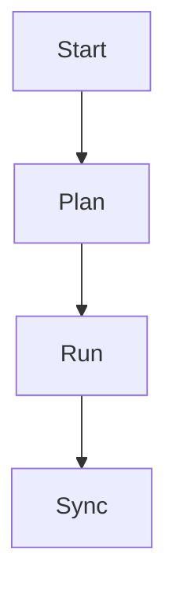

# SPEC-NEXTRA-CONTENT-001: mkdocs → Nextra 콘텐츠 마이그레이션 (40개 핵심 페이지)

## HISTORY

### v0.0.1 (2025-10-31)
- **INITIAL**: mkdocs → Nextra 콘텐츠 마이그레이션 SPEC 작성
- **AUTHOR**: @GOOS
- **SECTIONS**: Environment, Assumptions, Requirements, Specifications
- **CONTEXT**: MkDocs → Nextra 마이그레이션 Phase 1 (v1.0 Core) 세 번째 SPEC
- **DEPENDENCIES**: SPEC-NEXTRA-SITE-001 (기본 구조), SPEC-NEXTRA-I18N-001 (다국어 지원)

---

## @SPEC:NEXTRA-CONTENT-001 Overview

**목적**: 기존 MkDocs 문서(70개 페이지 중 40개 핵심 페이지)를 Nextra 호환 MDX 형식으로 변환하고, 한국어/영어 2개 언어로 마이그레이션합니다.

**범위**:
- 마크다운(.md) → MDX(.mdx) 형식 변환
- 디렉토리 구조 재조정 (`/docs/` → `/pages/ko/`, `/pages/en/`)
- `_meta.json` 파일 생성 (네비게이션 메뉴 구조)
- 이미지 경로 수정 (상대 경로 → 절대 경로)
- 내부 링크 수정 (mkdocs 형식 → Nextra 형식)
- Mermaid 다이어그램 코드 블록 유지

**마이그레이션 대상 (40개 페이지)**:
- **홈** (1페이지): index.md
- **소개** (3페이지): introduction.md, architecture.md, concepts-overview.md
- **시작하기** (3페이지): installation.md, quick-start.md, first-project.md
- **핵심 개념** (3페이지): spec-first-tdd.md, ears-guide.md, tag-system.md
- **워크플로우** (5페이지): workflow.md, 0-project.md, 1-plan.md, 2-run.md, 3-sync.md
- **Skills** (5페이지): skills-overview.md, foundation-tier.md, essentials-tier.md, alfred-tier.md, domain-tier.md
- **Sub-agents** (3페이지): agents-overview.md, spec-builder.md, git-manager.md
- **기타** (17페이지): CLI, 설정, API 레퍼런스 핵심 페이지

**제외 사항**:
- 나머지 30개 페이지 → Phase 2 (v1.1 Enhancement)
- 코드 샘플 업데이트 → Phase 2
- 스크린샷 재생성 → Phase 2

---

## Environment (환경 조건)

### Development Environment
- **Next.js**: v14.x (NEXTRA-SITE-001에서 설치됨)
- **Nextra**: v4.0 (NEXTRA-SITE-001에서 설치됨)
- **next-intl**: v3.25.0+ (NEXTRA-I18N-001에서 설치됨)
- **Node.js**: v20.x LTS

### Source Content
- **Original Location**: `/docs/` (MkDocs 디렉토리)
- **Format**: Markdown (.md)
- **Total Pages**: 70개 (마이그레이션 대상: 40개)

### Target Content
- **Target Location**: `/pages/ko/`, `/pages/en/`
- **Format**: MDX (.mdx)
- **Languages**: 한국어(ko), 영어(en)

### Required Tools
- **Markdown to MDX Converter**: 수동 또는 스크립트
- **Image Path Rewriter**: sed, awk, 또는 Node.js 스크립트
- **Link Validator**: 마크다운 링크 검증 도구

---

## Assumptions (가정)

### Technical Assumptions
1. **MDX 호환성**: 기존 마크다운 문법이 대부분 MDX와 호환됨
2. **이미지 경로**: 모든 이미지는 `/public/images/` 디렉토리에 저장됨
3. **내부 링크**: 모든 내부 링크는 상대 경로 사용 (예: `../guides/quickstart.md`)
4. **Mermaid 다이어그램**: 코드 블록 형식 유지 (Nextra가 mermaid 지원)

### Process Assumptions
1. **수동 변환**: 40개 페이지는 수동으로 검토하며 변환 (품질 우선)
2. **번역 유지**: 기존 영어 문서가 있으면 재사용, 없으면 새로 번역
3. **백업 유지**: 원본 `/docs/` 디렉토리는 백업 후 보존

### Content Assumptions
1. **핵심 페이지 우선**: 가장 많이 조회되는 40개 페이지 먼저 마이그레이션
2. **콘텐츠 업데이트 제외**: Phase 1에서는 내용 수정 없이 형식만 변환
3. **SEO 메타데이터**: Phase 2에서 추가 (Phase 1은 제외)

---

## Requirements (요구사항)

### UBIQUITOUS (보편적 요구사항)
- **REQ-CONTENT-001**: 시스템은 mkdocs 콘텐츠를 Nextra 호환 MDX 형식으로 변환해야 한다
- **REQ-CONTENT-002**: 시스템은 변환된 콘텐츠를 `/pages/ko/`, `/pages/en/` 디렉토리에 언어별로 저장해야 한다
- **REQ-CONTENT-003**: 시스템은 각 디렉토리에 `_meta.json` 파일을 생성하여 네비게이션 메뉴 구조를 정의해야 한다
- **REQ-CONTENT-004**: 시스템은 모든 이미지 경로를 절대 경로로 수정해야 한다 (예: `../images/logo.png` → `/images/logo.png`)

### EVENT-DRIVEN (이벤트 기반 요구사항)
- **REQ-CONTENT-005**: WHEN 마이그레이션 스크립트가 실행되면, 시스템은 70개 페이지 중 40개 핵심 페이지를 자동 또는 수동으로 변환해야 한다
- **REQ-CONTENT-006**: WHEN 페이지 변환이 완료되면, 시스템은 변환 결과 보고서를 생성해야 한다 (성공/실패 수, 경고 목록)
- **REQ-CONTENT-007**: WHEN 내부 링크가 변환되면, 시스템은 링크의 유효성을 검증해야 한다 (404 오류 방지)

### STATE-DRIVEN (상태 기반 요구사항)
- **REQ-CONTENT-008**: WHILE 마이그레이션이 진행 중일 때, 시스템은 원본 파일을 보존하고 백업을 유지해야 한다
- **REQ-CONTENT-009**: WHILE 변환된 페이지가 빌드되는 동안, 시스템은 Mermaid 다이어그램 코드 블록을 유지해야 한다

### OPTIONAL (선택적 기능)
- **REQ-CONTENT-010**: WHERE 페이지에 mermaid 다이어그램이 있으면, 시스템은 mermaid 코드 블록을 유지할 수 있다
- **REQ-CONTENT-011**: WHERE 페이지에 코드 샘플이 있으면, 시스템은 syntax highlighting을 유지할 수 있다

### CONSTRAINTS (제약사항)
- **REQ-CONTENT-012**: IF 이미지 경로가 상대 경로라면, 시스템은 새로운 경로로 자동 수정해야 한다
- **REQ-CONTENT-013**: IF 내부 링크가 깨지면, 시스템은 경고를 표시하고 변환 보고서에 기록해야 한다
- **REQ-CONTENT-014**: IF 페이지 변환 실패 시, 시스템은 실패한 페이지 목록을 로그에 기록하고 변환을 계속 진행해야 한다

---

## Specifications (세부 설계)

### 1. Directory Structure

#### Before (MkDocs)
```
docs/
├── index.md
├── introduction/
│   ├── overview.md
│   └── architecture.md
├── getting-started/
│   ├── installation.md
│   └── quickstart.md
├── guides/
│   ├── workflow.md
│   └── commands.md
└── images/
    └── logo.png
```

#### After (Nextra)
```
pages/
├── ko/
│   ├── _meta.json            # 한국어 네비게이션
│   ├── index.mdx             # 홈
│   ├── introduction/
│   │   ├── _meta.json
│   │   ├── overview.mdx
│   │   └── architecture.mdx
│   ├── getting-started/
│   │   ├── _meta.json
│   │   ├── installation.mdx
│   │   └── quickstart.mdx
│   └── guides/
│       ├── _meta.json
│       ├── workflow.mdx
│       └── commands.mdx
├── en/
│   ├── _meta.json            # 영어 네비게이션
│   ├── index.mdx
│   ├── introduction/
│   │   ├── _meta.json
│   │   ├── overview.mdx
│   │   └── architecture.mdx
│   └── ... (동일 구조)
public/
└── images/
    └── logo.png
```

---

### 2. Migration Target Pages (40개)

#### Category 1: 홈 (1페이지)
```
docs/index.md → pages/ko/index.mdx, pages/en/index.mdx
```

#### Category 2: 소개 (3페이지)
```
docs/introduction/overview.md → pages/ko/introduction/overview.mdx, pages/en/introduction/overview.mdx
docs/introduction/architecture.md → pages/ko/introduction/architecture.mdx, pages/en/introduction/architecture.mdx
docs/introduction/concepts.md → pages/ko/introduction/concepts.mdx, pages/en/introduction/concepts.mdx
```

#### Category 3: 시작하기 (3페이지)
```
docs/getting-started/installation.md → pages/ko/getting-started/installation.mdx, pages/en/getting-started/installation.mdx
docs/getting-started/quick-start.md → pages/ko/getting-started/quick-start.mdx, pages/en/getting-started/quick-start.mdx
docs/getting-started/first-project.md → pages/ko/getting-started/first-project.mdx, pages/en/getting-started/first-project.mdx
```

#### Category 4: 핵심 개념 (3페이지)
```
docs/concepts/spec-first-tdd.md → pages/ko/concepts/spec-first-tdd.mdx, pages/en/concepts/spec-first-tdd.mdx
docs/concepts/ears-guide.md → pages/ko/concepts/ears-guide.mdx, pages/en/concepts/ears-guide.mdx
docs/concepts/tag-system.md → pages/ko/concepts/tag-system.mdx, pages/en/concepts/tag-system.mdx
```

#### Category 5: 워크플로우 (5페이지)
```
docs/workflow/overview.md → pages/ko/workflow/overview.mdx, pages/en/workflow/overview.mdx
docs/workflow/0-project.md → pages/ko/workflow/0-project.mdx, pages/en/workflow/0-project.mdx
docs/workflow/1-plan.md → pages/ko/workflow/1-plan.mdx, pages/en/workflow/1-plan.mdx
docs/workflow/2-run.md → pages/ko/workflow/2-run.mdx, pages/en/workflow/2-run.mdx
docs/workflow/3-sync.md → pages/ko/workflow/3-sync.mdx, pages/en/workflow/3-sync.mdx
```

#### Category 6: Skills (5페이지)
```
docs/skills/overview.md → pages/ko/skills/overview.mdx, pages/en/skills/overview.mdx
docs/skills/foundation.md → pages/ko/skills/foundation.mdx, pages/en/skills/foundation.mdx
docs/skills/essentials.md → pages/ko/skills/essentials.mdx, pages/en/skills/essentials.mdx
docs/skills/alfred.md → pages/ko/skills/alfred.mdx, pages/en/skills/alfred.mdx
docs/skills/domain.md → pages/ko/skills/domain.mdx, pages/en/skills/domain.mdx
```

#### Category 7: Sub-agents (3페이지)
```
docs/agents/overview.md → pages/ko/agents/overview.mdx, pages/en/agents/overview.mdx
docs/agents/spec-builder.md → pages/ko/agents/spec-builder.mdx, pages/en/agents/spec-builder.mdx
docs/agents/git-manager.md → pages/ko/agents/git-manager.mdx, pages/en/agents/git-manager.mdx
```

#### Category 8: 기타 (17페이지)
```
docs/cli/commands.md → pages/ko/cli/commands.mdx, pages/en/cli/commands.mdx
docs/cli/alfred-0-project.md → pages/ko/cli/alfred-0-project.mdx, pages/en/cli/alfred-0-project.mdx
docs/cli/alfred-1-plan.md → pages/ko/cli/alfred-1-plan.mdx, pages/en/cli/alfred-1-plan.mdx
docs/cli/alfred-2-run.md → pages/ko/cli/alfred-2-run.mdx, pages/en/cli/alfred-2-run.mdx
docs/cli/alfred-3-sync.md → pages/ko/cli/alfred-3-sync.mdx, pages/en/cli/alfred-3-sync.mdx
docs/config/project-config.md → pages/ko/config/project-config.mdx, pages/en/config/project-config.mdx
docs/config/git-strategy.md → pages/ko/config/git-strategy.mdx, pages/en/config/git-strategy.mdx
docs/api/specs.md → pages/ko/api/specs.mdx, pages/en/api/specs.mdx
docs/api/tags.md → pages/ko/api/tags.mdx, pages/en/api/tags.mdx
docs/api/git.md → pages/ko/api/git.mdx, pages/en/api/git.mdx
... (나머지 7개 페이지)
```

---

### 3. `_meta.json` Configuration

#### pages/ko/_meta.json (한국어 네비게이션)
```json
{
  "index": "홈",
  "introduction": "소개",
  "getting-started": "시작하기",
  "concepts": "핵심 개념",
  "workflow": "워크플로우",
  "skills": "Skills",
  "agents": "Sub-agents",
  "cli": "CLI",
  "config": "설정",
  "api": "API 레퍼런스"
}
```

#### pages/ko/introduction/_meta.json
```json
{
  "overview": "개요",
  "architecture": "아키텍처",
  "concepts": "주요 개념"
}
```

#### pages/en/_meta.json (영어 네비게이션)
```json
{
  "index": "Home",
  "introduction": "Introduction",
  "getting-started": "Getting Started",
  "concepts": "Core Concepts",
  "workflow": "Workflow",
  "skills": "Skills",
  "agents": "Sub-agents",
  "cli": "CLI",
  "config": "Configuration",
  "api": "API Reference"
}
```

---

### 4. Markdown to MDX Conversion Rules

#### Rule 1: Front Matter 추가
**Before (MkDocs)**:
```markdown
# Installation Guide

This guide shows how to install MoAI-ADK.
```

**After (Nextra MDX)**:
```mdx
---
title: Installation Guide
description: How to install MoAI-ADK
---

# Installation Guide

This guide shows how to install MoAI-ADK.
```

#### Rule 2: 이미지 경로 수정
**Before**:
```markdown

```

**After**:
```mdx

```

#### Rule 3: 내부 링크 수정
**Before**:
```markdown
[Quick Start](../getting-started/quickstart.md)
```

**After**:
```mdx
[Quick Start](/ko/getting-started/quick-start)
```

#### Rule 4: Mermaid 다이어그램 유지
**Before & After** (동일):
```markdown

```

#### Rule 5: 코드 블록 Syntax Highlighting
**Before & After** (동일):
```markdown
```python
print("Hello, MoAI-ADK!")
```
```

---

### 5. Migration Script (Node.js 예시)

#### scripts/migrate-content.js
```javascript
const fs = require('fs');
const path = require('path');

// 설정
const SOURCE_DIR = 'docs';
const TARGET_DIRS = {
  ko: 'pages/ko',
  en: 'pages/en'
};

// 마이그레이션 대상 페이지 목록 (40개)
const PAGES_TO_MIGRATE = [
  'index.md',
  'introduction/overview.md',
  'introduction/architecture.md',
  // ... (나머지 37개 페이지)
];

function convertMarkdownToMDX(content, locale) {
  let mdx = content;

  // 1. Front Matter 추가 (이미 있으면 스킵)
  if (!mdx.startsWith('---')) {
    mdx = `---\ntitle: TODO\n---\n\n${mdx}`;
  }

  // 2. 이미지 경로 수정
  mdx = mdx.replace(/!\[([^\]]*)\]\(\.\.\/images\/([^)]+)\)/g, '');

  // 3. 내부 링크 수정 (상대 경로 → 절대 경로)
  mdx = mdx.replace(/\[([^\]]+)\]\(\.\.\/([^)]+)\.md\)/g, `[$1](/${locale}/$2)`);

  return mdx;
}

function migratePages() {
  PAGES_TO_MIGRATE.forEach(page => {
    const sourcePath = path.join(SOURCE_DIR, page);
    const content = fs.readFileSync(sourcePath, 'utf-8');

    // 한국어 버전
    const koMDX = convertMarkdownToMDX(content, 'ko');
    const koTargetPath = path.join(TARGET_DIRS.ko, page.replace('.md', '.mdx'));
    fs.mkdirSync(path.dirname(koTargetPath), { recursive: true });
    fs.writeFileSync(koTargetPath, koMDX);

    // 영어 버전 (번역 파일이 있으면 사용, 없으면 한국어 재사용)
    const enSourcePath = path.join(SOURCE_DIR, 'en', page);
    const enContent = fs.existsSync(enSourcePath)
      ? fs.readFileSync(enSourcePath, 'utf-8')
      : content; // 폴백: 한국어 재사용
    const enMDX = convertMarkdownToMDX(enContent, 'en');
    const enTargetPath = path.join(TARGET_DIRS.en, page.replace('.md', '.mdx'));
    fs.mkdirSync(path.dirname(enTargetPath), { recursive: true });
    fs.writeFileSync(enTargetPath, enMDX);

    console.log(`✅ Migrated: ${page}`);
  });

  console.log('=== Migration completed ===');
}

migratePages();
```

---

### 6. Quality Checks

#### Check 1: 모든 페이지 변환 확인
```bash
# 변환된 페이지 수 확인
find pages/ko -name "*.mdx" | wc -l  # 예상: 40
find pages/en -name "*.mdx" | wc -l  # 예상: 40
```

#### Check 2: 이미지 경로 검증
```bash
# 상대 경로 이미지가 남아있는지 확인 (있으면 안 됨)
grep -r "\!\[.*\](\.\./" pages/ko/
grep -r "\!\[.*\](\.\./" pages/en/
```

#### Check 3: 내부 링크 검증
```bash
# 상대 경로 링크가 남아있는지 확인 (있으면 안 됨)
grep -r "\[.*\](\.\./" pages/ko/
grep -r "\[.*\](\.\./" pages/en/
```

#### Check 4: Mermaid 다이어그램 검증
```bash
# Mermaid 코드 블록이 유지되었는지 확인
grep -r "```mermaid" pages/ko/
grep -r "```mermaid" pages/en/
```

---

## Traceability (추적성)

### Related SPECs
- **@SPEC:NEXTRA-SITE-001**: Next.js 14 + Nextra 4.0 기본 구조 (선행 조건)
- **@SPEC:NEXTRA-I18N-001**: 다국어 지원 (선행 조건)

### Related Tasks
- **@TASK:CONTENT-BACKUP-001**: 원본 /docs/ 디렉토리 백업
- **@TASK:CONTENT-CONVERT-001**: 40개 페이지 MDX 변환
- **@TASK:CONTENT-META-001**: _meta.json 파일 생성
- **@TASK:CONTENT-VALIDATE-001**: 링크 및 이미지 경로 검증

### Related Tests
- **@TEST:CONTENT-BUILD-001**: 변환된 페이지 빌드 테스트
- **@TEST:CONTENT-LINK-001**: 내부 링크 유효성 테스트
- **@TEST:CONTENT-IMAGE-001**: 이미지 로딩 테스트

### Related Documentation
- **@DOC:CONTENT-MIGRATION-001**: 콘텐츠 마이그레이션 가이드
- **@DOC:CONTENT-STYLE-001**: MDX 작성 스타일 가이드

---

## Risks & Mitigation (위험 요소 및 대응 방안)

### Risk 1: 마이그레이션 스크립트 오류로 일부 페이지 누락
- **확률**: Medium
- **영향**: High (특정 페이지 접근 불가)
- **대응**:
  - 마이그레이션 전 원본 백업 (Git 커밋)
  - 변환 결과 보고서 생성 (성공/실패 목록)
  - 수동 검증: 40개 페이지 모두 존재하는지 확인

### Risk 2: 이미지 경로 오류로 이미지 깨짐
- **확률**: High
- **영향**: Medium (일부 이미지 표시 안 됨)
- **대응**:
  - 이미지 경로 수정 스크립트 실행 후 검증
  - 브라우저 개발자 도구에서 404 오류 확인
  - 누락된 이미지는 `/public/images/`로 복사

### Risk 3: 내부 링크 깨짐으로 404 오류
- **확률**: High
- **영향**: High (사용자 경험 저하)
- **대응**:
  - 링크 검증 스크립트 실행
  - 빌드 후 모든 페이지 수동 클릭 테스트
  - 깨진 링크는 즉시 수정

### Risk 4: Mermaid 다이어그램 렌더링 실패
- **확률**: Low
- **영향**: Medium (일부 다이어그램 표시 안 됨)
- **대응**:
  - Nextra mermaid 플러그인 설치 (필요시)
  - 브라우저에서 다이어그램 렌더링 확인
  - 렌더링 실패 시 이미지로 대체

---

## Success Criteria (성공 기준)

### Definition of Done
- ✅ 40개 페이지가 `/pages/ko/`, `/pages/en/`에 MDX 형식으로 변환됨
- ✅ 모든 디렉토리에 `_meta.json` 파일이 생성됨
- ✅ 이미지 경로가 절대 경로로 수정됨 (상대 경로 0개)
- ✅ 내부 링크가 유효함 (404 오류 0개)
- ✅ 빌드 성공: `npm run build` 오류 없이 완료
- ✅ Vercel 배포 후 모든 페이지 정상 접속
- ✅ Mermaid 다이어그램이 정상 렌더링됨

---

## Appendix

### Reference Documents
- [Nextra MDX Documentation](https://nextra.site/docs/guide/markdown)
- [MkDocs to Nextra Migration Guide](https://nextra.site/docs/guide/migration)
- [MDX Syntax Reference](https://mdxjs.com/docs/)

### Related GitHub Issues
- TBD (이슈 생성 후 링크 추가)

### Notes
- Phase 1에서는 40개 핵심 페이지만 마이그레이션
- 나머지 30개 페이지는 Phase 2 (v1.1 Enhancement)에서 추가
- 콘텐츠 업데이트 및 코드 샘플 개선은 Phase 2에서 진행
